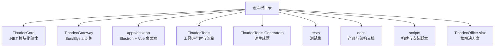
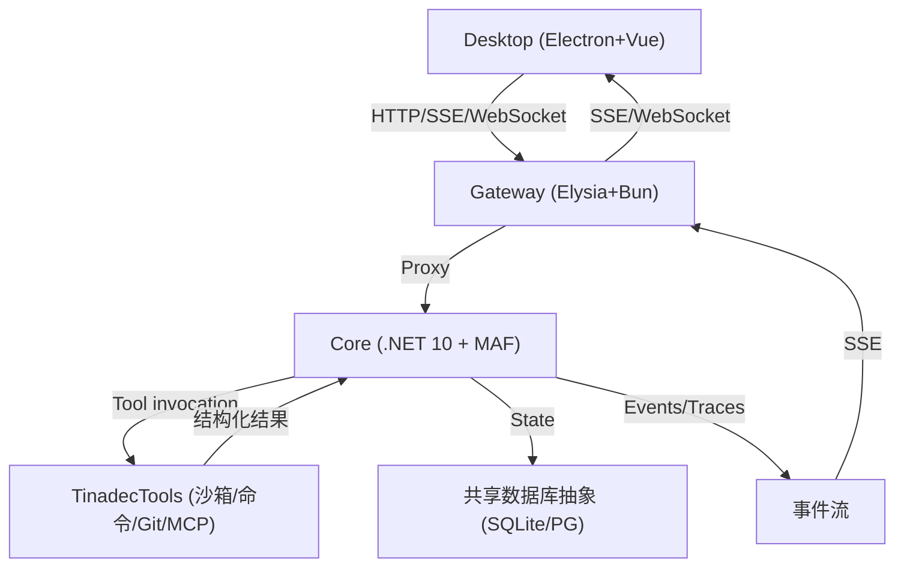
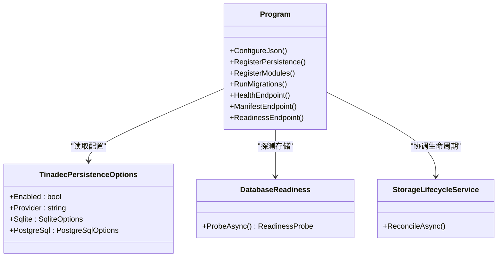
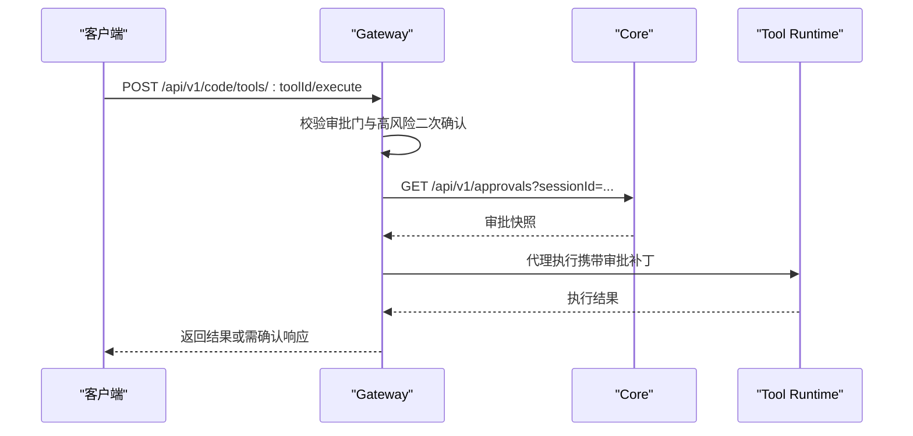
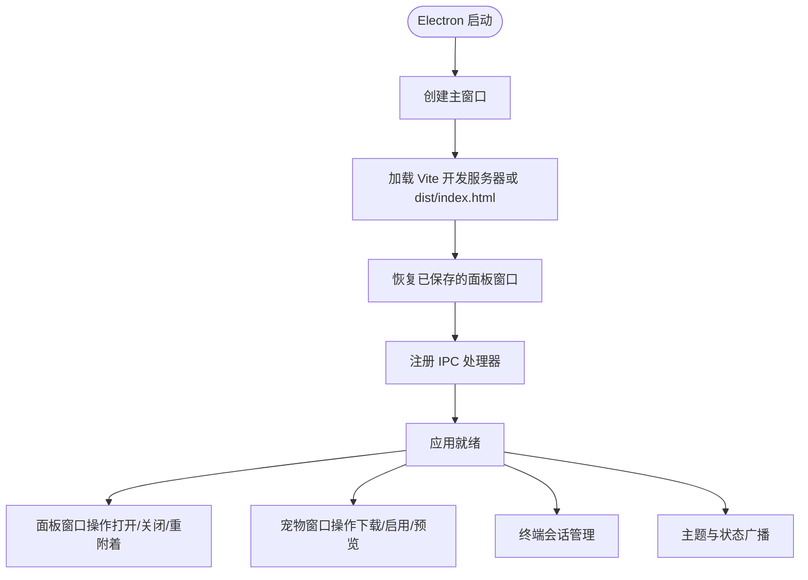
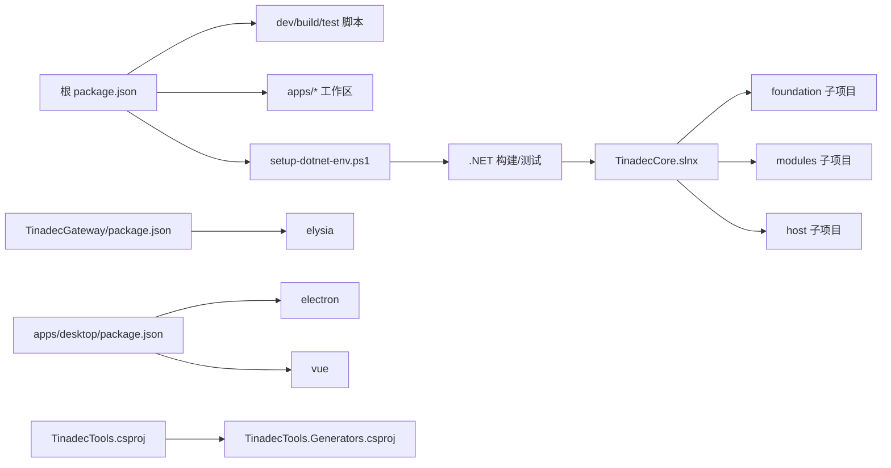

# 项目结构

<cite>
**本文引用的文件**   
- [README.md](file://README.md)
- [package.json](file://package.json)
- [TinadecCore.slnx](file://TinadecCore/TinadecCore.slnx)
- [Directory.Build.props](file://TinadecCore/Directory.Build.props)
- [Program.cs](file://TinadecCore/Api/Program.cs)
- [appsettings.json](file://TinadecCore/Api/appsettings.json)
- [index.ts](file://TinadecGateway/src/index.ts)
- [package.json](file://TinadecGateway/package.json)
- [bunfig.toml](file://TinadecGateway/bunfig.toml)
- [main.cjs](file://apps/desktop/electron/main.cjs)
- [package.json](file://apps/desktop/package.json)
- [TinadecTools.csproj](file://TinadecTools/TinadecTools.csproj)
- [TinadecTools.Generators.csproj](file://TinadecTools.Generators/TinadecTools.Generators.csproj)
- [setup-dotnet-env.ps1](file://scripts/setup-dotnet-env.ps1)
</cite>

## 目录
1. [简介](#简介)
2. [项目结构](#项目结构)
3. [核心组件](#核心组件)
4. [架构总览](#架构总览)
5. [详细组件分析](#详细组件分析)
6. [依赖关系分析](#依赖关系分析)
7. [性能考量](#性能考量)
8. [故障排查指南](#故障排查指南)
9. [结论](#结论)
10. [附录：导航与常用命令](#附录导航与常用命令)

## 简介
TinadecOffice 是一个面向 AI 智能体协作的 Agent 工作空间。整体采用三层架构：
- Core（.NET 10 + ASP.NET Core + MAF）：唯一状态权威，负责编排、工具策略、模型路由、持久化与就绪探测。
- Gateway（Elysia + TypeScript/Bun）：薄 BFF/代理层，提供鉴权、协议转换、流式转发与 Model/Agent Center 聚合视图。
- Desktop（Electron + Vue 3 + Vite + Tailwind）：UI 呈现，包含聊天、任务图、审批、可分离面板与 Debug Studio。

设计原则强调“Core 是唯一状态权威”“Desktop 仅通过 Gateway 访问 Core”“写操作必须经过审批门”“API 契约统一 snake_case”。

**章节来源**
- [README.md:1-120](file://README.md#L1-L120)

## 项目结构
仓库采用多语言、多子项目的模块化组织方式，根级使用 npm workspaces 管理前端与网关，.NET 解决方案由 TinadecCore.slnx 与根 slnxx 共同驱动。

各模块职责概览：
- TinadecCore：MAF 模块化单体，包含 Contracts、Abstractions、Persistence、Strategies、Runtime、Api 等子项目；按基础能力与业务模块分层。
- TinadecGateway：基于 Elysia 的轻量网关，负责认证、CORS、SSE/WebSocket 转发、Model/Agent Center 聚合、代码工具审批门与 MCP 透传。
- apps/desktop：Electron 主进程与 Vue 渲染进程，提供 UI、窗口管理、终端、宠物窗口、设置中心与调试面板。
- TinadecTools：.NET 控制台应用，实现文件读写、Git、命令执行、MCP 客户端、沙箱隔离与终端运行器等工具能力。
- TinadecTools.Generators：Roslyn 源生成器，为工具函数静态注册表生成代码。
- tests：覆盖 Core、Tools 与契约的单元测试与架构边界测试。
- docs：产品模型、架构、安全、启动手册等文档。
- scripts：.NET 环境准备、AI 工具安装与校验脚本。

**章节来源**
- [README.md:61-73](file://README.md#L61-L73)
- [TinadecCore.slnx:1-32](file://TinadecCore/TinadecCore.slnx#L1-L32)
- [package.json:1-36](file://package.json#L1-L36)

## 核心组件
- Core 服务入口与 API：
  - Program.cs 配置 JSON 序列化策略（snake_case）、注入共享数据库抽象、注册所有 Core 模块、执行迁移与生命周期协调，并暴露健康检查、清单与就绪接口。
  - appsettings.json 定义日志、连接字符串、存储提供者（默认 SQLite，可选 PostgreSQL）与开发身份。
- Gateway 网关：
  - index.ts 定义 Elysia 应用，集中处理 CORS、认证、SSE/WebSocket 转发、代码工具审批门、Model/Agent Center 聚合、MCP 路由与调试探针。
  - package.json 与 bunfig.toml 管理依赖、脚本与测试行为。
- Desktop 桌面端：
  - main.cjs 管理 Electron 主进程生命周期、窗口创建、IPC 通道、面板窗口与宠物窗口、终端管理与主题广播。
  - package.json 声明 Vue/Electron/Vite/Tailwind 等依赖与脚本。
- Tools 工具层：
  - TinadecTools.csproj 定义 .NET 10 控制台应用，启用 AOT 与不变全球化，引用 NLog、System.IO.Hashing 与 ModelContextProtocol，并引用源生成器。
- Generators 源生成器：
  - TinadecTools.Generators.csproj 基于 Roslyn 构建分析器，输出编译期生成的代码。

**章节来源**
- [Program.cs:1-181](file://TinadecCore/Api/Program.cs#L1-L181)
- [appsettings.json:1-31](file://TinadecCore/Api/appsettings.json#L1-L31)
- [index.ts:1-800](file://TinadecGateway/src/index.ts#L1-L800)
- [package.json:1-22](file://TinadecGateway/package.json#L1-L22)
- [bunfig.toml:1-13](file://TinadecGateway/bunfig.toml#L1-L13)
- [main.cjs:1-374](file://apps/desktop/electron/main.cjs#L1-L374)
- [package.json:1-69](file://apps/desktop/package.json#L1-L69)
- [TinadecTools.csproj:1-47](file://TinadecTools/TinadecTools.csproj#L1-L47)
- [TinadecTools.Generators.csproj:1-21](file://TinadecTools.Generators/TinadecTools.Generators.csproj#L1-L21)

## 架构总览
系统以 Core 为唯一状态权威，Gateway 作为薄代理与协议转换层，Desktop 仅做展示与交互。Tool 层在 Core 治理下执行受控能力，并通过事件流与 SSE/WebSocket 向 Gateway 和 Desktop 推送实时信息。

**图表来源**
- [Program.cs:1-181](file://TinadecCore/Api/Program.cs#L1-L181)
- [index.ts:1-800](file://TinadecGateway/src/index.ts#L1-L800)
- [main.cjs:1-374](file://apps/desktop/electron/main.cjs#L1-L374)

**章节来源**
- [README.md:17-43](file://README.md#L17-L43)

## 详细组件分析

### TinadecCore（.NET 模块化单体）
- 解决方案结构（slnx）将项目分为 foundation（Contracts/Abstractions/Persistence/VectorStore/Tenancy/Migrations/Strategies）、modules（DmaEA/Models/Context/Prompts/Memory/Skills/LoopGuard/Lifecycle）、host（Runtime/Api）与 tests。
- Api 项目暴露 REST 端点，统一 JSON 命名策略，并在启动时执行迁移与生命周期协调。
- Persistence 提供数据库抽象与迁移，支持 SQLite 与 PostgreSQL。
- Runtime 提供 CoreBuilder 与服务扩展，用于模块注册与能力装配。

**图表来源**
- [Program.cs:1-181](file://TinadecCore/Api/Program.cs#L1-L181)
- [appsettings.json:1-31](file://TinadecCore/Api/appsettings.json#L1-L31)

**章节来源**
- [TinadecCore.slnx:1-32](file://TinadecCore/TinadecCore.slnx#L1-L32)
- [Directory.Build.props:1-21](file://TinadecCore/Directory.Build.props#L1-L21)
- [Program.cs:1-181](file://TinadecCore/Api/Program.cs#L1-L181)
- [appsettings.json:1-31](file://TinadecCore/Api/appsettings.json#L1-L31)

### TinadecGateway（Elysia 网关）
- 统一中间件：CORS 预检与允许源控制、云端模式认证、公共路径放行。
- 路由组织：健康检查、Doctor、Readiness、Projects、Sessions、SSE 事件流、Approvals、Tools、Code Tools、Prompt Fragments、Model Center、Market/Extensions、MCP、Agent Center、Agent Evolution、Debug Studio。
- 代码工具执行流程：规格发布 → 审批门验证 → 高风险二次确认 → 合并审批补丁 → 代理到 Tool Runtime 执行。

**图表来源**
- [index.ts:1-800](file://TinadecGateway/src/index.ts#L1-L800)

**章节来源**
- [index.ts:1-800](file://TinadecGateway/src/index.ts#L1-L800)
- [package.json:1-22](file://TinadecGateway/package.json#L1-L22)
- [bunfig.toml:1-13](file://TinadecGateway/bunfig.toml#L1-L13)

### apps/desktop（Electron + Vue 桌面端）
- 主进程（main.cjs）：窗口创建、DevTools、IPC 通道、面板窗口管理、宠物窗口、终端管理、主题广播、退出清理。
- 渲染进程（Vue 3 + Vite + Tailwind）：页面与组件（聊天、代码编辑器、Git 面板、工具目录、设置中心等）。
- 脚本与依赖：Vite 开发服务器、Electron 打包、原生模块重建（node-pty）。

**图表来源**
- [main.cjs:1-374](file://apps/desktop/electron/main.cjs#L1-L374)

**章节来源**
- [main.cjs:1-374](file://apps/desktop/electron/main.cjs#L1-L374)
- [package.json:1-69](file://apps/desktop/package.json#L1-L69)

### TinadecTools（工具运行时）
- 目标框架 net10.0，启用 AOT 与不变全球化，便于快速启动与部署。
- 集成 NLog 日志、System.IO.Hashing 哈希计算、ModelContextProtocol MCP 客户端。
- 通过 ProjectReference 引用源生成器，编译期生成工具注册表。

**章节来源**
- [TinadecTools.csproj:1-47](file://TinadecTools/TinadecTools.csproj#L1-L47)

### TinadecTools.Generators（源生成器）
- 基于 Microsoft.CodeAnalysis.CSharp 构建 Roslyn 分析器。
- 输出编译期生成的代码至 Generated 目录，减少运行时反射开销。

**章节来源**
- [TinadecTools.Generators.csproj:1-21](file://TinadecTools.Generators/TinadecTools.Generators.csproj#L1-L21)

## 依赖关系分析
- 根 package.json 使用 workspaces 管理 apps/*，并提供 dev/build/test 脚本，串联 Core、Gateway 与 Desktop 的启动与构建。
- TinadecCore.slnx 明确划分基础能力、业务模块与宿主，确保层次清晰、依赖单向。
- Gateway 依赖 Elysia 与 Bun，独立包管理，测试范围限定于 src。
- Desktop 依赖 Electron、Vue、Vite、Tailwind 与 Monaco/Xterm 等 UI 库。
- Tools 与 Generators 通过 .csproj 关联，Generators 作为 Analyzer 引用。

**图表来源**
- [package.json:1-36](file://package.json#L1-L36)
- [TinadecCore.slnx:1-32](file://TinadecCore/TinadecCore.slnx#L1-L32)
- [package.json:1-22](file://TinadecGateway/package.json#L1-L22)
- [package.json:1-69](file://apps/desktop/package.json#L1-L69)
- [TinadecTools.csproj:1-47](file://TinadecTools/TinadecTools.csproj#L1-L47)
- [TinadecTools.Generators.csproj:1-21](file://TinadecTools.Generators/TinadecTools.Generators.csproj#L1-L21)

**章节来源**
- [package.json:1-36](file://package.json#L1-L36)
- [TinadecCore.slnx:1-32](file://TinadecCore/TinadecCore.slnx#L1-L32)
- [TinadecGateway/package.json:1-22](file://TinadecGateway/package.json#L1-L22)
- [apps/desktop/package.json:1-69](file://apps/desktop/package.json#L1-L69)
- [TinadecTools.csproj:1-47](file://TinadecTools/TinadecTools.csproj#L1-L47)
- [TinadecTools.Generators.csproj:1-21](file://TinadecTools.Generators/TinadecTools.Generators.csproj#L1-L21)

## 性能考量
- Core 使用 SQLite 本地文件作为默认存储，启动时进行迁移与就绪探测，避免不必要的数据库连接开销。
- Gateway 采用 Bun 与 Elysia，具备高性能 I/O 与低内存占用，适合薄代理与流式转发场景。
- Desktop 使用 Vite 开发服务器与按需加载，提升前端开发与预览效率。
- Tools 启用 AOT 与不变全球化，缩短冷启动时间，降低运行时开销。

[本节为通用指导，不直接分析具体文件]

## 故障排查指南
- .NET 环境问题：
  - 使用 setup-dotnet-env.ps1 清理可能干扰 dotnet 的环境变量（Version、Ice-Version），并确保 PATH 中包含 dotnet 命令。
- Core 启动失败：
  - 检查 appsettings.json 中存储提供者与连接字符串配置，确认 SQLite 文件或 PostgreSQL 可达。
  - 查看健康检查与健康端点返回状态，定位模块未配置或存储不可用问题。
- Gateway 认证与 CORS：
  - 确认 mode 与 allowed origins 配置，确保前端来源被允许。
  - 检查公共路径是否放行，避免误拦截。
- Desktop 窗口与 IPC：
  - 检查主进程 IPC 处理器是否正确注册，面板窗口与宠物窗口生命周期是否正常。
  - 若原生模块报错，尝试 rebuild:native 脚本重建 node-pty。

**章节来源**
- [setup-dotnet-env.ps1:1-49](file://scripts/setup-dotnet-env.ps1#L1-L49)
- [appsettings.json:1-31](file://TinadecCore/Api/appsettings.json#L1-L31)
- [Program.cs:1-181](file://TinadecCore/Api/Program.cs#L1-L181)
- [index.ts:1-800](file://TinadecGateway/src/index.ts#L1-L800)
- [main.cjs:1-374](file://apps/desktop/electron/main.cjs#L1-L374)

## 结论
TinadecOffice 通过清晰的三层架构与模块化设计，实现了 Core 的状态权威、Gateway 的灵活代理与 Desktop 的丰富交互。Tools 与 Generators 增强了可执行能力与编译期优化。借助统一的脚本与配置，开发者可以快速搭建、联调与扩展。建议遵循设计原则与 API 契约，保持模块间解耦与职责单一。

[本节为总结性内容，不直接分析具体文件]

## 附录：导航与常用命令
- 常用命令：
  - npm run dev：同时启动 Core、Gateway、Desktop。
  - npm run dev:core / dev:gateway / dev:desktop：单独启动某服务。
  - npm run build：构建工作区与 .NET 解决方案。
  - npm test：运行测试。
  - npm run restore:dotnet：还原 .NET 包。
- 服务地址：
  - Desktop（Vite）：http://127.0.0.1:5173
  - Gateway API / Docs：http://127.0.0.1:48730/docs
  - Core：http://127.0.0.1:48731

**章节来源**
- [README.md:45-59](file://README.md#L45-L59)
- [package.json:1-36](file://package.json#L1-L36)