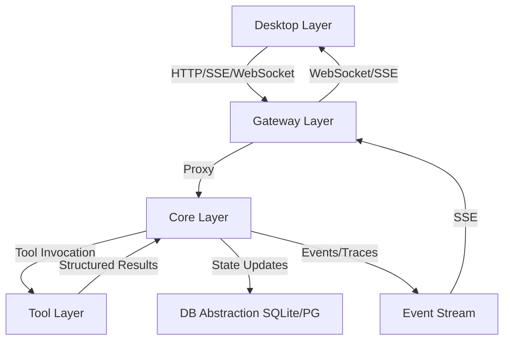

# PROJECT KNOWLEDGE BASE

**Generated:** 2026-05-30
**Generated By:** openai/gpt-5.5
**Last Updated:** 2026-09-23
**Last Updated By:** 市场第一次能"装"东西（跨层 #37 / M2，含 #41 #42 前置守卫）：Core 新增 `IMarketInstallService` + `Skills/MarketInstallService.cs`，四条新路由（catalog/installations 两条 preview、proposals/apply、GET installations）把一次 MCP 服务器安装收成"冻结字节 → 人工审批 → 由治理层落盘"，**这个面上没有任何一次调用能碰磁盘或起进程**：可达的唯一变更是一条 `requires_approval` 的 `write_file` 用户动作，字节在预览时就冻结并以 digest 绑定（apply 先复核 digest 再判状态、也再走重放分支），目标路径向 provider 的 `mcp_list → config_path` 要、落在项目根之外就 409 拒绝，配置读不到时退化成"只创建、绝不覆盖"。网关四条同名纯代理 + 7 个错误码进白名单。桌面这一侧主要是"删决定"：控制器不再替用户调用 `decideApproval`（测试断它从未被调用），"当前工作区"收回 `homeController.selectedProjectId` 唯一 owner，跨模块 `watch` 换成派生 `activeProposal`。细则见 `TinadecCore/AGENTS.md` 的 AN INSTALL IS A FROZEN PROPOSAL PLUS A HUMAN DECISION, NOT A DOWNLOAD 段与 `docs/agent-workbench-capability-gap-report.zh-CN.md` §5g。上一批是市场只读面落地（跨层 #36 / M1）。
**Last Verified Commit:** `e0c0e08` 之后的工作树，且**本批阶段末全量按顺序跑完、逐个读日志里自己写的退出码**：Core 整解 `GATE_EXIT=0`——`Api.Tests` **507/507**（23m27s）、Governance **44/44**、Architecture **17/17**、AgentFramework **329/329**；`TinadecTools.Tests` `TOOLS_EXIT=0`、**292/292**；`MarketCatalogApiTests` 定向 **50/50**，digest 守卫的变异对照**恰红 1 例**（`AProposalWhoseFrozenBytesMovedIsRefused_NotAppliedOnTheReviewersBehalf`）、其余 49 例仍绿（第一次对照因脚本把 mute/restore 的替换对写反而**无效**，详见 `TinadecCore/AGENTS.md` 头部）；Gateway `bun test src` `BUN_EXIT=0`、**72 pass / 0 fail**；Desktop `npx vitest run` `VITEST_EXIT=0`（**80 文件通过 / 1 跳过、746 例通过 / 14 跳过**）、`vue-tsc --noEmit` `TSC_EXIT=0`、`npx vite build` `BUILD_EXIT=0`、electron `node --test` `ELECTRON_EXIT=0` **24/24**、`generate:client` `GEN_EXIT=0`；`check:drift` 提交前 `exit=1`（该门以 `git diff --exit-code` 收尾，未提交的有意契约变更必然让它红），**提交后复跑 `DRIFT_EXIT=0`**。三份契约同批再生成并逐条核对只含本批内容：`openapi.core.json` +416/−0、`openapi.external.json` +319/−1、`schema.d.ts` +128/0。
**Branch:** Everything-changed

> The metadata above is advisory and goes stale by design. Never treat an "implemented/current" claim in this file as fact without verifying it against source and tests.

## AI MAINTENANCE PROTOCOL
- Treat this file and nested `AGENTS.md` files as living project memory, not static docs.
- Before relying on a rule that looks stale, contradictory, or surprising, verify against source files, configs, scripts, and docs.
- If verified reality differs from this file, update the relevant `AGENTS.md` immediately in the same change.
- When changing code, configs, commands, ports, contracts, module boundaries, or build/test workflows, update affected `AGENTS.md` files in the same work item.
- When modifying any `AGENTS.md`, update the metadata above: `Last Updated`, `Last Updated By`, `Last Verified Commit`, and `Branch`.
- Do not “fix” this file from memory alone; cite current repo evidence in the edit rationale or final message.
- Keep entries concise and project-specific. Remove obsolete guidance instead of appending conflicting notes.
- Long-lived branch merges ALWAYS conflict on this file's metadata header (every branch rewrites `Last Updated`/`By`/`Verified Commit`/`Branch`). Resolve by combining BOTH sides' content sections and refreshing the metadata to the post-merge state — never drop either side's entries; code-file conflicts are usually zero because UI and Core branches touch disjoint trees.

## OVERVIEW
TinadecOffice is a product family consisting of independently versioned TinadecCore, TinadecTool, TinadecGateway, and TinadecApp products. The current repository still ships a Windows-first integrated workbench topology, but that topology must not be treated as a mandatory product dependency chain. TinadecCore is the MAF-based agent-governance and collaboration runtime; its normative positioning, DmaEA contract, permission model, evolution lifecycle, and target delivery forms are defined in `docs/tinadec-core-product-definition.zh-CN.md`, with source-backed reference decisions in `docs/tinadec-core-reference-decisions.zh-CN.md`.

The Core is a MAF-based modular monolith; storage and read paths are in place, a full-duplex dual-layer invocation runtime exists (durable run engine, governance coordination → execution → supervision → meeting finalization, context patches, spawn/lineage, candidate review, run control), the tool chain is wired end-to-end (real TinadecTools child process, manifest v2, approval gating, dispatch, recovery), and an `operation`/`execution` configuration foundation has been added. Workspace snapshot providers, Git stewardship, and user tool actions are now governed through Core; event-driven context compression, complete evolution evaluation/canary, and restore-plan UX remain incomplete capabilities.

## CURRENT REBUILD STATE
- **真机走查缺陷② 已修：审批现在给得出裁决所需的事实（2026-09-21，跨 Core/契约/Desktop）**：被要求批准的人从来看不到要批准什么——`ApprovalResponseDto` 只有 `tool_id` + 一行 summary，策略驻留行的 summary 还是写死的 `"Tool permission request requires authorization."`。新增唯一所有者 `TinadecCore/Abstractions/Ports/ApprovalEvidenceProjector.cs`：从**已冻结的调用参数**投影出 `command`/`cwd`/`resource_path` 三个具名字段 + 有界脱敏的 `arguments` 摘要 + `summary`（`write_file → …\probe.txt`），secret 形状键整个丢弃、bulk 值（content/body/patch/diff/…）换成 `"N chars, sha256 …"`（审批仍由 request hash 精确钉住原字节，但不把 40 KB 文件体推给每个列审批的客户端），解析失败与超预算一律降级为不透明指纹——**永不抛、永不产坏 JSON**。铸造即冻结存进新列 `arguments_digest`（`tool_executions` 与 `approval_requests` 两张表，走 `DbContextSchemaBootstrapper` 列对账，无迁移文件）。**最容易漏的一环**：run 主链上人类裁决的是 **permission 包络**而不是审批行，而 permission 快照里根本没有参数——靠 `tool_executions.permission_request_id` 的一次批量 join 把执行行的 digest 取回（`ToolDispatcher` 在返回驻留**之前**就已 `BindAuthorizationAsync` 绑好，所以驻留期间链接已存在）；没有这个 join，整套投影在主链上完全不可见。第三个铸造点是 `UserToolActionService` 的 `kind="user_tool"` 行（**不是 `"tool"`**，实测纠正了我自己的断言）。桌面侧 `ApprovalTab.vue` 一行审批渲染工具名/风险（只靠 `--accent-warning`/`--accent-danger` 字形着色，无边框无底色）/命令行+工作目录/目标路径/可展开脱敏参数，命令与路径**换行不省略**，digest 为空的旧行整块不渲染而不是谎报"没有命令"。**契约真相**：`/api/v1/approvals*` 在 OpenAPI 快照里只有路径、没有响应体 schema（端点返回裸 `IResult`），所以 `CoreOpenApiSnapshotTests` 零漂移、`check:drift` 天然干净，`schema.d.ts` 里搜不到这个 DTO——新字段由测试钉住而不是生成器，补带类型响应登记为架构债。**验证**：`ApprovalEvidenceProjectorTests` 17 例、AgentFramework 329/329、Governance 44/44、Architecture 17/17、Api 定向（`ApprovalFlowTests`+`ToolChainEndpointTests`+`PreAuthorizationMintTests`）**55/55**（4m7s；含两条线上传输事实：permission 行点名 `probe.txt` 且 `arguments` 不含被写入的 `"hello"`；`user_tool` 行含 `filepath` 与 sha256 指纹且不含 `"governed"`；顺带推翻 `ApprovalFlowTests.UserToolAction_GitCommit_*` 的"git 环境必红"长期标签——本轮类内全绿）、Desktop `ApprovalTab.test.ts` 4 例 + **全量 vitest 480 passed/14 skipped/0 failed**、Gateway bun 50/50、`check:drift` 零漂移、`vue-tsc` 24=基线。诚实边界：**Core Api 全量本轮未跑**（该工作树上轮起即卡死测试主机，只跑了上述三个审批相关类的定向集）；未做真实 Electron 走查、未演练 PostgreSQL、digest 为空的既有历史行在真库上的外观未观测。细则见 `TinadecCore/AGENTS.md` 的 APPROVAL EVIDENCE 段。
- **真机走查缺陷① 已修：首轮对话现在能看到工具活动与审批入口（2026-09-21）**：`MessageList.vue` 原先只按消息 id 挂载活动，且用 `props.thinkingSteps ?? (role === 'assistant' ? thinkingSteps : undefined)` 兜底——同一份实时活动会被盖到**每一条** assistant 消息上，而首轮 run 还没有 assistant 消息时**无处可挂**，于是用户只看到 "awaiting user" 与转圈。契约改为两个互不重叠的输入：`activityByMessage`（run 已结束且存在 assistant 落点）与 `liveTurn`（run 进行中或还没有落点），归属判定收敛在 `ChatPanel.vue` 的两个 computed，新增 `chat/LiveTurnBlock.vue` 常驻渲染未落地的活动并把 approve/reject 转发到与功能面板同一个审批入口（扁平、无边框无背景，状态只靠字形颜色，遵守 `docs/uie-visual-layer-spec.md` 的聊天视觉语言）。`.message-stream-inner` 补 `role="log" aria-live="polite" aria-relevant="additions"` + `:aria-label`。**验证**：`MessageList.test.ts` 新增 4 例（首轮零消息仍出工具卡与审批按钮、run 结束后活动归位最后一条 assistant、两处切换不重复渲染、零尺寸矩形下 FLIP 守卫静默返回），已做变异验证——删掉 `liveTurn` 分支即用例转红；Desktop 定向 ChatPanel+MessageList 全绿、`vue-tsc` 仍为既有基线 24 处。**未做**：真 Electron 复走一遍（本轮只到组件级）。缺陷②（审批行不返回命令/参数/资源）是 Core 侧契约缺口，见同轮后续条目。
- **真机走查推翻"人类裁决位"，聊天室收为纯观察（2026-09-20）**：首次用真 Electron 43.3.0（CDP 驱动真实渲染层，`window.tinadec` 桥在）+ 真模型（AMD/DeepSeek-V4-Flash）+ 真 TinadecTools 子进程走完整链路。**先纠正自己写的文档**：上一轮把"简报采纳"做成人类在聊天室点按钮（`useIntentDesk.ts`），并在 `TinaChat/README.md` 写成"唯一的写路径是人类裁决"——规范 §14.4:802 只说"owner/admin 按会话 revision 采纳"（**会话角色，不看 kind**），`DecideIntentAsync` 只有 `RequireAdmin(member)`，而 `ReserveExecutionAsync` 反过来硬性要求 `actor.Kind=="agent"`；实测 agent 身份 `POST /conversations` 返回 201。也就是说人类从来不是设计上的必要环节，是我把加戏写成了设计，且六个工具里没有 accept，导致**人类不点按钮智能体就闭不了环**。本轮：①删除裁决台（`ChatroomPanel.vue` 的 intent-desk 块、`useIntentDesk.ts`、5 条用例、5 个 desk-only 文案键），聊天室零写操作，并留下能红的守卫（proposed/accepted 两态断言无任何 accept/reject/execute/mode/project 控件、按钮文本无"采纳/拒绝/交接"、decide/execute 从未被调用；注入假按钮验证过确实变红）；②智能体侧补三个工具 `tina_chat_list_intents`（带 `conversation_revision`）/ `tina_chat_decide_intent`（CAS，非角色成员拿到服务端的原话拒绝）/ `tina_chat_execute_intent`——后者需要模式目录与协调器，故由 **Runtime 装饰器** `TinaChatHandoffGateway` 承接（`TinaChatService` 注入 `ITinaChatRunService` 会构成构造环），端口新增 `RequireActorAsync` 让装饰器复用同一套身份校验而不复制规则，省略 `mode_version_id` 时解析工作区默认模式、解析不了就 409 而不是猜；③种子包 2.4.0→**2.5.0**（`solo_master`/`global_engineering` 各声明 9 个工具，digest `2463deeadbb2f25564b74ca21edff4e3d131f5df747539af90dc8ceb6e8d2b57`，先跑守卫拿到计算值再钉）。**真机实测到的既有缺陷（本轮未修，已定位）**：①首轮 run 无 assistant 消息时 `MessageList.vue:35` 按消息 id 挂载工具卡，导致**对话里看不到任何工具活动与审批入口**，只有头部 "awaiting user" 和转圈；②审批行/`GET /api/v1/approvals/{id}` **不返回命令、工具参数、风险归属**，人类无法据以判断——审批契约级缺口，前端单独修不了；③注册身份默认 `receive_human_messages=false`，人类消息静默不唤醒整理者且界面无解释；④TinaChat 面上畸形请求（缺必填 query、未知 JSON 字段）返回 **500 internal_error 而非 400**（`POST /projects` 同类输入正确返 400，说明是 TinaChat 端点特有）；⑤2026-09-17 演练把 `solo_master`/`global_engineering`/`search` 三个 pack 托管智能体钉在死模型 `qwen3.8-27b`（`user_binding` 优先级压过 chat 路由），**该实例的真实对话自此基本全废**，本轮已清回 `inherit`——演练只记了改路由、没人记还原逐智能体绑定。**验证**：TinaChat 定向 22/22（含新 decide 用例：非角色被拒→任命 admin→采纳→`AcceptedIntentId` 落库→旧修订号被拒）、Core 四套全量绿、GraphSeedPackClosure+FreeFormTier 3/3（2.5.0 装得上发得出）、Desktop 472 passed/14 skipped/0 failed、`vue-tsc` 24=基线、Gateway 50/50、`check:drift` 零漂移。诚实边界：真模型走查未跑完"采纳→隔离执行→结果回群"全链（上游 503 与审批循环打断，且该路径的 agent 侧入口本轮刚建、只有单测覆盖）；PostgreSQL 仍未演练。
- **Core Api 全量：跑通了，但不是全绿（2026-09-20 收尾）**：应"跑 Core Api 全量测试"做的实测。`TinadecCore.slnx` 全量 16m43s 跑完不再中途崩测试主机（上一轮登记的"三次分别停在第 6/8/9 例"就此闭合），Governance 44/44、AgentFramework 312/312、Architecture 17/17，**Api 309/310**——唯一失败是 `ToolChainEndpointTests.RunScopedApproval_MintsBothEnvelopes_AndReleasesParkedSiblings`，`GET /api/v1/approvals?status=pending` 返回 **500**（不是超时）。隔离复跑两次皆绿（37 s / 17 s），但没停在"负载抖动"这个标签上：`ControlPlaneService.ListApprovals` 逐行读下来**结构上不可能抛**（`status/session_id/run_id` 只解析与过滤，`ToResponse` 与 `ToPermissionResponse` 是纯属性拷贝，`ClaimOf` 只做三字段构造，`PermissionRequestRecord` 全列非空），所以异常只可能来自数据库层。据此收敛到的**唯一站得住的代码级事实**是：全仓零 `EnableRetryOnFailure`/`ExecutionStrategy`（`TinadecDatabaseConfigurer` 只有裸 `UseSqlite`），所以任何一次瞬态数据库锁都直接以未处理异常变成 500。**中途我差点重犯本轮正在批的错**：先写下"全仓无 `PRAGMA journal_mode` ⇒ 走默认回滚日志 ⇒ 提交窗口新读者拿 `SQLITE_BUSY`"，又把它说成"开 WAL 属需拍板的产品变更"。两条都被实测否掉：用 Core 解析到的同一套 `Microsoft.Data.Sqlite 10.0.10 + SQLitePCLRaw.bundle_e_sqlite3 3.0.3` 手建新库确实是 `journal_mode=delete`（探针输出），但**从零启动一个新 Core 实例**（独立 `DatabasePath`）建出的库头 18/19 字节是 `02 02`=WAL、`-wal`/`-shm` 当场存在，`.tmp-dmaea-diagnostic/dmaea-server.log` 里就是 EF 迁移器自己执行的 `PRAGMA journal_mode = 'wal';`（`DbContextMigrationParticipant.MigrateAsync` → `db.Database.MigrateAsync()`），且仓库里 19 个 Core `.db` 全部是 `0202`。结论：**WAL 一直是默认状态，`*.db-wal`/`*.db-shm` 早在 `.gitignore` 里，"要不要开 WAL"是假问题**；剩下的真问题只有"瞬态锁无人重试"，而具体是哪一种锁（WAL checkpoint / 读标记恢复 / 写写冲突）我没拿到证据——这正是给轮询补响应体捕获的理由：`WaitForPendingApprovalAsync` 改用手取状态码并把响应体写进异常（注释写明"处理器不会抛，500 即数据库拒绝读"），下次不再只有 `(Internal Server Error)` 五个字。同时纠正上一条"Core 四套全量首次全绿"：那是当轮单次观测，本次同码不同果，全绿结论不成立。
- **三条被误记为「环境抖动」的真缺陷（2026-09-20）**：上一轮把 `ToolChainEndpointTests` 两例超时与 Core Api 全量崩溃一起判为"既有环境级故障、隔离复跑绿"。隔离单跑证明这三条**每一条都必红**，与负载无关：`AskMode_RunsOnNarrowedRoster_BrowserWorkerCompletesWithoutSupervisor`、`TaskRequiringToolOutsideFrozenManifest_FailsOnlyThatTask_RunCompletes`、`OperationalEvolution_CuratesMemoryAndAgentCandidatesOnRunClose`。根因两条来自 `c68c873`（2026-09-18 harden durable run recovery，改了语义没改测试），一条是测试自身的时序缺陷：①无监督模式的**终态记录值**从合成 `pass` 改为 `"skipped"`（驱动流程仍是合成 Pass，记账改为"没人评审过"）——产品是对的，测试改钉 `skipped`；②`EnforceTaskOutcomeFacts` 把 `status != completed` 一律当未决，于是**已被执行循环判死的 `failed` 任务反复被重开**：不在冻结 manifest 内的工具需求每轮重派每轮同样失败，烧光修订预算后**整个 run 永久停在 `awaiting_user`**，这就是 60 秒超时的全部机理（实测 3× `worker.failed` + 三轮 `supervision.completed`）；改为 closed(`failed`)/open(`blocked|pending|running`) 二分——closed failure 不再重开，事实仍进 `SupervisionReasons` 与 meeting 提示词的逐任务 `[status] summary`；**边界不退让**：图内零 completed 时仍直接 escalate 交人裁决，`DeterministicTier_CoveredSpawnDemand_IsDenied` 的 `awaiting_user` 期望原样保住（只是不再空烧三轮）；③策展器是 `done` 帧**之后**才派发的运营旁路，测试却在收到 `done` 的下一毫秒读进程内 `CuratorCalls` 计数器；把断言移到既有的 15 秒候选轮询之后即绿（候选行只可能由策展器写入），同族压缩/能力顾问例一直全绿说明触发链本身是通的。**验证**（三条全修完后的完整矩阵）：`ToolChainEndpointTests` 21/21（原 19/21，类耗时 2m42s→1m29s）、`FullDuplexEndpointTests` 43/43、`TaskOutcomeFacts*` 4/4（新增 3 例纯函数回归，含反旁路）、**Core 四套全量首次全绿**——Api 309/309（10m34s，测试主机不再崩溃）、AgentFramework 312/312、Governance 44/44、Architecture 17/17，Gateway bun 50/50，Desktop vitest 475 passed/14 skipped/0 failed，`check:drift` 零漂移，`vue-tsc` 24 处全为既有基线。另如实记录：本轮开工时同机确有**另一仓库** `C:\git\LanDesktop` 的 `dotnet test` 在并发，它是"全量并行崩测试主机"的真实外部因子，但**不解释**这三条超时——把两件事混为一谈正是它们躲过复查一年的原因。**纪律沉淀**：`AGENTS.md` 的"隔离复跑绿"只能写本轮亲手跑出的结论，禁止继承旧标签；断言后台旁路写入的计数器前必须先轮询其持久副作用。诚实边界：未做真实外部模型与 PostgreSQL 演练；`RunControl_Cancel_EndsWithDoneCancelled` 本轮在全量与类内均绿，其既有"负载敏感"定性暂予保留；C5 超时路径已加诊断包装（run 状态/节点/工具执行/事件序列），但同类包装未铺到其他测试。细则见 `TinadecCore/AGENTS.md` 的 SUPERVISION OUTCOME FACTS 段。
- **TinaChat 真正落地为智能体的常驻频道（2026-09-19）**：定位校正——TinaChat 的使用者是智能体，人类侧是观察 + 裁决 + 架构搭建位，不再补“人类聊天框”。此前 24 个操作里 20 个没有任何入口、且没有任何链路从运行引擎回到群里，等于未交付。本轮闭合双向：①消息（含智能体发言与执行结果）与它欠下的回合在**同一 Serializable 事务**写入新表 `tina_chat_wakes`，一 (会话,参与者,原因) 只留一条并合并来源；意图简报不再唤醒整理者、发送者不唤醒自己（回路闸），冷却 20 秒只推迟不丢弃。②`Runtime/TinaChatWakeService.cs` 是唯一宿主调度循环，按行内参与者所有者自身经 Tenancy 复核的身份驱动**既有**意图生成端口产出简报（不新增第二套执行器），单行 CAS 领取、重启重放、400/403/404/409 终止而模型故障与修订竞争退避重试、结算行 7 天清理。③run 进入终态后以接收参与者身份写 `kind=result` 群消息，受众与来源沿用被执行简报、保密等级继承，parked 不算终态。④可达面：设置页新增“智能体交流”子页（注册/停用身份、以某身份建群与邀请/移除/任命、跨工作区通信策略），聊天室简报卡新增采纳/拒绝与选模式交接（携带读到的会话修订号，412 显式提示重载）；聊天室仍无发送框，这是定位而非缺口。**（该裁决台已于 2026-09-20 整体移除：规范里的 owner/admin 是会话角色、不是人类专属，详见上一条目。）**⑤校正过期记录：`/api/v1/tina-chat` 实为 **24 操作 / 17 路径**（旧记录 25、“21+4”与“11 例”均与源码不符），TinaChat 表 11 张，Gateway 代理测试从 `>= 20` 下限改为精确 17/24 钉住。**验证**：Api 定向 TinaChat 17 + 建表/列对账 1、Architecture 17、Gateway tinaChatRoutes 3、Desktop ChatroomPanel 10 + TinaChatSection 6，`vue-tsc` 仍为改动前既有 24 处错误。诚实边界：本轮未做真实 Electron 走查、未做真实外部模型与 PostgreSQL 演练；Desktop 全量并行下出现两个与本次无关且隔离复跑全绿的移动失败点（`SettingsPage.smoke`、`useDetachedTabs`），Core Api 全量在本机冷并行下反复以“测试主机进程崩溃”中止（三次分别停在第 6/8/9 个用例），但把新的排空循环用 `TinadecTinaChat__WakeDrainEnabled=false` 关掉后同样崩溃（第 6 例即中止），而定向复跑全绿（TinaChat 17/17、AgentPackEndpointTests+CliRuntimeTests 38/38）——当时判定为既有的环境级全量并行故障、非本次引入，`--blame` 无法归属到任何用例，登记为独立待查项。**该判定 2026-09-20 被推翻**：被归为“环境级”的 `ToolChainEndpointTests` 两例超时与 curator 一例隔离必红，全是 `c68c873` 引入／遗留的真实缺陷（详见「三条被误记为环境抖动的真缺陷」条目）；同轮 Core Api 全量 309 例完整跑完不再崩主机，崩溃归因转为“外部并发测试负载 + 被卡死 run 在已 Dispose 的宿主里继续空转”的叠加，前者当轮确实有另一仓库的 `dotnet test` 在同机运行。
- **TinaChat 管理员观察（2026-09-18）**：Desktop 左侧“聊天室”打开 `/chatroom`，复用 TinadecUIE nav + chatroom 布局。Core `/api/v1/tina-chat/observer` 新增4个只读接口（合计25操作），Runtime 读取真实租户/工作区管理员成员记录：租户 owner/admin 可观察本租户全部活跃工作区，工作区管理员仅观察其管理范围；无需入群，原文/来源/受众和保密消息完整可见，不改变智能体收件箱 ACK。只展示 TinaChat 持久消息，未接入的 DmaEA 内部事件仍在原活动面板。验证：TinaChat14、Architecture17、Gateway50、Desktop18、布局32用例通过，契约及构建通过；本轮真实进程启动被工具安全检查拦截，尚无新面板的 Electron 实测结论。
- **TinaChat 首批后端（2026-09-18）**：用户明确选择 `TinadecCore/TinaChat`，覆盖此前根级独立项目建议。可打包 .NET 10 模块仅依赖 Abstractions/Persistence，Runtime 组合真实主体校验与 Core 运行适配，DmaEA 提供 tool-free 意图生成。新增 9 张 `tina_chat_*` 表，稳定 human/agent 身份、私聊/群聊、本人接受邀请、owner/admin、消息受众与原文/整理材料分权、双向跨区策略、Serializable 幂等消息/收件箱、版本化意图采纳和绑定执行。隔离执行只读取已采纳简报；普通 interaction/insert、无关会话历史/记忆、旧式目标补丁与恢复路径均有守卫。`/api/v1/tina-chat` 21 个操作，经 Gateway 纯代理，Core/Gateway OpenAPI 与 Desktop 类型同步。真实 Electron→Gateway→Core→本机 OpenAI-compatible 模型→SQLite/ContentStore E2E 验证了原文隔离、幂等执行、SSE、收件箱 ACK 与 Core 重启恢复；实测发现并修复普通 interaction 拒绝曾被 Core 记作未处理异常、且 Gateway 将 `tina_chat_input_locked` 降级为 `conflict` 的问题。脚本模型+隔离 SQLite，未测真实外部模型/PG；UI、CLI/MCP、自动唤醒/结果回群、附件/访客、独立 agent 凭据尚未实现。具体接入、权限语义与边界见 `TinadecCore/TinaChat/README.md`，规范见产品定义 §14.4。
- **plan_parse_failed 规划解析韧性 (2026-09-17，当日 5 个失败 run 实锤定位)**: 承接「对话里让它真正干活就报 plan_parse_failed」的用户报告。取证链（SQLite `runs` 表 + `data/events/*.events.jsonl` 的 `run.plan_diagnostic`）当日失败 run 5 个：`1200D08D`（DeepSeek-V4-Flash）/ `D6B315E5`、`D9053A94`（qwen3.8-27b「你好」）/ `FEB146E4`、`05A89FC3`（qwen3.8-27b「为我介绍这个项目」）。根因：规划模型把 `"success_criteria"` 写成**单个标量字符串**（JSON 合法但形状错），`PlannedTask` 四个 `string[]` 字段严格反序列化抛 `JsonException` → `IsFallback` 回落任务 → `RefuseSilentPlanningFallbackOnDeclaredEdges` 在声明边模式拒绝 → `plan_parse_failed`。三层修复：①**解析容错**——`DmaEA/PlanningAgent.cs` 挂 `LenientStringArrayConverter`（标量→单元素数组、null/空白→空数组、数组内 null/空/非字符串/嵌套元素带深度跟踪逐个丢弃、不可救形状仍抛），当日实锤形状直接消化；②**盲发重试→纠正提示**——`PlanningInstructions` 补四字段类型硬约束（带示例）/问候输出 `[]`/Windows 路径转义，`FullDuplexRunEngine.BuildPlannerRetryHint` 携带上次失败原因（`PlanningAgent.LastParseErrorDetail` 新属性，捕获首个 JsonException 详情）注入三个规划环（`PlanAsync`/`TryReplanFromSupervisionAsync`/lane planner）的 attempt 2；③**诊断补口**——`run.plan_diagnostic` 事件补 `parse_error` 字段，响应头上限 400→2000（当日 400 字符恰好截断在关键字段前，定位全靠运气）。保留不变：真解析失败仍回落+声明边拒绝+报 `plan_parse_failed`（防就近误派的守卫），空数组=合法计划（`task_graph.empty`）语义不动。**Measured**：AgentFramework 300/300（+8 新例：四字段标量修复 Theory/垃圾元素丢弃/解析详情/散文无候选/提示词钉死）、Api `ToolChainEndpointTests|FullDuplexEndpointTests` 60/60（含新引擎级 `DeclaredEdge_PlannerRetryHint_SteersSecondAttemptIntoValidGraph`：声明边模式下 attempt1 坏形状→attempt2 纠正提示→run completed；`ToolScriptedClient` 增 `ThenPlanner`/`PlannerInstructions`，follow-up 队列必须首调后消费）、Governance 44/44、Architecture 15/15、零 HTTP 契约改动（事件负载是运行时 JSON 非 OpenAPI 面）。细节见 `TinadecCore/AGENTS.md` 的 PLAN PARSE RESILIENCE 段。**Live 复跑（同日完成）**：隔离实例 48739 + 真实 qwen3.8-27b，声明边 vibe_graph「为我介绍这个项目」两轮 completed（空工作区如实报告/放样例后正确读出 README、src/greet.ts、tests），规划零 plan_parse_failed；演练中修复 401（secret 被 PUT unused 覆盖，重拷真实 key）与 503 model_not_found（路由模型名 gpt-4o-mini → qwen3.8-27b），并确认演练实例与 dev 共享 bin content-root 的 data 目录（隔离演练须显式 DatabasePath + 清理 secrets 残片）。
- **task-171 工具调用预算与收敛机制重构 (2026-09-16，全量矩阵对账)**: 承接「AI 不能正常长时间工作」的定性——不是工具调用代码坏了，是限制的目的搞错了：该松的卡死（`max_tool_rounds = 4`）、该紧的前 4 回合完全不查重复调用、该做的没做（撞顶直接 `FailedToolTask` 判死）。本轮把**主闸门换成无进展检测（重复调用 / 连续错误 / 连续空响应，阈值 3）＋ 两级 token 预算**（任务级 `DurableTaskNode.TokensUsed`、run 级 `checkpoint.ModelUsage`），轮次上限降级为可关保险丝（`max_tool_rounds = 0` 即无限，`test/build/refactor/investigate` 覆盖项全部放开），并保留 **`max_tool_calls = 500` 绝对保险丝**（用户批准的偏离：Core 支持无人值守 run，没人能在终端前 Ctrl+C；与轮次解耦，`max_tool_rounds = 0` 不会取消它，触发时事件标 `hard_ceiling = true`）。撞顶不再判死，而是**收走工具 + 注入中英双语收尾提示**（必须回答：已完成 / 剩余 / 为什么停+具体数值 / 下一步），任务以 completed + 手递文本收场，收尾原因进任务证据与 `SupervisionReasons`，让「completed 但目标未达成」显式可见；新增 5 个 `RunErrorTaxonomy` category、每回合 `worker.tool_round` 与触发时 `worker.budget_exhausted` 结构化事件。配套硬化：`ILoopGuard` 删掉两个零消费的假字段（`ElapsedTime`/`MaxDuration`），F# 四个预算纯函数统一「≤0 = 不启用」（原本 0 会**立即否决**），重复指纹只取尾部 3 条修掉每回合 O(n²)，配置默认值调整为 65536 / 128 / 1048576 / 48000 / 600，并新增 `context_token_threshold < default_token_budget` 的**启动期联动校验**（指名两个键）。**Measured**：Core AgentFramework 270/270、Governance 39/39、Architecture 15/15、Api 265/267（2 例全量失败、**隔离复跑全绿**，均属已登记负载敏感类）、Gateway bun 46/46、Desktop vitest 444 passed / 14 skipped、`vue-tsc` 24 例既有错误不变、`npm run check:drift` 干净，**零 HTTP 契约改动**。细节、偏离（收尾提示落 `DmaEA/` 而非 `Prompts/`，因架构规则禁止 DmaEA 引用 Prompts 模块）与诚实边界（`ConsecutiveErrors`、重复调用两条路径只有求值器层覆盖）见 `TinadecCore/AGENTS.md`。
- **工作区基线 (2026-09-14，模型不再"不知道工作区在哪")**: 把"工作区"做成一等运行时概念，闭合 live 事故链（会话在 Jalium.UI 问"理解项目" → worker 的 `tool_scope` 只有 `mcp_search/mcp_invoke/read_file`，`mcp_search` 静默返回 `{"results":[]}`，模型猜 `mcp_invoke{server_id:"filesystem",tool_name:"list_workspace"}` 被 `resource_access` 判 `explicit_deny`，被拒后引擎从不写 `ResultJson`，模型只看到"没有返回任何东西"）。(1) **冻结**：`AgentRuntimeConfigurationResolver` 准入期经 `ISessionLocator.FindProjectAsync` 解析项目根（跨 tenant/workspace 即回落"无工作区"），`WorkspaceProbe` 探测 git/分支（含 linked worktree 的 `.git` 文件形态）与有界顶层清单，冻进 `FrozenRunConfigurationV1.Workspace`（`FrozenWorkspaceBinding`，`JsonIgnore(WhenWritingNull)`；缺段=无工作区，不加 schema 门禁）；同时按"envelope 声明优先、否则持 provider 工具面者给整根 `read:`"派生默认读权 grants（写权一律 envelope 显式 + 审批）。(2) **提示**：`PromptAssembler.WorkspaceContext` 注入工作区块（绝对根路径/路径契约 `absolute-in-root`/git/顶层清单/额外只读根 + "Never ask the user for the workspace path"），只对清单做预算裁剪；`AssemblePromptAsync` 全部 7 个调用点带 `configuration`。(3) **绝对路径 + 允许根**：TinadecTools `WorkspaceRootSet`（writable root = 子进程 CWD，额外只读根经 `TINADEC_TOOLS_READ_ROOTS` 由 Core 下发）统一 `Resolve/IsAllowed/OwningRoot`，越界抛可执行错误（含尝试路径/解析结果/允许根）；文件写与所有 git 变更走 `writable: true`；`shell` 的 `cwd` 改走同一边界（原来裸前缀比较，`C:\ws-other` 会被判在 `C:\ws` 内）。(4) **授权**：`ToolResourcePathRegistry` 覆盖 `read_file/write_file` + 行/字节变更族（`replace_*/insert_*/delete_*` 曾漏登记致 WS-8 前缀收窄失效）+ `ls/stat/file_search` + `shell.cwd`/`command_run.working_directory` + 全部 `git_*`；`mcp_invoke` 显式 `MutatesWorkspace=false`（审批门保留，但不再因 `RequiresApproval` 被隐式判 mutating）；`AuthorizationBoundary.DenyReason` 让 `explicit_deny` 携带可执行原因（根/缺失级别/现有 grants），且不进边界 hash（策略身份不变）。(5) **可诊断回灌**：引擎失败出口写结构化 `ResultJson`（`{tool_id,error_category,message}`）并在任务证据里带 `tool:<id>`；`mcp_search` 空结果带 `reason/config_path/failures/servers_queried/tools_listed`；`ls/stat/read_file/write_file/file_search/git_status|diff|log/shell/command_run/mcp_*` 补齐描述并写明绝对路径契约；`RunErrorTaxonomy` 收编 8 个引擎/调度器即席 category（`invalid_tool_arguments/model_unavailable/tool_round_limit/tool_loop_detected/duplicate_tool_call/worker_assignment_invalid/tool_manifest_unavailable/not_authorized`）+ 3 个 PDP reason code。(6) **发布期闸③**：GraphSeedPack `search/global_engineering` 补内置工具面（meeting 仍为空——闸①禁止 operation 层持工具）；`ModePublishGate` 新增 `mutating_tool_without_write_grant`（保留 mutating 工具面必须声明 write 授权，`WorkspaceToolCatalog` 27 项内置目录与真实 mutating 面逐项一致），pack version 2.0.1→2.1.0 且 digest 同步。**Measured**：AgentFramework 243/243、Governance 39/39、Architecture 15/15、TinadecTools 228 过 + 3 已知符号链接环境红、Api 262 = 258 过 + 3 已知 git 环境红 + 1 例 `RunControl_Cancel_EndsWithDoneCancelled`（隔离复跑绿，负载敏感）、Desktop 种子包与契约测试全绿且 `check:drift` 零漂移。**登记待办**：`command_run` 的 `additional_read_paths/additional_write_paths` 仍可越出工作区并 `persist_grants` 持久化（沙箱自有关闭策略，需产品决策后再收口）；桌面侧工作区可见性 UI 未做。
- **包管理收口 (2026-09-15，模式列表纯包驱动 + pack 生命周期闭环)**: 承接 OfficeAgentPack→GraphSeedPack 迁移后的遗留缺口，六个批次全部落地。(1) **批次 0（bc5a376，WS-1/WS-2 契约断裂）**：修掉继承的 5 个失败（模式列表测试重写、unattended 专用夹具、schema v3 迁移等），四套 Core 测试全绿；请求契约去掉六值 `agent_mode` 枚举（传值→400 `unknown_field`），bootstrap 纯包驱动。(2) **WS-3（0fcb59d）Core 包管理**：`PurgeAsync`（逐表删除计数 + If-Match 428/412 门）、enable/disable、adopt-defaults、模式/智能体归属（`pack_id`/`pack_managed`/`pack_disabled`）、跨上下文 purge 走新端口 `IAgentPackResourceStore`（遵守架构规则②）。(3) **WS-4 桌面完全动态化**：删六值模式硬编码，发送框下拉唯一来源 = 已发布模式版本 + 「跟随默认」；设置页包管理 UI（启用/禁用、卸载二次确认、设为默认）；删退役提示。(4) **WS-5 Gateway 契约清理**：删 `agent_mode` 与 `application_mode` 透传，契约三件套再生。(5) **WS-6 live 清库（数据变更不入库）**：purge `tinadec.office.agent-pack`（14 智能体/7 模式/51 runs 连运行史删除，逐表计数全对、新增悬空引用 0；purge 前快照 `tinadec.db.bak-20260915-purge*` 三文件已 gitignore，勿删），adopt GraphSeedPack 为默认。(6) **准入守卫 live 演练（`InteractionsEndpoints` 的 `pack_disabled` 守卫）**：禁用 GraphSeedPack 后模式列表 4→1（仅剩非包管理遗留模式 `mode-mt9d4s`，正确），pack 绑定会话发消息 409 `pack_disabled`（显式指名待启用的包，不回落；runs 计数不变），新建无模式会话同样 409（工作区默认仍指向被禁包——`agent_mode_not_configured` 仅在无默认时出现），重新启用后模式列表恢复且准入成功（探测 run 立即 cancel）。**冒烟缺口①定性（既有设计缺口，非本批回归）**：vibe_graph（self_dispatch）会话要求派发 `global_engineering` 时任务从未真正落位（run `d035fa40`）——机理：规划模型输出无法解析为任务数组 → `PlanningAgent` 回落单任务（task_key=整句用户目标，`PlanningAgent.cs` 回落路径的签名特征）→ 回落任务无 `required_tools` → `GraphSpawnAuthority.FindCoverage`「最少额外工具」平局规则选中 search（8 工具）而非 global_engineering（11 工具）→ 只读 search worker 如实报告「无 dispatch 工具/无写能力」，meeting 复述后监督 pass，run 以目标未达成而 completed。根因两层：A) **提示词汇表断层**——对话身份"派发"的唯一机制是输出 JSON 任务数组，但无任何提示词解释这一点，而用户/任务文本要求"通过 dispatch 工具派发"且治理层按设计零工具，模型找不到 dispatch 工具即以散文拒绝；B) **解析失败静默回落 + 就近派发**——回落任务不校验声明边目标即派给最接近覆盖的模板，无失败闭环。**Measured**（0fcb59d 全量）：Core 四套全绿（含 purge 逐表计数、`agent_mode`→400 负例、428/412 门）；Desktop 436 passed/14 既有 skip、vue-tsc 24 个错误全为既有存量、`check:drift` 干净；Gateway 46/46；live 冒烟 ①重启后 packs 只剩 GraphSeedPack、agent-modes 恰 3 个已发布模式（conversation.* 零命中）②`agent_mode` 负例→400 不落库（runs/events 计数不变）③完整走通派发→审批驻留 awaiting_user→批准唤醒→工具完成→最终回复 ④临时库 DELETE 演练（`C:\tmp\ws6-drill\`，live 零接触）无 If-Match→428、错 revision→412、正确→200 逐表计数、二次 DELETE 幂等 404、integrity_check ok。**登记待办**：缺口①已于同日修复（见「规划派发闭环修复」条目）；第 5 步的桌面 UI 面走查未做（API 层已全过）；live 库 probe 会话 `331307ee` 与取消 run `671e4f0e` 为演练残留。
- **规划派发闭环修复 (2026-09-15，缺口①三层防线落地)**: 修复上述冒烟缺口①——规划模型散文输出 → 静默回落单任务 → 就近覆盖误派只读 search → run 假完成。(1) **修复 A（规划名册图原生）**：`FullDuplexRunEngine.BuildFrozenPlannerRoster`（internal static）退役 role 硬白名单（`worker.*`/`task_executor`/`git_specialist` 过滤），改为图原生：有边模式 = 声明边目标 AgentSlug ∪（self_dispatch/free_form 才并集）冻结 `SpawnableTemplates` slug（模板 `ToolCeiling` 作 `AllowedTools`、`Capabilities` 透传）；**free_form 额外并集全部启用执行智能体**（`IsDispatchAllowed` 对 free_form 无条件放行，office/夹具等未声明 agent_types 白名单的 legacy 形态不能让规划模型对执行层失明）；`Graph==null` 回落全部启用执行智能体（排除 task_planner）；确定性由边/模板声明顺序保证，与 role 词汇彻底解耦（上一轮职责语义化审计的唯一残留收口）。(2) **修复 B（提示词汇表翻译）**：`PlanningAgent.PlanningInstructions` 明确「输出 JSON 任务数组本身即声明图模式下把任务沿声明边派发给执行层的唯一机制——没有、也不需要 dispatch 工具；即使任务文本要求『通过 dispatch 工具派发』也只输出任务数组，不要用散文拒绝」，并要求 `required_capabilities/required_tools` 必须被冻结名册成员完整覆盖、不得虚构。(3) **修复 C（回落收敛 fail-loud）**：`PlannedTask.IsFallback`（`[JsonIgnore]`，不从模型 JSON 解析）标记回落任务；新纯函数 `FullDuplexRunEngine.RefuseSilentPlanningFallbackOnDeclaredEdges` 在**两个规划位点**（PlanAsync 主环与 TryReplanFromSupervisionAsync）解析后调用——声明边模式下出现回落任务即抛 `InvalidTaskGraphException`（消息携带 `plan_parse_failed`），走既有 2 次重试环 → `FailRunAsync("invalid_task_graph")`，不再静默就近派发；free_form（无边）保留回落（总监语义，无错靶风险）。失败可见化：`PlanningAgent` 回落路径 LogWarning 带 ResponseHead。(4) **测试**：新 `GraphNativePlannerRosterTests` 9 例（role 词汇无关收录/self_dispatch 白名单并集/deterministic 排除白名单/free_form 两形态/`Graph==null` 回落/回落拒绝+放行三态），`DmaeaOrchestrationTests` 钉 `IsFallback` 标记与提示词派发语义。**Measured**：AgentFramework 253/253、Api `FullDuplexEndpointTests|ArchitectureTests` 39/39、`ToolChainEndpointTests` 15/15（包夹具 legacy 形态零回归）；无 API 形状/契约变更（`IsFallback` 引擎内部、`[JsonIgnore]`）。**登记待办**：live 复跑 vibe_graph 派发 `global_engineering` 场景验证 d035fa40 事故链闭合（需真实模型，未做）；「completed 但目标未达成」的 run 终态语义与 tier-3 引擎自动走图仍为独立登记项。
- TinadecCore is a .NET 10 modular monolith whose current normative Microsoft Agent Framework baseline is MAF 1.18.0.
- **DmaEA 图编排 Phase 1 (2026-09-12，权限包络驱动的图编排第一刀)**: (1) **数据模型**——新表 `agent_templates(_versions)`/`mode_bindings`/`tool_definitions(_versions)`（迁移 `202609120001_DmaeaGraphOrchestration` SQLite/PG 同批；每表一条 bootstrapper 列对账回归，`DmaeaGraphSchemaReconciliationTests` 2 例含 sessions 新列调和）；`sessions` 加 `conversation_node_key`/`conversation_template_slug`——**ConversationIdentity 创建时冻结、跨模式不变**，解析链（`Runtime/ConversationIdentityResolver.cs`）=node config `conversation:true` 标记 → operation 层持 `user.respond`/`user.converse` 模板 → 字面 meeting（旧模式兼容），无身份模式 409 `agent_mode_not_configured`；`POST /api/v1/sessions` 请求加可选 `conversation_node_key`（不属于解析层级的请求 422 `conversation_identity_invalid`）。checkpoint 加 `ConversationIdentityInstanceId`/`InstancePoolIds`/`MainInstanceId`（容忍读：缺席→回落 MeetingAgentId 单例路径，`RunFreezeGate.ValidatePool` 钉池形状）。(2) **检查器**——闸2=共享 `AgentConfiguration/GraphValidation.cs`（对话节点恰一可解析/边端点+自环拒绝/关系文件五字段+16KB 上限；**边是通信拓扑不是 DAG，双向对合法**；pack 与手动发布两处 meeting 强制由此统一取代）+`ModePublishGate.cs`（包络 ⊆ 模板 caps/tools 只收窄、spawn ≤ TOML 天花板、operation 地板查 **binding 有效工具面**——注意：**模板级 tool_scope 只是冻结 manifest ceiling 不是地板执行点**，闸3 若查它会击碎 operation agent 带 `["*"]` scope 的既有合法形态，FullDuplexEndpointTests 44 例连红即此）；闸3=`DmaEA/RunFreezeGate.cs` 挂 `AgentRuntimeConfigurationResolver.ResolveAsync` 冻结点与引擎恢复反验证点（身份锁定/池形状/执行层拓扑，`conversation_identity_locked_mismatch`/`instance_pool_context_mismatch`）；三命名空间映射=`Abstractions/Ports/ThreeNamespaceMap.cs`（spawn 能力是声明、非 PDP claim 字面）。(3) **包 v1 原地演进**——`resources.tools`（reference=entry_hash hash-pin 结构校验 / definition=受控导入+内联 secret 拒收）、mode `bindings`、node `relationship`（五字段）与 tool `definition` 全部 **nullable+`JsonIgnore(WhenWritingNull)`**：新字段缺席不得改变重序列化字节，否则 digest 漂移撞 409 不可变纪律——**教训：默认 `default(JsonElement)` 序列化抛 InvalidOperationException→409，且新增恒写集合属性会改既有包 digest**（Office 包 preview 全红两次即此）；`[JsonExtensionData]` 把未知成员回灌 digest（纵深），携带新字段的包必须声明 `graph_mode_packs` core capability（`SupportedCapabilities` 白名单 + `required_core_capabilities` 门 422 fail-closed，老 Core 零新代码拒包）。(4) **哨兵/冻结解耦**——`CoreVirtualToolPolicy.ToWireSentinel/FromWireSentinel` 收拢全部 wire↔durable 翻译点（往返 property test）；`AgentModelFreezeRequest.IsMeetingRoot` 改名 `IsConversationRoot` 并按冻结身份取用户模型 override（fallback 字面 meeting）。(5) **真图投影**——session/run 两级 `/orchestration` 返回 `graph`（声明图，来自 mode snapshot，`DmaEA/OrchestrationGraphProjection.cs`；不再恒 null）+`flows`（checkpoint 任务图按对话身份投影）；`RunReplayService` checkpoint 反序列化补 Web options（checkpoint-backed lanes/task_keys 空 shape 缺陷修复，Gateway `orchestrationMapper` 同批补 lanes/flows 透传）；Desktop 新增 `DeclaredGraphCanvas.vue` 挂 `OrchestrationTab`。S9 refactor-only：`ToolResourceAllowList.Evaluate` 具名三档决策（空表/粗 token/前缀+basis），6 处 `["workspace"]` 种子不动（资源包络接管随 R5 走 Phase 2）。契约三件套（`openapi.core.json`/`openapi.external.json`/`schema.d.ts`）同提交再生。**Measured**: Api 265 = 260 过 + 4 已知 git 环境失败 + 1 例 `GateReview_ModelProceedCannotOverrideFalseFacts`（该类已登记的负载敏感 flake，隔离绿）；AgentFramework 162/162、Governance 39/39、Architecture 13/13（新规则：MAF 不出 DmaEA、AgentConfiguration↔DmaEA 依赖单向）、Gateway 46/46、Desktop 416 passed（12 个 `AppearanceSection` 失败为既有环境项，stash 验证与本次无关）。live 冒烟：Core 48731 新构建启动，readiness 9/10 ready（`model_probe` 因外部 AMD 端点超时降级，环境网络非本次改动），5 张新表+sessions 身份列已落用户库，经 Gateway 建无项目会话身份解析正确（meeting-1/meeting）。**Phase 1.5（2026-09-12，同日第二批）**：① **冻结配置 Graph 段**——`FrozenRunConfigurationV1.Graph`（tier/身份/节点/边，`JsonIgnore(WhenWritingNull)`），**无边模式（含 `edges: []`）=free_form 不写该键，canonical 字节零变化零 hash churn**；tier 判定（`AgentRuntimeConfigurationResolver.DeriveGraphTier`，internal）只在 admission 从冻结输入算一次，恢复路径零重判；规则：持 `agent.create_temporary`/`agent.spawn` 别名→self_dispatch，仅持 `agent.create_persistent`（建候选非可派发 worker）→deterministic。② **GraphModeResolver 双写**（`Runtime/GraphModeResolver.cs` 装饰器，lane 双写过渡不取代）：内层 FormalModeResolver 保留必保清单（策略栈/prompt hash/tool_scope override），装饰器对**有边模式**派生四语义（DirectUserOutput=对话节点、ContextAccess manage/read、Lifecycle 阶梯 conversation→session/operation 非对话→task/边目标→on_demand）；`[orchestration] graph_resolver = "shadow"(默认)|"active"`；`GraphDriftReport.Compare` 纯函数 + 三件 corpus 漂移测试（office 形态无边不进派生、vibe 形态零漂移、合成分歧可检出防 vacuous）；**翻转标准=三件 corpus 连续一轮全量零漂移 + 用户评审拍板，本批 shadow 常驻**。③ **确定性/自派发档派发器**——两个规划位点（PlanAsync 与 TryReplanFromSupervisionAsync）graph 分支：对话身份实例作者化任务图（`EnsureConversationAuthorAsync`，无 task_planner 实例；PlannerAgentId 语义=任务图作者实例，十处消费点已审计），监督按 roster 无 supervisor 既有跳过；worker 创建走**引擎权威 root 路径**（`CreateRootAsync` seed 带 `TaskId`，权限来自冻结 roster 非 parent grant——meeting 当 parent 必死 SpawnAsync 层门/子集门），`GraphEdgeAuthority.IsDispatchAllowed` 纯函数（**边目标是节点键、派发选 agent slug，经冻结节点集翻译**）在 assignment 落盘**之前**校验，`EnsureGraphWorkerBudget` 按 run 实例全量计数封 root 路径预算旁路（SpawnAsync 的 per-run 预算对 root 失效）；lanes×graph 组合在 `RunFreezeGate` freeze 期拒（`graph_tier_lanes_unsupported`），不留 mid-run 炸点；tier 事件 `orchestration.mode_tier_decided`（event_index 通道非 SSE）与 `GraphTierAnnounced` checkpoint 标记同 CAS 提交。④ **vibe 随 run E2E**（`VibePack_Run_WalksDeclaredEdges_ParksOnApproval_AndCompletes`，FakeToolProvider harness 非 RequiresTinadecTools）：安装→绑 vibe mode→meeting 作者化→边目标 root worker→write_file 审批驻留→approved→completed→tier/图/flows/无 planner 血统/supervision.skipped 全断言。**诚实边界**：本批 deterministic 与 self_dispatch 机制相同，tier 仅观测标签，enforcement 差异 Phase 2 定；双 lane 字段与 `RequiredAgent("task_planner"/"supervisor")` legacy consumer 迁移登记 Phase 2（free_form=office 无边 → Graph=null → 引擎 legacy 路径零变化，FullDuplex 45 例为天然门禁）。**Measured**：AgentFramework 169/169（含 Phase 1.5 七个新测试）、Governance 39/39、Architecture 13/13、Api 266 = 262 过 + 4 已知 git 环境红（零新增失败；FullDuplex 45 例 free_form 零变化门禁全绿）；零 UI/网关变更（Desktop/bun 未跑）。
- **DmaEA 图编排 Phase 2 (2026-09-13，让图编排真生效)**: 承接 Phase 1/1.5，把"权限包络决定编排语义"第一次真正落地；**legacy `Graph==null` 引擎路径彻底删除**，schema 干净断裂，种子包全新重做。(1) **schema v2 + R5 干净断裂**——`FrozenRunConfigurationV1.CurrentSchemaVersion = "frozen-run-configuration/v2"`（类名保留 V1 以最小 diff）；**每个模式都冻 Graph 段**（free_form 也落盘，Phase 1.5 的"无边不写 Graph、canonical 字节零变化"保证就此退役）；SchemaVersion 此前是**只写不读的摆设**（全库零消费），本批新建读侧门禁：引擎恢复入口比对本字符串，非 v2 → `run_schema_superseded` run 失败（旧 completed run 留作不可变审计、不可续跑，**不做双读 shim**）；投影路径保持容错（`DmaeaEndpoints` 反序列化 swallow → 旧 run 投影降级不 crash）。(2) **三档 enforcement 真实差异化**（`DeriveGraphTier` 三分支：无边→free_form；有边+对话者持 `create_temporary`/`spawn` 别名→self_dispatch；有边+无 spawn（含仅 `create_persistent`）→deterministic）：deterministic=拓扑焊死（`GraphEdgeAuthority` 只放声明边目标，spawn 意图 → 任务级 `graph_tier_spawn_denied`）；self_dispatch=声明边目标 ∪ `GraphSpawnAuthority` 白名单（冻结 `SpawnableTemplates`，来自关系文件 `agent_types` 并集），工人天花板=模板 tools ∩ binding envelope 工具面 ∩ 冻结 manifest，总管可在天花板内按任务 `required_tools` 再收窄（越界 `spawn_tool_ceiling_exceeded`）；free_form=单总监体、任意 worker 可派发、边仅提示素材。worker 一律走**引擎权威 root 路径**（`CreateRootAsync`，权限来自冻结模板非 parent grant），预算过 `EnsureGraphWorkerBudget`（按 run 实例全量计数）。(3) **FormalModeResolver 图原生重写**——4 处 meeting 硬编码（`DirectUserOutput`/`ContextAccess`/op-exec 计数/`LifecycleFor` slug）全部改为从对话节点+声明边派生；**删除 `GraphModeResolver` 装饰器全文件 + `GraphResolverModes` + `[orchestration] graph_resolver` 配置键 + DI 装饰器注册**；必保清单（策略栈 `user_binding>mode_node_override>agent_version`、prompt hash `VerifyHash`、tool_scope override）逐条不动；`DeriveGraphTier` 只从冻结输入算一次，恢复零重判。(4) **lane 处置**——引擎 lane 代码保留不拆，但因 Graph 恒非 null，`lanes_enabled=true` 一律在 `RunFreezeGate` freeze 期拒（`graph_tier_lanes_unsupported`，`InteractionsEndpoints` 补通用 `RunAdmissionException`→409 映射），lane machinery 不可达；物理拆解登记下一批。(5) **资源包络接管（WS-4）**——binding `envelope.resources`（`{"read":[前缀],"write":[前缀]}`，workspace 相对正斜杠前缀，空串=整库）在解析期冻成 `FrozenGraphNode.ResourceGrants`/`SpawnableTemplate.ResourceGrants`；实例 grant 以 `"read:prefix"`/`"write:prefix"` 串落 `AllowedResources`；**PDP 新增 `resource_access` 边界**（`CoreAuthorizationContextResolver`：无 grant 拒、mutate 需 write grant、`create_workspace` Core 保留豁免）；`ToolResourceAllowList` 的粗 token 语义（`["workspace"]` 恒真、空表=unrestricted）**退役为空表=fail-closed**；8 处 `["workspace"]` 种子全部换成冻结 grants。(6) **包 envelope 运行期真实收窄**——`envelope.capabilities` 收窄节点能力（**实现"同一 meeting 模板服务 self_dispatch 与 deterministic 两档"的关键**，deterministic 模式靠它剥掉 spawn 权）、`envelope.tools` 收窄 spawnable 模板工具面、`tool_switches` 参与 `effective_tools`（**修复既有空洞：tool_switches 此前被校验但零消费**）；**新能力：无 `node_key` 的 `agent_ref`-only binding**（free_form 单节点模式下 spawnable 模板不是 mode 节点，需无节点 binding 携带其 envelope）；发布闸 `mode_topology_invalid` 条件化（空执行层仅当 free_form 且关系文件声明 agent_types 白名单时合法）。(7) **GraphSeedPack 全新种子包**（`apps/desktop/src/agentPacks/GraphSeedPack/manifest.json`，3 模板 meeting/search/global_engineering × 3 模式 free_director/vibe_graph/fixed_pipeline，digest=D**TO 往返后规范化**——Core 按 DTO 重序列化验 digest，fixture 必须摘要同一形状）；旧 OfficeAgentPack 保留作参考、**不再安装**（live 退役）；测试经路径上溯安装（`InstallGraphSeedPackAsync`）。(8) **项目内测试同步**——`manifestVersionedPackTools_unauthorized`/`spawnable_template_tools_unauthorized`（spawnable 天花板声明了冻结 manifest 未授权的工具 → admission fail-closed，fake provider manifest 需覆盖种子包工具面）。(9) **可视化**——`OrchestrationGraphProjection.FromSnapshot` 加 `tier`（run 级取冻结 Graph 段）、`api.ts` `DeclaredModeGraphDto.tier`、`DeclaredGraphCanvas.vue` tier 徽章。(10) **教训/边界**：`FrozenRunConfigurationV1` 投影路径 vs 恢复路径的容错差异须显式设计；`spawnable_template_tools_unauthorized` 暴露"roster 有效工具并集 ≠ spawnable 天花板"→`ToolManifestSnapshotRequest` 加 `SpawnableToolIds`；EF Core 不翻译 `string.Equals(..., StringComparison)`/`Join` → 测试查询改内存；lane-less 图档的审批过期驻留用 `AwaitingApprovalExpiryReview` checkpoint 标志防 stray tick 越过用户评审。**Measured**（全量回归）：Api 259 = **255 过 + 4 已知 git 环境红**（`ApprovalFlowTests.UserToolAction_GitCommit_*` + `UnattendedEndToEndTests.{FullAccess,PreAuthorization,AutoPolicy}_EndToEnd_GitCommitWithoutHuman`——沙箱 `git commit`/HEAD 不可用，本批开工前首次全量即红，零新增失败；FullDuplex 38/38、ToolChain 全绿、新增 `FreeFormTier_DirectorSpawnsWhitelistedWorker_RunCompletes`+`DeterministicTier_CoveredSpawnDemand_IsDenied`+`InvokeStream_LanesEnabled_IsRejectedAtAdmission` 全绿）、AgentFramework 174/174（含 `GraphOrchestrationPhase2Tests` 15 例）、Governance 39/39、Architecture 13/13、Gateway 46/46、契约三件套零漂移（`npm run check:drift` 通过，本批 API 形状改动都在运行时体不在 schema）。live 迁移（装 GraphSeedPack / 退役 office / 重启验证链）为**登记待办**（见记忆）。
- **DmaEA 图编排 Phase 2 收口 (2026-09-14，发布链路 + 资源路径强制 + 门禁)**: 承接 Phase 2 主体（工作树已含 Phase 2 全部改动），闭合四类缺口。(1) **发布链路收敛（WS-7）**——桌面删除 `OfficeAgentPack/`（manifest/index/test 三文件），`graphSeedPackBootstrap.{ts,test.ts}` 取代 `officeAgentPackBootstrap.*`，`api.ts`/`App.vue`/`SettingsPage.vue`/locales 全改指 `GraphSeedPack`（`agentPack.workspaceDefaultNotice` 的 Office 文案一并清理）；设置页新增**已安装包只读列表**（`GET /api/v1/agent-packs`，请求失败降级为空列表不崩）+ **退役包引导**（`agentPacks/retiredPacks.ts` 的 `RETIRED_AGENT_PACK_IDS=['tinadec.office.agent-pack']`，取自 git 历史旧 manifest 的 `metadata.pack_id`；命中即渲染"已退役"徽章 + 提示条 + 复用 `installOrUpgradeGraphSeedPack()` 的安装按钮）；Core 测试夹具全部自包含——`ToolChainEndpointTests` 内嵌 full-roster 夹具改名 `ToolChainPackId`/`InstallToolChainPackAsync`（保留 `conversation.ask` 窄 roster 覆盖），`AgentPackEndpointTests`/`UnattendedEndToEndTests` 改用新夹具 `tests/TinadecCore.Api.Tests/Fixtures/agent-pack-lifecycle.manifest.json`（由退役 manifest 派生：`pack_id=tinadec.tests.agent-pack-lifecycle`、14 agents + 5 prompts + 7 modes = 26 资源，**断言零改动**），Core 测试**不再读取桌面产物**。(2) **资源路径前缀强制（WS-8）**——新建 `Tools/ToolResourcePathRegistry.cs`（每工具路径参数表：`read_file`/`write_file` → JSON 属性 **`filepath`**（核对真实 TinadecTools 绑定所得，非猜测）；`shell`/`mcp_*`/`git_*`/`create_workspace`/未登记工具 → 无单一路径 fail-safe；绝对路径按 `scope.WorkspaceRoot` 转相对；`..` 越界 → 无路径，由工具进程自身的 workspace 边界兜底）；`ToolResourceAllowList.Evaluate(grants, relativePath, mutating)` 恢复真实前缀语义（`read:`/`write:` 级别、`""`=整库、路径段边界匹配、write 蕴含 read、空表 fail-closed、裸 token（`workspace`）不再是 grant）；端口扩**可选** `ResourceClaim`（`ToolAuthorizationCommand`/`PermissionRequestCommand`/`AuthorizationContextRequest` 尾参默认 null = 不做路径维度，旧调用零破坏）；`ToolDispatcher.AuthorizeAsync` 经 registry 构造 `CapabilityClaim("resource.access", read|mutate, "path://<relative>")` 与 `tool.invoke` claim 并列；`GovernanceService` 把资源 claim 送进边界求值（`requestHash`/decision/lease 仍绑主 claim）；`CoreAuthorizationContextResolver.ResourceRulesAsync` 用 `ToolResourceAllowList` 按前缀+级别判定（`create_workspace` 的 `IsCoreReservedClaim` 豁免保留、`ToolInvocationScopeResolver` 廉价前置门保留作第一道）；`TinadecCore.Tools.csproj` 加 `InternalsVisibleTo TinadecCore.Runtime`（Runtime 是组合根，单向消费决策步，不放宽为 public）。(3) **残留硬编码清理（WS-10）**——引擎 `GenerateInteractionResponseAsync`/收尾会议响应两处字面 `RequiredAgent(...,"meeting")` → 既有的 `RequiredConversationAgent(configuration)`（按 `Graph.ConversationTemplateSlug` 解析）；`RuntimeAgentSeed.DirectUserOutput` 显式字段取代 `AgentInstanceService` 的 `seed.Id == "meeting"`，仅对话身份实例（`EnsureConversationAuthorAsync`）置 true。(4) **门禁（WS-11）**——Desktop vitest 与 `vue-tsc` 正式入回归矩阵；Architecture 增 `ResourceEnvelopeDecisionStep_StaysInsideToolsAndItsPorts`（Tools 不依赖 DmaEA/Runtime/Governance/MAF、Abstractions 不依赖 Tools）。**Measured**：AgentFramework 199/199、Governance 39/39、Architecture 14/14、Gateway 46/46、Desktop vitest **434 passed / 0 failed**（上一轮的 `testSetup.ts` 已消除 12 个 `AppearanceSection` 环境失败）、Desktop `vue-tsc` 24 错误（**全部既有**，与本次改动无关）、`openapi.core.json` 漂移仅 `AgentPackMetadataDto.description`（WS-7a 预期，随本批提交）、`openapi.external.json` 与 `schema.d.ts` 零漂移（`npm run generate:client` 后 `schema.d.ts` 字节不变）；Api 261 = 254 过 + 4 已知 git 环境红（`ApprovalFlowTests.UserToolAction_GitCommit_*` + `UnattendedEndToEndTests.*_GitCommitWithoutHuman`，沙箱 git 限制）+ 2 负载敏感 flake（`FullDuplexEndpointTests.{RunControl_Cancel_EndsWithDoneCancelled,OperationalEvolution_CuratesMemoryAndAgentCandidatesOnRunClose}`，**隔离复跑绿**；该定性 2026-09-20 被部分推翻——curator 一例隔离必红，是测试自身的时序缺陷，见「三条被误记为环境抖动的真缺陷」条目）+ `CoreOpenApiSnapshotTests` 的预期快照漂移。**WS-9（lane 抽取到 `DmaEA/Orchestration/`，`FullDuplexRunEngine` 432 处引用）本轮不做，登记为下一轮单独任务**；lane 的契约字段/DB 列/UI/审批耦合保持不动，`RunFreezeGate` 冻结期拒 `lanes_enabled`（`graph_tier_lanes_unsupported`）现状不变。
- **DmaEA 图编排 WS-9：lane 模块化（partial 拆文件，2026-09-14）**: 承接 Phase 2 收口登记的 WS-9。**三轮澄清更正了前提**——lane 与智能体包**零绑定**（`GraphSeedPack`/`OfficeAgentPack` 的 manifest 与 index.ts 中 "lane" 命中均为 0；开关只在 TOML 运行时基线 `[orchestration] lanes_enabled`，出厂 false），且 **Phase 2 起 lane 在 admission 即被拒**（每个模式都冻 Graph 段 → `RunFreezeGate` 抛 `graph_tier_lanes_unsupported`，测试注释原话 "the lane machinery is unreachable, not silently degraded"）；但其契约面（`lane_key` DTO/三张表 DB 列/审批 lane 匹配/投影/Desktop 泳道）继续在每次 run 上使用（正常 run 的 lane 缺省为隐式 `main`），故**只做组织拆分、不删不减容**。**落地形式**：`FullDuplexRunEngine` 改 `partial`，12 段共 1305 行 lane 编排（`ExecuteLaneTickAsync`/`ClassifyParkedLanesAsync`/`SuperviseLaneAsync`/`EscalateLaneAsync`/`RejectStaleGateAsync`/`RunGateReviewAsync`/`BuildGatePrompt`/`ParseGateDecision`/`GateDecision(+Body)`/`UnmetLaneWaits`/`EvaluateLaneWait`/`GateCodeFactsHold`/`CriterionVerdictsHold`/`GateTargetLanes`/`ComputeLaneFactsHash`/`IsLaneStuckEligible`/`CrossLaneWaitsFor`/`LaneKeyOf`/`SyncLanes`/`MapCriterionVerdicts`/`LaneOpenProtocol`/`LaneOpenMarker`/`FinalizeInteractionTextAsync`/`ExtractLaneOpenLine`/`TryReadLaneKey`/`DrainRunDirectivesAsync`/`ApplyPendingOrchestrationDirectivesAsync`/`ConsumeOrchestrationDirectiveAsync`/`EnsureLanePlannerAsync`/`PlanLaneTasksAsync`/`ReadLaneTasks`/`ReadLaneWaits`/`PlannerInstructions`）原样搬入新文件 `DmaEA/FullDuplexRunEngine.Lanes.cs`（引擎主文件 4878 → 3471 行）；lane 模型与序列化契约（`DurableLane`/`LaneWait`/`LaneWaitJsonConverter`/`CriterionVerdict`）迁入 `DmaEA/Orchestration/LaneModel.cs`（新命名空间 `TinadecCore.DmaEA.Orchestration`，与既有 `OrchestrationDirectiveValidator` 同目录），并新增 `LaneStatus` 常量类承载 lane 生命周期值（15 处 `lane.Status` 字面量替换为常量，**值不变**）。**明确不做（用户拍板）**：不做 spec 原文的"独立类 LaneCoordinator + 窄接口"（接口成本吃掉收益）；不搬 `ValidateAndMaterializeGraph`/`MergeReplannedGraph`（任务图通用逻辑，留引擎）；`RunFreezeGate` 冻结期拒 lane 与 `InteractionsEndpoints` 的 409 映射保持现状。**Measured**：AgentFramework 203/203（含新增 `LaneModelContractTests` 4 例：LaneWait 结构化往返 / M2 字符串兼容 / DurableLane 键名 / LaneStatus 值钉住）、Architecture 15/15（新增 `OrchestrationNamespace_StaysAPureModelModule`：Orchestration 命名空间不依赖 MAF/Hosting/Runtime/AgentConfiguration）；其余项目与契约三件套见本轮回归对账（纯内部组织拆分，预期零漂移）。
- **无工作区自由对话与审批建区迁移 (2026-09-10，学习 Codex 的会话/工作区解耦)**: `sessions.project_id` 可空——省略 `project_id` 创建的会话是自由对话（free conversation），拥有完整 Meeting/Planner/Worker 编排与任务图投影，但无 provider 工具。无项目 run 冻结的合成 v2 manifest 只含 Core 自有的 `create_workspace` 虚拟工具（`TinadecCore/Tools/CoreWorkspaceTool.cs`；`ToolManifestSnapshotResolver` 合成，`ToolInvocationScopeResolver` 仅对该项目免除 project/live-manifest 校验，`ToolApprovalCoordinator` 仅对 `create_workspace` 接受空 ProjectId 并落库为 NULL）：worker 提议建区 → 标准审批门 → 用户批准 → `ToolDispatcher` 进程内执行（建目录 → 按根路径 find-or-create Project → `ISessionWorkspaceBinder.BindSessionToWorkspaceAsync` 原子迁移会话）；绑定后的 run 保持其冻结上限，下一次交互才从新项目根冻结完整工具面。`POST /api/v1/sessions/{id}/migrate` 是同一能力的用户手动入口（`target_project_id` 或 `project_name`+`project_path`）。`EventIndexRecord`/`SessionMetadataSnapshotRecord`/`EventFileRecord` 的 `ProjectId` 可空；`DbContextSchemaBootstrapper` 新增 `RelaxModelNullableColumnsAsync` 把旧库中仍为 NOT NULL 的映射列放宽为可空（SQLite 表重建/PostgreSQL `DROP NOT NULL`）。Desktop：发送链路移除 `Open a project before sending a message` 硬阻断，ComposerBar 项目下拉新增「自由对话 (无工作区)」，`AppSidebar` 新增自由对话分组并允许零项目新建会话，`OfficeAgentPack` **0.2.4** 为 `worker.code` 显式授权 `create_workspace`（digest `e99cd567…f2e9`；**manifest `metadata.version` 必须与 digest 同步升位**——Core 按版本键控安装并以 `manifest_hash` 做不可变校验，同一版本换了字节会在 `install-preview` 返回 409 `agent_pack_version_hash_conflict`。2026-09-10 的 `5f82e53` 只改了 `worker.code.tool_scope` 与 `index.ts` 的 version/digest，漏改 `manifest.json:metadata.version`（仍为 0.2.3），导致已装 0.2.3 的工作区检查包时报 "The same pack version is already installed with a different manifest digest."）。注意：ASP.NET 最小 API 会把参数类型上的公共 `BindAsync` 当作自定义绑定器——`ProjectSessionStore` 上的迁移绑定方法因此命名 `BindSessionToWorkspaceAsync`（曾导致全量 Api 测试在主机启动时集体失败）。
- **自由对话闭环修复 (2026-09-10，审查 12 项发现)**: 上述三个提交落地后暴露的缺口已修复，其中两项会让功能整体不可用。(1) **致命**：`ToolApprovalCoordinator.PrepareAsync` 用可空的 `session.ProjectId` 直接与请求侧 `Guid.Empty` 哨兵比较，两者永不相等，于是每次 `create_workspace` 都在审批前抛 `UnauthorizedAccessException`；现统一经 `NormalizeProjectId` 归一（重放幂等路径 `AssertSamePreparation` 同样归一）。工具身份收敛到 `Abstractions/Ports/CoreVirtualToolPolicy.cs`（`CreateWorkspaceToolId`/`IsProjectlessScope`/`IsProjectlessCreateWorkspace`），`TinadecCore.Lifecycle` 不再硬编码 `"create_workspace"`，`ToolDispatcher` 的三处无项目判断全部改走该策略。(2) **致命**：Gateway `POST /api/v1/sessions` 的 Elysia body 曾要求 `project_id: t.String()`，无项目的自由对话请求在到达 Core 前即被网关拒绝；现为 `t.Optional(t.String())`，且 `sessionMapper` 不再把无项目会话强转成 `project_id: ''` 而保留 `null`（外部 OpenAPI 快照与 `apps/desktop/src/generated/schema.d.ts` 已按脚本重生成）。(3) Desktop：`SessionDto.project_id` 改为 `string | null`；`HomeController.createSession` 去重归一为 `(existing.project_id ?? null) === (projectId ?? null)`（原先 `undefined`/`''` 与 `null` 永不相等 → 重复建会话）；`refreshProjectsAndSessions` 改用无过滤 `listSessions()`（原先逐项目拉取，归档/删除后自由对话整体从侧栏消失）；`AppSidebar` 移除 `title !== 'Tinadec session'` 过滤（新建会话在首条消息生成标题前完全不可见）；ComposerBar 无工作区时标签显示「自由对话」。(4) `POST /api/v1/sessions/{id}/migrate` 不再内联重写建区逻辑，改为复用 `ISessionWorkspaceBinder.BindSessionToWorkspaceAsync`；`BindSessionToWorkspaceAsync`/`MigrateSessionAsync` 加会话级 `SemaphoreSlim` 门（与 `AddMessageAsync` 同源），并发 `create_workspace` 不再丢更新；`Path.IsPathRooted` 改为在 `GetFullPath` 之前作用于调用方输入（原判断恒真，`CreateProjectAsync` 同步修正）；`create_workspace` 在 `ToolDispatcher` 内补 `ToolResourceAllowList.IsAllowed(AllowedResources, path)`（作用域解析器对无项目作用域跳过资源检查，此处是唯一补位点）。(5) `DbContextSchemaBootstrapper` 的 SQLite 表重建把 `pragma_table_info.pk` 序号当布尔值，复合主键第二列起会被静默踢出主键；现按序号生成表级 `PRIMARY KEY (a, b)`。**有意保留**：无项目分支的合成清单不与每个 agent 的 `tool_scope` 求交（安装库中已发布的旧 mode 可能不含 `create_workspace`，求交会静默禁用该功能），按实例的边界仍由 `ToolInvocationScopeResolver.IsToolAllowed` 与 `IFrozenToolManifestCatalog`（实例授权 ∩ 冻结清单）下游强制。回归证明：`ToolApprovalLifecycleFixTests` 新增 3 个 `[Fact]`（无项目 create_workspace 落 NULL 且不被拒、同 tool_call_key 重放幂等、无项目 provider 工具仍被拒），Desktop 新增 3 个测试（侧栏可见、去重、归档页显示「自由对话」），Gateway 增补无项目返回 `null` 的断言。实测：Api 240/240（排除 3 个依赖本机 git 的类后全绿——`ApprovalFlowTests.UserToolAction_GitCommit_*` 等因沙箱内 `git commit` 不可用而失败，已在未修改基线上复现）、AgentFramework 127/127、Governance 39/39、Architecture 11/11、Gateway 46/46、Desktop 416 passed / 14 skipped / 12 既有环境失败（`AppearanceSection` 的 `localStorage` 未定义，基线同样失败）、`TinadecOffice.slnx` 0 错误、Desktop `vue-tsc` 错误数 21 → 21（全部既有，与本次改动无关）。
- MAF 1.18 types stay inside the DmaEA internal adapter. Core remains authoritative for permission, approval, checkpoint, tool receipts, and recovery; compaction preserves atomic call/result groups, telemetry is non-sensitive by default, usage is provider-neutral, and MAF automatic-approval rounds are only a Core budget ceiling.
- `TinadecCore/` currently contains 23 source projects (including the packable `AspNetCore` HTTP layer and `TinaChat`) plus 4 test projects. `TinadecCore.slnx` includes the complete Core set; the root solution intentionally contains a smaller Core subset plus external Tools projects/tests.
- Shared database abstraction lives in `TinadecCore/Persistence`: EF Core LINQ surface, default **SQLite** local file, optional **PostgreSQL** via config. Runtime histories, task graphs, events, and artifacts remain Core-owned files under `data/`; tenant-scoped control-plane projections and immutable configuration versions are module-owned relational data.
- `TinadecCore/VectorStore` is a Core foundation capability: it chunks and retrieves semantic content, asks `Models` for embeddings through `IEmbeddingProvider`, and uses Persistence's `IProjectVectorDatabase`. Local SQLite stores independent `sqlite-vec` databases at `data/vectors/tenants/{tenant}/{workspace}/{project}.db`; PostgreSQL uses `pgvector` via `PostgresProjectVectorDatabase` (Npgsql + `Vector`, shared `vector_chunks`/`vector_collections`, `vector_cosine_ops`, `Migration 202608260001_VectorStorePgVector`, `pgvector/pgvector:pg16` in CI).
- Project/session/message CRUD, session run listing, durable replay-then-follow event SSE with heartbeat, and durable interaction admission (`POST /api/v1/sessions/{id}/interactions` → `GET /api/v1/runs/{runId}/stream`) are implemented at port 48731 alongside `GET /api/v1/health`, `GET /api/v1/harness/manifest`, and `GET /api/v1/readiness`. Scheduling remains a `501` stub; tool dispatch, approval writes, and `tool-layer-readiness` are implemented. The request-bound `invoke-stream` route is retired and returns 404.
- **Dual-layer permission closure (2026-08-31)**: the operation/execution split is now enforced as permission data instead of an engine convention. (1) `CoreAuthorizationContextResolver` emits a single unconditional deny boundary `operation_layer_cannot_invoke_tools` for any `layer == "operation"` instance, so a governance agent cannot dispatch any tool even when its published version still grants `*`; this sits behind `Maf18RuntimeAdapter`'s "governance agents never receive tools" model-surface guard. (2) The `agent_version` boundary reads the real snapshot key: writers persist `tool_scope` (`BootstrapAgentDirectory`, `AgentPackService`) while the resolver read `allowed_tools`, so the immutable AgentVersion authority was inert and a broader frozen-roster copy could re-widen a narrowed publish — the resolver now accepts `tool_scope|allowed_tools|tools` and treats a declared scope as final (deny included), falling back only when no scope is readable at all. (3) `FreezeToolManifestAsync` unions **only** `ExecutionAgents`, so a governance declaration can no longer raise the run's tool ceiling. (4) `SpawnAsync` refuses a wildcard child grant — `*` is legal only in a published declaration as a delegable envelope — which closes the path where planner-authored `required_tools` minted an all-tool worker; `IsSubset`'s `*` short-circuit is now only ever reached from a concrete child set. (5) The worker tool **declaration** surface moved onto the previously dead `IFrozenToolManifestCatalog` (instance grant ∩ run-frozen manifest, which self-verifies the frozen hash) instead of re-reading the live provider manifest. (6) `GET /api/v1/tool-layer-readiness` derives every count from the resolved runtime snapshot rather than returning `Array.Empty`; measured live it still shows `agent_scopes: []` because `default-agent-runtime.toml` carries no roster since 2026-08-25, so exposing the *formal* per-agent scopes for the default workspace remains open. Regression proof: three new `[Fact]`s in `ToolChainEndpointTests` — `OperationLayerToolInvoke_IsDeniedByLayerPolicy_WhileWorkerIsAllowed`, `DerivedAgentCannotCarryWildcardToolGrant`, and `AgentVersionBoundary_UsesDeclaredToolScope_AsFinalAnswer`. Measured: Core 232/232 green on a full parallel solution run (153 Api + 55 AgentFramework + 13 Governance + 11 Architecture), Desktop 316 passed / 14 pre-existing skipped, Gateway 44 passed, root `TinadecOffice.slnx` builds with 0 errors. Two of the new `[Fact]`s add full-host WebApplicationFactory cases to an already load-sensitive class, so the documented cross-project flake (ToolChain/CliRuntime/TinadecToolsProcess) is slightly more likely on a cold parallel run; the failing set moved between runs and every suspect passed in isolation. **Pack data aligned in the same change**: `tinadec.office.agent-pack` shipped as **0.2.1** with `tool_scope: []` for the five non-steward governance roles (new RFC 8785 digest `8110547a03bebe857dfd1736b728293d2e1cd427843338897c0081a43068962e`), pinned as a data contract by `OfficeAgentPack.test.ts`; `AgentPackEndpointTests` now reads the expected version from the bundled manifest instead of hard-coding it. The only remaining wildcard is `worker.general`, **deliberately accepted** this round: it is its delegable template ceiling and the only writable fallback worker in `conversation.vibe`, so narrowing it would make that mode's write tasks fail closed. Wildcards can no longer reach an instance either way, because `SpawnAsync` refuses them.
- **Agent terminal capability (2026-08-31)**: the terminal feature is two transports behind one widget. (1) The user's own shell stays on the Electron direct path (`electron/terminalManager.cjs` node-pty → `window.tinadec.terminal.*` IPC). (2) The agent shell tool goes through the tool-core-gateway path: `TinadecTools` now hosts a governed `shell` tool (`Tools/Command/ShellTool.cs` + `Runtime/TerminalSessionRunner.cs` — one-shot by default, `long_lived:true` promotes into a hosted session that keeps streaming after the call returns) and a reserved `#terminal` control tool (write/kill/status, excluded from the manifest). Wire protocol v2 gained unsolicited event lines (`{"kind":"event",...}`) routed by call id in `TinadecToolsProcessManager` (`CallStreamingAsync` + `WireEventBroadcast`); `ToolDispatcher` pumps them into the run event log (`terminal.command/stdout/exit` kinds via `ToolEventPump`) and records sessions in `TerminalSessionRegistry`; `POST /api/v1/terminals/{id}/stdin|kill` + `GET /api/v1/terminals?run_id=` (`TerminalEndpoints.cs`) are audited Core routes, and run cancel cascades a kill of the run's live sessions. Gateway proxies the terminal routes (pure transport, openapi.external.json regenerated). Desktop renders both under `useTerminalSource.ts` (`local` = IPC PTY, `agent` = event-journal replay+follow with audited stdin POST); conversation shell calls render as `chat/TerminalCallBlock.vue` with 暂停/终止 + 「在功能面板打开」 (`openAgentTerminal` reuses the terminal panel tab with an AGENT source badge). Protocol smoke test: `scripts/terminal_protocol_smoke.py`. Known follow-ups: no ConPTY (pipes only), explicit `long_lived` flag only (no auto-upgrade), Gateway `/ws/terminal` stub untouched.
- **DmaEA legacy invocation runtime (2026-08-05) — RETIRED, route returns 404; kept as a historical record**: `POST /api/v1/sessions/{id}/invoke-stream` appended the user message and runs legacy planning → execution agents over the configured `chat` model route (`IChatResolver` port, OpenAI-compatible via `ChatClientAgent`), then streams a single terminal `kind:done`/`kind:error` SSE chunk and persists run/task-snapshot/audit events. It does not persist an assistant answer, stream deltas, or detach run lifetime from the request. `GET .../orchestration`, `.../tool-executions`, and `.../task-nodes` return replay-derived projections. `DevSeed` (idempotent, Api composition via Runtime assembly) creates **only** a `chat` route + OpenAI provider (no API key stored); it seeds no planner/executor agents (`Runtime/DevSeed.cs:29-85`). Without a stored key a run fails cleanly (`run.failed` event, error chunk — never fake success). Scheduling remains a `501` stub; tool dispatch, approval writes, and `tool-layer-readiness` are implemented.
- **Full-duplex invocation runtime (2026-08-18, tests green)**: the durable full-duplex engine (`FullDuplexRunEngine`) is entered through `POST /api/v1/sessions/{id}/interactions` and read back through `GET /api/v1/runs/{runId}/stream` (the former `invoke-stream` route is retired): idempotent admission by client message id, `context_revision` snapshots and meeting context patches, governance coordination → task planning → execution → supervision → meeting finalization, worker spawn/lineage with budgets, durable SSE (ack/delta/done/error) with replay/follow, run control (cancel/pause/resume), active-run limits, and restart recovery via leased checkpoints. `GET .../orchestration`, `.../tool-executions`, `.../task-nodes`, `.../context-versions`, `.../stream` and `POST .../control` are implemented; `agent-evolution/proposals` GET and `generate`/`promote`/`reject` are implemented by `AspNetCore/Endpoints/EvolutionEndpoints.cs` on top of `AgentInstanceService` candidate review. Scheduling remains `501`; `tools/shell` is implemented as the governed `shell` tool dispatch (`runs/{runId}/tools/shell/execute`, approval-gated), as are tool dispatch, approval writes, and `tool-layer-readiness`.
- **Tool chain wired end-to-end (2026-08-18, tests green)**: `TinadecToolsProcessManager` auto-probes `TinadecTools:ExecutablePath` (content root, then the repo's `TinadecTools/bin/{Debug|Release}/net10.0/`) when the config value is null, hosts one v2-manifest child process per workspace root, and uses a BOM-free UTF-8 pipe for the line-delimited JSON protocol (the default `Encoding.UTF8` emits an EF-BB-BF preamble that corrupts the first JSON byte on the wire). `ToolManifestSnapshotResolver` freezes the authorized manifest per run, `ToolInvocationScopeResolver` verifies the frozen hash at resume, and `ToolDispatcher` prepare/resume drives the persisted execution plus one-time approval consumption (`ToolApprovalCoordinator`). Approval decisions wake the run via `engine.EnqueueAsync(runId)`; `ControlPlaneService.DecideApproval` is the entry point. `GET /api/v1/tool-layer-readiness` now reports the real manifest (tool counts, approval/checkpoint gates) with graceful degradation notes when no default workspace root is configured. Two real fixes landed: `AgentInstanceService.IsSubset` honors `*` parent grants (workers inherit task `required_tools`) — superseded on 2026-08-31, where a derived instance may no longer carry `*` at all (see the dual-layer permission closure entry) — and the recovery scan skips runs younger than a 30s admission grace period so it cannot execute a run whose manifest freeze is still in flight. New tests: `TinadecToolsProcessTests` (5 real-process tests) and `ToolChainEndpointTests` (one full-duplex run→approval→resume→real `write_file` E2E through HTTP).
- **Operation/execution configuration foundation (2026-08-17)**: `TinadecCore/DmaEA/Configuration/default-agent-runtime.toml` defines the annotated built-in baseline, including the `conversation`/`space` mode sets, `space.full_duplex`, `im`/`hub` aliases, a meeting-only `direct_user_output` rule, and default generation budgets (depth 2, 16 generated instances/run, 4 parallel workers, 2 active runs/session). When resolved, `AgentRuntimeConfigurationStore` validates the TOML and hot-reloads only valid in-process snapshots; invalid edits retain the prior snapshot. `agent_instances`, `agent_candidates`, and `runtime_profile_overrides` are relational projections. The full-duplex engine resolves and freezes the profile per run; workspace overrides, the readiness diagnostic, and legacy-orchestrator adoption remain open.
- **Phase 1 vertical slice (2026-08-20, Core 95/Gateway 36/Desktop 262 green)**: 12-state run vocabulary (`planning` writable initial, `StateTransition.fs` delegates to `RunStatusMachine`, `finalizing` removed), global `snake_case` + RFC9457 `ProblemDetails` with `code`+`trace_id`, internal Core OpenAPI `/openapi/core.json` (`Microsoft.AspNetCore.OpenApi 10.0.11` pin), orchestration frozen snapshot `run:{mode_id,agent_profile_id,config_version,config_hash,context_revision}`+`frozen:{…tool_manifest_hash}`, multi-protocol blocking `openai-chat/openai-responses/anthropic-messages` (`Anthropic.SDK 5.10.0`, missing route/key → `run.failed` never fake success), Gateway external OpenAPI `/docs` with `TinadecGateway/src/mappers/*` 15 explicit `CoreDto→ExternalDto` + `headers.ts` `X-Request-Id`/`X-Tinadec-Principal:dev@local` + `proxySseWithCursor` (`Last-Event-ID`/`?cursor`→`after_seq`, 8 kinds `ack/delta/done/error/heartbeat/task_node_update/supervision_update/context_version_update`, `id=seq`), Desktop `src/generated/client.ts` typed fetch + `src/transport/` WS placeholder + `useRunStream` `run_id+seq` dedup/heartbeat/retry + Pinia `project/session/run/workbench` + `WorkbenchPage.vue` (`pending/ready/running/completed/failed/blocked`, `agent/worker`, supervision, context-versions, `cancel/pause/resume`); `/sessions/{id}/runs` still minimal (frozen snapshot only in orchestration).
- `package.json` `dev:core` now targets `TinadecCore/Api/TinadecCore.Api.csproj`.
- **CLI runtime connect closed loop (2026-08-21, Core Api 68 + Gateway 37 green; Desktop 239/253)**: `GET /api/v1/model-providers/cli/discover` probes installed CLIs with `--version` reachability (`missing`/`found`/`configured` status, `binary_path` only when verified) and `POST /api/v1/model-providers/cli/connect` spawns/reuses the CLI service (`CliProcessManager`: ACP `--acp-port` or opencode `serve --port`, `ResponseHeadersRead` reachability probe, exit-fast first-value wait, Win32Exception→`CLI_CONNECT_FAILED` 502) and persists it as an enabled provider carrying the reachable `server_url` + effective launch args — routes are never touched (binding stays a manual model-center action). Core `CliRuntime` adds ACP drivers (`claude-cli`/`codex-cli`/`cursor-acp`, JSON-RPC 2.0 over SSE `AcpChatClient`) + `opencode serve` (`OpenCodeChatClient`); `ChatProtocols.InferFromDriver` infers `acp`/`opencode-serve`, so Desktop sends no protocol. Desktop quick-connect now POSTs connect directly (`api.connectCliRuntime`, SettingsPage `connectDiscoveredCli`) then refreshes the model center; Gateway proxies the connect POST. Both OpenAPI snapshots regenerated (Core + Gateway) for the new routes. Desktop vitest 239/253: the remaining 14 `NotificationIslandHost` failures are a pre-existing Vue 3.6.0-rc.2 Transition + happy-dom environment issue on this branch; stale nested Vue 3.5.41 copies under `apps/desktop/node_modules` were removed (fixes 4 suites, 37→14) to align with the root `vue`/`@vue/compiler-sfc` 3.6.0-rc.2 overrides. **(2026-08-29 update: those 14 cases are now wrapped in `describe.skip` in `apps/desktop/src/components/NotificationIslandHost.test.ts` — commit `96d41b9` — so vitest no longer reports them as failures; the Vue Transition root cause remains unfixed.)**
- **Schema bootstrapper column reconciliation (2026-08-29, verified end-to-end)**: databases created before a model column is added could never receive it — `GovernanceNonceMaterial` (`202608220008`, SQLite + PostgreSQL) is a deliberate no-op because governance tables are bootstrap-created with no migration history, so the pre-20260822 `capability_leases` shape (inline NOT NULL `nonce`, no `nonce_secret_reference`) survived every startup and broke `POST /api/v1/approvals/{id}/decision` with `SQLite Error 1: table capability_leases has no column named nonce_secret_reference`, leaving runs stuck in `awaiting_user` until approval expiry. Fix: `TinadecCore/Persistence/DbContextMigrationParticipant.cs` `DbContextSchemaBootstrapper` now reconciles columns after table creation — `ReconcileModelColumnsAsync` compares model columns against the live table (`pragma_table_info` on SQLite, `information_schema.columns` on PostgreSQL) and `ALTER TABLE ADD COLUMN`s what is missing (required columns get a type-zero `NOT NULL DEFAULT`), plus a targeted guarded drop of the legacy `capability_leases.nonce` column. Idempotent on fresh databases; regression test `TinadecCore/tests/TinadecCore.Governance.Tests/SchemaReconciliationTests.cs`. Verified live: the full-duplex chain (project→session→interaction→tool approval→approved `write_file` landing in the project's workspace root→supervision pass→completed) works over real HTTP against a local scripted OpenAI-compatible endpoint (`PUT /api/v1/model-providers/{id}` accepts `api_key` + `base_url`; If-Match takes the bare revision number), including run/approval durability across a Core restart. Core 219 tests pass in isolation; parallel full-suite runs flake (ToolChain/FullDuplex/CliRuntime/TinadecToolsProcess cross-interference), including a known sharp edge where a run already in `awaiting_user` rejects the engine's `awaiting_approval` transition (`RunStatusMachine` forbids `awaiting_user→awaiting_approval`, `StorageLifecycleService.cs`).
- **智能体配置与全双工重构 (2026-08-22, Core 68/Gateway 35 green)**: 新增 `TinadecCore/AgentConfiguration` 隔离库（Agent/Mode/Prompt/WorkspaceDefaults draft、不可变版本与 ETag），正式 ModeVersion 成为 session/run 的关系库事实源；`POST /sessions/{id}/interactions` 支持 `queued|insert|parallel`，Prompt 图、工具交集和逐 Agent 模型策略（当时的 inherit/fixed/父选枚举，2026-08-27 已收敛为 inherit|route|fixed）进入冻结运行配置。Office 正式 roster 已于 2026-08-25 从 DevSeed 迁出，见下方 OfficeAgentPack 条目。
- **剩余缺口收口 (2026-08-22, Core 68/Gateway 35 green)**: Session迁移幂等（`ProjectSessionStore.EnsureSessionColumnsAsync` SQLite pragma+PostgreSQL `ADD COLUMN IF NOT EXISTS uuid/TEXT` 双路径，`MigrateAsync` 重复安全）；工具交集在run冻结时复算（`IFormalModeResolver.GetEffectiveToolsForSessionAsync` 聚合 `agent ∩ mode` 各节点 `ParseTools` 并集/`*` 透传，`ToolManifestSnapshotResolver` 取 `ISessionLocator.ModeVersionId` 经 `IFormalModeResolver` 与 `manifest` 求交，空交集=无授权工具）；Prompt强校验（`AgentConfigurationEndpoints.PublishPipeline` 要求 `template` 与 `assemble` 同时存在，白名单 `template/variable/condition/stage/.../assemble/context_trim` + 环检测，`DevSeed` 基线补为 `template→assemble`）；模型策略沿拓扑继承（`Runtime/FormalModeResolver.TryResolveFormalChatAsync` 当时解析 inherit/fixed/父选三种策略，`fixed` 直连 `ModelControlDbContext` 读 `provider_instance_id/model` 并经 `IContentStore/ISecretStore` 组 `ChatResolution`，父选策略最多3次 `Enabled` provider 轮询，`inherit` 回落默认 `ResolveChatAsync`，统一审计 `AppendEventAsync("model_selection")`+`AppendRunStreamAsync("model_selection")`+`LifecycleDbContext.ControlEventIndex`，`FullDuplexRunEngine` 中 `GenerateMeetingResponseAsync`/`GetWorkerModelTurnAsync` 经 `FixedChatFactory` 接入；该解析已于 2026-08-27 由 `IAgentModelResolver` 统一取代）；SSE扩展（`FullDuplexRunCoordinator.SubmitTargetRunInteractionAsync` `ack→steering/context_conflict→done` 有序发射，`FullDuplexRunEngine.GetOrCreateWorkerAsync` `ephemeral_agent` 流，`FormalModeResolver` `model_selection` 流，`DmaeaEndpoints.FollowAsync` 透传 8+5 扩展 kind）；文档同步（`docs/architecture.md` `planning/execution`→`operation/execution`，`docs/agent-harness-product-model.zh-CN.md` 运营层/执行层/代码工具套件称呼一致），`openapi.core.json`/`openapi.external.json` 快照校验通过（`dotnet test` 68/32/10 + `bun test` 35），E2E闭环（创建发布Agent→Mode发布→会话选Mode→`POST /interactions` 冻结 `tool_manifest_hash`→实例实时/`ephemeral_agent`→临时候选→`promote` 重发布）验证。
- **模型获取与智能体模型策略收口 (2026-08-23, Core 155/Gateway 36/Desktop 247 green)**: Desktop 触发 canonical `POST /api/v1/model-providers/{id}/models/refresh`，Core 持 SecretStore 密钥代理发现并由前端确认后持久化；Gateway 仅薄代理。Agent definitions 支持 `system_prompt/description/enabled`，Desktop Agent Center 合并进 Settings 五子标签并全量使用版本化 draft/publish 写路径；旧 overview/runtime-binding 客户端删除。重复 `GET /api/v1/agents` 已于 2026-08-25 收口为 AgentConfiguration 唯一事实源。
- **外观 Monet 背景取色 (2026-08-24, Desktop 258 green)**: 强调色新增第 9 个值 `dynamic`（跟随背景）。**统一颜色管线 (同日二批)**：预设与动态走同一条路——8 个预设以 `dark.accentPrimary` 为种子、dynamic 以提取 `sourceColor` 为种子，全部经 `buildDynamicVars(seed, theme)` 生成全量 token 后注入（预设结果按 `key:theme` 记忆化），"一个参数配置全局统一"。`apps/desktop/src/lib/monetExtract.ts` 用官方 `@material/material-color-utilities`（**pinned 0.3.0**——0.4.0 的 ESM 构建有 extensionless import bug）实现确定性取色管线：QuantizerWu（直方图、无随机）+ 自算簇权重 + `Score.source()`。**刻意不用 `QuantizerCelebi`**：其 K-means 精修用裸 `Math.random()`，跨窗口各自提取会得到不同色板；Wu+Score 保证各窗口字节级一致，无需同步协议。注入面共 ~59 变量/主题：`--bg-*` 家族 + 中性 `--border-*`/`--text-*` + 强调族 + `--bg-*-rgb` 三元组 + **shadcn HSL 三元组族**（`--background/-foreground/-card(-fg)/-popover(-fg)/-primary(-fg)/-secondary/-muted/-accent/-border/-input/-ring`，覆盖 body 基底与 UiButton/badge/checkbox/switch/progress/tooltip 及 `bg-card`/`bg-popover`/`bg-accent` 工具类——固定 hue-222 蓝从此消失）；status/error 语义实体色不动（styles.css 契约）。切回任意 key 都重注入同名集，无需差异化清除。`useDynamicPalette.ts` watch 图片背景设置静默提取（选图不自动切换主题色），结果缓存于 `tinadec-dynamic-palette`（含 `sourceColor`；vueuse 需显式 `StorageSerializers.object`——默认 null 会选中 any 序列化器导致读回原始 JSON 字符串）；换 video/html/none 冻结上次色板并显示提示行，重新选图恢复跟随。设置页动态选项为收尾预设色板的胶囊控件（`.accent-color-grid` 直接子元素，`margin-left:auto` 右对齐；窄窗口换行后仍靠右），只显示 1 个提取色块——`dark['--accent-primary']`，与预设色块同一角色（此前的 5 圆角色条会与单色预设色块读感不一致；纯圆无标签又会与预设混淆，故保留文字标签）。`previewSwatches` 仍用于自定义取色弹层的草稿预览。自定义色块（第 9 个）双态：未选中 custom 时圆点渲染色相环（`.accent-color-dot--spectrum`，`conic-gradient` 扫过全色相）＋中心白色加粗加号（16px/`stroke-width:3`，白描边＋drop-shadow 以在任何色相上可读），表示"此处可自选颜色"；已选中 custom 时回到 `--swatch-color` 实心圆＋勾号，加号消失。本地图经新 IPC `tinadec:read-image-data-url` 读为 data URL（dev 渲染层是 http origin，canvas 直读 file:// 必被 tainted-canvas 拦截；main.cjs 有扩展名白名单 + 50MB 上限）。Monaco 用内置 vs-dark/vs 不消费这些变量，无需挂钩。
- **OfficeAgentPack 随 App 安装 (2026-08-25；2026-08-26 v0.2.0 七模式)**: Desktop/Web 构建期静态携带 schema `tinadec.io/agent-pack/v1alpha1` 的 `tinadec.office.agent-pack@0.2.0`（owner `tinadec.office`，digest `837497ea7d5c98ec22213725339a936014cdb88d840c0f649ad6052f7b3c7ee5`），内容为 14 Agent、`baseline-prompt`、**7 个 Mode 与推荐 defaults**——`default-mode`（space.full_duplex 全量 14 节点基线）+ 六个发送框对话模式 `conversation.plan/spec/ask/vibe/auto/agent`（节点子集对齐 TOML profile 的 operation_agents，并各带该模式合法的 worker 子集；worker 选择只在当前模式冻结 roster 内进行，无覆盖即 fail-closed）。Core 提供 workspace-scoped preview/install/version/default-adoption/managed-read-only 生命周期和 SQLite/PostgreSQL 七表迁移；Gateway 四路径无状态代理；Desktop connected bootstrap 做 owner/version/hash 确认、多窗口协调、持久 Retry 和 Agent Center Pack 状态/clone。DevSeed 不再正式写 Office 资源/defaults，只保留通用 chat route 与 planner/executor dev bootstrap；重复 `/api/v1/agents` 已删除。运行时冻结精确 Agent/Prompt/Mode 版本，实例化 meeting/planner/supervisor 与一个匹配的七类 worker；四个运营辅助角色仅冻结不实例化（2026-08-29 起经运营层触发链按需旁路激活，见同日条目）。**发送框打通 (同日)**：`POST /interactions` 接受 `agent_mode`（plan|spec|ask|vibe|auto|agent），Core 解析顺序 = 显式 `mode_version_id` > `conversation.{agent_mode}` 的已发布版本 > 会话既有默认；选中即把该精确 ModeVersion 持久化到 session 并以 conversation 应用语义 admission（未选保持 space/full_duplex 旧行为）；`GET /api/v1/agent-modes/{id}` 对 published/managed 模式返回只读拓扑投影 + `managed` 标记（此前 draft-only 守卫导致画布空白），Desktop 模式面板对 managed/published 模式只读渲染并提供克隆入口。**v0.2.1（2026-08-31 权限收口）**：五个非 steward 治理角色的 `tool_scope` 从 `["*"]` 收口为 `[]`，与 Core 新增的 operation 层零工具策略一致；digest 重算为 `8110547a03bebe857dfd1736b728293d2e1cd427843338897c0081a43068962e`，`worker.general` 的通配作为已确认接受的残余保留。**v0.2.2（2026-09-01 工具 id 对齐）**：`worker.code`/`worker.data` 的 `shell.execute` 改为已注册的 `shell`（详见同日 terminal 条目 break 2），digest 重算为 `1d48a50832c2d2c70a5303f8349193547faa0997d41f407d2f598ea88eb9b2b0`。**v0.2.3（2026-09-03 角色提示词管线）**：新增 `meeting/planner/supervisor/worker-prompt` 四条角色管线（共享基线模板 + 角色纪律模板双节点图），meeting/planner/supervisor/7 worker 按角色绑定，4 个运营辅助角色保留 `baseline-prompt`；digest 重算为 `78dbc5658019159938b829ef166f5d4376239bc1740cf47087dfe8fe644d66cc`，资源数 22→26。
- **Feature-panel terminal repair (2026-09-01)**: measured against a running instance, the previous entry's claims are partly falsified — read this before trusting it. (1) **Local path was 100% dead**: `useTerminal.createTerminalInstance` passed `availableShells.value[...].args` — a Vue deep-reactive **Proxy** — straight into `ipcRenderer.invoke`, and Electron's V8 serializer refuses Proxy objects, so `terminal:create` never reached the main process and the panel sat on its empty state. `Array.isArray` and `Object.prototype.toString` both still report an array, which is why 8 months of reading the source missed it. Fixed by copying at the boundary plus `shallowRef`/frozen catalog; `useTerminal.test.ts` pins it by running `structuredClone` on the payload (verified red when the fix is reverted). `node-pty` itself was never the problem — the abandoned 2026-08-03 diagnosis blamed a node-pty ABI mismatch, which was wrong, and **node-pty 1.1.0 does use ConPTY on Windows** (breaking `prebuilds/win32-x64/conpty.node` breaks spawning; `pty.node` alone does not), so the old "no ConPTY (pipes only)" follow-up note was false too. (2) **The implicit `child_process.spawn` fallback is deleted**; a PTY that cannot spawn now returns `{id:null, error}` and the panel shows a persistent, retryable 无法创建终端 strip (measured: it rendered `Failed to load native module: conpty.node…`). Also: `terminal:snapshot` + bounded replay so the first prompt survives, per-terminal 16 ms output coalescing, output routed only to `_isTinadecMain`/`_isTinadecPanel` windows instead of broadcasting to pet and Debug Studio windows, absolute Windows shell paths, `execSync('wsl --list')` moved off the create path into an async probe, `TerminalView` unmount detaches instead of killing the user's shell, `UieCardHost`'s `wb:active` is now a `ComputedRef` (a plain `provide` froze it at mount under Vapor, so the card never fitted or focused), and packaging maps the **hoisted** root `node_modules/node-pty` with `asarUnpack`. (3) **The agent chain had two independent breaks — both are now FIXED (2026-09-01). BREAK 1 FIXED**: `ToolDispatcher.RecordTerminalSession` reads `terminal_session_id`/`status`/`command`; `ShellToolJsonContext` now carries `PropertyNamingPolicy = SnakeCaseLower` and `ShellToolResult` gained the previously missing `Command`, so the keys match, `ITerminalSessionRegistry` populates, `GET /api/v1/terminals?run_id=` is non-empty, `stdin`/`kill` resolve, and post-call broadcast stdout/exit reaches `TerminalSessionEventBridge`. Pinned by `TinadecToolsProcessTests.CallAsync_ShellTool_ResultUsesSnakeCaseWireKeys` (measured red with the naming policy removed, green with it). **BREAK 2 FIXED (2026-09-01, own change)**: the registered tool id is `shell` (exact-match-or-`*` gate in `ToolInvocationScopeResolver.IsToolAllowed`, `AgentInstanceService.AuthorizeAsync`), and the authorizations now say `shell` too — `OfficeAgentPack/manifest.json` (`worker.code`, `worker.data`) and `bootstrap-agent-directory.toml` renamed `shell.execute` → `shell`, published as pack **0.2.2** with RFC 8785 digest `1d48a50832c2d2c70a5303f8349193547faa0997d41f407d2f598ea88eb9b2b0` in `OfficeAgentPack/index.ts`; `OfficeAgentPack.test.ts` pins the version and recomputes the digest with the runtime canonicalizer, and the example in `docs/tinadec-core-product-definition.zh-CN.md` now reads `shell`. `FrozenWorkerSelectionTests.cs` still says `shell.execute` inside self-contained synthetic fixtures that never reference the registered id — left as-is deliberately. Verification is config-level (vitest digest pin + Core Api tests); a live end-to-end run where `worker.code` invokes `shell` through the gate has not been re-measured against a running instance. The `「在功能面板打开」` button called into `usePanelTabs`, which builds its state inside the function and is rendered only by the Debug Studio preview gallery — it is now rewired to dispatch `openCard` through the command bus. After the break-1 fix the session/exit events are attributed correctly **at the data layer**; with break 2 also fixed, shell-declaring workers (`worker.code`/`worker.data`) can finally pass the authorization gate, so the panel's own agent-buffer replay should now receive their session/exit events — still not re-verified in a running instance. `scripts/terminal_protocol_smoke.py` passes while all of this is broken because it stops at the TinadecTools boundary.
- **Unattended-approval reversal record (2026-09-01, M5 docs)**: the frozen-configuration invariant "deliberately has no approval bypass" (pinned until M5 as a comment near `TinadecCore/DmaEA/FrozenRunConfiguration.cs`, comment removed in M5③ `dc08eac`) is a deliberately overturned architecture decision, not an accidental deletion — canonical record now lives in `docs/tinadec-core-product-definition.zh-CN.md` §10.5. Why reversed: scenario-1 deferred lanes ("完成后测试并提交") must finish with the user gone; a frozen config that can only request human decisions parks the run on `awaiting_user` forever, and the UI surface already exposed full-access/auto-approve modes that were silently folded to `ask` — governance denied what the product surface already offered. Compensating controls (all four M5 lanes keep the governance invariants): tool surface stays instance-grant ∩ frozen manifest with `tool_manifest_hash` immutability; pre-authorization references are binding-checked at mint and consumed once via nonce with the execution window still failing closed; auto-approve defaults **off**, never touches human-only tools (git_push/command_run/git_worktree_remove/mcp_invoke/web_fetch plus `*_delete`/`delete_*`) or above-medium risk, escalates to `awaiting_user` on per-run budget exhaustion instead of denying (a deny is terminal and could never be human-decided afterwards), and auto decisions carry `DecisionSource="auto_policy"` with both `DecidedBy*` columns blanked plus an `approval.auto_decided` audit event. Residual risk: enabled modes leave unattended commits with no human review point (mitigated only by lane gate review + post-hoc audit). The "no direct push to main" tool-layer branch guard landed the **same day** in TinadecTools (`ProtectedBranchGuard`): the structured `git_push` tool refuses protected branches (default main/master, `TINADEC_PROTECTED_BRANCHES` override) and `shell` command text is parsed quote-aware for `git push` refspec targets (`HEAD:main`, `:main` delete, `main:master`, `--all`/`--mirror`, bare/repo-only push → denied as undetermined target); limits are text-level (aliases/scripts/wrappers bypass it) and it deliberately does not govern the user's own node-pty terminal. Auto-approve still has no trigger into the Lifecycle tool-approval chain (needs an Abstractions port since Lifecycle does not reference Governance).
- **M6 lane observability close-out (2026-09-01, Api 183 / Gateway bun 44 / Desktop api.test 7 green)**: both orchestration endpoints (`/runs/{id}` and the Workbench-consumed `/sessions/{id}`) plus `/runs/{id}/replay` project the lane dimension from the run checkpoint — a `lanes` array (`lane_key`/`status`/`escalated`/`task_keys`/`waits`) and per-node `lane_key` (blank → implicit `main`); unreadable checkpoints degrade to empty/implicit-main lanes without failing the journal rebuild. Gateway external DTOs (`Lane`/`LaneWait`/`OrchestrationSnapshot.lanes`, TaskNode `lane_key`) were updated with the OpenAPI snapshot and the Desktop generated client in the same commit per the DTO contract; Desktop `TaskGraphPanel` renders swimlanes by `lane_key` (lane header + escalated marker only when multi-lane) with `waiting`/`gate_review` badges on stuck nodes. Canonical lane record lives in `docs/tinadec-core-product-definition.zh-CN.md` §6.4.1 (lane state machine, wait predicates, `success_criteria` vs `required_criteria` naming) and §8.4. Honest gaps: the plan's referenced docs 《全双工智能体配置文档.md》/《双层智能体架构.md》 do not exist in the repo, so records went to the canonical product-definition doc; `lane_key` is null in approval event payloads. (Same-day update: the pre-authorization dialog gap is closed by commit `46431a7` — `PreAuthorizationDialog.vue` mounted on GovernanceBoardPage with ApprovalTab's style vocabulary, `PreAuthorizationDialog.test.ts` 3/3 + api.test 7/7 + vue-tsc zero new errors; caveat: no live dev-server UI walkthrough, and run_id is manually pasted since the board has no session context.)
- **M8 unattended lane closure (2026-09-03, Core: Governance 34 / AgentFramework 100 / Architecture 11 / Api 194+1-known-flake)**: scenario-1's deferred lane ("完成后测试并提交") now runs unattended end to end. Milestones ①–⑤ (lane admission thaw keyed on `FrozenPermissionMode`, the lane_key pipe with run-level-or-lane-exact grant matching, the `IToolApprovalAutoPolicy` port with deliberately separate Governance/Lifecycle budgets, `park_expired` lane escalation, and per-lane planner instances for goal-only directives with spawn budget 8→16) landed with their unit suites; milestone ⑥'s real-chain E2E (`UnattendedLaneEndToEndTests`, three `[RequiresTinadecToolsFact]` cases: full-access / pre-authorization / auto-policy) then exposed and closed **two real product gaps**: (a) admission-side directive validation compared `tool_scope` against the interaction source run's frozen manifest — which only `new_task` turns freeze, so every tool-scoped clarification directive died as `tool_scope_widening`; it now validates against the target run's frozen configuration. (b) All three unattended release paths lived downstream of the PDP permission request, which parks `awaiting_user` whenever no capability grant matches — real dispatches never reached the approval mint. The PDP now releases unattended calls keyed on the frozen permission mode (`full-access` → run-scoped grant+lease `full_access_auto_grant`; `auto-approve` + shared-rule engagement → `auto_policy_released`, no budget spent at the PDP so the approval layer stays the single consumer; `ask`/null parks unchanged, M5④ decide-path semantics preserved; `DecidedByPrincipalId` emptied on releases), pre-authorization now also mints one run-scoped capability grant per tool so the PDP grant search hits directly (the record remains the consumption authority), and `NewLease` binds the lease to the requesting subject instead of copying the grant's agent column (fixes `lease_subject_mismatch` for agent-null envelopes). The E2E proves each release path drives the real TinadecTools child process to write `feature.txt` and produce exactly one "M8 unattended commit" in a real temp git repo, with `approval.pre_authorized_minted:{source}` events and (auto-policy only) `approval.auto_decided`. Honest gaps: real-model live smoke not done (scripted model, real child process — a live run needs a stored API key); RiskRank keeps the conservative path (`elevated` never auto-approved, permission path's ranking unchanged — the plan's "unify on the tool-chain ranking" was not done, and the two auto-policy budgets stay separate by decision); `HumanOnlyTools` listed `command_run` while the real command tool id is `shell` (never matches) — **closed 2026-09-09**: `shell` was added to the list (`command_run` kept); default `AutoApproveRiskMax=medium` never releases high-risk mutating tools — unattended commits require an explicit ceiling raise; the three real-process E2E tests add parallel child-process load, making the documented cold-parallel disposal flake slightly more likely (one `ApprovalFlowTests` case hit it, passes in isolation). Canonical records: `docs/tinadec-core-product-definition.zh-CN.md` §6.4.1 (per-lane planner + change-lane authorization conditions) and §10.5 (auto-policy chain closure + M8 honest-gap list); detailed landing points in `TinadecCore/AGENTS.md`.
- **Model configuration chain repair (2026-09-04, Core Api.Tests 212/212 + Gateway 44 + Desktop vitest 332 green; live-verified)**: the configuration-drift failure cluster (18 of the 24 historical failed runs) is closed at four layers. Core `ControlPlaneService` now (1) merges partial provider PUTs onto the persisted config instead of whole-blob overwrites, (2) never persists `api_key` into the content store (SecretStore only), (3) returns `409 provider_in_use` (routes list; `?force=true` escape) on delete/disable of a route-referenced provider, and (4) mandates If-Match on provider/route PUT/DELETE (`428` missing, `412` stale) with `ETag` echoes — blind writes like the 2026-08-29 scripted clobber are rejected. Desktop `api.ts`/`SettingsPage.vue` send `expected_revision` from the loaded row and handle 409 (confirm→force) and 412/428 (reload). A new live-instance bug was found and fixed during verification: pre-f9c44c0 databases kept a NOT NULL `model_route_versions.provider_id` column the model no longer maps, so every route save failed with a NOT NULL constraint violation — `DbContextSchemaBootstrapper.DropLegacyNotNullColumnsAsync` now drops such legacy NOT NULL columns at startup (pinned by `LegacyRouteSchemaReconciliationTests`; guard suite `ControlPlaneConfigGuardTests` 12 cases). Live verification on the developer instance: chat route rebound to the repaired AMD provider through the new conditional API, `model-readiness` ready, and two real DeepSeek-V4-Flash conversations ran the full planner→worker→supervisor→meeting→evolution chain (12/12 invocations succeeded, runs completed). Pre-repair DB snapshot: `TinadecCore/Api/data/tinadec.db.bak-20260904-configfix`.
- **Unified persistent composer + merged mode selector (2026-09-05, Desktop vitest 346 green; live-verified)**: the two send boxes are now literally one element. `ChatPanel` mounts `ComposerBar` outside the `chat-panel` `<Transition>` (which now swaps only the hero title block vs the active body, opacity-only with the leaving branch lifted out of flow); `WelcomeScreen` is the hero title row only. `ComposerBar` takes `hero` (centered via `.conversation.composer-hero`, submits `welcome-submit` incl. `mode_version_id`) vs docked (dispatch `submit` + queued cards/ask-menu); the box keeps `.composer-box .welcome-dialog` and inherits ALL visuals from the shared `.welcome-dialog` rules — `styles.css` must not redeclare `.composer-box` (`settingsCssContract.test.ts` pins this; dead legacy `.composer-*` blocks removed). `.composer` is `max-width: 852px` so hero/docked box widths match and the first send does an immersive FLIP sink (pre-flush rect capture → WAAPI `translateY`, 0.35s, transform on the box itself only — never an ancestor of the backdrop-filtered surface; skipped on zero rects/reduced motion; reverse rise on new chat verified). Composer popovers (plus menu, project dropdown, ask-menu) teleport to body via `lib/dropdownPlacement.ts` — space-aware flip, so docked menus open UPWARD; the ask-menu clipping bug is gone. `loadMessagesAndApprovals` keeps `pending-*` optimistic messages until the backend echoes them — without this the session-select reload racing the first POST wipes the append and bounces the composer mid-sink (observed live). The old `SessionModeStrip` is DELETED and its function merged into the ONE `ModeSelector` in the composer toolbar (both states): its dropdown is 跟随默认 + the workspace's published ModeVersions (`listAgentModeTopologies`, `· 默认` suffix marks published); selecting a version pins `mode_version_id` (sent on the next submit in BOTH states, `agent_mode` nulled per Core precedence) while 跟随默认 clears the pin and falls back to the persisted `agent_mode`; with zero published versions the dropdown falls back to the bare agent-mode enum. `SessionModeStrip`'s floating strip above the composer is gone. Pinned by `ChatPanel.test.ts` (element persistence via dataset probe), `ComposerBar.test.ts` (hero variant, teleported ask menu, merged selector), `dropdownPlacement.test.ts`; live-verified sink/rise/upward-flip and captured `/interactions` payloads carrying the selected `mode_version_id` over real Gateway+Core. Detail in `apps/desktop/AGENTS.md`.
- **自定义主题色选色盘改为 shadcn 风格 2D 取色区 (2026-09-10, Desktop vitest 425 passed / 14 skipped, typecheck 21 既有错误不变, build green; 真实浏览器像素采样验证)**: 外观页「自定义主题色」弹层里那个原生 `<input type="color">`（OS 绘制、不消费设计 token、各平台外观不一致）已被新的手写原语 `apps/desktop/src/components/ui/color-field.vue`（`UiColorField`）取代——饱和度为横轴、亮度为纵轴的 2D 取色区，`role="slider"` + `setPointerCapture` 拖拽 + 方向键/Home/End 键盘操作，`aria-valuetext` 播报饱和/亮度对；亮度叠加层必须以 `background-image` 而不是 `background` 简写设置，因为只保留最后一层简写的 DOM 实现会静默丢掉黑→透明→白渐变（`color-field.test.ts` 已钉死，回退为简写即变红）。弹层同时删除了被 2D 区取代的饱和度/亮度两个滑杆，只保留色相滑杆（新增 spectrum 轨道）+ 色号输入 + 取色器按钮；`onNativeColorInput` 与 `.custom-accent-native` 一并移除。**选型说明**：shadcn-vue 官方 registry 没有 color picker 组件（`/r/index.json` 66 项里只有 `slider`，且它依赖 `reka-ui`），而本项目 `src/components/ui/` 全部是零依赖手写原语（无 reka-ui/radix），因此按项目既有约定手写而非引入新依赖。验证方式：`node_modules/electron` 离屏渲染真实构建产物（`index.css` + 代码分割出的 `SettingsPage.css` 两份都要加载）后按 1.5 倍位图比例采样像素，确认顶部亮、底部近黑、左侧灰、右侧饱和蓝、中心 hue-210 蓝，与设计一致。新增 7 个 `color-field.test.ts` 用例 + 改写 3 个 `AppearanceSection.test.ts` 用例（无障碍名/指针映射/键盘调整）。
- **Vue 3.6.0-rc.2 → rc.7 bump (2026-09-09, Desktop vitest 416 passed / 14 pre-existing skipped, TinadecUI 133 passed, typecheck unchanged at 21 pre-existing errors, Desktop+Web builds green)**: root `package.json` `overrides` pin `vue` + `@vue/compiler-sfc` to `3.6.0-rc.7`; the whole `@vue/*` family (compiler-core/dom/ssr/vapor, reactivity, runtime-core/dom/vapor, server-renderer, shared) moves in lockstep to rc.7 with no nested copies. Measured parity against the rc.2 baseline: identical 54 passed / 1 skipped test files and 416 passed / 14 skipped tests, byte-identical 21 `vue-tsc` errors in the same 6 pre-existing files (monaco `ITextModel` null, `GitChangesView` `is_staged`/`tree`-vs-`list`/`stagedTreeRoots`, `mockData.ts` missing `lane_key`, two spread-arg test errors), and green `vite build` for both apps (bundle carries `3.6.0-rc.7` and the Vapor runtime). **The 14 `NotificationIslandHost` tests stay skipped**: rc.7 does NOT fix the classic `<Transition>` wrapping a Vapor SFC null-anchor bug under happy-dom — re-running them with `describe.skip` removed reproduced the same `Cannot read properties of null (reading 'insertBefore')` in the classic↔Vapor interop leave path, so the skip's stated re-enable condition (Vue 3.6 stable or a fixed DOM implementation) is still unmet and the comment now records the rc.7 re-verification. Diagnostic note for future upgrades: a synthetic probe that mounts a Vapor SFC directly fails under vitest with `simpleSetCurrentInstance is not a function` because `vite.config.ts` aliases `@vue/runtime-dom`/`-vapor` to `esm-bundler` but not `@vue/runtime-core`; adding that alias makes the probe pass but regresses 63 real tests via dual module identity, so it is deliberately NOT applied. Version references updated across `AGENTS.md`/`apps/desktop/AGENTS.md`/`apps/TinadecUI/AGENTS.md`/`docs/architecture.md`/`.ponytail/debt.md`/`docs/office-agent-pack-shipment-status-and-backlog.md`; the `vite.config.ts` reactivity-dedupe workaround and the `main.ts` 3.5/3.6 interop guard are retained (their removal conditions — no nested copies / stable ≥3.6 — are about the stable release, not this rc bump).
- **Deferred**: cross-window PTY ownership transfer (reconnect the same terminal id with scrollback into a detached window, as `cate` does with `beginTerminalBuffering` → `transferTarget` → `reconnectTerminal` → `panelTransferAck` + cols-only winsize nudge). Today a detached panel window starts its own shell.
- **Supervision revise → true replan (2026-09-03)**: the `revise` verdict now calls the planner with supervision feedback and merges the revised graph (`MergeReplannedGraph`, flagged keys forced back to `pending`, `PlanRevision++`, `task_graph.created {replan:true}`); invalid graphs or escalated lanes fall back to the legacy reset with `supervision.replan_fallback`. Detail in `TinadecCore/AGENTS.md`; tests in `FullDuplexEndpointTests` (`Supervision_Revise*`, incl. `ScriptedChatClient.ThenPlanner`).
- **Ask/vibe rosters + per-role model divergence (2026-09-03)**: composer modes without a supervisor node (ask/vibe) no longer 500 at review — the gate reads the frozen roster and skips the review round (`supervision.skipped`). The verdict that drives the pipeline is a synthetic Pass, but since 2026-09-18 the durable record is `decision = "skipped"`, never a fabricated pass (`FullDuplexRunEngine.cs` `checkpoint.SupervisionDecision`); `AskMode_RunsOnNarrowedRoster_BrowserWorkerCompletesWithoutSupervisor` pins that value. `ModeNodeOverride_DivergesEffectiveModelPreviewPerRole` proves per-role frozen model plans diverge via `mode_node_override` vs `agent_version`. Detail in `TinadecCore/AGENTS.md`.
- The former `gateway/` tree is currently present as `TinadecGateway/`. Root `dev:gateway` script uses `cd TinadecGateway`.
- Commit `57fb696` remains the verified pre-deletion baseline for legacy implementation details.
- Legacy contract test project `tests/Tinadec.Contracts.Tests` is preserved as requirements evidence but removed from the active solution. **`tests/TinadecCore.Tests` no longer exists on disk** — the live Core test suite is `TinadecCore/tests/` (Architecture / AgentFramework / Api / Governance).
- Storage + Gateway stubs: durable Core storage and a SQLite VectorStore foundation are present; no real model provider calls (API key must be configured via SecretStore), no configured embedding route, and the full-duplex dual-layer runtime is implemented and tested (see `TinadecCore/AGENTS.md` for details). Remaining stub endpoints allow Gateway/Desktop to function without crashes.
- **四产品路线图 Phase 0 (2026-08-29)**: 路线图持久化于 `docs/tinadec-four-product-roadmap.zh-CN.md`（A=Core 可独立交付 / B=契约即代码 / C=通用 Tool Provider）。已落地：①打包布局独立化——`Contracts/Abstractions/Runtime` 三个可打包项目的 `PackageReadmeFile` 文档引用改为 `..\docs\`，文档副本放入 `TinadecCore/docs/`，嵌套与独立仓库布局 `dotnet pack` 均通过；②契约客户端生成启用——`apps/desktop` `generate:client` 改为 `openapi-typescript@6` 从 Gateway 外部 OpenAPI 快照（`TinadecGateway/tests/__snapshots__/openapi.external.json`）离线生成 `src/generated/schema.d.ts`（186 操作/45 schema，重跑字节级一致），`check:drift` 以 `git diff --exit-code` 守门。`api.ts` 2200 行手写 DTO 镜像的渐进替换为后续工作。
- **四产品路线图全面推进完成 (2026-08-29)**：A0–A4 / B2–B3 / C1–C2 当日落账，逐项证据与延后清单见路线图「九、2026-08-29 全面推进落账」。要点：A0 拍板独立镜像为受控同步快照并落地 `scripts/sync-tinadec-core.mjs`（文件级暂存、幂等，绝不 `git add -A`——镜像有未跟踪的 `Api/data/*`）；A3 新增可打包 `TinadecCore.AspNetCore`（`AddTinadecCoreHttp()`/`MapTinadecCore()`，Api 瘦身为组合宿主，`AspNetCore/Endpoints/` 是端点组新家）；A2/A4 的 `core-pack.yml` 提供 pack artifact + tag 触发 publish（等 `NUGET_API_KEY`）+ build-only docker job；B2.5 首段把 Gateway 外部快照扩到 41 schema（`TinadecGateway/src/externalDtoOpenApi.ts`，documentation-only，勿改用运行时 `response:` 校验）并让 `generated/client.ts` 全部 DTO 别名到生成组件；C 线以进程内假 Provider E2E 钉死 `IToolProvider` 解耦。延后：真实 feed 接入、容器推送、`api.ts` 全量迁移、B4、OIDC/多租户、C3 第二 Provider。

## CURRENT INTEGRATED DEPLOYMENT TOPOLOGY

The following Desktop → Gateway → Core → Tool flow describes the repository's current integrated deployment. It does not override the four-product boundary: as a product contract, other TinadecApp form factors may direct-connect to Core and Gateway stays optional for them, and Core must evolve from the current direct TinadecTools child-process adapter to a generic Tool Provider contract (the generic `IToolProvider` port already exists in `TinadecCore/Abstractions/Ports/IToolDispatcher.cs`). **Architecture decision (2026-08-29)**: Desktop belongs to the TinadecApps layer and intentionally does NOT direct-connect Core — Gateway (port 48730) is Desktop's permanent and sole transport boundary; `electron/serviceDiscovery.cjs` Core candidates stay informational only. See `docs/tinadec-four-product-roadmap.zh-CN.md` for the full decision record and roadmap.

当前集成部署由 App、Gateway、Core 和 Tool 四部分组成，每部分有明确的职责边界和技术栈：

### Desktop层 (UI呈现层)
- **技术栈**: Electron + Vue 3 + Vite + Tailwind CSS
- **端口**: 5173 (Vite开发服务器)
- **主要职责**: 
  - 提供聊天界面、任务图、执行分派、上下文包、监督发现、审批和事件流
  - 包含Agent Debug Studio调试工具
  - 支持可分离的面板窗口
  - 通过HTTP/SSE/WebSocket与Gateway通信
- **关键组件**: 
  - Monaco Editor: 代码编辑器
  - Xterm.js: 终端模拟器
  - Node-pty: 伪终端支持
- **设计原则**: 只调用Gateway，不直接调用Core；不存储任何业务状态

### Gateway层 (BFF/API层)
- **技术栈**: Elysia TypeScript + Node.js
- **端口**: 48730
- **主要职责**: 
  - 作为Desktop和Core之间的代理层
  - 提供RESTful API端点（`/api/v1/*`）
  - 代理所有请求到Core层
  - 处理CORS和API文档（Swagger）
- **关键组件**: 
  - `coreClient.ts`: Gateway到Core的HTTP/SSE调用
  - MCP 读路由在 `index.ts` 内联代理（`src/mcp/mcpRoutes.ts` 已删：它代理的 4 条 Core 路由从不存在，见 `TinadecCore/AGENTS.md` 的 THE MCP PANEL WAS ASKING A SURFACE THAT NEVER EXISTED 段）
  - 市场读路由（`/api/v1/market/*`）同为内联纯透传，2026-09-23 起背后是 Core 的真实现；同日 M2 起**写侧四条**（`catalog/{id}/install-preview`、`installations/{id}/uninstall-preview`、`install-proposals/{id}/apply`、`GET installations`）也只是透传——**提案与写盘都在 Core**，网关从不重写 payload（重写就等于把"批准的就是落盘的"这句话作废）。**查询参数名按 Core 的拼写转发**（`q`/`source_id`），曾发 `query`/`sourceId` 而两边都没人读，见 `TinadecGateway/AGENTS.md` 的市场读面条目
- **设计原则**: 薄代理模式，不存储任何状态；只代理请求，不实现业务逻辑

### Core层 (智能体编排层)
- **技术栈**: .NET 10 C# + ASP.NET Core
- **端口**: 48731
- **当前状态**: 已重建为基于 MAF 1.18.0 的 .NET 10 模块化单体；项目/会话/消息 CRUD、会话运行列表与回放事件 SSE、全双工运行引擎（经 `POST /sessions/{id}/interactions` 准入；旧 `invoke-stream` 已退役返回 404）（治理协调→任务规划→执行→监督→meeting、上下文补丁、spawn/lineage、run control、重启恢复）、agent-evolution 端点、用户工具动作、Git/文件系统快照与端到端工具链路（真实 TinadecTools 子进程、manifest v2、审批门、dispatch、恢复）已实现。Scheduling、完整演化评测闭环和完整快照恢复 UX 尚未完成。
- **主要职责**: 
  - **唯一状态权威**: 管理会话、消息、项目、事件、审批等所有状态
  - **双层智能体编排**: 治理层 `operation`（主动协调、上下文、监督和候选建议）和执行层 `execution`（任务规划、worker 与证据交付）；新配置和公开契约只使用这两个层值
  - **工具执行与审批**: 通过审批门机制控制写操作
  - **模型路由**: 管理模型provider、route和settings
  - **持久化**: 共享数据库抽象层（默认 SQLite 本地文件；云端/协作可切换 PostgreSQL）；业务表后置
  - **可观测性**: OpenTelemetry集成
- **待补齐的能力**: 真实模型调用需要配置 API key（DevSeed 已建 `chat` 路由/provider/planner/executor，key 经 SecretStore 配置后即生效）、已配置的 embedding 路由与 scheduling；已就位的能力包括状态存储、harness 清单、就绪回执、回放事件、TOML 配置读取基础、全双工运行引擎（`context_revision`、spawn/lineage、候选晋升与检索、run control）、agent-evolution 端点与端到端工具链路（真实 TinadecTools 子进程、manifest v2 冻结、审批门、dispatch 与恢复、`tool-layer-readiness`）
- **设计原则**: 通用智能体编排模型，可被其他产品复用；通过接口治理工具，不硬编码工具逻辑

### TinadecTools (原型工具层)
- **技术栈**: .NET 10 C# + System.Text.Json source generation + official `ModelContextProtocol` SDK
- **作用**: 作为静态/非静态工具处理器的原型宿主，验证 AOT-safe JSON 与工具注册方式
- **注册方式**: 静态工具使用 `[ToolFunction(...)]` + source generator 生成注册表，可用 `RequiresApproval = true` 标记写工具；需要状态的工具可继承 `ToolHandlerBase<TArgs, TResult>` 并手动注册
- **MCP-Pass-Through**: `Tools/Mcp` 独立实现 `mcp_list`、`mcp_search`、`mcp_invoke`，从启动目录 `mcp_servers.json` 或 `TINADEC_TOOLS_MCP_CONFIG` 读取 stdio MCP server 配置；`mcp_invoke` 需要审批
- **边界**: 这里的 generator 只负责编译期生成静态注册代码，不承担 Core 层状态、审批或路由职责

## LAYER INTERACTION AND DATA FLOW

### 典型用户请求流程
1. 用户在Desktop发起目标、选择项目、配置模式或审批动作
2. Desktop调用Gateway（端口48730）
3. Gateway代理请求到Core（端口48731）
4. Core创建或更新会话状态，生成run、task graph、agent assignment、context pack和supervision finding
5. Core根据工具描述和权限策略决定哪些只读工具可自动执行，哪些必须进入审批流程
6. Core通过工具适配器请求Tool layer
7. Tool layer调用对应工具实现，返回结构化结果
8. Core将结果写回step result、event、trace和状态存储
9. Desktop通过HTTP/SSE/WebSocket刷新UI

### 数据流向图


### 核心设计原则
1. **Core是唯一状态权威**: Gateway和Desktop不存储任何状态
2. **Desktop只调Gateway**: 不直接调用Core
3. **Code是Tool Layer内置工具套件**: 不是独立层
4. **审批门机制控制写操作**: 任何mutating action都必须经过审批
5. **API契约统一snake_case**: 所有API使用snake_case命名
6. **Windows优先**: 针对Windows平台优化

## SURVIVING COMPONENTS AND REBUILD INPUTS

### Gateway层关键组件
- **Elysia App** (`TinadecGateway/src/index.ts`): 主应用入口，定义所有API路由
- **coreClient** (`TinadecGateway/src/coreClient.ts`): Gateway到Core的HTTP/SSE调用客户端
- **toolRuntimeClient** (`TinadecGateway/src/toolRuntimeClient.ts`): 用户直连工具传输代理；目录和风险事实来自 Core/Tool Provider
- ~~**mcpRoutes** (`TinadecGateway/src/mcp/mcpRoutes.ts`): MCP协议支持，处理Model Context Protocol请求~~ —— 该文件已于 2026-09-22 删除：它代理的 `connect`/`disconnect`/`status`/`tools/{toolName}/call` 四条 Core 路由从未注册过，其中 `tools/{toolName}/call` 即使存在也是一条绕过审批门直达 MCP 工具的口子。网关侧只剩 `index.ts` 里两条内联读代理。
- **Debug Studio 后端（未实现）**: Gateway 没有 `debugProxy.ts`；Core 的 `debug/*` 路由仍是空数组/`501` 桩（`AspNetCore/Endpoints/StubEndpoints.cs`），WS `/ws/debug` 是死桩。Desktop 的 Debug Studio 页面因此只能显示空数据。

### Desktop层关键组件
- **Electron Main** (`apps/desktop/electron/main.cjs`): Electron主进程，管理窗口和IPC
- **Panel Window** (`apps/desktop/electron/panelWindow.cjs`): 面板窗口管理，支持可分离的面板窗口
- **Terminal Manager** (`apps/desktop/electron/terminalManager.cjs`): 终端管理器，处理终端IPC
- **API Client** (`apps/desktop/src/api.ts`): API客户端，封装与Gateway的通信
- **Tool Catalog** (`apps/desktop/src/toolCatalog.ts`): 工具目录，组织Code工具套件和设置UI
- **Appearance Composables** (`apps/desktop/src/composables/useTheme.ts`, `apps/desktop/src/composables/usePanelStyles.ts`): 处理主题、强调色和全局面板材质持久化

### Tool层关键组件
- **TinadecTools** (`TinadecTools/`): 审批感知的文件、命令、Git、MCP 原型工具宿主，仍然存在。
- **Source Generator** (`TinadecTools.Generators/`): `[ToolFunction]` 静态注册表生成器，仍然存在。

### 删除前的旧 Core 轮廓
- 旧 `src/` 共 75 个受跟踪文件：Core 43、Contracts 5、Model 27；另有 130 个 `bin`/`obj`/`output` 产物随目录清理。
- 旧 HTTP 面覆盖 health/doctor/readiness、project/session/message、run/task/context/supervision、tool execution/approval、model provider/route/settings、market/extensions、MCP/ACP、agent/prompt evolution、debug/simulation。
- 旧 Core 采用 ASP.NET minimal API + SQLite + OpenTelemetry；Contracts 集中 DTO/event/security；Model 集中 provider runtime、routing、credentials、readiness 和 invocation。
- 这些是重建设计输入，不是必须照搬的目录或类结构。

## AI READING ORDER
Read these before making architecture, feature, or UI decisions:
1. `docs/agent-harness-product-model.zh-CN.md` or `docs/agent-harness-product-model.en.md` - product model and layer boundaries.
2. `docs/tinadec-four-product-roadmap.zh-CN.md` - four-product roadmap, the Desktop-never-direct-connects-Core decision, and the contract-as-code plan.
3. `docs/architecture.md` - current technical architecture, ports, event shape, and the (not yet implemented) Debug Studio target overview.
4. `docs/reference-project-map.md` - sibling-project reference map for VS Code, Codex, t3code, OpenCode, OpenHarness, Open-ClaudeCode, openclaw, pi, DeepSeek-TUI, The Zeroth Docs, and Tinadice.
5. Surviving Gateway/Desktop/TinadecTools source and tests that prove current behavior.
6. Legacy Core/contract tests as requirements evidence; they do not currently build.
7. Deleted implementation through `git show 57fb696:<path>` only when a concrete contract needs historical clarification.

Product model summary: TinadecCore, TinadecTool, TinadecGateway, and TinadecApp are independently versioned products connected by public contracts. Core is the agent-governance/runtime authority; Tool provides executable capabilities; Gateway is an optional API/protocol facade for the product family — but NOT for Desktop, which per the 2026-08-29 decision always talks through Gateway; App provides client experiences. The repository's Desktop → Gateway → Core → TinadecTools flow is the current integrated topology, not a mandatory deployment chain. Code remains a built-in suite inside TinadecTool, not another product. Gateway has no local `codeTools.ts` catalog or approval helper; `/api/v1/code/tools/*` and `/api/v1/tool-runtime/*` are stateless user transport surfaces.

## STRUCTURE
```
TinadecOffice/
├── TinadecCore/            # MAF-based modular monolith (23 source + 4 test projects)
│   ├── Contracts/          # Pure C# DTOs — no MAF/ASP.NET/F# deps
│   ├── Abstractions/       # Port interfaces + ITinadecCoreBuilder
│   ├── Persistence/        # Shared DB abstraction (EF Core; SQLite default, PG optional)
│   ├── VectorStore/        # Semantic indexing/retrieval; project-scoped vector databases
│   ├── Tenancy/            # External-principal, tenant, workspace, membership isolation
│   ├── AgentConfiguration/ # Versioned agent/mode/prompt/defaults + generic Agent Pack lifecycle
│   ├── Storage.Migrations.Sqlite/     # SQLite migrations for storage contexts
│   ├── Storage.Migrations.PostgreSql/ # PostgreSQL migrations for storage contexts
│   ├── Strategies/         # F# pure strategy kernels
│   ├── DmaEA/              # Dual-layer collaboration plus operation/execution TOML baseline
│   ├── Models/             # Provider instances, routing, readiness
│   ├── Context/            # ContextPack with evidence and token budget
│   ├── Prompts/            # Deterministic prompt assembly
│   ├── Memory/             # Session serialization, chat history, retention
│   ├── TinaChat/           # Named participants, message visibility, durable inbox and intent handoffs
│   ├── Skills/             # AgentSkillsProvider, SKILL.md
│   ├── LoopGuard/          # Loop detection, iteration limits, budget checks
│   ├── Lifecycle/          # Run/task/agent/tool/approval state and audit
│   ├── Tools/              # Core-side Tool Provider governance/adapter
│   ├── Runtime/            # Full composition: AddTinadecCore()
│   ├── Api/                # ASP.NET Core minimal API (port 48731)
│   └── tests/              # Architecture, AgentFramework, Api tests
├── apps/                  # TinadecApp implementations (desktop/web/shared UI)
├── TinadecGateway/        # Elysia BFF/proxy
├── TinadecTools/          # Approval-aware tool prototype host
├── TinadecTools.Generators/ # Tool registry source generator
├── tests/                 # TinadecTools tests plus legacy Core/contract requirements (evidence only)
├── docs/                  # product model, architecture, security, startup runbook
└── TinadecOffice.slnx      # Root solution: selected Core projects/tests plus external TinadecTools projects/tests; TinadecCore.slnx owns the complete 21-source/4-test Core set
```
The legacy `src/` directory is intentionally absent.

## WHERE TO LOOK
| Task | Location | Notes |
|------|----------|-------|
| TinadecCore product / DmaEA boundary | `docs/tinadec-core-product-definition.zh-CN.md` | Normative four-product matrix, DmaEA, permission, configuration, snapshot, evolution, and delivery roadmap. |
| Desktop/Core UI contract | `docs/app-core-ui.md` | Desktop pages, Core user-action endpoints, governance/snapshot state machine, Git write path, error states, and acceptance criteria. |
| Current harness integration view | `docs/agent-harness-product-model.zh-CN.md`, `docs/agent-harness-product-model.en.md` | Current integrated Core / Tool layer / Desktop responsibilities; subordinate to the normative product definition. |
| Sibling project references | `docs/tinadec-core-reference-decisions.zh-CN.md`, `docs/reference-project-map.md` | Source-backed Core decisions first; the older workbench map remains supporting context. |
| 四产品路线图与架构决定 | `docs/tinadec-four-product-roadmap.zh-CN.md` | 前后端分离/Core 独立运行判断、Desktop 不直连 Core 决定、A（独立交付）/B（契约即代码）/C（Tool Provider）三主线与阶段规划。 |
| 工作台能力差距（已完成/已验证 vs 缺口） | `docs/agent-workbench-capability-gap-report.zh-CN.md` | 按 A（有自动化测试穿过）/B（实现落地但有一半边没人看）/C（缺口）三级分栏，逐条给证据锚点；最重一条是真实模型从未进入任何测试。 |
| Rebuild status | `CURRENT REBUILD STATE` in this file, `TinadecOffice.slnx`, `package.json` | Root full-stack commands restore/build/test Core via `TinadecCore/Api`. |
| OfficeAgentPack 阶段收尾与后续待办 | `docs/office-agent-pack-shipment-status-and-backlog.md` | `3d92404` 落地对照 + 后续待办（签名/卸载回滚/市场分发、Cloud 多租户调度等；四运营角色触发链已于 2026-08-29 落地）。 |
| Core rebuild target | `TinadecCore/` | MAF modular monolith; Persistence is the shared DB abstraction. |
| Dual-layer runtime baseline | `TinadecCore/DmaEA/Configuration/default-agent-runtime.toml`, `AgentRuntimeConfiguration.cs` | Read the canonical operation/execution contract and current configuration status before changing modes, profiles, spawn budgets, or layer values. |
| Legacy Core contracts | `apps/desktop/src/api.ts`, `TinadecGateway/src/` (note: `tests/TinadecCore.Tests` no longer exists) | Use as requirements evidence; reconcile contradictions explicitly. `tests/Tinadec.Contracts.Tests` **不在其中**：它引用了不存在的 `src/TinadecCore/TinadecCore.csproj`、编译不过，且两个 `.slnx` 都不含它（实测 `grep -c` 均为 0），所以它不红只是因为没人跑它——当作需求史料读，别当作门禁。 |
| Deleted implementation | Git object paths under commit `57fb696` | Inspect narrowly with `git show`; do not bulk-restore by default. |
| API proxy/BFF | `TinadecGateway/src/index.ts`, `coreClient.ts`, `modelAgentCenter.ts` | Thin Core proxy plus stateless, secret-stripping center views and Tool-layer code-tool endpoints. |
| Desktop UI | `apps/desktop/src/pages`, `src/components`, `src/api.ts` | Renderer talks to Gateway. |
| Desktop notifications | `apps/desktop/src/composables/useNotifications.ts`, `NotificationIslandHost.vue`, `NotificationDetailDialog.vue`, `App.vue` | Dynamic-island capsules with an explicit lifecycle contract (Apple Live Activity / 小米超级岛 model): `transient` auto-expires and is user-closable, `persistence:'sticky'` transients persist until the user closes them, pending tasks are handle-owned and settle into user-closable feedback, `status` conditions are source-owned and never user-closable (cleared only via `dismissByKey`/broadcast). `isUserDismissible()` governs every close affordance; the overflow badge opens a notification center with live + cleared sections. Never replaces Core approvals or chat approval UI. |
| Desktop Gateway configuration | `apps/desktop/electron/appConfig.cjs`, `electron/serviceDiscovery.cjs`, `electron/main.cjs`, `electron/preload.cjs`, `src/settings/sections/GeneralSection.vue` | General settings persist the validated Gateway URL under Electron `userData`; `TINADEC_GATEWAY_URL` remains the read-only deployment override. Backend service self-discovery (2026-08-28): the main process scans loopback + private NIC IPv4 on ports 48730–48739 (TCP probe + `/api/v1/health` fingerprint: `gateway:'ok'` → Gateway, `name:'tinadec-core'` → Core) via `tinadec:discover-services` IPC; the settings list fills the URL draft, selection still applies after save + restart; Gateway health degrades to 503 + `core_status:'unreachable'` when only Core is down so it stays discoverable. |
| Detachable panel windows | `apps/desktop/electron/panelWindow.cjs`, `apps/desktop/src/pages/DetachedPanelPage.vue`, `apps/TinadecUI/src/components/BrowserTabBar.vue`, `apps/TinadecUI/src/components/UieStack.vue`, `apps/TinadecUI/src/components/UieColumn.vue`, `apps/desktop/src/composables/useDetachedTabs.ts`, `apps/TinadecUI/src/components/cards/home/featureCatalog.ts` | Electron multi-window management for the feature panel: the UIE right-column stack renders the browser-style tab chrome (pinned Home tab, per-tab detach/close, drag-to-detach via cursor polling, dashed detached-window indicators, `+` new-tab dropdown listing all pages from `featureCatalog.ts`, 44px collapse rail) and drives detach/reattach through `useDetachedTabs.ts` (maps `browser`↔`preview`); `panelWindow.cjs`/`DetachedPanelPage.vue` create and render the floating windows. The collapsed rail (in `UieColumn.vue`) lists the open feature-tab icons vertically — icon-only, click to activate + expand; the `+` dropdown is Teleported to body (the `ui/dropdown-menu.vue`/`ui/popover.vue` non-teleported wrappers would be clipped by the stack's overflow). The legacy `usePanelTabs.ts`/`ContextPanel.vue` remain only as debug-gallery previews. |
| Local pet system | `apps/desktop/electron/petStore.cjs`, `apps/desktop/electron/petWindow.cjs`, `apps/desktop/src/pets/petRuntime.ts`, `apps/desktop/src/pages/DesktopPetPage.vue` | Desktop-only Petdex v2 registry and transparent multi-window Canvas renderer. `petRuntime.ts` owns the canonical Petdex 8-column grid, nine state rows, active frame counts, timing, and source rectangles; do not infer animation metadata from `pet.json`. Files, enable state, per-pet bounds, and scale are local under Electron `userData/pets/`; sender-scoped IPC handles drag, resize, wheel scaling, close, and transparent-pixel click-through. Never use Gateway/Core. |
| Debug Studio UI | `apps/desktop/src/debug` | Backend was deleted and must be redesigned/reimplemented. |
| Tool layer / Code suite | `TinadecTools`, `TinadecCore/Tools` | Tool Provider 执行能力；Core 负责策略、审批、审计和 dispatch，Gateway 只保留传输代理。 |
| Tool layer UI | `apps/desktop/src/pages/SettingsPage.vue`, `apps/desktop/src/toolCatalog.ts` | Desktop presents Core-governed Code-suite tools and Codex primitives. |
| Prompt context requirements | `apps/desktop/src/pages/SettingsPage.vue`, legacy tests, Git history | New Core must own storage/assembly; Desktop remains presentation only. |
| Shared contract reconstruction | `apps/desktop/src/api.ts`, Gateway response handling, legacy contract tests | Define Core contracts first, then update mirrors. |
| Tests | `TinadecCore/tests/*` (Architecture/AgentFramework/Api/Governance), `tests/Tinadec.Contracts.Tests`, `tests/TinadecTools.Tests`, app `*.test.ts` | xUnit, node:test, Vitest. |

## CODE MAP
| Symbol/File | Type | Location | Role |
|-------------|------|----------|------|
| Gateway `app` | Server | `TinadecGateway/src/index.ts` | `/api/v1/*` and `/docs` route surface. |
| Gateway `modelAgentCenter` | BFF adapter | `TinadecGateway/src/modelAgentCenter.ts` | Aggregates Core-owned model/agent resources, derives read-only legacy bindings, negotiates optional capability degradation, and validates reserved writes without persisting state. |
| `proxyJson` / `proxySse` | Bridge | `TinadecGateway/src/coreClient.ts` | Gateway-to-Core HTTP/SSE calls. |
| Gateway tool transport | Proxy bridge | `TinadecGateway/src/index.ts`, `toolRuntimeClient.ts` | Forwards Core catalog and direct Tool Provider requests; no local tool specs or risk decisions. |
| Desktop `toolCatalog` | UI helper | `apps/desktop/src/toolCatalog.ts` | Groups Code-suite tools and derives runtime language support for Settings UI. |
| Desktop `api.ts` | DTO mirror | `apps/desktop/src/api.ts` | Renderer-side Core/Gateway response types. |
| `useTheme` | Composable | `apps/desktop/src/composables/useTheme.ts` | Theme/accent persistence and application. |
| `usePanelStyles` | Composable | `apps/desktop/src/composables/usePanelStyles.ts` | Synchronously persists normalized global panel material settings in a detached module-lifetime storage scope; interior surfaces follow `--surface-*` roles, while blur roots expose bounded section/raised filters for a few top-level groups (spec: `docs/architecture.md` § Desktop Panel Material System). |
| `TinadecTools` | 原型工具宿主 | `TinadecTools/Program.cs` | 验证 AOT-safe JSON source generation、静态 `[ToolFunction]` 注册和非静态 handler 基类。 |
| `TinadecTools.Generators` | Source generator | `TinadecTools.Generators/ToolFunctionGenerator.cs` | 扫描 `[ToolFunction]` 并生成静态注册表代码。 |
| `TinadecTools MCP` | Tool suite | `TinadecTools/Tools/Mcp` | 基于 official `ModelContextProtocol` SDK 的独立 MCP pass-through 工具：list/search/invoke。 |

## CONVENTIONS
- npm is the package manager. `package.json` `workspaces` declares only `apps/*`; the Gateway lives at `TinadecGateway/` and is not an npm workspace member — it is driven by the `dev:gateway`/`build`/`test` scripts via `cd TinadecGateway && bun run …`.
- Root `.npmrc` sets `legacy-peer-deps=true` (vite-plugin-vue-mcp declares Vite ≤ 6 peer but works on Vite 7). Keep `react`/`react-dom`/`react-is` as explicit deps in `apps/desktop/package.json` — under legacy-peer-deps npm will not auto-install peer dependencies.
- TypeScript is strict in both app packages. Desktop alias: `@/* -> src/*`.
- Gateway is ESM + `NodeNext`; Desktop is ESM + Vite/Vue + Tailwind.
- The replacement Core is expected to target `net10.0` with nullable and implicit usings enabled unless the rebuild explicitly changes the documented platform decision.
- Rebuilt Core HTTP JSON must use `snake_case`; keep Desktop DTO mirrors synchronized from Core-owned contracts.
- Contract-as-code pipeline: the Gateway external OpenAPI snapshot `TinadecGateway/tests/__snapshots__/openapi.external.json` is the frontend contract source of truth; `apps/desktop/src/generated/schema.d.ts` is generated from it via `npm run generate:client -w @tinadec/desktop` at the repository root (openapi-typescript@6, byte-deterministic) and must never be hand-edited. `npm run check:drift -w @tinadec/desktop` regenerates and fails on diff; these scripts belong to the Desktop workspace, not the root package. When Gateway/Core contracts change: update the snapshot (Gateway `bun test` rewrites it), regenerate the client, and commit both together. TinaChat also requires Gateway `bun run generate:tina-chat-contract` between the Core and external snapshot steps.
- Canonical layers are the governance layer (`operation`) and execution layer (`execution`). Accept `planning` only while migrating old inputs; new Core APIs, event payloads, persisted versions, and Desktop-visible values must use `operation`.
- `default-agent-runtime.toml` is an annotated built-in baseline. Its valid-only hot-reload store is a configuration foundation, not evidence that workspace overrides, run-frozen bindings (the full-duplex engine does freeze a profile per run), or readiness exposure already work.
- Prompt fragment storage and assembly must return to Core. Gateway may proxy and Desktop may manage/preview, but neither may reimplement prompt selection.
- The surviving Model Center contract expects Gateway's five-part overview: Core-owned suppliers, API/local connections, configured-only models, CLI runtimes, and ACP runtimes. Desktop presentation metadata must not become the executable catalog.
- The surviving Agent Center exposes legacy read-only runtime binding previews. Persistent per-agent binding semantics must be redesigned and owned by the new Core before writes are enabled.
- Full assembled prompt content should remain local to preview UI/API. Runtime events and tool results should contain ids/counts/warnings rather than full prompt text.
- Treat Tool layer capabilities as Core-governed tools. Code is a Tool-layer suite, not a separate orchestration layer.
- The legacy contract named `executor_git_manager` as the execution-layer Git Manager Subagent. If retained, all Git mutations must still execute through approved TinadecTools calls; `git_worktree_manager` is only a legacy compatibility name.
- `TinadecTools` 原型里的静态工具写 `[ToolFunction(...)]` + `static ValueTask<TResult> HandleAsync(TArgs args, CancellationToken ct)`；写工具可用 `[ToolFunction("id", RequiresApproval = true)]` 让 generated registry 拒绝未批准调用；非静态工具则通过 `ToolHandlerBase<TArgs, TResult>` 或显式 `ToolRegistry.Register(...)` 接入。
- `TinadecTools` MCP pass-through 只属于工具层原型，不依赖 Core/Gateway/Desktop。配置文件格式是 `{ "servers": [{ "id", "name", "command", "args", "env", "cwd" }] }`；默认读启动目录 `mcp_servers.json`，可用 `TINADEC_TOOLS_MCP_CONFIG` 覆盖。`mcp_list` 的 `include_schema` 默认 **true**，`mcp_search` 的默认 **false**（两个默认值不同，别当一个记）；Core 的人类侧列表路由显式传 false，逐服务器那条才要 schema。schema 缺席在 wire 上是 `"input_schema": null` 而不是键消失。
- `TinadecTools` 的 `command_run` 始终需要审批；Windows 上通过本地 `TinadecSandbox` 账户执行，首次已批准调用可触发 UAC 初始化。工作区和单次显式授权目录以临时 ACL 授予，命令结束后撤销；持久授权写入工作区 `.tinadec/sandbox.json`（gitignored），环境变量只保存名称、不保存值。超时范围是 1 毫秒到 30 分钟，超时会终止 Job Object 进程树；网络和局域网绑定由宿主防火墙决定。
- `TinadecTools` 的完整只读 Git 工具面（状态、推送就绪、diff、日志/文件历史、分支/worktree/ref/remote、blame、revision 文件和冲突预览）都需要审批。它们只读取工作区内 Git 仓库；路径参数必须解析到仓库内且不得穿越 symbolic link 或 junction。补丁与文本输出受调用方字节预算限制，超限时返回显式 binary/truncation 元数据。
- `git_stage` 和 `git_unstage` 都需要审批。它们接受完整仓库内路径或受限 unified text patch（二者互斥）；patch 先进行仓库路径、文本类型和 `git apply --check` 校验，再只更新 Git index。二进制、rename、整文件新增/删除只能按完整路径处理。
- `git_commit` 需要审批和 `confirm_commit`。它要求 `commit_staged_only`、`include_all`、显式 `paths` 三种模式恰好选择一种；路径模式复用仓库/链接边界，成功结果返回 commit hash、实际 staged files 和最新 `git_status`。
- `git_checkout`、`git_branch_create`、`git_branch_delete`、`git_branch_rename` 都需要审批和各自的显式确认字段: `confirm_checkout`、`confirm_branch_create`、`confirm_branch_delete`、`confirm_branch_rename`；分支名由 Git `check-ref-format --branch` 校验，删除当前分支会被工具层拒绝。
- `git_worktree_create` / `git_worktree_remove` 需要审批和显式确认字段 `confirm_worktree_create` / `confirm_worktree_remove`，只管理工作区内 `.tinadec/worktrees/` 下的路径；该目录被 Git 忽略，创建可复用现有本地分支或从 `start_ref` 新建分支，删除当前 worktree 会被拒绝（主 worktree 路径越界会先被 `ResolveManagedPath` 以 `UnauthorizedAccessException` 拒绝）。
- `git_merge` 支持 start/continue/abort，`git_rebase` 支持 start/continue/abort/skip；均需要审批和显式确认字段 `confirm_merge` / `confirm_rebase`（横跨三种 operation 复用同一 token），并通过禁用 editor 的 Git 配置保持非交互执行，冲突结果返回结构化 conflicted files 和最新 status。
- `git_conflict_preview` 与 `git_conflict_resolve` 共用无 AST 的行级三方文本合并引擎：从 base→ours/theirs 变更区间自动合并不相交、相同或单边修改，只报告真正重叠且不同的局部冲突。resolve 支持 `auto`、`ours`、`theirs`、`both`，需要审批和显式确认字段 `confirm_resolve`，解析后更新工作文件并 stage；binary 仅支持 ours/theirs。
- 所有 mutating 工具的确认语义沿用 `ToolConfirmations.Require(value, fieldName)`：非空字符串即通过，缺失或空白抛 `InvalidOperationException`，由 gateway 翻译为结构化失败。`confirm_*` 是 approval 之上的额外闸门（AND 关系），不替代 approval。`git_stage` / `git_unstage` 仅审批，无 `confirm_*`。
- `web_fetch` 需要审批和显式确认字段 `confirm_fetch`，并登记在 `AutoApproveOptions.HumanOnlyTools`：它 `MutatesWorkspace=false`，因此 ask 模式的"只读自动放行"本会把它变成免批网络出口（`ToolResourcePathRegistry` 里 mcp_invoke 同理）。它只走 http/https、拒绝 URL 内嵌凭据；地址策略在 `SocketsHttpHandler.ConnectCallback` 内对每次连接的 IP 生效，故 DNS rebinding 与云元数据（169.254.169.254）都拿不到 socket，重定向逐跳复验、上限 3 跳。只有文本类 media type 才回正文，字节与字符双上限超任一都置 `truncated=true`；4xx/5xx 仍回可读正文；策略拒绝用 `blocked=true` 表达，使"不许访问"与"访问不到"在结果里是两个事实。
- `TinadecTools` 文件工具在进程启动时将当前目录快照为唯一工作区根目录：相对路径以此解析，绝对路径必须在根目录内；读、写和 `file_search` 均拒绝经过 symbolic link 或 junction 的路径。`ls`/`stat` 可显示链接本身和 `link_target`，但不会读取目标。
- `write_file` 需要审批：仅当父目录已存在时才创建 UTF-8（无 BOM）LF 文件；覆盖既有文件必须提供匹配的 `file_hash`。既有 `replace_*`、`insert_*`、`delete_*` 工具不创建不存在的文件。
- The rebuilt Core must own `/api/v1/harness/manifest`, `/api/v1/tools/search`, `/api/v1/sessions/{sessionId}/tool-executions`, `/api/v1/readiness`, `/api/v1/model-readiness`, `/api/v1/model-catalog-readiness`, and `/api/v1/tool-layer-readiness` semantics. Gateway/Desktop may proxy or display these receipts but must not recompute them.
- Reserved dev ports remain Gateway `48730`, Core `48731`, Vite `5173`.
- When .NET scripts are repaired, continue clearing `Version` and `Ice-Version` for child dotnet processes on this machine. `scripts/setup-dotnet-env.ps1` is the shared wrapper: it clears both variables with diagnostics, then runs `dotnet <args>`; all root `package.json` dotnet commands (`dev:core`, `build`, `test`, `restore:dotnet`) go through it.
- Core centrally pins `Microsoft.AspNetCore.OpenApi` and `Microsoft.AspNetCore.Mvc.Testing` to `10.0.11`, with the required `Microsoft.Extensions.DependencyInjection`, `.Abstractions`, and `Options.ConfigurationExtensions` packages on the same patch. This resolves `Microsoft.OpenApi` to `2.7.5`; verify the security baseline with `dotnet list TinadecCore/TinadecCore.slnx package --vulnerable --include-transitive`.
- No repo ESLint, Prettier, or `.editorconfig` was found. Match local file style.
- CodeGraph 1.4.1 is initialized locally under `.codegraph/`; project-level OpenCode MCP registration is in `opencode.jsonc`, Claude Code MCP registration is in `.mcp.json` (`codegraph serve --mcp`), and telemetry is disabled on the configured developer machine. Run `npm run ai:codegraph:sync` after bulk external changes and `npm run ai:codegraph:status` to verify freshness.
- shadcn-vue AI 集成：`opencode.jsonc` 注册 `shadcnVue` MCP（本地 `npx shadcn-vue@latest mcp`），`.mcp.json` 为 Claude Code 注册同名 `shadcn` 服务器；两者 `cwd` 均指向 `apps/desktop`（`components.json` 位于该目录，MCP 需在那里读取注册表与项目配置；该文件已移除旧版 `rsc`/`tsx` 字段以兼容 shadcn-vue v2 校验）。官方 skill（`unovue/shadcn-vue`）由 `scripts/setup-shadcn-ai.mjs` 幂等安装到 `.agents/skills/`（opencode）与 `.claude/skills/`（claude-code），由 `postinstall`/`predev`/`ai:shadcn:setup` 触发。skill 内容假设 `components.json` 在 CWD 根，激活时运行 `shadcn-vue info --json` 需手动加 `-c apps/desktop`；MCP/skill 在客户端启动时加载，修改后需重启 opencode/Claude Code。
- **UI automation MCP servers (2026-08-20)**: `opencode.jsonc` and `.mcp.json` register `chrome-devtools` (official `npx -y chrome-devtools-mcp@latest`, drives Chrome/Vite renderer or attaches to any CDP endpoint via `--browser-url`) and `electron` (`npx -y electron-mcp-server`, SECURITY_LEVEL=balanced; auto-detects a running Electron app on CDP ports 9222-9225 and exposes window info/screenshot/UI-interaction+eval/logs). `apps/desktop/scripts/dev.mjs` launches dev Electron with `--remote-debugging-port=9222` so both servers can drive the real app. Renderer-only checks can also target the Vite dev server at 5173 in a plain Chrome via chrome-devtools-mcp.
- **Mimosa git 门禁**：`git commit` / `git push` 前会对整个仓库跑 L3 审计，任何 open high finding，即使与本次 diff 完全无关，也会在 graded 模式下阻断提交。门禁放行不属于代码工作流；发现 high 必须修复，门禁输出会逐条列出文件与位置。Gateway 的 Tool Runtime 入口只能转发经过 Core 审批的 `command_run`；TinadecTools 的 Windows 沙箱必须在请求入口和 runner 边界校验 executable、参数、工作目录、超时和环境变量，并使用 `ProcessStartInfo.ArgumentList`。
- **运营层触发链全量落地 (2026-08-29)**: `default-agent-runtime.toml` 新增 `[triggers]` 策略（开关 + 压缩阈值），`DmaEA/Operations/OperationalTriggers.cs` 触发评估器在四个引擎锚点（task_graph_created / task_completed / run_finalized / capability_missing）旁路分派运营角色；旁路调用不进任务图、不产生用户可见输出、失败隔离（`operation.dispatch.failed`）。context_compressor：ToolCallAware 守卫（有运行中任务/待决工具跳过）+ `kind=compaction` CAS 补丁 + `context.compacted` 事件。skill_recommender：推荐写 `checkpoint.RecommendedCapabilities` 并注入重规划指令。evolution：run 收尾策展记忆/智能体候选（受 `[memory]` 白名单约束），`agent-evolution/promote` 从硬编码 409 解锁为消毒→发布不可变 AgentVersion→回填（无 DB 迁移；canary/灰度仍缺）；新增 `GET /api/v1/agent-evolution/proposals/{id}/evaluation`（候选提案 + 源 run 回放）。git_steward：仅对触碰 `git_*` 工具的 run 发 `git.steward.reviewed` 建议，不执行 git。responding 阶段非状态查询改由 meeting 模型真实回复；FinalizeAsync 在 meeting 前后复检取消。worker 可按 `CONTEXT_PATCH: 摘要 || 内容` 行提议上下文补丁，引擎以任务输入修订号做 CAS 仲裁（`context.patch.accepted/stale`）。新增 `GET /api/v1/runs/{runId}/replay`（事件日志重建任务结果/监督轮次/里程碑，作监督回放与候选评测载体）。关键决策：MAF Workflows 1.18 经分析**不能替代**自研相位机（缺分布式租约/审批策略钩子，且自身无 time-travel），保留自研引擎，回放以事件日志为介质。记忆注入闭环已端到端验证（候选→人审晋升→后续 run 组装提示词命中）。初始检查点 ContextRevision 改为取会话实时修订号（修复补丁基线）。分析基线见 `withdocs/双层智能体架构现状与差异分析.md`。

## PONYTAIL CODING PRINCIPLES

Before writing code, AI agents MUST follow this decision ladder:

1. **YAGNI Check**: Does this need to exist? → No: skip it
2. **Reuse Check**: Already in this codebase? → Reuse it, don't rewrite
3. **Stdlib Check**: Stdlib does it? → Use it
4. **Platform Check**: Native platform feature? → Use it
5. **Dependency Check**: Installed dependency? → Use it
6. **One-liner Check**: One line? → One line
7. **Minimum Viable**: Only then: the minimum that works

**Safety Rules**:
- NEVER remove validation, error handling, security, or accessibility code
- NEVER compromise security guards for brevity
- ALWAYS maintain existing safety patterns

**TinadecOffice Specific Applications**:
- Core层: 优先使用现有的服务接口，避免重复实现
- Gateway层: 保持薄代理模式，不添加业务逻辑
- Desktop层: 复用现有组件，避免过度封装

**CodeGraph Integration**:
- Use CodeGraph for understanding cross-layer call chains
- Query CodeGraph before making architecture changes
- Verify impact radius using CodeGraph impact analysis
- Trust CodeGraph results, avoid re-verifying with grep

**Layer-Specific Examples**:

Desktop Layer (Electron + Vue 3):
```vue
<!-- Good: Use native HTML5 -->
<input type="date" v-model="date">

<!-- Bad: Install third-party library -->
<!-- <DatePicker v-model="date" /> -->
```

Gateway Layer (Elysia TypeScript):
```typescript
// Good: Simple validation
app.post('/api/v1/endpoint', {
  body: t.Object({ name: t.String() })
}, (context) => proxyToCore(context))

// Bad: Complex middleware chain
// app.post('/api/v1/endpoint', validate, transform, authorize, handler)
```

Core Layer (.NET 10 C#):
```csharp
// Good: Use built-in logging
_logger.LogInformation("Operation completed")

// Bad: Introduce third-party logging
// Log.Information("Operation completed")
```

**Ponytail Validation**:
Run `npm run ai:ponytail:validate` to verify Ponytail configuration.

**Project linkage**: Claude Code consumes Ponytail via the project skill
`.claude/skills/ponytail/SKILL.md` (`/ponytail`); the canonical TinadecOffice rules
live in `.ponytail/rules.md`. OpenCode consumes the `@dietrichgebert/ponytail`
plugin registered in `opencode.jsonc`.

## ANTI-PATTERNS (THIS PROJECT)
- Keep the current `apps/desktop` implementation on its configured Gateway transport unless a scoped product change introduces a direct-Core transport. The TinadecApp product contract permits either topology; neither may bypass Core authentication or public APIs.
- Do not store session state, approvals, model routes, or provider lifecycle state in Gateway/Desktop; Core owns it.
- Do not model Code as a fifth product. Code is one built-in suite inside TinadecTool.
- Do not let Tool-layer implementations bypass Core approval, policy, event, trace, or state recording.
- Do not edit generated/artifact directories: `bin/`, `obj/`, `node_modules/`, `dist/`, `dist-electron/`, `.vite/`, `coverage/`, `output/`, `tmp/`.
- Do not assume lint/format tooling exists; there is none configured.

## TERMINAL OPERATING DISCIPLINE (Windows/pwsh)

Every bash/pwsh call here must be able to determine its own end. Bare-running a long-lived/foreground process will get killed by the tool timeout (wastes 2 min, no output). The four failure modes and their fixes:

1. **Long-running servers / dev watchers** — never run bare (`npm run dev`, `dotnet run`, `bun run src/index.ts`). Start them **background** with `Start-Process` + `-RedirectStandardOutput/-Error` to `$env:TEMP\opencode\*.log` + `-WindowStyle Hidden`; the `Start-Process` call itself must return immediately. Use `scripts/setup-dotnet-env.ps1 run --project TinadecCore/Api --no-build`; for Gateway `Start-Process bun run src/index.ts -WorkingDirectory TinadecGateway`. `npm` needs `npm.cmd` under Start-Process.
2. **Health polling** — fold the loop into ONE bash call with a short timeout (≤ ~40s) and `break` on success. Never one `Invoke-RestMethod` per call (each hangs 30-60s). Ports: Core 48731, Gateway 48730.
3. **E2E verification** — do create → assert → cleanup inside a single bash call (via `;` / try-catch / variables). Never one HTTP request per bash call.
4. **Log triage** — never `Get-Content` a whole MB-scale server log (screen floods). Grep-filter keywords (`Select-String -Pattern "error|fail:"`). If the developer exception page swallows the real cause, run the relevant unit test instead of digging logs.

**Stop dev before build/test** (the running Core instance locks dlls → MSB3021 copy failures; the real-process `TinadecToolsProcessTests` also flake on resource contention). Kill with `Get-Process dotnet,node,bun | Where-Object { $_.CommandLine -match 'TinadecCore|bun run' } | Stop-Process -Force` plus `Get-NetTCPConnection -LocalPort 48731,48730,5173`.

Full worked examples and the anti-pattern list live in the **`terminal-hygiene`** skill (`.claude/skills/terminal-hygiene/SKILL.md`) — load it via `/terminal-hygiene` for any terminal that keeps stalling.

## COMMANDS

Root `restore:dotnet`, `dev:core`, `build`, and `test` commands are now functional with the rebuilt TinadecCore skeleton.

```bash
# Restore .NET packages (both Core sub-solution and root solution)
npm run restore:dotnet

# Install npm dependencies (repo root). .npmrc sets legacy-peer-deps=true so
# vite-plugin-vue-mcp installs cleanly on Vite 7 without manual flags.
npm install

# Start all services (Core + Gateway + Desktop).
# `predev` first runs `scripts/dev-port-guard.mjs`, which reclaims ports
# 48730/48731/5173/9222 from *this repo's own* leftover processes. Those orphans
# are normal on Windows: the dev chain is concurrently → npm → powershell/bun →
# the real server, so closing the terminal (or one branch failing) can leave
# `TinadecCore.Api.exe` / `bun --watch src/index.ts` / `vite` / `electron.exe`
# alive; the next run then dies with Kestrel "address already in use".
# Foreign listeners are reported and abort startup (exit 1) instead of being killed.
# Report only: `TINADEC_DEV_PORT_GUARD=report npm run dev`. Skip: `=off`.
# `dev` also passes `--kill-others` to concurrently, so one child exiting tears
# down the whole stack rather than orphaning Core/Gateway.
npm run dev

# Start Core only (port 48731)
npm run dev:core

# Build everything
npm run build

# Run all tests
npm test
```

Core sub-solution only:

```powershell
powershell -NoProfile -ExecutionPolicy Bypass -File scripts/setup-dotnet-env.ps1 restore TinadecCore/TinadecCore.slnx
powershell -NoProfile -ExecutionPolicy Bypass -File scripts/setup-dotnet-env.ps1 build TinadecCore/TinadecCore.slnx --no-restore
powershell -NoProfile -ExecutionPolicy Bypass -File scripts/setup-dotnet-env.ps1 test TinadecCore/TinadecCore.slnx --no-build
```

Surviving package tests:

```bash
npm --prefix TinadecGateway test
npm --prefix apps/desktop test
```

Direct TinadecTools test on Windows/PowerShell:
```powershell
powershell -NoProfile -ExecutionPolicy Bypass -File scripts/setup-dotnet-env.ps1 test tests/TinadecTools.Tests/TinadecTools.Tests.csproj -v minimal
```

## CORE REBUILD GUARDRAILS

1. Define the new project/module boundaries before creating provider, persistence, or orchestration classes.
2. Reconstruct contracts from product docs, Gateway/Desktop consumers, legacy tests, and narrow Git-history reads; do not copy the old `src/` tree wholesale.
3. Core remains the only authority for state, routes, approvals, readiness, policy, audit, and events.
4. Keep Gateway thin and Desktop presentation-only.
5. Reuse surviving TinadecTools capabilities behind Core approval/policy adapters instead of duplicating tool implementations.
6. Restore build/test scripts only when their referenced projects exist, then validate in proportion to the reconstructed surface.

## NOTES
- Vue and C# language servers may be missing in lightweight environments; verify with package/build commands when LSP is unavailable.
- The largest surviving UI hotspot is `apps/desktop/src/pages/SettingsPage.vue`.
- `TinadecCore/Persistence` is the shared database abstraction; default SQLite path is under Api content root `data/tinadec.db` (gitignored `*.db`). SQLite migrations apply on local Core startup; PostgreSQL requires `TinadecPersistence:ApplyMigrationsOnStartup=true` to avoid multi-instance deployment races.

## LICENSES

Copyright (c) 2026 Lincube.

| Scope | License | File |
|-------|---------|------|
| TinadecOffice (root, `apps/desktop`, `apps/web`, `apps/TinadecUI`, `docs`, `scripts`) | `GPL-3.0-or-later` | `LICENSE` |
| `TinadecCore` (all `TinadecCore/*` modules, NuGet `TinadecCore.Contracts/Abstractions/Runtime`) | `MIT` | `TinadecCore/LICENSE` |
| `TinadecGateway` (`TinadecGateway/`) | `AGPL-3.0-or-later` | `TinadecGateway/LICENSE` |
| `TinadecTools` (`TinadecTools/` + `TinadecTools.Generators/`) | `AGPL-3.0-or-later` | `TinadecTools/LICENSE` |

`TinadecTools.Generators` inherits `TinadecTools/LICENSE`. Combined distribution follows the most restrictive component; AGPL Section 13 applies when Gateway/Tools are hosted as network services. Third-party notices aggregated in `NOTICE`.

<!-- CODEGRAPH_START -->
## CodeGraph

In repositories indexed by CodeGraph (a `.codegraph/` directory exists at the repo root), reach for it BEFORE grep/find or reading files when you need to understand or locate code:

- **MCP tool** (when available): `codegraph_explore` answers most code questions in one call — the relevant symbols' verbatim source plus the call paths between them, including dynamic-dispatch hops grep can't follow. Name a file or symbol in the query to read its current line-numbered source. If it's listed but deferred, load it by name via tool search.
- **Shell** (always works): `codegraph explore "<symbol names or question>"` prints the same output.

If there is no `.codegraph/` directory, skip CodeGraph entirely — indexing is the user's decision.
<!-- CODEGRAPH_END -->

## Vue MCP (Desktop UI introspection) — USE PROACTIVELY

While the Desktop dev server is running and the app is loaded, reach for the `vue-mcp` MCP server (registered in root `.mcp.json` as SSE `http://localhost:5173/__mcp/sse`) to inspect the **live** Vue app instead of reading source:

- `get-component-tree`, `get-component-state`, `edit-component-state`, `highlight-component` — live component hierarchy/state and in-place mutation
- `get-router-info` — registered routes
- `get-pinia-tree`, `get-pinia-state` — Pinia stores (Desktop currently has none; relevant only if one is added)

**Prerequisites**: Desktop dev server up (`npm run dev:desktop`) AND the app loaded in the Electron window/browser AND Claude Code connected to `vue-mcp`. **Fallback**: if `vue-mcp` is not connected, read source under `apps/desktop/src`; never treat an absent live connection as "no components/state".
