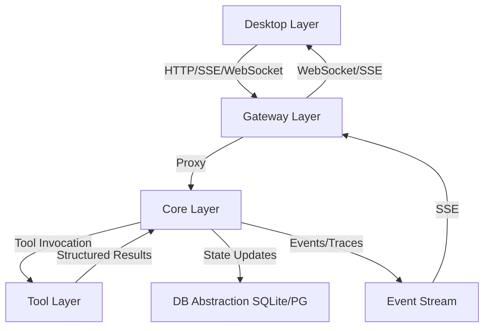

# PROJECT KNOWLEDGE BASE

**Generated:** 2026-05-30
**Generated By:** openai/gpt-5.5
**Last Updated:** 2026-08-23
**Last Updated By:** opencode (model discovery auto-persist + versioned agent model strategy inherit/fixed/cli/acp; legacy overview/runtime-binding/refresh-alias deleted)
**Last Verified Commit:** HEAD of DmaEA/MVP after model-strategy commit
**Branch:** DmaEA/MVP

## AI MAINTENANCE PROTOCOL
- Treat this file and nested `AGENTS.md` files as living project memory, not static docs.
- Before relying on a rule that looks stale, contradictory, or surprising, verify against source files, configs, scripts, and docs.
- If verified reality differs from this file, update the relevant `AGENTS.md` immediately in the same change.
- When changing code, configs, commands, ports, contracts, module boundaries, or build/test workflows, update affected `AGENTS.md` files in the same work item.
- When modifying any `AGENTS.md`, update the metadata above: `Last Updated`, `Last Updated By`, `Last Verified Commit`, and `Branch`.
- Do not “fix” this file from memory alone; cite current repo evidence in the edit rationale or final message.
- Keep entries concise and project-specific. Remove obsolete guidance instead of appending conflicting notes.
- Long-lived branch merges ALWAYS conflict on this file's metadata header (every branch rewrites `Last Updated`/`By`/`Verified Commit`/`Branch`). Resolve by combining BOTH sides' content sections and refreshing the metadata to the post-merge state — never drop either side's entries; code-file conflicts are usually zero because UI and Core branches touch disjoint trees.

## OVERVIEW
TinadecOffice is a product family consisting of independently versioned TinadecCore, TinadecTool, TinadecGateway, and TinadecApp products. The current repository still ships a Windows-first integrated workbench topology, but that topology must not be treated as a mandatory product dependency chain. TinadecCore is the MAF-based agent-governance and collaboration runtime; its normative positioning, DmaEA contract, permission model, evolution lifecycle, and target delivery forms are defined in `docs/tinadec-core-product-definition.zh-CN.md`, with source-backed reference decisions in `docs/tinadec-core-reference-decisions.zh-CN.md`.

The Core is a MAF-based modular monolith; storage and read paths are in place, a full-duplex dual-layer invocation runtime exists (durable run engine, governance coordination → execution → supervision → meeting finalization, context patches, spawn/lineage, candidate review, run control), the tool chain is wired end-to-end (real TinadecTools child process, manifest v2, approval gating, dispatch, recovery), and an `operation`/`execution` configuration foundation has been added. Workspace snapshot providers, Git stewardship, and user tool actions are now governed through Core; event-driven context compression, complete evolution evaluation/canary, and restore-plan UX remain incomplete capabilities.

## CURRENT REBUILD STATE
- TinadecCore is a .NET 10 modular monolith whose current normative Microsoft Agent Framework baseline is MAF 1.18.0.
- MAF 1.18 types stay inside the DmaEA internal adapter. Core remains authoritative for permission, approval, checkpoint, tool receipts, and recovery; compaction preserves atomic call/result groups, telemetry is non-sensitive by default, usage is provider-neutral, and MAF automatic-approval rounds are only a Core budget ceiling.
- `TinadecCore/` currently contains 21 source projects plus 4 test projects after adding Governance. `TinadecCore.slnx` includes the complete Core set; the root solution intentionally contains a smaller Core subset plus external Tools projects/tests.
- Shared database abstraction lives in `TinadecCore/Persistence`: EF Core LINQ surface, default **SQLite** local file, optional **PostgreSQL** via config. Runtime histories, task graphs, events, and artifacts remain Core-owned files under `data/`; tenant-scoped control-plane projections and immutable configuration versions are module-owned relational data.
- `TinadecCore/VectorStore` is a Core foundation capability: it chunks and retrieves semantic content, asks `Models` for embeddings through `IEmbeddingProvider`, and uses Persistence's `IProjectVectorDatabase`. Local SQLite stores independent `sqlite-vec` databases at `data/vectors/tenants/{tenant}/{workspace}/{project}.db`; PostgreSQL uses `pgvector` via `PostgresProjectVectorDatabase` (Npgsql + `Vector`, shared `vector_chunks`/`vector_collections`, `vector_cosine_ops`, `Migration 202608260001_VectorStorePgVector`, `pgvector/pgvector:pg16` in CI).
- Project/session/message CRUD, session run listing, durable replay-then-follow event SSE with heartbeat, and a legacy request-bound invocation endpoint are implemented at port 48731 alongside `GET /api/v1/health`, `GET /api/v1/harness/manifest`, and `GET /api/v1/readiness`. Scheduling and `tools/shell` remain `501` stubs; tool dispatch, approval writes, and `tool-layer-readiness` are implemented.
- **DmaEA legacy invocation runtime (2026-08-05)**: `POST /api/v1/sessions/{id}/invoke-stream` appends the user message and runs legacy planning → execution agents over the configured `chat` model route (`IChatResolver` port, OpenAI-compatible via `ChatClientAgent`), then streams a single terminal `kind:done`/`kind:error` SSE chunk and persists run/task-snapshot/audit events. It does not persist an assistant answer, stream deltas, or detach run lifetime from the request. `GET .../orchestration`, `.../tool-executions`, and `.../task-nodes` return replay-derived projections. `DevSeed` (idempotent, Api composition via Runtime assembly) creates a `chat` route + OpenAI provider (no API key stored) + planner/executor agents on first startup; without a stored key the run fails cleanly (`run.failed` event, error chunk — never fake success). Scheduling, tool dispatch, and approval writes remain `501`.
- **Full-duplex invocation runtime (2026-08-18, tests green)**: `POST /api/v1/sessions/{id}/invoke-stream` now runs the durable full-duplex engine (`FullDuplexRunEngine`): idempotent admission by client message id, `context_revision` snapshots and meeting context patches, governance coordination → task planning → execution → supervision → meeting finalization, worker spawn/lineage with budgets, durable SSE (ack/delta/done/error) with replay/follow, run control (cancel/pause/resume), active-run limits, and restart recovery via leased checkpoints. `GET .../orchestration`, `.../tool-executions`, `.../task-nodes`, `.../context-versions`, `.../stream` and `POST .../control` are implemented; `agent-evolution/proposals` GET and `generate`/`promote`/`reject` are implemented by `Api/Endpoints/EvolutionEndpoints.cs` on top of `AgentInstanceService` candidate review. Scheduling and `tools/shell` remain `501`; tool dispatch, approval writes, and `tool-layer-readiness` are implemented.
- **Tool chain wired end-to-end (2026-08-18, tests green)**: `TinadecToolsProcessManager` auto-probes `TinadecTools:ExecutablePath` (content root, then the repo's `TinadecTools/bin/{Debug|Release}/net10.0/`) when the config value is null, hosts one v2-manifest child process per workspace root, and uses a BOM-free UTF-8 pipe for the line-delimited JSON protocol (the default `Encoding.UTF8` emits an EF-BB-BF preamble that corrupts the first JSON byte on the wire). `ToolManifestSnapshotResolver` freezes the authorized manifest per run, `ToolInvocationScopeResolver` verifies the frozen hash at resume, and `ToolDispatcher` prepare/resume drives the persisted execution plus one-time approval consumption (`ToolApprovalCoordinator`). Approval decisions wake the run via `engine.EnqueueAsync(runId)`; `ControlPlaneService.DecideApproval` is the entry point. `GET /api/v1/tool-layer-readiness` now reports the real manifest (tool counts, approval/checkpoint gates) with graceful degradation notes when no default workspace root is configured. Two real fixes landed: `AgentInstanceService.IsSubset` honors `*` parent grants (workers inherit task `required_tools`), and the recovery scan skips runs younger than a 30s admission grace period so it cannot execute a run whose manifest freeze is still in flight. New tests: `TinadecToolsProcessTests` (5 real-process tests) and `ToolChainEndpointTests` (one full-duplex run→approval→resume→real `write_file` E2E through HTTP).
- **Operation/execution configuration foundation (2026-08-17)**: `TinadecCore/DmaEA/Configuration/default-agent-runtime.toml` defines the annotated built-in baseline, including the `conversation`/`space` mode sets, `space.full_duplex`, `im`/`hub` aliases, a meeting-only `direct_user_output` rule, and default generation budgets (depth 2, 8 generated instances/run, 4 parallel workers, 2 active runs/session). When resolved, `AgentRuntimeConfigurationStore` validates the TOML and hot-reloads only valid in-process snapshots; invalid edits retain the prior snapshot. `agent_instances`, `agent_candidates`, and `runtime_profile_overrides` are relational projections. The full-duplex engine resolves and freezes the profile per run; workspace overrides, the readiness diagnostic, and legacy-orchestrator adoption remain open.
- **Phase 1 vertical slice (2026-08-20, Core 95/Gateway 36/Desktop 262 green)**: 10-state `planning→understanding→…→cancelled` (`planning` writable initial, `StateTransition.fs` synced, `finalizing` removed), global `snake_case` + RFC9457 `ProblemDetails` with `code`+`trace_id`, internal Core OpenAPI `/openapi/core.json` (`Microsoft.AspNetCore.OpenApi 10.0.11` pin), orchestration frozen snapshot `run:{mode_id,agent_profile_id,config_version,config_hash,context_revision}`+`frozen:{…tool_manifest_hash}`, multi-protocol blocking `openai-chat/openai-responses/anthropic-messages` (`Anthropic.SDK 5.10.0`, missing route/key → `run.failed` never fake success), Gateway external OpenAPI `/docs` with `TinadecGateway/src/mappers/*` 12 explicit `CoreDto→ExternalDto` + `headers.ts` `X-Request-Id`/`X-Tinadec-Principal:dev@local` + `proxySseWithCursor` (`Last-Event-ID`/`?cursor`→`after_seq`, 8 kinds `ack/delta/done/error/heartbeat/task_node_update/supervision_update/context_version_update`, `id=seq`), Desktop `src/generated/client.ts` typed fetch + `src/transport/` WS placeholder + `useRunStream` `run_id+seq` dedup/heartbeat/retry + Pinia `project/session/run/workbench` + `WorkbenchPage.vue` (`pending/ready/running/completed/failed/blocked`, `agent/worker`, supervision, context-versions, `cancel/pause/resume`); `/sessions/{id}/runs` still minimal (frozen snapshot only in orchestration).
- `package.json` `dev:core` now targets `TinadecCore/Api/TinadecCore.Api.csproj`.
- **CLI runtime connect closed loop (2026-08-21, Core Api 68 + Gateway 37 green; Desktop 239/253)**: `GET /api/v1/model-providers/cli/discover` probes installed CLIs with `--version` reachability (`missing`/`found`/`configured` status, `binary_path` only when verified) and `POST /api/v1/model-providers/cli/connect` spawns/reuses the CLI service (`CliProcessManager`: ACP `--acp-port` or opencode `serve --port`, `ResponseHeadersRead` reachability probe, exit-fast first-value wait, Win32Exception→`CLI_CONNECT_FAILED` 502) and persists it as an enabled provider carrying the reachable `server_url` + effective launch args — routes are never touched (binding stays a manual model-center action). Core `CliRuntime` adds ACP drivers (`claude-cli`/`codex-cli`/`cursor-acp`, JSON-RPC 2.0 over SSE `AcpChatClient`) + `opencode serve` (`OpenCodeChatClient`); `ChatProtocols.InferFromDriver` infers `acp`/`opencode-serve`, so Desktop sends no protocol. Desktop quick-connect now POSTs connect directly (`api.connectCliRuntime`, SettingsPage `connectDiscoveredCli`) then refreshes the model center; Gateway proxies the connect POST. Both OpenAPI snapshots regenerated (Core + Gateway) for the new routes. Desktop vitest 239/253: the remaining 14 `NotificationIslandHost` failures are a pre-existing Vue 3.6.0-rc.2 Transition + happy-dom environment issue on this branch; stale nested Vue 3.5.41 copies under `apps/desktop/node_modules` were removed (fixes 4 suites, 37→14) to align with the root `vue`/`@vue/compiler-sfc` 3.6.0-rc.2 overrides.
- **智能体配置与全双工重构 (2026-08-22, Core 68/Gateway 35 green)**: 新增 `TinadecCore/AgentConfiguration` 隔离库（11表：`agent_definitions/versions`, `agent_modes/mode_versions/nodes/edges/layouts`, `prompt_pipelines/versions/nodes`, `workspace_defaults`，过滤唯一草稿索引+`Revision IsConcurrencyToken`+`If-Match` 412），发布校验（`operation≥1 meeting + execution≥1`，跨层复用`CROSS_LAYER_REUSE`警告，`EMPTY_EFFECTIVE_TOOLS`，`layer`拒`planning`），`PromptPipeline` 图白名单+环检测+`assemble/template`必备；会话`mode_version_id/meeting_model`持久化（`MemoryDbContext` 新增列+`MigrateAsync` pragma 补列+`PATCH /sessions` `has_update`计算）；`POST /sessions/{id}/interactions` 替代`invoke-stream`（`dispatch_mode: queued|insert|parallel`，insert必带`target_run_id`，上下文`context_revision`补丁冲突→`context_conflict` 409，`parent_select`最多2次重选审计，`inherit/fixed/parent_select`解析）；SSE新增`queued/assigned/steering/context_conflict/model_selection`（复用`RunStream`）；Gateway删除旧`model-center/agent-center/runtime-binding`直接404，新增27薄代理+`agentsMapper/agentModesMapper/promptPipelinesMapper/interactionsMapper`；Desktop `AgentCenterPage` 5 tabs+`AgentModeCanvas` Vue Flow双泳道+`ComposerBar`三动作；基线`DevSeed`植入`space.full_duplex` 12 智能体（5 运营层 meeting/context_compressor/skill_recommender/supervisor/evolution + 1 执行层 task_planner + 6 worker 特化 code/document/data/browser/file/general）+`prompt`+`default-mode` 拓扑默认发布。
- **剩余缺口收口 (2026-08-22, Core 68/Gateway 35 green)**: Session迁移幂等（`ProjectSessionStore.EnsureSessionColumnsAsync` SQLite pragma+PostgreSQL `ADD COLUMN IF NOT EXISTS uuid/TEXT` 双路径，`MigrateAsync` 重复安全）；工具交集在run冻结时复算（`IFormalModeResolver.GetEffectiveToolsForSessionAsync` 聚合 `agent ∩ mode` 各节点 `ParseTools` 并集/`*` 透传，`ToolManifestSnapshotResolver` 取 `ISessionLocator.ModeVersionId` 经 `IFormalModeResolver` 与 `manifest` 求交，空交集=无授权工具）；Prompt强校验（`AgentConfigurationEndpoints.PublishPipeline` 要求 `template` 与 `assemble` 同时存在，白名单 `template/variable/condition/stage/.../assemble/context_trim` + 环检测，`DevSeed` 基线补为 `template→assemble`）；模型策略沿拓扑继承（`Runtime/FormalModeResolver.TryResolveFormalChatAsync` 解析 `inherit/fixed/parent_select`，`fixed` 直连 `ModelControlDbContext` 读 `provider_instance_id/model` 并经 `IContentStore/ISecretStore` 组 `ChatResolution`，`parent_select` 最多3次 `Enabled` provider 轮询，`inherit` 回落默认 `ResolveChatAsync`，统一审计 `AppendEventAsync("model_selection")`+`AppendRunStreamAsync("model_selection")`+`LifecycleDbContext.ControlEventIndex`，`FullDuplexRunEngine` 中 `GenerateMeetingResponseAsync`/`GetWorkerModelTurnAsync` 经 `FixedChatFactory` 接入）；SSE扩展（`FullDuplexRunCoordinator.SubmitTargetRunInteractionAsync` `ack→steering/context_conflict→done` 有序发射，`FullDuplexRunEngine.GetOrCreateWorkerAsync` `ephemeral_agent` 流，`FormalModeResolver` `model_selection` 流，`DmaeaEndpoints.FollowAsync` 透传 8+5 扩展 kind）；文档同步（`docs/architecture.md` `planning/execution`→`operation/execution`，`docs/agent-harness-product-model.zh-CN.md` 运营层/执行层/代码工具套件称呼一致），`openapi.core.json`/`openapi.external.json` 快照校验通过（`dotnet test` 68/32/10 + `bun test` 35），E2E闭环（创建发布Agent→Mode发布→会话选Mode→`POST /interactions` 冻结 `tool_manifest_hash`→实例实时/`ephemeral_agent`→临时候选→`promote` 重发布）验证。
- **模型获取与智能体模型策略收口 (2026-08-23, Core 154/Gateway 36/Desktop 245 green)**: 模型发现闭环——Desktop 触发 canonical `POST /api/v1/model-providers/{id}/models/refresh`，Core 持 SecretStore 密钥代理外部 `GET {base_url}/models`（密钥不出 Core），前端确认后把发现模型合并进 provider 配置并 PUT 持久化；Gateway 仅薄代理读取已写入状态。智能体模型策略版本化——`ValidateModelStrategy` kinds 扩为 `inherit|fixed|parent_select|cli|acp`（cli/acp 要求 `runtime_id`，兼容剥离 `legacy_provider:` 前缀），`FormalModeResolver.TryResolveFormalChatAsync` 新增 cli/acp 分支复用 provider 解析（server_url/免密/ACP 协议已内建）；Desktop 保存链路为 `updateAgentDraft`→`publishAgent`（If-Match revision），`runtimeCenterView.bindingFromModelStrategy` 从 versioned 策略合成绑定视图。删除项：Gateway `/model-center/provider-instances/{id}/models/refresh` 别名 + `modelAgentCenter.ts` 存根，Desktop `getAgentCenterOverview`/`saveAgentRuntimeBinding` 客户端与 runtime-binding UI 分支；openapi.external.json 快照再生成。已知遗留：Core 双注册 `GET /agents`（AgentConfiguration vs ControlPlane flat）仍待按 §14 收口。
- The former `gateway/` tree is currently present as `TinadecGateway/`. Root `dev:gateway` script uses `cd TinadecGateway`.
- Commit `57fb696` remains the verified pre-deletion baseline for legacy implementation details.
- Legacy Core/Contracts test projects (`tests/TinadecCore.Tests`, `tests/Tinadec.Contracts.Tests`) are preserved as requirements evidence but removed from the active solution.
- Storage + Gateway stubs: durable Core storage and a SQLite VectorStore foundation are present; no real model provider calls (API key must be configured via SecretStore), no configured embedding route, and the full-duplex dual-layer runtime is implemented and tested (see `TinadecCore/AGENTS.md` for details). Remaining stub endpoints allow Gateway/Desktop to function without crashes.

## CURRENT INTEGRATED DEPLOYMENT TOPOLOGY

The following Desktop → Gateway → Core → Tool flow describes the repository's current integrated deployment. It does not override the four-product boundary: TinadecApp may direct-connect to Core, Gateway is optional, and Core must evolve from the current direct TinadecTools child-process adapter to a generic Tool Provider contract.

当前集成部署由 App、Gateway、Core 和 Tool 四部分组成，每部分有明确的职责边界和技术栈：

### Desktop层 (UI呈现层)
- **技术栈**: Electron + Vue 3 + Vite + Tailwind CSS
- **端口**: 5173 (Vite开发服务器)
- **主要职责**: 
  - 提供聊天界面、任务图、执行分派、上下文包、监督发现、审批和事件流
  - 包含Agent Debug Studio调试工具
  - 支持可分离的面板窗口
  - 通过HTTP/SSE/WebSocket与Gateway通信
- **关键组件**: 
  - Monaco Editor: 代码编辑器
  - Xterm.js: 终端模拟器
  - Node-pty: 伪终端支持
- **设计原则**: 只调用Gateway，不直接调用Core；不存储任何业务状态

### Gateway层 (BFF/API层)
- **技术栈**: Elysia TypeScript + Node.js
- **端口**: 48730
- **主要职责**: 
  - 作为Desktop和Core之间的代理层
  - 提供RESTful API端点（`/api/v1/*`）
  - 代理所有请求到Core层
  - 处理CORS和API文档（Swagger）
- **关键组件**: 
  - `coreClient.ts`: Gateway到Core的HTTP/SSE调用
  - `mcpRoutes.ts`: MCP协议支持
- **设计原则**: 薄代理模式，不存储任何状态；只代理请求，不实现业务逻辑

### Core层 (智能体编排层)
- **技术栈**: .NET 10 C# + ASP.NET Core
- **端口**: 48731
- **当前状态**: 已重建为基于 MAF 1.18.0 的 .NET 10 模块化单体；项目/会话/消息 CRUD、会话运行列表与回放事件 SSE、旧式 DmaEA invocation、全双工运行引擎（治理协调→任务规划→执行→监督→meeting、上下文补丁、spawn/lineage、run control、重启恢复）、agent-evolution 端点、用户工具动作、Git/文件系统快照与端到端工具链路（真实 TinadecTools 子进程、manifest v2、审批门、dispatch、恢复）已实现。Scheduling、完整演化评测闭环和完整快照恢复 UX 尚未完成。
- **主要职责**: 
  - **唯一状态权威**: 管理会话、消息、项目、事件、审批等所有状态
  - **双层智能体编排**: 治理层 `operation`（主动协调、上下文、监督和候选建议）和执行层 `execution`（任务规划、worker 与证据交付）；新配置和公开契约只使用这两个层值
  - **工具执行与审批**: 通过审批门机制控制写操作
  - **模型路由**: 管理模型provider、route和settings
  - **持久化**: 共享数据库抽象层（默认 SQLite 本地文件；云端/协作可切换 PostgreSQL）；业务表后置
  - **可观测性**: OpenTelemetry集成
- **待补齐的能力**: 真实模型调用需要配置 API key（DevSeed 已建 `chat` 路由/provider/planner/executor，key 经 SecretStore 配置后即生效）、已配置的 embedding 路由、scheduling 与 `tools/shell`；已就位的能力包括状态存储、harness 清单、就绪回执、回放事件、旧式 DmaEA invocation、TOML 配置读取基础、全双工运行引擎（`context_revision`、spawn/lineage、候选晋升与检索、run control）、agent-evolution 端点与端到端工具链路（真实 TinadecTools 子进程、manifest v2 冻结、审批门、dispatch 与恢复、`tool-layer-readiness`）
- **设计原则**: 通用智能体编排模型，可被其他产品复用；通过接口治理工具，不硬编码工具逻辑

### TinadecTools (原型工具层)
- **技术栈**: .NET 10 C# + System.Text.Json source generation + official `ModelContextProtocol` SDK
- **作用**: 作为静态/非静态工具处理器的原型宿主，验证 AOT-safe JSON 与工具注册方式
- **注册方式**: 静态工具使用 `[ToolFunction(...)]` + source generator 生成注册表，可用 `RequiresApproval = true` 标记写工具；需要状态的工具可继承 `ToolHandlerBase<TArgs, TResult>` 并手动注册
- **MCP-Pass-Through**: `Tools/Mcp` 独立实现 `mcp_list`、`mcp_search`、`mcp_invoke`，从启动目录 `mcp_servers.json` 或 `TINADEC_TOOLS_MCP_CONFIG` 读取 stdio MCP server 配置；`mcp_invoke` 需要审批
- **边界**: 这里的 generator 只负责编译期生成静态注册代码，不承担 Core 层状态、审批或路由职责

## LAYER INTERACTION AND DATA FLOW

### 典型用户请求流程
1. 用户在Desktop发起目标、选择项目、配置模式或审批动作
2. Desktop调用Gateway（端口48730）
3. Gateway代理请求到Core（端口48731）
4. Core创建或更新会话状态，生成run、task graph、agent assignment、context pack和supervision finding
5. Core根据工具描述和权限策略决定哪些只读工具可自动执行，哪些必须进入审批流程
6. Core通过工具适配器请求Tool layer
7. Tool layer调用对应工具实现，返回结构化结果
8. Core将结果写回step result、event、trace和状态存储
9. Desktop通过HTTP/SSE/WebSocket刷新UI

### 数据流向图


### 核心设计原则
1. **Core是唯一状态权威**: Gateway和Desktop不存储任何状态
2. **Desktop只调Gateway**: 不直接调用Core
3. **Code是Tool Layer内置工具套件**: 不是独立层
4. **审批门机制控制写操作**: 任何mutating action都必须经过审批
5. **API契约统一snake_case**: 所有API使用snake_case命名
6. **Windows优先**: 针对Windows平台优化

## SURVIVING COMPONENTS AND REBUILD INPUTS

### Gateway层关键组件
- **Elysia App** (`TinadecGateway/src/index.ts`): 主应用入口，定义所有API路由
- **coreClient** (`TinadecGateway/src/coreClient.ts`): Gateway到Core的HTTP/SSE调用客户端
- **toolRuntimeClient** (`TinadecGateway/src/toolRuntimeClient.ts`): 用户直连工具传输代理；目录和风险事实来自 Core/Tool Provider
- **mcpRoutes** (`TinadecGateway/src/mcp/mcpRoutes.ts`): MCP协议支持，处理Model Context Protocol请求
- **debugProxy** (`TinadecGateway/src/debugProxy.ts`): 调试代理，转发Debug Studio相关请求

### Desktop层关键组件
- **Electron Main** (`apps/desktop/electron/main.cjs`): Electron主进程，管理窗口和IPC
- **Panel Window** (`apps/desktop/electron/panelWindow.cjs`): 面板窗口管理，支持可分离的面板窗口
- **Terminal Manager** (`apps/desktop/electron/terminalManager.cjs`): 终端管理器，处理终端IPC
- **API Client** (`apps/desktop/src/api.ts`): API客户端，封装与Gateway的通信
- **Tool Catalog** (`apps/desktop/src/toolCatalog.ts`): 工具目录，组织Code工具套件和设置UI
- **Appearance Composables** (`apps/desktop/src/composables/useTheme.ts`, `apps/desktop/src/composables/usePanelStyles.ts`): 处理主题、强调色和全局面板材质持久化

### Tool层关键组件
- **TinadecTools** (`TinadecTools/`): 审批感知的文件、命令、Git、MCP 原型工具宿主，仍然存在。
- **Source Generator** (`TinadecTools.Generators/`): `[ToolFunction]` 静态注册表生成器，仍然存在。

### 删除前的旧 Core 轮廓
- 旧 `src/` 共 75 个受跟踪文件：Core 43、Contracts 5、Model 27；另有 130 个 `bin`/`obj`/`output` 产物随目录清理。
- 旧 HTTP 面覆盖 health/doctor/readiness、project/session/message、run/task/context/supervision、tool execution/approval、model provider/route/settings、market/extensions、MCP/ACP、agent/prompt evolution、debug/simulation。
- 旧 Core 采用 ASP.NET minimal API + SQLite + OpenTelemetry；Contracts 集中 DTO/event/security；Model 集中 provider runtime、routing、credentials、readiness 和 invocation。
- 这些是重建设计输入，不是必须照搬的目录或类结构。

## AI READING ORDER
Read these before making architecture, feature, or UI decisions:
1. `docs/agent-harness-product-model.zh-CN.md` or `docs/agent-harness-product-model.en.md` - product model and layer boundaries.
2. `docs/architecture.md` - current technical architecture, ports, event shape, and Debug Studio overview.
3. `docs/reference-project-map.md` - sibling-project reference map for VS Code, Codex, t3code, OpenCode, OpenHarness, Open-ClaudeCode, openclaw, pi, DeepSeek-TUI, The Zeroth Docs, and Tinadice.
4. Surviving Gateway/Desktop/TinadecTools source and tests that prove current behavior.
5. Legacy Core/contract tests as requirements evidence; they do not currently build.
6. Deleted implementation through `git show 57fb696:<path>` only when a concrete contract needs historical clarification.

Product model summary: TinadecCore, TinadecTool, TinadecGateway, and TinadecApp are independently versioned products connected by public contracts. Core is the agent-governance/runtime authority; Tool provides executable capabilities; Gateway is an optional API/protocol facade; App provides client experiences. The repository's Desktop → Gateway → Core → TinadecTools flow is the current integrated topology, not a mandatory deployment chain. Code remains a built-in suite inside TinadecTool, not another product. Gateway has no local `codeTools.ts` catalog or approval helper; `/api/v1/code/tools/*` and `/api/v1/tool-runtime/*` are stateless user transport surfaces.

## STRUCTURE
```
TinadecOffice/
├── TinadecCore/            # MAF-based modular monolith (21 source + 4 test projects)
│   ├── Contracts/          # Pure C# DTOs — no MAF/ASP.NET/F# deps
│   ├── Abstractions/       # Port interfaces + ITinadecCoreBuilder
│   ├── Persistence/        # Shared DB abstraction (EF Core; SQLite default, PG optional)
│   ├── VectorStore/        # Semantic indexing/retrieval; project-scoped vector databases
│   ├── Tenancy/            # External-principal, tenant, workspace, membership isolation
│   ├── AgentConfiguration/ # Versioned agent/mode/prompt configuration
│   ├── Storage.Migrations.Sqlite/     # SQLite migrations for storage contexts
│   ├── Storage.Migrations.PostgreSql/ # PostgreSQL migrations for storage contexts
│   ├── Strategies/         # F# pure strategy kernels
│   ├── DmaEA/              # Dual-layer collaboration plus operation/execution TOML baseline (legacy invocation still uses planning/execution)
│   ├── Models/             # Provider instances, routing, readiness
│   ├── Context/            # ContextPack with evidence and token budget
│   ├── Prompts/            # Deterministic prompt assembly
│   ├── Memory/             # Session serialization, chat history, retention
│   ├── Skills/             # AgentSkillsProvider, SKILL.md
│   ├── LoopGuard/          # Loop detection, iteration limits, budget checks
│   ├── Lifecycle/          # Run/task/agent/tool/approval state and audit
│   ├── Tools/              # Core-side Tool Provider governance/adapter
│   ├── Runtime/            # Full composition: AddTinadecCore()
│   ├── Api/                # ASP.NET Core minimal API (port 48731)
│   └── tests/              # Architecture, AgentFramework, Api tests
├── apps/                  # TinadecApp implementations (desktop/web/shared UI)
├── TinadecGateway/        # Elysia BFF/proxy
├── TinadecTools/          # Approval-aware tool prototype host
├── TinadecTools.Generators/ # Tool registry source generator
├── tests/                 # TinadecTools tests plus legacy Core/contract requirements (evidence only)
├── docs/                  # product model, architecture, security, startup runbook
└── TinadecOffice.slnx      # Root solution: selected Core projects/tests plus external TinadecTools projects/tests; TinadecCore.slnx owns the complete 21-source/4-test Core set
```
The legacy `src/` directory is intentionally absent.

## WHERE TO LOOK
| Task | Location | Notes |
|------|----------|-------|
| TinadecCore product / DmaEA boundary | `docs/tinadec-core-product-definition.zh-CN.md` | Normative four-product matrix, DmaEA, permission, configuration, snapshot, evolution, and delivery roadmap. |
| Desktop/Core UI contract | `docs/app-core-ui.md` | Desktop pages, Core user-action endpoints, governance/snapshot state machine, Git write path, error states, and acceptance criteria. |
| Current harness integration view | `docs/agent-harness-product-model.zh-CN.md`, `docs/agent-harness-product-model.en.md` | Current integrated Core / Tool layer / Desktop responsibilities; subordinate to the normative product definition. |
| Sibling project references | `docs/tinadec-core-reference-decisions.zh-CN.md`, `docs/reference-project-map.md` | Source-backed Core decisions first; the older workbench map remains supporting context. |
| Rebuild status | `CURRENT REBUILD STATE` in this file, `TinadecOffice.slnx`, `package.json` | Root full-stack commands restore/build/test Core via `TinadecCore/Api`. |
| Core rebuild target | `TinadecCore/` | MAF modular monolith; Persistence is the shared DB abstraction. |
| Dual-layer runtime baseline | `TinadecCore/DmaEA/Configuration/default-agent-runtime.toml`, `AgentRuntimeConfiguration.cs` | Read the canonical operation/execution contract and current configuration status before changing modes, profiles, spawn budgets, or layer values. |
| Legacy Core contracts | `tests/TinadecCore.Tests`, `tests/Tinadec.Contracts.Tests`, `apps/desktop/src/api.ts`, `TinadecGateway/src/` | Use as requirements evidence; reconcile contradictions explicitly. |
| Deleted implementation | Git object paths under commit `57fb696` | Inspect narrowly with `git show`; do not bulk-restore by default. |
| API proxy/BFF | `TinadecGateway/src/index.ts`, `coreClient.ts`, `modelAgentCenter.ts` | Thin Core proxy plus stateless, secret-stripping center views and Tool-layer code-tool endpoints. |
| Desktop UI | `apps/desktop/src/pages`, `src/components`, `src/api.ts` | Renderer talks to Gateway. |
| Desktop notifications | `apps/desktop/src/composables/useNotifications.ts`, `NotificationIslandHost.vue`, `NotificationDetailDialog.vue`, `App.vue` | Dynamic-island capsules with an explicit lifecycle contract (Apple Live Activity / 小米超级岛 model): `transient` auto-expires and is user-closable, `persistence:'sticky'` transients persist until the user closes them, pending tasks are handle-owned and settle into user-closable feedback, `status` conditions are source-owned and never user-closable (cleared only via `dismissByKey`/broadcast). `isUserDismissible()` governs every close affordance; the overflow badge opens a notification center with live + cleared sections. Never replaces Core approvals or chat approval UI. |
| Desktop Gateway configuration | `apps/desktop/electron/appConfig.cjs`, `electron/main.cjs`, `electron/preload.cjs`, `src/pages/SettingsPage.vue` | General settings persist the validated Gateway URL under Electron `userData`; `TINADEC_GATEWAY_URL` remains the read-only deployment override. |
| Detachable panel windows | `apps/desktop/electron/panelWindow.cjs`, `apps/desktop/src/pages/DetachedPanelPage.vue`, `apps/TinadecUI/src/components/BrowserTabBar.vue`, `apps/TinadecUI/src/components/UieStack.vue`, `apps/TinadecUI/src/components/UieColumn.vue`, `apps/desktop/src/composables/useDetachedTabs.ts`, `apps/TinadecUI/src/components/cards/home/featureCatalog.ts` | Electron multi-window management for the feature panel: the UIE right-column stack renders the browser-style tab chrome (pinned Home tab, per-tab detach/close, drag-to-detach via cursor polling, dashed detached-window indicators, `+` new-tab dropdown listing all pages from `featureCatalog.ts`, 44px collapse rail) and drives detach/reattach through `useDetachedTabs.ts` (maps `browser`↔`preview`); `panelWindow.cjs`/`DetachedPanelPage.vue` create and render the floating windows. The collapsed rail (in `UieColumn.vue`) lists the open feature-tab icons vertically — icon-only, click to activate + expand; the `+` dropdown is Teleported to body (the `ui/dropdown-menu.vue`/`ui/popover.vue` non-teleported wrappers would be clipped by the stack's overflow). The legacy `usePanelTabs.ts`/`ContextPanel.vue` remain only as debug-gallery previews. |
| Local pet system | `apps/desktop/electron/petStore.cjs`, `apps/desktop/electron/petWindow.cjs`, `apps/desktop/src/pets/petRuntime.ts`, `apps/desktop/src/pages/DesktopPetPage.vue` | Desktop-only Petdex v2 registry and transparent multi-window Canvas renderer. `petRuntime.ts` owns the canonical Petdex 8-column grid, nine state rows, active frame counts, timing, and source rectangles; do not infer animation metadata from `pet.json`. Files, enable state, per-pet bounds, and scale are local under Electron `userData/pets/`; sender-scoped IPC handles drag, resize, wheel scaling, close, and transparent-pixel click-through. Never use Gateway/Core. |
| Debug Studio UI | `apps/desktop/src/debug` | Backend was deleted and must be redesigned/reimplemented. |
| Tool layer / Code suite | `TinadecTools`, `TinadecCore/Tools` | Tool Provider 执行能力；Core 负责策略、审批、审计和 dispatch，Gateway 只保留传输代理。 |
| Tool layer UI | `apps/desktop/src/pages/SettingsPage.vue`, `apps/desktop/src/toolCatalog.ts` | Desktop presents Core-governed Code-suite tools and Codex primitives. |
| Prompt context requirements | `apps/desktop/src/pages/SettingsPage.vue`, legacy tests, Git history | New Core must own storage/assembly; Desktop remains presentation only. |
| Shared contract reconstruction | `apps/desktop/src/api.ts`, Gateway response handling, legacy contract tests | Define Core contracts first, then update mirrors. |
| Tests | `tests/TinadecCore.Tests`, `tests/Tinadec.Contracts.Tests`, `tests/TinadecTools.Tests`, app `*.test.ts` | xUnit, node:test, Vitest. |

## CODE MAP
| Symbol/File | Type | Location | Role |
|-------------|------|----------|------|
| Gateway `app` | Server | `TinadecGateway/src/index.ts` | `/api/v1/*` and `/docs` route surface. |
| Gateway `modelAgentCenter` | BFF adapter | `TinadecGateway/src/modelAgentCenter.ts` | Aggregates Core-owned model/agent resources, derives read-only legacy bindings, negotiates optional capability degradation, and validates reserved writes without persisting state. |
| `proxyJson` / `proxySse` | Bridge | `TinadecGateway/src/coreClient.ts` | Gateway-to-Core HTTP/SSE calls. |
| Gateway tool transport | Proxy bridge | `TinadecGateway/src/index.ts`, `toolRuntimeClient.ts` | Forwards Core catalog and direct Tool Provider requests; no local tool specs or risk decisions. |
| Desktop `toolCatalog` | UI helper | `apps/desktop/src/toolCatalog.ts` | Groups Code-suite tools and derives runtime language support for Settings UI. |
| Desktop `api.ts` | DTO mirror | `apps/desktop/src/api.ts` | Renderer-side Core/Gateway response types. |
| `useTheme` | Composable | `apps/desktop/src/composables/useTheme.ts` | Theme/accent persistence and application. |
| `usePanelStyles` | Composable | `apps/desktop/src/composables/usePanelStyles.ts` | Synchronously persists normalized global panel material settings in a detached module-lifetime storage scope; interior surfaces follow `--surface-*` roles, while blur roots expose bounded section/raised filters for a few top-level groups (spec: `docs/architecture.md` § Desktop Panel Material System). |
| `TinadecTools` | 原型工具宿主 | `TinadecTools/Program.cs` | 验证 AOT-safe JSON source generation、静态 `[ToolFunction]` 注册和非静态 handler 基类。 |
| `TinadecTools.Generators` | Source generator | `TinadecTools.Generators/ToolFunctionGenerator.cs` | 扫描 `[ToolFunction]` 并生成静态注册表代码。 |
| `TinadecTools MCP` | Tool suite | `TinadecTools/Tools/Mcp` | 基于 official `ModelContextProtocol` SDK 的独立 MCP pass-through 工具：list/search/invoke。 |

## CONVENTIONS
- npm is the package manager. `package.json` `workspaces` declares only `apps/*`; the Gateway lives at `TinadecGateway/` and is not an npm workspace member — it is driven by the `dev:gateway`/`build`/`test` scripts via `cd TinadecGateway && bun run …`.
- Root `.npmrc` sets `legacy-peer-deps=true` (vite-plugin-vue-mcp declares Vite ≤ 6 peer but works on Vite 7). Keep `react`/`react-dom`/`react-is` as explicit deps in `apps/desktop/package.json` — under legacy-peer-deps npm will not auto-install peer dependencies.
- TypeScript is strict in both app packages. Desktop alias: `@/* -> src/*`.
- Gateway is ESM + `NodeNext`; Desktop is ESM + Vite/Vue + Tailwind.
- The replacement Core is expected to target `net10.0` with nullable and implicit usings enabled unless the rebuild explicitly changes the documented platform decision.
- Rebuilt Core HTTP JSON must use `snake_case`; keep Desktop DTO mirrors synchronized from Core-owned contracts.
- Canonical layers are the governance layer (`operation`) and execution layer (`execution`). Accept `planning` only while migrating old inputs; new Core APIs, event payloads, persisted versions, and Desktop-visible values must use `operation`.
- `default-agent-runtime.toml` is an annotated built-in baseline. Its valid-only hot-reload store is a configuration foundation, not evidence that workspace overrides, run-frozen bindings (the full-duplex engine does freeze a profile per run), or readiness exposure already work.
- Prompt fragment storage and assembly must return to Core. Gateway may proxy and Desktop may manage/preview, but neither may reimplement prompt selection.
- The surviving Model Center contract expects Gateway's five-part overview: Core-owned suppliers, API/local connections, configured-only models, CLI runtimes, and ACP runtimes. Desktop presentation metadata must not become the executable catalog.
- The surviving Agent Center exposes legacy read-only runtime binding previews. Persistent per-agent binding semantics must be redesigned and owned by the new Core before writes are enabled.
- Full assembled prompt content should remain local to preview UI/API. Runtime events and tool results should contain ids/counts/warnings rather than full prompt text.
- Treat Tool layer capabilities as Core-governed tools. Code is a Tool-layer suite, not a separate orchestration layer.
- The legacy contract named `executor_git_manager` as the execution-layer Git Manager Subagent. If retained, all Git mutations must still execute through approved TinadecTools calls; `git_worktree_manager` is only a legacy compatibility name.
- `TinadecTools` 原型里的静态工具写 `[ToolFunction(...)]` + `static ValueTask<TResult> HandleAsync(TArgs args, CancellationToken ct)`；写工具可用 `[ToolFunction("id", RequiresApproval = true)]` 让 generated registry 拒绝未批准调用；非静态工具则通过 `ToolHandlerBase<TArgs, TResult>` 或显式 `ToolRegistry.Register(...)` 接入。
- `TinadecTools` MCP pass-through 只属于工具层原型，不依赖 Core/Gateway/Desktop。配置文件格式是 `{ "servers": [{ "id", "name", "command", "args", "env", "cwd" }] }`；默认读启动目录 `mcp_servers.json`，可用 `TINADEC_TOOLS_MCP_CONFIG` 覆盖。
- `TinadecTools` 的 `command_run` 始终需要审批；Windows 上通过本地 `TinadecSandbox` 账户执行，首次已批准调用可触发 UAC 初始化。工作区和单次显式授权目录以临时 ACL 授予，命令结束后撤销；持久授权写入工作区 `.tinadec/sandbox.json`（gitignored），环境变量只保存名称、不保存值。超时范围是 1 毫秒到 30 分钟，超时会终止 Job Object 进程树；网络和局域网绑定由宿主防火墙决定。
- `TinadecTools` 的完整只读 Git 工具面（状态、推送就绪、diff、日志/文件历史、分支/worktree/ref/remote、blame、revision 文件和冲突预览）都需要审批。它们只读取工作区内 Git 仓库；路径参数必须解析到仓库内且不得穿越 symbolic link 或 junction。补丁与文本输出受调用方字节预算限制，超限时返回显式 binary/truncation 元数据。
- `git_stage` 和 `git_unstage` 都需要审批。它们接受完整仓库内路径或受限 unified text patch（二者互斥）；patch 先进行仓库路径、文本类型和 `git apply --check` 校验，再只更新 Git index。二进制、rename、整文件新增/删除只能按完整路径处理。
- `git_commit` 需要审批和 `confirm_commit`。它要求 `commit_staged_only`、`include_all`、显式 `paths` 三种模式恰好选择一种；路径模式复用仓库/链接边界，成功结果返回 commit hash、实际 staged files 和最新 `git_status`。
- `git_checkout`、`git_branch_create`、`git_branch_delete`、`git_branch_rename` 都需要审批和各自的显式确认字段: `confirm_checkout`、`confirm_branch_create`、`confirm_branch_delete`、`confirm_branch_rename`；分支名由 Git `check-ref-format --branch` 校验，删除当前分支会被工具层拒绝。
- `git_worktree_create` / `git_worktree_remove` 需要审批和显式确认字段 `confirm_worktree_create` / `confirm_worktree_remove`，只管理工作区内 `.tinadec/worktrees/` 下的路径；该目录被 Git 忽略，创建可复用现有本地分支或从 `start_ref` 新建分支，删除当前 worktree 会被拒绝（主 worktree 路径越界会先被 `ResolveManagedPath` 以 `UnauthorizedAccessException` 拒绝）。
- `git_fetch`、`git_push`、`git_pull` 需要审批和显式确认字段 `confirm_fetch`、`confirm_push`、`confirm_pull`。remote 必须是已配置名称；push 拒绝 dirty、detached 或 behind 状态并显式处理 upstream；pull 固定使用 `--ff-only`，不隐式 merge/rebase。
- `git_merge` 支持 start/continue/abort，`git_rebase` 支持 start/continue/abort/skip；均需要审批和显式确认字段 `confirm_merge` / `confirm_rebase`（横跨三种 operation 复用同一 token），并通过禁用 editor 的 Git 配置保持非交互执行，冲突结果返回结构化 conflicted files 和最新 status。
- `git_conflict_preview` 与 `git_conflict_resolve` 共用无 AST 的行级三方文本合并引擎：从 base→ours/theirs 变更区间自动合并不相交、相同或单边修改，只报告真正重叠且不同的局部冲突。resolve 支持 `auto`、`ours`、`theirs`、`both`，需要审批和显式确认字段 `confirm_resolve`，解析后更新工作文件并 stage；binary 仅支持 ours/theirs。
- 所有 mutating 工具的确认语义沿用 `ToolConfirmations.Require(value, fieldName)`：非空字符串即通过，缺失或空白抛 `InvalidOperationException`，由 gateway 翻译为结构化失败。`confirm_*` 是 approval 之上的额外闸门（AND 关系），不替代 approval。`git_stage` / `git_unstage` 仅审批，无 `confirm_*`。
- `TinadecTools` 文件工具在进程启动时将当前目录快照为唯一工作区根目录：相对路径以此解析，绝对路径必须在根目录内；读、写和 `file_search` 均拒绝经过 symbolic link 或 junction 的路径。`ls`/`stat` 可显示链接本身和 `link_target`，但不会读取目标。
- `write_file` 需要审批：仅当父目录已存在时才创建 UTF-8（无 BOM）LF 文件；覆盖既有文件必须提供匹配的 `file_hash`。既有 `replace_*`、`insert_*`、`delete_*` 工具不创建不存在的文件。
- The rebuilt Core must own `/api/v1/harness/manifest`, `/api/v1/tools/search`, `/api/v1/sessions/{sessionId}/tool-executions`, `/api/v1/readiness`, `/api/v1/model-readiness`, `/api/v1/model-catalog-readiness`, and `/api/v1/tool-layer-readiness` semantics. Gateway/Desktop may proxy or display these receipts but must not recompute them.
- Reserved dev ports remain Gateway `48730`, Core `48731`, Vite `5173`.
- When .NET scripts are repaired, continue clearing `Version` and `Ice-Version` for child dotnet processes on this machine. `scripts/setup-dotnet-env.ps1` is the shared wrapper: it clears both variables with diagnostics, then runs `dotnet <args>`; all root `package.json` dotnet commands (`dev:core`, `build`, `test`, `restore:dotnet`) go through it.
- Core centrally pins `Microsoft.AspNetCore.OpenApi` and `Microsoft.AspNetCore.Mvc.Testing` to `10.0.11`, with the required `Microsoft.Extensions.DependencyInjection`, `.Abstractions`, and `Options.ConfigurationExtensions` packages on the same patch. This resolves `Microsoft.OpenApi` to `2.7.5`; verify the security baseline with `dotnet list TinadecCore/TinadecCore.slnx package --vulnerable --include-transitive`.
- No repo ESLint, Prettier, or `.editorconfig` was found. Match local file style.
- CodeGraph 1.4.1 is initialized locally under `.codegraph/`; project-level OpenCode MCP registration is in `opencode.jsonc`, Claude Code MCP registration is in `.mcp.json` (`codegraph serve --mcp`), and telemetry is disabled on the configured developer machine. Run `npm run ai:codegraph:sync` after bulk external changes and `npm run ai:codegraph:status` to verify freshness.
- shadcn-vue AI 集成：`opencode.jsonc` 注册 `shadcnVue` MCP（本地 `npx shadcn-vue@latest mcp`），`.mcp.json` 为 Claude Code 注册同名 `shadcn` 服务器；两者 `cwd` 均指向 `apps/desktop`（`components.json` 位于该目录，MCP 需在那里读取注册表与项目配置；该文件已移除旧版 `rsc`/`tsx` 字段以兼容 shadcn-vue v2 校验）。官方 skill（`unovue/shadcn-vue`）由 `scripts/setup-shadcn-ai.mjs` 幂等安装到 `.agents/skills/`（opencode）与 `.claude/skills/`（claude-code），由 `postinstall`/`predev`/`ai:shadcn:setup` 触发。skill 内容假设 `components.json` 在 CWD 根，激活时运行 `shadcn-vue info --json` 需手动加 `-c apps/desktop`；MCP/skill 在客户端启动时加载，修改后需重启 opencode/Claude Code。
- **UI automation MCP servers (2026-08-20)**: `opencode.jsonc` and `.mcp.json` register `chrome-devtools` (official `npx -y chrome-devtools-mcp@latest`, drives Chrome/Vite renderer or attaches to any CDP endpoint via `--browser-url`) and `electron` (`npx -y electron-mcp-server`, SECURITY_LEVEL=balanced; auto-detects a running Electron app on CDP ports 9222-9225 and exposes window info/screenshot/UI-interaction+eval/logs). `apps/desktop/scripts/dev.mjs` launches dev Electron with `--remote-debugging-port=9222` so both servers can drive the real app. Renderer-only checks can also target the Vite dev server at 5173 in a plain Chrome via chrome-devtools-mcp.
- **Mimosa git 门禁**：`git commit` / `git push` 前会对整个仓库跑 L3 审计，任何 open high finding，即使与本次 diff 完全无关，也会在 graded 模式下阻断提交。门禁放行不属于代码工作流；发现 high 必须修复，门禁输出会逐条列出文件与位置。Gateway 的 Tool Runtime 入口只能转发经过 Core 审批的 `command_run`；TinadecTools 的 Windows 沙箱必须在请求入口和 runner 边界校验 executable、参数、工作目录、超时和环境变量，并使用 `ProcessStartInfo.ArgumentList`。

## PONYTAIL CODING PRINCIPLES

Before writing code, AI agents MUST follow this decision ladder:

1. **YAGNI Check**: Does this need to exist? → No: skip it
2. **Reuse Check**: Already in this codebase? → Reuse it, don't rewrite
3. **Stdlib Check**: Stdlib does it? → Use it
4. **Platform Check**: Native platform feature? → Use it
5. **Dependency Check**: Installed dependency? → Use it
6. **One-liner Check**: One line? → One line
7. **Minimum Viable**: Only then: the minimum that works

**Safety Rules**:
- NEVER remove validation, error handling, security, or accessibility code
- NEVER compromise security guards for brevity
- ALWAYS maintain existing safety patterns

**TinadecOffice Specific Applications**:
- Core层: 优先使用现有的服务接口，避免重复实现
- Gateway层: 保持薄代理模式，不添加业务逻辑
- Desktop层: 复用现有组件，避免过度封装

**CodeGraph Integration**:
- Use CodeGraph for understanding cross-layer call chains
- Query CodeGraph before making architecture changes
- Verify impact radius using CodeGraph impact analysis
- Trust CodeGraph results, avoid re-verifying with grep

**Layer-Specific Examples**:

Desktop Layer (Electron + Vue 3):
```vue
<!-- Good: Use native HTML5 -->
<input type="date" v-model="date">

<!-- Bad: Install third-party library -->
<!-- <DatePicker v-model="date" /> -->
```

Gateway Layer (Elysia TypeScript):
```typescript
// Good: Simple validation
app.post('/api/v1/endpoint', {
  body: t.Object({ name: t.String() })
}, (context) => proxyToCore(context))

// Bad: Complex middleware chain
// app.post('/api/v1/endpoint', validate, transform, authorize, handler)
```

Core Layer (.NET 10 C#):
```csharp
// Good: Use built-in logging
_logger.LogInformation("Operation completed")

// Bad: Introduce third-party logging
// Log.Information("Operation completed")
```

**Ponytail Validation**:
Run `npm run ai:ponytail:validate` to verify Ponytail configuration.

**Project linkage**: Claude Code consumes Ponytail via the project skill
`.claude/skills/ponytail/SKILL.md` (`/ponytail`); the canonical TinadecOffice rules
live in `.ponytail/rules.md`. OpenCode consumes the `@dietrichgebert/ponytail`
plugin registered in `opencode.jsonc`.

## ANTI-PATTERNS (THIS PROJECT)
- Keep the current `apps/desktop` implementation on its configured Gateway transport unless a scoped product change introduces a direct-Core transport. The TinadecApp product contract permits either topology; neither may bypass Core authentication or public APIs.
- Do not store session state, approvals, model routes, or provider lifecycle state in Gateway/Desktop; Core owns it.
- Do not model Code as a fifth product. Code is one built-in suite inside TinadecTool.
- Do not let Tool-layer implementations bypass Core approval, policy, event, trace, or state recording.
- Do not edit generated/artifact directories: `bin/`, `obj/`, `node_modules/`, `dist/`, `dist-electron/`, `.vite/`, `coverage/`, `output/`, `tmp/`.
- Do not assume lint/format tooling exists; there is none configured.

## TERMINAL OPERATING DISCIPLINE (Windows/pwsh)

Every bash/pwsh call here must be able to determine its own end. Bare-running a long-lived/foreground process will get killed by the tool timeout (wastes 2 min, no output). The four failure modes and their fixes:

1. **Long-running servers / dev watchers** — never run bare (`npm run dev`, `dotnet run`, `bun run src/index.ts`). Start them **background** with `Start-Process` + `-RedirectStandardOutput/-Error` to `$env:TEMP\opencode\*.log` + `-WindowStyle Hidden`; the `Start-Process` call itself must return immediately. Use `scripts/setup-dotnet-env.ps1 run --project TinadecCore/Api --no-build`; for Gateway `Start-Process bun run src/index.ts -WorkingDirectory TinadecGateway`. `npm` needs `npm.cmd` under Start-Process.
2. **Health polling** — fold the loop into ONE bash call with a short timeout (≤ ~40s) and `break` on success. Never one `Invoke-RestMethod` per call (each hangs 30-60s). Ports: Core 48731, Gateway 48730.
3. **E2E verification** — do create → assert → cleanup inside a single bash call (via `;` / try-catch / variables). Never one HTTP request per bash call.
4. **Log triage** — never `Get-Content` a whole MB-scale server log (screen floods). Grep-filter keywords (`Select-String -Pattern "error|fail:"`). If the developer exception page swallows the real cause, run the relevant unit test instead of digging logs.

**Stop dev before build/test** (the running Core instance locks dlls → MSB3021 copy failures; the real-process `TinadecToolsProcessTests` also flake on resource contention). Kill with `Get-Process dotnet,node,bun | Where-Object { $_.CommandLine -match 'TinadecCore|bun run' } | Stop-Process -Force` plus `Get-NetTCPConnection -LocalPort 48731,48730,5173`.

Full worked examples and the anti-pattern list live in the **`terminal-hygiene`** skill (`.claude/skills/terminal-hygiene/SKILL.md`) — load it via `/terminal-hygiene` for any terminal that keeps stalling.

## COMMANDS

Root `restore:dotnet`, `dev:core`, `build`, and `test` commands are now functional with the rebuilt TinadecCore skeleton.

```bash
# Restore .NET packages (both Core sub-solution and root solution)
npm run restore:dotnet

# Install npm dependencies (repo root). .npmrc sets legacy-peer-deps=true so
# vite-plugin-vue-mcp installs cleanly on Vite 7 without manual flags.
npm install

# Start all services (Core + Gateway + Desktop)
npm run dev

# Start Core only (port 48731)
npm run dev:core

# Build everything
npm run build

# Run all tests
npm test
```

Core sub-solution only:

```powershell
powershell -NoProfile -ExecutionPolicy Bypass -File scripts/setup-dotnet-env.ps1 restore TinadecCore/TinadecCore.slnx
powershell -NoProfile -ExecutionPolicy Bypass -File scripts/setup-dotnet-env.ps1 build TinadecCore/TinadecCore.slnx --no-restore
powershell -NoProfile -ExecutionPolicy Bypass -File scripts/setup-dotnet-env.ps1 test TinadecCore/TinadecCore.slnx --no-build
```

Surviving package tests:

```bash
npm --prefix TinadecGateway test
npm --prefix apps/desktop test
```

Direct TinadecTools test on Windows/PowerShell:
```powershell
powershell -NoProfile -ExecutionPolicy Bypass -File scripts/setup-dotnet-env.ps1 test tests/TinadecTools.Tests/TinadecTools.Tests.csproj -v minimal
```

## CORE REBUILD GUARDRAILS

1. Define the new project/module boundaries before creating provider, persistence, or orchestration classes.
2. Reconstruct contracts from product docs, Gateway/Desktop consumers, legacy tests, and narrow Git-history reads; do not copy the old `src/` tree wholesale.
3. Core remains the only authority for state, routes, approvals, readiness, policy, audit, and events.
4. Keep Gateway thin and Desktop presentation-only.
5. Reuse surviving TinadecTools capabilities behind Core approval/policy adapters instead of duplicating tool implementations.
6. Restore build/test scripts only when their referenced projects exist, then validate in proportion to the reconstructed surface.

## NOTES
- Vue and C# language servers may be missing in lightweight environments; verify with package/build commands when LSP is unavailable.
- The largest surviving UI hotspot is `apps/desktop/src/pages/SettingsPage.vue`.
- `TinadecCore/Persistence` is the shared database abstraction; default SQLite path is under Api content root `data/tinadec.db` (gitignored `*.db`). SQLite migrations apply on local Core startup; PostgreSQL requires `TinadecPersistence:ApplyMigrationsOnStartup=true` to avoid multi-instance deployment races.

<!-- CODEGRAPH_START -->
## CodeGraph

In repositories indexed by CodeGraph (a `.codegraph/` directory exists at the repo root), reach for it BEFORE grep/find or reading files when you need to understand or locate code:

- **MCP tool** (when available): `codegraph_explore` answers most code questions in one call — the relevant symbols' verbatim source plus the call paths between them, including dynamic-dispatch hops grep can't follow. Name a file or symbol in the query to read its current line-numbered source. If it's listed but deferred, load it by name via tool search.
- **Shell** (always works): `codegraph explore "<symbol names or question>"` prints the same output.

If there is no `.codegraph/` directory, skip CodeGraph entirely — indexing is the user's decision.
<!-- CODEGRAPH_END -->

## Vue MCP (Desktop UI introspection) — USE PROACTIVELY

While the Desktop dev server is running and the app is loaded, reach for the `vue-mcp` MCP server (registered in root `.mcp.json` as SSE `http://localhost:5173/__mcp/sse`) to inspect the **live** Vue app instead of reading source:

- `get-component-tree`, `get-component-state`, `edit-component-state`, `highlight-component` — live component hierarchy/state and in-place mutation
- `get-router-info` — registered routes
- `get-pinia-tree`, `get-pinia-state` — Pinia stores (Desktop currently has none; relevant only if one is added)

**Prerequisites**: Desktop dev server up (`npm run dev:desktop`) AND the app loaded in the Electron window/browser AND Claude Code connected to `vue-mcp`. **Fallback**: if `vue-mcp` is not connected, read source under `apps/desktop/src`; never treat an absent live connection as "no components/state".
