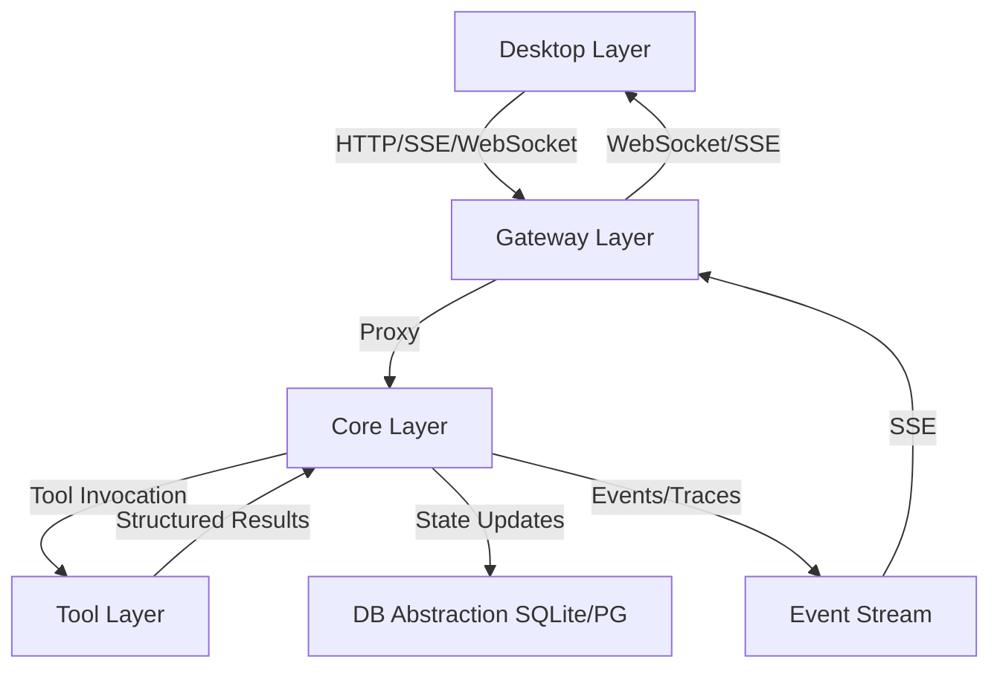

# PROJECT KNOWLEDGE BASE

**Generated:** 2026-05-30
**Generated By:** openai/gpt-5.5
**Last Updated:** 2026-09-10
**Last Updated By:** 自定义主题色选色盘改为手写 shadcn 风格 2D 取色区（替换原生 `<input type="color">`）
**Last Verified Commit:** ad579df
**Branch:** Astra

> The metadata above is advisory and goes stale by design. Never treat an "implemented/current" claim in this file as fact without verifying it against source and tests.

## AI MAINTENANCE PROTOCOL
- Treat this file and nested `AGENTS.md` files as living project memory, not static docs.
- Before relying on a rule that looks stale, contradictory, or surprising, verify against source files, configs, scripts, and docs.
- If verified reality differs from this file, update the relevant `AGENTS.md` immediately in the same change.
- When changing code, configs, commands, ports, contracts, module boundaries, or build/test workflows, update affected `AGENTS.md` files in the same work item.
- When modifying any `AGENTS.md`, update the metadata above: `Last Updated`, `Last Updated By`, `Last Verified Commit`, and `Branch`.
- Do not “fix” this file from memory alone; cite current repo evidence in the edit rationale or final message.
- Keep entries concise and project-specific. Remove obsolete guidance instead of appending conflicting notes.
- Long-lived branch merges ALWAYS conflict on this file's metadata header (every branch rewrites `Last Updated`/`By`/`Verified Commit`/`Branch`). Resolve by combining BOTH sides' content sections and refreshing the metadata to the post-merge state — never drop either side's entries; code-file conflicts are usually zero because UI and Core branches touch disjoint trees.

## OVERVIEW
TinadecOffice is a product family consisting of independently versioned TinadecCore, TinadecTool, TinadecGateway, and TinadecApp products. The current repository still ships a Windows-first integrated workbench topology, but that topology must not be treated as a mandatory product dependency chain. TinadecCore is the MAF-based agent-governance and collaboration runtime; its normative positioning, DmaEA contract, permission model, evolution lifecycle, and target delivery forms are defined in `docs/tinadec-core-product-definition.zh-CN.md`, with source-backed reference decisions in `docs/tinadec-core-reference-decisions.zh-CN.md`.

The Core is a MAF-based modular monolith; storage and read paths are in place, a full-duplex dual-layer invocation runtime exists (durable run engine, governance coordination → execution → supervision → meeting finalization, context patches, spawn/lineage, candidate review, run control), the tool chain is wired end-to-end (real TinadecTools child process, manifest v2, approval gating, dispatch, recovery), and an `operation`/`execution` configuration foundation has been added. Workspace snapshot providers, Git stewardship, and user tool actions are now governed through Core; event-driven context compression, complete evolution evaluation/canary, and restore-plan UX remain incomplete capabilities.

## CURRENT REBUILD STATE
- TinadecCore is a .NET 10 modular monolith whose current normative Microsoft Agent Framework baseline is MAF 1.18.0.
- MAF 1.18 types stay inside the DmaEA internal adapter. Core remains authoritative for permission, approval, checkpoint, tool receipts, and recovery; compaction preserves atomic call/result groups, telemetry is non-sensitive by default, usage is provider-neutral, and MAF automatic-approval rounds are only a Core budget ceiling.
- `TinadecCore/` currently contains 22 source projects (including the packable `AspNetCore` HTTP layer) plus 4 test projects. `TinadecCore.slnx` includes the complete Core set; the root solution intentionally contains a smaller Core subset plus external Tools projects/tests.
- Shared database abstraction lives in `TinadecCore/Persistence`: EF Core LINQ surface, default **SQLite** local file, optional **PostgreSQL** via config. Runtime histories, task graphs, events, and artifacts remain Core-owned files under `data/`; tenant-scoped control-plane projections and immutable configuration versions are module-owned relational data.
- `TinadecCore/VectorStore` is a Core foundation capability: it chunks and retrieves semantic content, asks `Models` for embeddings through `IEmbeddingProvider`, and uses Persistence's `IProjectVectorDatabase`. Local SQLite stores independent `sqlite-vec` databases at `data/vectors/tenants/{tenant}/{workspace}/{project}.db`; PostgreSQL uses `pgvector` via `PostgresProjectVectorDatabase` (Npgsql + `Vector`, shared `vector_chunks`/`vector_collections`, `vector_cosine_ops`, `Migration 202608260001_VectorStorePgVector`, `pgvector/pgvector:pg16` in CI).
- Project/session/message CRUD, session run listing, durable replay-then-follow event SSE with heartbeat, and durable interaction admission (`POST /api/v1/sessions/{id}/interactions` → `GET /api/v1/runs/{runId}/stream`) are implemented at port 48731 alongside `GET /api/v1/health`, `GET /api/v1/harness/manifest`, and `GET /api/v1/readiness`. Scheduling remains a `501` stub; tool dispatch, approval writes, and `tool-layer-readiness` are implemented. The request-bound `invoke-stream` route is retired and returns 404.
- **Dual-layer permission closure (2026-08-31)**: the operation/execution split is now enforced as permission data instead of an engine convention. (1) `CoreAuthorizationContextResolver` emits a single unconditional deny boundary `operation_layer_cannot_invoke_tools` for any `layer == "operation"` instance, so a governance agent cannot dispatch any tool even when its published version still grants `*`; this sits behind `Maf18RuntimeAdapter`'s "governance agents never receive tools" model-surface guard. (2) The `agent_version` boundary reads the real snapshot key: writers persist `tool_scope` (`BootstrapAgentDirectory`, `AgentPackService`) while the resolver read `allowed_tools`, so the immutable AgentVersion authority was inert and a broader frozen-roster copy could re-widen a narrowed publish — the resolver now accepts `tool_scope|allowed_tools|tools` and treats a declared scope as final (deny included), falling back only when no scope is readable at all. (3) `FreezeToolManifestAsync` unions **only** `ExecutionAgents`, so a governance declaration can no longer raise the run's tool ceiling. (4) `SpawnAsync` refuses a wildcard child grant — `*` is legal only in a published declaration as a delegable envelope — which closes the path where planner-authored `required_tools` minted an all-tool worker; `IsSubset`'s `*` short-circuit is now only ever reached from a concrete child set. (5) The worker tool **declaration** surface moved onto the previously dead `IFrozenToolManifestCatalog` (instance grant ∩ run-frozen manifest, which self-verifies the frozen hash) instead of re-reading the live provider manifest. (6) `GET /api/v1/tool-layer-readiness` derives every count from the resolved runtime snapshot rather than returning `Array.Empty`; measured live it still shows `agent_scopes: []` because `default-agent-runtime.toml` carries no roster since 2026-08-25, so exposing the *formal* per-agent scopes for the default workspace remains open. Regression proof: three new `[Fact]`s in `ToolChainEndpointTests` — `OperationLayerToolInvoke_IsDeniedByLayerPolicy_WhileWorkerIsAllowed`, `DerivedAgentCannotCarryWildcardToolGrant`, and `AgentVersionBoundary_UsesDeclaredToolScope_AsFinalAnswer`. Measured: Core 232/232 green on a full parallel solution run (153 Api + 55 AgentFramework + 13 Governance + 11 Architecture), Desktop 316 passed / 14 pre-existing skipped, Gateway 44 passed, root `TinadecOffice.slnx` builds with 0 errors. Two of the new `[Fact]`s add full-host WebApplicationFactory cases to an already load-sensitive class, so the documented cross-project flake (ToolChain/CliRuntime/TinadecToolsProcess) is slightly more likely on a cold parallel run; the failing set moved between runs and every suspect passed in isolation. **Pack data aligned in the same change**: `tinadec.office.agent-pack` shipped as **0.2.1** with `tool_scope: []` for the five non-steward governance roles (new RFC 8785 digest `8110547a03bebe857dfd1736b728293d2e1cd427843338897c0081a43068962e`), pinned as a data contract by `OfficeAgentPack.test.ts`; `AgentPackEndpointTests` now reads the expected version from the bundled manifest instead of hard-coding it. The only remaining wildcard is `worker.general`, **deliberately accepted** this round: it is its delegable template ceiling and the only writable fallback worker in `conversation.vibe`, so narrowing it would make that mode's write tasks fail closed. Wildcards can no longer reach an instance either way, because `SpawnAsync` refuses them.
- **Agent terminal capability (2026-08-31)**: the terminal feature is two transports behind one widget. (1) The user's own shell stays on the Electron direct path (`electron/terminalManager.cjs` node-pty → `window.tinadec.terminal.*` IPC). (2) The agent shell tool goes through the tool-core-gateway path: `TinadecTools` now hosts a governed `shell` tool (`Tools/Command/ShellTool.cs` + `Runtime/TerminalSessionRunner.cs` — one-shot by default, `long_lived:true` promotes into a hosted session that keeps streaming after the call returns) and a reserved `#terminal` control tool (write/kill/status, excluded from the manifest). Wire protocol v2 gained unsolicited event lines (`{"kind":"event",...}`) routed by call id in `TinadecToolsProcessManager` (`CallStreamingAsync` + `WireEventBroadcast`); `ToolDispatcher` pumps them into the run event log (`terminal.command/stdout/exit` kinds via `ToolEventPump`) and records sessions in `TerminalSessionRegistry`; `POST /api/v1/terminals/{id}/stdin|kill` + `GET /api/v1/terminals?run_id=` (`TerminalEndpoints.cs`) are audited Core routes, and run cancel cascades a kill of the run's live sessions. Gateway proxies the terminal routes (pure transport, openapi.external.json regenerated). Desktop renders both under `useTerminalSource.ts` (`local` = IPC PTY, `agent` = event-journal replay+follow with audited stdin POST); conversation shell calls render as `chat/TerminalCallBlock.vue` with 暂停/终止 + 「在功能面板打开」 (`openAgentTerminal` reuses the terminal panel tab with an AGENT source badge). Protocol smoke test: `scripts/terminal_protocol_smoke.py`. Known follow-ups: no ConPTY (pipes only), explicit `long_lived` flag only (no auto-upgrade), Gateway `/ws/terminal` stub untouched.
- **DmaEA legacy invocation runtime (2026-08-05) — RETIRED, route returns 404; kept as a historical record**: `POST /api/v1/sessions/{id}/invoke-stream` appended the user message and runs legacy planning → execution agents over the configured `chat` model route (`IChatResolver` port, OpenAI-compatible via `ChatClientAgent`), then streams a single terminal `kind:done`/`kind:error` SSE chunk and persists run/task-snapshot/audit events. It does not persist an assistant answer, stream deltas, or detach run lifetime from the request. `GET .../orchestration`, `.../tool-executions`, and `.../task-nodes` return replay-derived projections. `DevSeed` (idempotent, Api composition via Runtime assembly) creates **only** a `chat` route + OpenAI provider (no API key stored); it seeds no planner/executor agents (`Runtime/DevSeed.cs:29-85`). Without a stored key a run fails cleanly (`run.failed` event, error chunk — never fake success). Scheduling remains a `501` stub; tool dispatch, approval writes, and `tool-layer-readiness` are implemented.
- **Full-duplex invocation runtime (2026-08-18, tests green)**: the durable full-duplex engine (`FullDuplexRunEngine`) is entered through `POST /api/v1/sessions/{id}/interactions` and read back through `GET /api/v1/runs/{runId}/stream` (the former `invoke-stream` route is retired): idempotent admission by client message id, `context_revision` snapshots and meeting context patches, governance coordination → task planning → execution → supervision → meeting finalization, worker spawn/lineage with budgets, durable SSE (ack/delta/done/error) with replay/follow, run control (cancel/pause/resume), active-run limits, and restart recovery via leased checkpoints. `GET .../orchestration`, `.../tool-executions`, `.../task-nodes`, `.../context-versions`, `.../stream` and `POST .../control` are implemented; `agent-evolution/proposals` GET and `generate`/`promote`/`reject` are implemented by `AspNetCore/Endpoints/EvolutionEndpoints.cs` on top of `AgentInstanceService` candidate review. Scheduling remains `501`; `tools/shell` is implemented as the governed `shell` tool dispatch (`runs/{runId}/tools/shell/execute`, approval-gated), as are tool dispatch, approval writes, and `tool-layer-readiness`.
- **Tool chain wired end-to-end (2026-08-18, tests green)**: `TinadecToolsProcessManager` auto-probes `TinadecTools:ExecutablePath` (content root, then the repo's `TinadecTools/bin/{Debug|Release}/net10.0/`) when the config value is null, hosts one v2-manifest child process per workspace root, and uses a BOM-free UTF-8 pipe for the line-delimited JSON protocol (the default `Encoding.UTF8` emits an EF-BB-BF preamble that corrupts the first JSON byte on the wire). `ToolManifestSnapshotResolver` freezes the authorized manifest per run, `ToolInvocationScopeResolver` verifies the frozen hash at resume, and `ToolDispatcher` prepare/resume drives the persisted execution plus one-time approval consumption (`ToolApprovalCoordinator`). Approval decisions wake the run via `engine.EnqueueAsync(runId)`; `ControlPlaneService.DecideApproval` is the entry point. `GET /api/v1/tool-layer-readiness` now reports the real manifest (tool counts, approval/checkpoint gates) with graceful degradation notes when no default workspace root is configured. Two real fixes landed: `AgentInstanceService.IsSubset` honors `*` parent grants (workers inherit task `required_tools`) — superseded on 2026-08-31, where a derived instance may no longer carry `*` at all (see the dual-layer permission closure entry) — and the recovery scan skips runs younger than a 30s admission grace period so it cannot execute a run whose manifest freeze is still in flight. New tests: `TinadecToolsProcessTests` (5 real-process tests) and `ToolChainEndpointTests` (one full-duplex run→approval→resume→real `write_file` E2E through HTTP).
- **Operation/execution configuration foundation (2026-08-17)**: `TinadecCore/DmaEA/Configuration/default-agent-runtime.toml` defines the annotated built-in baseline, including the `conversation`/`space` mode sets, `space.full_duplex`, `im`/`hub` aliases, a meeting-only `direct_user_output` rule, and default generation budgets (depth 2, 16 generated instances/run, 4 parallel workers, 2 active runs/session). When resolved, `AgentRuntimeConfigurationStore` validates the TOML and hot-reloads only valid in-process snapshots; invalid edits retain the prior snapshot. `agent_instances`, `agent_candidates`, and `runtime_profile_overrides` are relational projections. The full-duplex engine resolves and freezes the profile per run; workspace overrides, the readiness diagnostic, and legacy-orchestrator adoption remain open.
- **Phase 1 vertical slice (2026-08-20, Core 95/Gateway 36/Desktop 262 green)**: 12-state run vocabulary (`planning` writable initial, `StateTransition.fs` delegates to `RunStatusMachine`, `finalizing` removed), global `snake_case` + RFC9457 `ProblemDetails` with `code`+`trace_id`, internal Core OpenAPI `/openapi/core.json` (`Microsoft.AspNetCore.OpenApi 10.0.11` pin), orchestration frozen snapshot `run:{mode_id,agent_profile_id,config_version,config_hash,context_revision}`+`frozen:{…tool_manifest_hash}`, multi-protocol blocking `openai-chat/openai-responses/anthropic-messages` (`Anthropic.SDK 5.10.0`, missing route/key → `run.failed` never fake success), Gateway external OpenAPI `/docs` with `TinadecGateway/src/mappers/*` 15 explicit `CoreDto→ExternalDto` + `headers.ts` `X-Request-Id`/`X-Tinadec-Principal:dev@local` + `proxySseWithCursor` (`Last-Event-ID`/`?cursor`→`after_seq`, 8 kinds `ack/delta/done/error/heartbeat/task_node_update/supervision_update/context_version_update`, `id=seq`), Desktop `src/generated/client.ts` typed fetch + `src/transport/` WS placeholder + `useRunStream` `run_id+seq` dedup/heartbeat/retry + Pinia `project/session/run/workbench` + `WorkbenchPage.vue` (`pending/ready/running/completed/failed/blocked`, `agent/worker`, supervision, context-versions, `cancel/pause/resume`); `/sessions/{id}/runs` still minimal (frozen snapshot only in orchestration).
- `package.json` `dev:core` now targets `TinadecCore/Api/TinadecCore.Api.csproj`.
- **CLI runtime connect closed loop (2026-08-21, Core Api 68 + Gateway 37 green; Desktop 239/253)**: `GET /api/v1/model-providers/cli/discover` probes installed CLIs with `--version` reachability (`missing`/`found`/`configured` status, `binary_path` only when verified) and `POST /api/v1/model-providers/cli/connect` spawns/reuses the CLI service (`CliProcessManager`: ACP `--acp-port` or opencode `serve --port`, `ResponseHeadersRead` reachability probe, exit-fast first-value wait, Win32Exception→`CLI_CONNECT_FAILED` 502) and persists it as an enabled provider carrying the reachable `server_url` + effective launch args — routes are never touched (binding stays a manual model-center action). Core `CliRuntime` adds ACP drivers (`claude-cli`/`codex-cli`/`cursor-acp`, JSON-RPC 2.0 over SSE `AcpChatClient`) + `opencode serve` (`OpenCodeChatClient`); `ChatProtocols.InferFromDriver` infers `acp`/`opencode-serve`, so Desktop sends no protocol. Desktop quick-connect now POSTs connect directly (`api.connectCliRuntime`, SettingsPage `connectDiscoveredCli`) then refreshes the model center; Gateway proxies the connect POST. Both OpenAPI snapshots regenerated (Core + Gateway) for the new routes. Desktop vitest 239/253: the remaining 14 `NotificationIslandHost` failures are a pre-existing Vue 3.6.0-rc.2 Transition + happy-dom environment issue on this branch; stale nested Vue 3.5.41 copies under `apps/desktop/node_modules` were removed (fixes 4 suites, 37→14) to align with the root `vue`/`@vue/compiler-sfc` 3.6.0-rc.2 overrides. **(2026-08-29 update: those 14 cases are now wrapped in `describe.skip` in `apps/desktop/src/components/NotificationIslandHost.test.ts` — commit `96d41b9` — so vitest no longer reports them as failures; the Vue Transition root cause remains unfixed.)**
- **Schema bootstrapper column reconciliation (2026-08-29, verified end-to-end)**: databases created before a model column is added could never receive it — `GovernanceNonceMaterial` (`202608220008`, SQLite + PostgreSQL) is a deliberate no-op because governance tables are bootstrap-created with no migration history, so the pre-20260822 `capability_leases` shape (inline NOT NULL `nonce`, no `nonce_secret_reference`) survived every startup and broke `POST /api/v1/approvals/{id}/decision` with `SQLite Error 1: table capability_leases has no column named nonce_secret_reference`, leaving runs stuck in `awaiting_user` until approval expiry. Fix: `TinadecCore/Persistence/DbContextMigrationParticipant.cs` `DbContextSchemaBootstrapper` now reconciles columns after table creation — `ReconcileModelColumnsAsync` compares model columns against the live table (`pragma_table_info` on SQLite, `information_schema.columns` on PostgreSQL) and `ALTER TABLE ADD COLUMN`s what is missing (required columns get a type-zero `NOT NULL DEFAULT`), plus a targeted guarded drop of the legacy `capability_leases.nonce` column. Idempotent on fresh databases; regression test `TinadecCore/tests/TinadecCore.Governance.Tests/SchemaReconciliationTests.cs`. Verified live: the full-duplex chain (project→session→interaction→tool approval→approved `write_file` landing in the project's workspace root→supervision pass→completed) works over real HTTP against a local scripted OpenAI-compatible endpoint (`PUT /api/v1/model-providers/{id}` accepts `api_key` + `base_url`; If-Match takes the bare revision number), including run/approval durability across a Core restart. Core 219 tests pass in isolation; parallel full-suite runs flake (ToolChain/FullDuplex/CliRuntime/TinadecToolsProcess cross-interference), including a known sharp edge where a run already in `awaiting_user` rejects the engine's `awaiting_approval` transition (`RunStatusMachine` forbids `awaiting_user→awaiting_approval`, `StorageLifecycleService.cs`).
- **智能体配置与全双工重构 (2026-08-22, Core 68/Gateway 35 green)**: 新增 `TinadecCore/AgentConfiguration` 隔离库（Agent/Mode/Prompt/WorkspaceDefaults draft、不可变版本与 ETag），正式 ModeVersion 成为 session/run 的关系库事实源；`POST /sessions/{id}/interactions` 支持 `queued|insert|parallel`，Prompt 图、工具交集和逐 Agent 模型策略（当时的 inherit/fixed/父选枚举，2026-08-27 已收敛为 inherit|route|fixed）进入冻结运行配置。Office 正式 roster 已于 2026-08-25 从 DevSeed 迁出，见下方 OfficeAgentPack 条目。
- **剩余缺口收口 (2026-08-22, Core 68/Gateway 35 green)**: Session迁移幂等（`ProjectSessionStore.EnsureSessionColumnsAsync` SQLite pragma+PostgreSQL `ADD COLUMN IF NOT EXISTS uuid/TEXT` 双路径，`MigrateAsync` 重复安全）；工具交集在run冻结时复算（`IFormalModeResolver.GetEffectiveToolsForSessionAsync` 聚合 `agent ∩ mode` 各节点 `ParseTools` 并集/`*` 透传，`ToolManifestSnapshotResolver` 取 `ISessionLocator.ModeVersionId` 经 `IFormalModeResolver` 与 `manifest` 求交，空交集=无授权工具）；Prompt强校验（`AgentConfigurationEndpoints.PublishPipeline` 要求 `template` 与 `assemble` 同时存在，白名单 `template/variable/condition/stage/.../assemble/context_trim` + 环检测，`DevSeed` 基线补为 `template→assemble`）；模型策略沿拓扑继承（`Runtime/FormalModeResolver.TryResolveFormalChatAsync` 当时解析 inherit/fixed/父选三种策略，`fixed` 直连 `ModelControlDbContext` 读 `provider_instance_id/model` 并经 `IContentStore/ISecretStore` 组 `ChatResolution`，父选策略最多3次 `Enabled` provider 轮询，`inherit` 回落默认 `ResolveChatAsync`，统一审计 `AppendEventAsync("model_selection")`+`AppendRunStreamAsync("model_selection")`+`LifecycleDbContext.ControlEventIndex`，`FullDuplexRunEngine` 中 `GenerateMeetingResponseAsync`/`GetWorkerModelTurnAsync` 经 `FixedChatFactory` 接入；该解析已于 2026-08-27 由 `IAgentModelResolver` 统一取代）；SSE扩展（`FullDuplexRunCoordinator.SubmitTargetRunInteractionAsync` `ack→steering/context_conflict→done` 有序发射，`FullDuplexRunEngine.GetOrCreateWorkerAsync` `ephemeral_agent` 流，`FormalModeResolver` `model_selection` 流，`DmaeaEndpoints.FollowAsync` 透传 8+5 扩展 kind）；文档同步（`docs/architecture.md` `planning/execution`→`operation/execution`，`docs/agent-harness-product-model.zh-CN.md` 运营层/执行层/代码工具套件称呼一致），`openapi.core.json`/`openapi.external.json` 快照校验通过（`dotnet test` 68/32/10 + `bun test` 35），E2E闭环（创建发布Agent→Mode发布→会话选Mode→`POST /interactions` 冻结 `tool_manifest_hash`→实例实时/`ephemeral_agent`→临时候选→`promote` 重发布）验证。
- **模型获取与智能体模型策略收口 (2026-08-23, Core 155/Gateway 36/Desktop 247 green)**: Desktop 触发 canonical `POST /api/v1/model-providers/{id}/models/refresh`，Core 持 SecretStore 密钥代理发现并由前端确认后持久化；Gateway 仅薄代理。Agent definitions 支持 `system_prompt/description/enabled`，Desktop Agent Center 合并进 Settings 五子标签并全量使用版本化 draft/publish 写路径；旧 overview/runtime-binding 客户端删除。重复 `GET /api/v1/agents` 已于 2026-08-25 收口为 AgentConfiguration 唯一事实源。
- **外观 Monet 背景取色 (2026-08-24, Desktop 258 green)**: 强调色新增第 9 个值 `dynamic`（跟随背景）。**统一颜色管线 (同日二批)**：预设与动态走同一条路——8 个预设以 `dark.accentPrimary` 为种子、dynamic 以提取 `sourceColor` 为种子，全部经 `buildDynamicVars(seed, theme)` 生成全量 token 后注入（预设结果按 `key:theme` 记忆化），"一个参数配置全局统一"。`apps/desktop/src/lib/monetExtract.ts` 用官方 `@material/material-color-utilities`（**pinned 0.3.0**——0.4.0 的 ESM 构建有 extensionless import bug）实现确定性取色管线：QuantizerWu（直方图、无随机）+ 自算簇权重 + `Score.source()`。**刻意不用 `QuantizerCelebi`**：其 K-means 精修用裸 `Math.random()`，跨窗口各自提取会得到不同色板；Wu+Score 保证各窗口字节级一致，无需同步协议。注入面共 ~59 变量/主题：`--bg-*` 家族 + 中性 `--border-*`/`--text-*` + 强调族 + `--bg-*-rgb` 三元组 + **shadcn HSL 三元组族**（`--background/-foreground/-card(-fg)/-popover(-fg)/-primary(-fg)/-secondary/-muted/-accent/-border/-input/-ring`，覆盖 body 基底与 UiButton/badge/checkbox/switch/progress/tooltip 及 `bg-card`/`bg-popover`/`bg-accent` 工具类——固定 hue-222 蓝从此消失）；status/error 语义实体色不动（styles.css 契约）。切回任意 key 都重注入同名集，无需差异化清除。`useDynamicPalette.ts` watch 图片背景设置静默提取（选图不自动切换主题色），结果缓存于 `tinadec-dynamic-palette`（含 `sourceColor`；vueuse 需显式 `StorageSerializers.object`——默认 null 会选中 any 序列化器导致读回原始 JSON 字符串）；换 video/html/none 冻结上次色板并显示提示行，重新选图恢复跟随。设置页动态选项为满宽横条（`grid-column:1/-1`）：左侧标签+勾选，右侧 5 个独立圆形色区（`previewSwatches`：深/浅主强调 tone80/40、按钮 tone45、深/浅表面 neutral tone6/96）。本地图经新 IPC `tinadec:read-image-data-url` 读为 data URL（dev 渲染层是 http origin，canvas 直读 file:// 必被 tainted-canvas 拦截；main.cjs 有扩展名白名单 + 50MB 上限）。Monaco 用内置 vs-dark/vs 不消费这些变量，无需挂钩。
- **OfficeAgentPack 随 App 安装 (2026-08-25；2026-08-26 v0.2.0 七模式)**: Desktop/Web 构建期静态携带 schema `tinadec.io/agent-pack/v1alpha1` 的 `tinadec.office.agent-pack@0.2.0`（owner `tinadec.office`，digest `837497ea7d5c98ec22213725339a936014cdb88d840c0f649ad6052f7b3c7ee5`），内容为 14 Agent、`baseline-prompt`、**7 个 Mode 与推荐 defaults**——`default-mode`（space.full_duplex 全量 14 节点基线）+ 六个发送框对话模式 `conversation.plan/spec/ask/vibe/auto/agent`（节点子集对齐 TOML profile 的 operation_agents，并各带该模式合法的 worker 子集；worker 选择只在当前模式冻结 roster 内进行，无覆盖即 fail-closed）。Core 提供 workspace-scoped preview/install/version/default-adoption/managed-read-only 生命周期和 SQLite/PostgreSQL 七表迁移；Gateway 四路径无状态代理；Desktop connected bootstrap 做 owner/version/hash 确认、多窗口协调、持久 Retry 和 Agent Center Pack 状态/clone。DevSeed 不再正式写 Office 资源/defaults，只保留通用 chat route 与 planner/executor dev bootstrap；重复 `/api/v1/agents` 已删除。运行时冻结精确 Agent/Prompt/Mode 版本，实例化 meeting/planner/supervisor 与一个匹配的七类 worker；四个运营辅助角色仅冻结不实例化（2026-08-29 起经运营层触发链按需旁路激活，见同日条目）。**发送框打通 (同日)**：`POST /interactions` 接受 `agent_mode`（plan|spec|ask|vibe|auto|agent），Core 解析顺序 = 显式 `mode_version_id` > `conversation.{agent_mode}` 的已发布版本 > 会话既有默认；选中即把该精确 ModeVersion 持久化到 session 并以 conversation 应用语义 admission（未选保持 space/full_duplex 旧行为）；`GET /api/v1/agent-modes/{id}` 对 published/managed 模式返回只读拓扑投影 + `managed` 标记（此前 draft-only 守卫导致画布空白），Desktop 模式面板对 managed/published 模式只读渲染并提供克隆入口。**v0.2.1（2026-08-31 权限收口）**：五个非 steward 治理角色的 `tool_scope` 从 `["*"]` 收口为 `[]`，与 Core 新增的 operation 层零工具策略一致；digest 重算为 `8110547a03bebe857dfd1736b728293d2e1cd427843338897c0081a43068962e`，`worker.general` 的通配作为已确认接受的残余保留。**v0.2.2（2026-09-01 工具 id 对齐）**：`worker.code`/`worker.data` 的 `shell.execute` 改为已注册的 `shell`（详见同日 terminal 条目 break 2），digest 重算为 `1d48a50832c2d2c70a5303f8349193547faa0997d41f407d2f598ea88eb9b2b0`。**v0.2.3（2026-09-03 角色提示词管线）**：新增 `meeting/planner/supervisor/worker-prompt` 四条角色管线（共享基线模板 + 角色纪律模板双节点图），meeting/planner/supervisor/7 worker 按角色绑定，4 个运营辅助角色保留 `baseline-prompt`；digest 重算为 `78dbc5658019159938b829ef166f5d4376239bc1740cf47087dfe8fe644d66cc`，资源数 22→26。
- **Feature-panel terminal repair (2026-09-01)**: measured against a running instance, the previous entry's claims are partly falsified — read this before trusting it. (1) **Local path was 100% dead**: `useTerminal.createTerminalInstance` passed `availableShells.value[...].args` — a Vue deep-reactive **Proxy** — straight into `ipcRenderer.invoke`, and Electron's V8 serializer refuses Proxy objects, so `terminal:create` never reached the main process and the panel sat on its empty state. `Array.isArray` and `Object.prototype.toString` both still report an array, which is why 8 months of reading the source missed it. Fixed by copying at the boundary plus `shallowRef`/frozen catalog; `useTerminal.test.ts` pins it by running `structuredClone` on the payload (verified red when the fix is reverted). `node-pty` itself was never the problem — the abandoned 2026-08-03 diagnosis blamed a node-pty ABI mismatch, which was wrong, and **node-pty 1.1.0 does use ConPTY on Windows** (breaking `prebuilds/win32-x64/conpty.node` breaks spawning; `pty.node` alone does not), so the old "no ConPTY (pipes only)" follow-up note was false too. (2) **The implicit `child_process.spawn` fallback is deleted**; a PTY that cannot spawn now returns `{id:null, error}` and the panel shows a persistent, retryable 无法创建终端 strip (measured: it rendered `Failed to load native module: conpty.node…`). Also: `terminal:snapshot` + bounded replay so the first prompt survives, per-terminal 16 ms output coalescing, output routed only to `_isTinadecMain`/`_isTinadecPanel` windows instead of broadcasting to pet and Debug Studio windows, absolute Windows shell paths, `execSync('wsl --list')` moved off the create path into an async probe, `TerminalView` unmount detaches instead of killing the user's shell, `UieCardHost`'s `wb:active` is now a `ComputedRef` (a plain `provide` froze it at mount under Vapor, so the card never fitted or focused), and packaging maps the **hoisted** root `node_modules/node-pty` with `asarUnpack`. (3) **The agent chain had two independent breaks — both are now FIXED (2026-09-01). BREAK 1 FIXED**: `ToolDispatcher.RecordTerminalSession` reads `terminal_session_id`/`status`/`command`; `ShellToolJsonContext` now carries `PropertyNamingPolicy = SnakeCaseLower` and `ShellToolResult` gained the previously missing `Command`, so the keys match, `ITerminalSessionRegistry` populates, `GET /api/v1/terminals?run_id=` is non-empty, `stdin`/`kill` resolve, and post-call broadcast stdout/exit reaches `TerminalSessionEventBridge`. Pinned by `TinadecToolsProcessTests.CallAsync_ShellTool_ResultUsesSnakeCaseWireKeys` (measured red with the naming policy removed, green with it). **BREAK 2 FIXED (2026-09-01, own change)**: the registered tool id is `shell` (exact-match-or-`*` gate in `ToolInvocationScopeResolver.IsToolAllowed`, `AgentInstanceService.AuthorizeAsync`), and the authorizations now say `shell` too — `OfficeAgentPack/manifest.json` (`worker.code`, `worker.data`) and `bootstrap-agent-directory.toml` renamed `shell.execute` → `shell`, published as pack **0.2.2** with RFC 8785 digest `1d48a50832c2d2c70a5303f8349193547faa0997d41f407d2f598ea88eb9b2b0` in `OfficeAgentPack/index.ts`; `OfficeAgentPack.test.ts` pins the version and recomputes the digest with the runtime canonicalizer, and the example in `docs/tinadec-core-product-definition.zh-CN.md` now reads `shell`. `FrozenWorkerSelectionTests.cs` still says `shell.execute` inside self-contained synthetic fixtures that never reference the registered id — left as-is deliberately. Verification is config-level (vitest digest pin + Core Api tests); a live end-to-end run where `worker.code` invokes `shell` through the gate has not been re-measured against a running instance. The `「在功能面板打开」` button called into `usePanelTabs`, which builds its state inside the function and is rendered only by the Debug Studio preview gallery — it is now rewired to dispatch `openCard` through the command bus. After the break-1 fix the session/exit events are attributed correctly **at the data layer**; with break 2 also fixed, shell-declaring workers (`worker.code`/`worker.data`) can finally pass the authorization gate, so the panel's own agent-buffer replay should now receive their session/exit events — still not re-verified in a running instance. `scripts/terminal_protocol_smoke.py` passes while all of this is broken because it stops at the TinadecTools boundary.
- **Unattended-approval reversal record (2026-09-01, M5 docs)**: the frozen-configuration invariant "deliberately has no approval bypass" (pinned until M5 as a comment near `TinadecCore/DmaEA/FrozenRunConfiguration.cs`, comment removed in M5③ `dc08eac`) is a deliberately overturned architecture decision, not an accidental deletion — canonical record now lives in `docs/tinadec-core-product-definition.zh-CN.md` §10.5. Why reversed: scenario-1 deferred lanes ("完成后测试并提交") must finish with the user gone; a frozen config that can only request human decisions parks the run on `awaiting_user` forever, and the UI surface already exposed full-access/auto-approve modes that were silently folded to `ask` — governance denied what the product surface already offered. Compensating controls (all four M5 lanes keep the governance invariants): tool surface stays instance-grant ∩ frozen manifest with `tool_manifest_hash` immutability; pre-authorization references are binding-checked at mint and consumed once via nonce with the execution window still failing closed; auto-approve defaults **off**, never touches human-only tools (git_push/command_run/git_worktree_remove/mcp_invoke plus `*_delete`/`delete_*`) or above-medium risk, escalates to `awaiting_user` on per-run budget exhaustion instead of denying (a deny is terminal and could never be human-decided afterwards), and auto decisions carry `DecisionSource="auto_policy"` with both `DecidedBy*` columns blanked plus an `approval.auto_decided` audit event. Residual risk: enabled modes leave unattended commits with no human review point (mitigated only by lane gate review + post-hoc audit). The "no direct push to main" tool-layer branch guard landed the **same day** in TinadecTools (`ProtectedBranchGuard`): the structured `git_push` tool refuses protected branches (default main/master, `TINADEC_PROTECTED_BRANCHES` override) and `shell` command text is parsed quote-aware for `git push` refspec targets (`HEAD:main`, `:main` delete, `main:master`, `--all`/`--mirror`, bare/repo-only push → denied as undetermined target); limits are text-level (aliases/scripts/wrappers bypass it) and it deliberately does not govern the user's own node-pty terminal. Auto-approve still has no trigger into the Lifecycle tool-approval chain (needs an Abstractions port since Lifecycle does not reference Governance).
- **M6 lane observability close-out (2026-09-01, Api 183 / Gateway bun 44 / Desktop api.test 7 green)**: both orchestration endpoints (`/runs/{id}` and the Workbench-consumed `/sessions/{id}`) plus `/runs/{id}/replay` project the lane dimension from the run checkpoint — a `lanes` array (`lane_key`/`status`/`escalated`/`task_keys`/`waits`) and per-node `lane_key` (blank → implicit `main`); unreadable checkpoints degrade to empty/implicit-main lanes without failing the journal rebuild. Gateway external DTOs (`Lane`/`LaneWait`/`OrchestrationSnapshot.lanes`, TaskNode `lane_key`) were updated with the OpenAPI snapshot and the Desktop generated client in the same commit per the DTO contract; Desktop `TaskGraphPanel` renders swimlanes by `lane_key` (lane header + escalated marker only when multi-lane) with `waiting`/`gate_review` badges on stuck nodes. Canonical lane record lives in `docs/tinadec-core-product-definition.zh-CN.md` §6.4.1 (lane state machine, wait predicates, `success_criteria` vs `required_criteria` naming) and §8.4. Honest gaps: the plan's referenced docs 《全双工智能体配置文档.md》/《双层智能体架构.md》 do not exist in the repo, so records went to the canonical product-definition doc; `lane_key` is null in approval event payloads. (Same-day update: the pre-authorization dialog gap is closed by commit `46431a7` — `PreAuthorizationDialog.vue` mounted on GovernanceBoardPage with ApprovalTab's style vocabulary, `PreAuthorizationDialog.test.ts` 3/3 + api.test 7/7 + vue-tsc zero new errors; caveat: no live dev-server UI walkthrough, and run_id is manually pasted since the board has no session context.)
- **M8 unattended lane closure (2026-09-03, Core: Governance 34 / AgentFramework 100 / Architecture 11 / Api 194+1-known-flake)**: scenario-1's deferred lane ("完成后测试并提交") now runs unattended end to end. Milestones ①–⑤ (lane admission thaw keyed on `FrozenPermissionMode`, the lane_key pipe with run-level-or-lane-exact grant matching, the `IToolApprovalAutoPolicy` port with deliberately separate Governance/Lifecycle budgets, `park_expired` lane escalation, and per-lane planner instances for goal-only directives with spawn budget 8→16) landed with their unit suites; milestone ⑥'s real-chain E2E (`UnattendedLaneEndToEndTests`, three `[RequiresTinadecToolsFact]` cases: full-access / pre-authorization / auto-policy) then exposed and closed **two real product gaps**: (a) admission-side directive validation compared `tool_scope` against the interaction source run's frozen manifest — which only `new_task` turns freeze, so every tool-scoped clarification directive died as `tool_scope_widening`; it now validates against the target run's frozen configuration. (b) All three unattended release paths lived downstream of the PDP permission request, which parks `awaiting_user` whenever no capability grant matches — real dispatches never reached the approval mint. The PDP now releases unattended calls keyed on the frozen permission mode (`full-access` → run-scoped grant+lease `full_access_auto_grant`; `auto-approve` + shared-rule engagement → `auto_policy_released`, no budget spent at the PDP so the approval layer stays the single consumer; `ask`/null parks unchanged, M5④ decide-path semantics preserved; `DecidedByPrincipalId` emptied on releases), pre-authorization now also mints one run-scoped capability grant per tool so the PDP grant search hits directly (the record remains the consumption authority), and `NewLease` binds the lease to the requesting subject instead of copying the grant's agent column (fixes `lease_subject_mismatch` for agent-null envelopes). The E2E proves each release path drives the real TinadecTools child process to write `feature.txt` and produce exactly one "M8 unattended commit" in a real temp git repo, with `approval.pre_authorized_minted:{source}` events and (auto-policy only) `approval.auto_decided`. Honest gaps: real-model live smoke not done (scripted model, real child process — a live run needs a stored API key); RiskRank keeps the conservative path (`elevated` never auto-approved, permission path's ranking unchanged — the plan's "unify on the tool-chain ranking" was not done, and the two auto-policy budgets stay separate by decision); `HumanOnlyTools` listed `command_run` while the real command tool id is `shell` (never matches) — **closed 2026-09-09**: `shell` was added to the list (`command_run` kept); default `AutoApproveRiskMax=medium` never releases high-risk mutating tools — unattended commits require an explicit ceiling raise; the three real-process E2E tests add parallel child-process load, making the documented cold-parallel disposal flake slightly more likely (one `ApprovalFlowTests` case hit it, passes in isolation). Canonical records: `docs/tinadec-core-product-definition.zh-CN.md` §6.4.1 (per-lane planner + change-lane authorization conditions) and §10.5 (auto-policy chain closure + M8 honest-gap list); detailed landing points in `TinadecCore/AGENTS.md`.
- **Model configuration chain repair (2026-09-04, Core Api.Tests 212/212 + Gateway 44 + Desktop vitest 332 green; live-verified)**: the configuration-drift failure cluster (18 of the 24 historical failed runs) is closed at four layers. Core `ControlPlaneService` now (1) merges partial provider PUTs onto the persisted config instead of whole-blob overwrites, (2) never persists `api_key` into the content store (SecretStore only), (3) returns `409 provider_in_use` (routes list; `?force=true` escape) on delete/disable of a route-referenced provider, and (4) mandates If-Match on provider/route PUT/DELETE (`428` missing, `412` stale) with `ETag` echoes — blind writes like the 2026-08-29 scripted clobber are rejected. Desktop `api.ts`/`SettingsPage.vue` send `expected_revision` from the loaded row and handle 409 (confirm→force) and 412/428 (reload). A new live-instance bug was found and fixed during verification: pre-f9c44c0 databases kept a NOT NULL `model_route_versions.provider_id` column the model no longer maps, so every route save failed with a NOT NULL constraint violation — `DbContextSchemaBootstrapper.DropLegacyNotNullColumnsAsync` now drops such legacy NOT NULL columns at startup (pinned by `LegacyRouteSchemaReconciliationTests`; guard suite `ControlPlaneConfigGuardTests` 12 cases). Live verification on the developer instance: chat route rebound to the repaired AMD provider through the new conditional API, `model-readiness` ready, and two real DeepSeek-V4-Flash conversations ran the full planner→worker→supervisor→meeting→evolution chain (12/12 invocations succeeded, runs completed). Pre-repair DB snapshot: `TinadecCore/Api/data/tinadec.db.bak-20260904-configfix`.
- **Unified persistent composer + merged mode selector (2026-09-05, Desktop vitest 346 green; live-verified)**: the two send boxes are now literally one element. `ChatPanel` mounts `ComposerBar` outside the `chat-panel` `<Transition>` (which now swaps only the hero title block vs the active body, opacity-only with the leaving branch lifted out of flow); `WelcomeScreen` is the hero title row only. `ComposerBar` takes `hero` (centered via `.conversation.composer-hero`, submits `welcome-submit` incl. `mode_version_id`) vs docked (dispatch `submit` + queued cards/ask-menu); the box keeps `.composer-box .welcome-dialog` and inherits ALL visuals from the shared `.welcome-dialog` rules — `styles.css` must not redeclare `.composer-box` (`settingsCssContract.test.ts` pins this; dead legacy `.composer-*` blocks removed). `.composer` is `max-width: 852px` so hero/docked box widths match and the first send does an immersive FLIP sink (pre-flush rect capture → WAAPI `translateY`, 0.35s, transform on the box itself only — never an ancestor of the backdrop-filtered surface; skipped on zero rects/reduced motion; reverse rise on new chat verified). Composer popovers (plus menu, project dropdown, ask-menu) teleport to body via `lib/dropdownPlacement.ts` — space-aware flip, so docked menus open UPWARD; the ask-menu clipping bug is gone. `loadMessagesAndApprovals` keeps `pending-*` optimistic messages until the backend echoes them — without this the session-select reload racing the first POST wipes the append and bounces the composer mid-sink (observed live). The old `SessionModeStrip` is DELETED and its function merged into the ONE `ModeSelector` in the composer toolbar (both states): its dropdown is 跟随默认 + the workspace's published ModeVersions (`listAgentModeTopologies`, `· 默认` suffix marks published); selecting a version pins `mode_version_id` (sent on the next submit in BOTH states, `agent_mode` nulled per Core precedence) while 跟随默认 clears the pin and falls back to the persisted `agent_mode`; with zero published versions the dropdown falls back to the bare agent-mode enum. `SessionModeStrip`'s floating strip above the composer is gone. Pinned by `ChatPanel.test.ts` (element persistence via dataset probe), `ComposerBar.test.ts` (hero variant, teleported ask menu, merged selector), `dropdownPlacement.test.ts`; live-verified sink/rise/upward-flip and captured `/interactions` payloads carrying the selected `mode_version_id` over real Gateway+Core. Detail in `apps/desktop/AGENTS.md`.
- **自定义主题色选色盘改为 shadcn 风格 2D 取色区 (2026-09-10, Desktop vitest 425 passed / 14 skipped, typecheck 21 既有错误不变, build green; 真实浏览器像素采样验证)**: 外观页「自定义主题色」弹层里那个原生 `<input type="color">`（OS 绘制、不消费设计 token、各平台外观不一致）已被新的手写原语 `apps/desktop/src/components/ui/color-field.vue`（`UiColorField`）取代——饱和度为横轴、亮度为纵轴的 2D 取色区，`role="slider"` + `setPointerCapture` 拖拽 + 方向键/Home/End 键盘操作，`aria-valuetext` 播报饱和/亮度对；亮度叠加层必须以 `background-image` 而不是 `background` 简写设置，因为只保留最后一层简写的 DOM 实现会静默丢掉黑→透明→白渐变（`color-field.test.ts` 已钉死，回退为简写即变红）。弹层同时删除了被 2D 区取代的饱和度/亮度两个滑杆，只保留色相滑杆（新增 spectrum 轨道）+ 色号输入 + 取色器按钮；`onNativeColorInput` 与 `.custom-accent-native` 一并移除。**选型说明**：shadcn-vue 官方 registry 没有 color picker 组件（`/r/index.json` 66 项里只有 `slider`，且它依赖 `reka-ui`），而本项目 `src/components/ui/` 全部是零依赖手写原语（无 reka-ui/radix），因此按项目既有约定手写而非引入新依赖。验证方式：`node_modules/electron` 离屏渲染真实构建产物（`index.css` + 代码分割出的 `SettingsPage.css` 两份都要加载）后按 1.5 倍位图比例采样像素，确认顶部亮、底部近黑、左侧灰、右侧饱和蓝、中心 hue-210 蓝，与设计一致。新增 7 个 `color-field.test.ts` 用例 + 改写 3 个 `AppearanceSection.test.ts` 用例（无障碍名/指针映射/键盘调整）。
- **Vue 3.6.0-rc.2 → rc.7 bump (2026-09-09, Desktop vitest 416 passed / 14 pre-existing skipped, TinadecUI 133 passed, typecheck unchanged at 21 pre-existing errors, Desktop+Web builds green)**: root `package.json` `overrides` pin `vue` + `@vue/compiler-sfc` to `3.6.0-rc.7`; the whole `@vue/*` family (compiler-core/dom/ssr/vapor, reactivity, runtime-core/dom/vapor, server-renderer, shared) moves in lockstep to rc.7 with no nested copies. Measured parity against the rc.2 baseline: identical 54 passed / 1 skipped test files and 416 passed / 14 skipped tests, byte-identical 21 `vue-tsc` errors in the same 6 pre-existing files (monaco `ITextModel` null, `GitChangesView` `is_staged`/`tree`-vs-`list`/`stagedTreeRoots`, `mockData.ts` missing `lane_key`, two spread-arg test errors), and green `vite build` for both apps (bundle carries `3.6.0-rc.7` and the Vapor runtime). **The 14 `NotificationIslandHost` tests stay skipped**: rc.7 does NOT fix the classic `<Transition>` wrapping a Vapor SFC null-anchor bug under happy-dom — re-running them with `describe.skip` removed reproduced the same `Cannot read properties of null (reading 'insertBefore')` in the classic↔Vapor interop leave path, so the skip's stated re-enable condition (Vue 3.6 stable or a fixed DOM implementation) is still unmet and the comment now records the rc.7 re-verification. Diagnostic note for future upgrades: a synthetic probe that mounts a Vapor SFC directly fails under vitest with `simpleSetCurrentInstance is not a function` because `vite.config.ts` aliases `@vue/runtime-dom`/`-vapor` to `esm-bundler` but not `@vue/runtime-core`; adding that alias makes the probe pass but regresses 63 real tests via dual module identity, so it is deliberately NOT applied. Version references updated across `AGENTS.md`/`apps/desktop/AGENTS.md`/`apps/TinadecUI/AGENTS.md`/`docs/architecture.md`/`.ponytail/debt.md`/`docs/office-agent-pack-shipment-status-and-backlog.md`; the `vite.config.ts` reactivity-dedupe workaround and the `main.ts` 3.5/3.6 interop guard are retained (their removal conditions — no nested copies / stable ≥3.6 — are about the stable release, not this rc bump).
- **Deferred**: cross-window PTY ownership transfer (reconnect the same terminal id with scrollback into a detached window, as `cate` does with `beginTerminalBuffering` → `transferTarget` → `reconnectTerminal` → `panelTransferAck` + cols-only winsize nudge). Today a detached panel window starts its own shell.
- **Supervision revise → true replan (2026-09-03)**: the `revise` verdict now calls the planner with supervision feedback and merges the revised graph (`MergeReplannedGraph`, flagged keys forced back to `pending`, `PlanRevision++`, `task_graph.created {replan:true}`); invalid graphs or escalated lanes fall back to the legacy reset with `supervision.replan_fallback`. Detail in `TinadecCore/AGENTS.md`; tests in `FullDuplexEndpointTests` (`Supervision_Revise*`, incl. `ScriptedChatClient.ThenPlanner`).
- **Ask/vibe rosters + per-role model divergence (2026-09-03)**: composer modes without a supervisor node (ask/vibe) no longer 500 at review — the gate reads the frozen roster and emits `supervision.skipped` with a synthetic Pass (`AskMode_RunsOnNarrowedRoster_BrowserWorkerCompletesWithoutSupervisor`); `ModeNodeOverride_DivergesEffectiveModelPreviewPerRole` proves per-role frozen model plans diverge via `mode_node_override` vs `agent_version`. Detail in `TinadecCore/AGENTS.md`.
- The former `gateway/` tree is currently present as `TinadecGateway/`. Root `dev:gateway` script uses `cd TinadecGateway`.
- Commit `57fb696` remains the verified pre-deletion baseline for legacy implementation details.
- Legacy contract test project `tests/Tinadec.Contracts.Tests` is preserved as requirements evidence but removed from the active solution. **`tests/TinadecCore.Tests` no longer exists on disk** — the live Core test suite is `TinadecCore/tests/` (Architecture / AgentFramework / Api / Governance).
- Storage + Gateway stubs: durable Core storage and a SQLite VectorStore foundation are present; no real model provider calls (API key must be configured via SecretStore), no configured embedding route, and the full-duplex dual-layer runtime is implemented and tested (see `TinadecCore/AGENTS.md` for details). Remaining stub endpoints allow Gateway/Desktop to function without crashes.
- **四产品路线图 Phase 0 (2026-08-29)**: 路线图持久化于 `docs/tinadec-four-product-roadmap.zh-CN.md`（A=Core 可独立交付 / B=契约即代码 / C=通用 Tool Provider）。已落地：①打包布局独立化——`Contracts/Abstractions/Runtime` 三个可打包项目的 `PackageReadmeFile` 文档引用改为 `..\docs\`，文档副本放入 `TinadecCore/docs/`，嵌套与独立仓库布局 `dotnet pack` 均通过；②契约客户端生成启用——`apps/desktop` `generate:client` 改为 `openapi-typescript@6` 从 Gateway 外部 OpenAPI 快照（`TinadecGateway/tests/__snapshots__/openapi.external.json`）离线生成 `src/generated/schema.d.ts`（186 操作/45 schema，重跑字节级一致），`check:drift` 以 `git diff --exit-code` 守门。`api.ts` 2200 行手写 DTO 镜像的渐进替换为后续工作。
- **四产品路线图全面推进完成 (2026-08-29)**：A0–A4 / B2–B3 / C1–C2 当日落账，逐项证据与延后清单见路线图「九、2026-08-29 全面推进落账」。要点：A0 拍板独立镜像为受控同步快照并落地 `scripts/sync-tinadec-core.mjs`（文件级暂存、幂等，绝不 `git add -A`——镜像有未跟踪的 `Api/data/*`）；A3 新增可打包 `TinadecCore.AspNetCore`（`AddTinadecCoreHttp()`/`MapTinadecCore()`，Api 瘦身为组合宿主，`AspNetCore/Endpoints/` 是端点组新家）；A2/A4 的 `core-pack.yml` 提供 pack artifact + tag 触发 publish（等 `NUGET_API_KEY`）+ build-only docker job；B2.5 首段把 Gateway 外部快照扩到 41 schema（`TinadecGateway/src/externalDtoOpenApi.ts`，documentation-only，勿改用运行时 `response:` 校验）并让 `generated/client.ts` 全部 DTO 别名到生成组件；C 线以进程内假 Provider E2E 钉死 `IToolProvider` 解耦。延后：真实 feed 接入、容器推送、`api.ts` 全量迁移、B4、OIDC/多租户、C3 第二 Provider。

## CURRENT INTEGRATED DEPLOYMENT TOPOLOGY

The following Desktop → Gateway → Core → Tool flow describes the repository's current integrated deployment. It does not override the four-product boundary: as a product contract, other TinadecApp form factors may direct-connect to Core and Gateway stays optional for them, and Core must evolve from the current direct TinadecTools child-process adapter to a generic Tool Provider contract (the generic `IToolProvider` port already exists in `TinadecCore/Abstractions/Ports/IToolDispatcher.cs`). **Architecture decision (2026-08-29)**: Desktop belongs to the TinadecApps layer and intentionally does NOT direct-connect Core — Gateway (port 48730) is Desktop's permanent and sole transport boundary; `electron/serviceDiscovery.cjs` Core candidates stay informational only. See `docs/tinadec-four-product-roadmap.zh-CN.md` for the full decision record and roadmap.

当前集成部署由 App、Gateway、Core 和 Tool 四部分组成，每部分有明确的职责边界和技术栈：

### Desktop层 (UI呈现层)
- **技术栈**: Electron + Vue 3 + Vite + Tailwind CSS
- **端口**: 5173 (Vite开发服务器)
- **主要职责**: 
  - 提供聊天界面、任务图、执行分派、上下文包、监督发现、审批和事件流
  - 包含Agent Debug Studio调试工具
  - 支持可分离的面板窗口
  - 通过HTTP/SSE/WebSocket与Gateway通信
- **关键组件**: 
  - Monaco Editor: 代码编辑器
  - Xterm.js: 终端模拟器
  - Node-pty: 伪终端支持
- **设计原则**: 只调用Gateway，不直接调用Core；不存储任何业务状态

### Gateway层 (BFF/API层)
- **技术栈**: Elysia TypeScript + Node.js
- **端口**: 48730
- **主要职责**: 
  - 作为Desktop和Core之间的代理层
  - 提供RESTful API端点（`/api/v1/*`）
  - 代理所有请求到Core层
  - 处理CORS和API文档（Swagger）
- **关键组件**: 
  - `coreClient.ts`: Gateway到Core的HTTP/SSE调用
  - `mcpRoutes.ts`: MCP协议支持
- **设计原则**: 薄代理模式，不存储任何状态；只代理请求，不实现业务逻辑

### Core层 (智能体编排层)
- **技术栈**: .NET 10 C# + ASP.NET Core
- **端口**: 48731
- **当前状态**: 已重建为基于 MAF 1.18.0 的 .NET 10 模块化单体；项目/会话/消息 CRUD、会话运行列表与回放事件 SSE、全双工运行引擎（经 `POST /sessions/{id}/interactions` 准入；旧 `invoke-stream` 已退役返回 404）（治理协调→任务规划→执行→监督→meeting、上下文补丁、spawn/lineage、run control、重启恢复）、agent-evolution 端点、用户工具动作、Git/文件系统快照与端到端工具链路（真实 TinadecTools 子进程、manifest v2、审批门、dispatch、恢复）已实现。Scheduling、完整演化评测闭环和完整快照恢复 UX 尚未完成。
- **主要职责**: 
  - **唯一状态权威**: 管理会话、消息、项目、事件、审批等所有状态
  - **双层智能体编排**: 治理层 `operation`（主动协调、上下文、监督和候选建议）和执行层 `execution`（任务规划、worker 与证据交付）；新配置和公开契约只使用这两个层值
  - **工具执行与审批**: 通过审批门机制控制写操作
  - **模型路由**: 管理模型provider、route和settings
  - **持久化**: 共享数据库抽象层（默认 SQLite 本地文件；云端/协作可切换 PostgreSQL）；业务表后置
  - **可观测性**: OpenTelemetry集成
- **待补齐的能力**: 真实模型调用需要配置 API key（DevSeed 已建 `chat` 路由/provider/planner/executor，key 经 SecretStore 配置后即生效）、已配置的 embedding 路由与 scheduling；已就位的能力包括状态存储、harness 清单、就绪回执、回放事件、TOML 配置读取基础、全双工运行引擎（`context_revision`、spawn/lineage、候选晋升与检索、run control）、agent-evolution 端点与端到端工具链路（真实 TinadecTools 子进程、manifest v2 冻结、审批门、dispatch 与恢复、`tool-layer-readiness`）
- **设计原则**: 通用智能体编排模型，可被其他产品复用；通过接口治理工具，不硬编码工具逻辑

### TinadecTools (原型工具层)
- **技术栈**: .NET 10 C# + System.Text.Json source generation + official `ModelContextProtocol` SDK
- **作用**: 作为静态/非静态工具处理器的原型宿主，验证 AOT-safe JSON 与工具注册方式
- **注册方式**: 静态工具使用 `[ToolFunction(...)]` + source generator 生成注册表，可用 `RequiresApproval = true` 标记写工具；需要状态的工具可继承 `ToolHandlerBase<TArgs, TResult>` 并手动注册
- **MCP-Pass-Through**: `Tools/Mcp` 独立实现 `mcp_list`、`mcp_search`、`mcp_invoke`，从启动目录 `mcp_servers.json` 或 `TINADEC_TOOLS_MCP_CONFIG` 读取 stdio MCP server 配置；`mcp_invoke` 需要审批
- **边界**: 这里的 generator 只负责编译期生成静态注册代码，不承担 Core 层状态、审批或路由职责

## LAYER INTERACTION AND DATA FLOW

### 典型用户请求流程
1. 用户在Desktop发起目标、选择项目、配置模式或审批动作
2. Desktop调用Gateway（端口48730）
3. Gateway代理请求到Core（端口48731）
4. Core创建或更新会话状态，生成run、task graph、agent assignment、context pack和supervision finding
5. Core根据工具描述和权限策略决定哪些只读工具可自动执行，哪些必须进入审批流程
6. Core通过工具适配器请求Tool layer
7. Tool layer调用对应工具实现，返回结构化结果
8. Core将结果写回step result、event、trace和状态存储
9. Desktop通过HTTP/SSE/WebSocket刷新UI

### 数据流向图


### 核心设计原则
1. **Core是唯一状态权威**: Gateway和Desktop不存储任何状态
2. **Desktop只调Gateway**: 不直接调用Core
3. **Code是Tool Layer内置工具套件**: 不是独立层
4. **审批门机制控制写操作**: 任何mutating action都必须经过审批
5. **API契约统一snake_case**: 所有API使用snake_case命名
6. **Windows优先**: 针对Windows平台优化

## SURVIVING COMPONENTS AND REBUILD INPUTS

### Gateway层关键组件
- **Elysia App** (`TinadecGateway/src/index.ts`): 主应用入口，定义所有API路由
- **coreClient** (`TinadecGateway/src/coreClient.ts`): Gateway到Core的HTTP/SSE调用客户端
- **toolRuntimeClient** (`TinadecGateway/src/toolRuntimeClient.ts`): 用户直连工具传输代理；目录和风险事实来自 Core/Tool Provider
- **mcpRoutes** (`TinadecGateway/src/mcp/mcpRoutes.ts`): MCP协议支持，处理Model Context Protocol请求
- **Debug Studio 后端（未实现）**: Gateway 没有 `debugProxy.ts`；Core 的 `debug/*` 路由仍是空数组/`501` 桩（`AspNetCore/Endpoints/StubEndpoints.cs`），WS `/ws/debug` 是死桩。Desktop 的 Debug Studio 页面因此只能显示空数据。

### Desktop层关键组件
- **Electron Main** (`apps/desktop/electron/main.cjs`): Electron主进程，管理窗口和IPC
- **Panel Window** (`apps/desktop/electron/panelWindow.cjs`): 面板窗口管理，支持可分离的面板窗口
- **Terminal Manager** (`apps/desktop/electron/terminalManager.cjs`): 终端管理器，处理终端IPC
- **API Client** (`apps/desktop/src/api.ts`): API客户端，封装与Gateway的通信
- **Tool Catalog** (`apps/desktop/src/toolCatalog.ts`): 工具目录，组织Code工具套件和设置UI
- **Appearance Composables** (`apps/desktop/src/composables/useTheme.ts`, `apps/desktop/src/composables/usePanelStyles.ts`): 处理主题、强调色和全局面板材质持久化

### Tool层关键组件
- **TinadecTools** (`TinadecTools/`): 审批感知的文件、命令、Git、MCP 原型工具宿主，仍然存在。
- **Source Generator** (`TinadecTools.Generators/`): `[ToolFunction]` 静态注册表生成器，仍然存在。

### 删除前的旧 Core 轮廓
- 旧 `src/` 共 75 个受跟踪文件：Core 43、Contracts 5、Model 27；另有 130 个 `bin`/`obj`/`output` 产物随目录清理。
- 旧 HTTP 面覆盖 health/doctor/readiness、project/session/message、run/task/context/supervision、tool execution/approval、model provider/route/settings、market/extensions、MCP/ACP、agent/prompt evolution、debug/simulation。
- 旧 Core 采用 ASP.NET minimal API + SQLite + OpenTelemetry；Contracts 集中 DTO/event/security；Model 集中 provider runtime、routing、credentials、readiness 和 invocation。
- 这些是重建设计输入，不是必须照搬的目录或类结构。

## AI READING ORDER
Read these before making architecture, feature, or UI decisions:
1. `docs/agent-harness-product-model.zh-CN.md` or `docs/agent-harness-product-model.en.md` - product model and layer boundaries.
2. `docs/tinadec-four-product-roadmap.zh-CN.md` - four-product roadmap, the Desktop-never-direct-connects-Core decision, and the contract-as-code plan.
3. `docs/architecture.md` - current technical architecture, ports, event shape, and the (not yet implemented) Debug Studio target overview.
4. `docs/reference-project-map.md` - sibling-project reference map for VS Code, Codex, t3code, OpenCode, OpenHarness, Open-ClaudeCode, openclaw, pi, DeepSeek-TUI, The Zeroth Docs, and Tinadice.
5. Surviving Gateway/Desktop/TinadecTools source and tests that prove current behavior.
6. Legacy Core/contract tests as requirements evidence; they do not currently build.
7. Deleted implementation through `git show 57fb696:<path>` only when a concrete contract needs historical clarification.

Product model summary: TinadecCore, TinadecTool, TinadecGateway, and TinadecApp are independently versioned products connected by public contracts. Core is the agent-governance/runtime authority; Tool provides executable capabilities; Gateway is an optional API/protocol facade for the product family — but NOT for Desktop, which per the 2026-08-29 decision always talks through Gateway; App provides client experiences. The repository's Desktop → Gateway → Core → TinadecTools flow is the current integrated topology, not a mandatory deployment chain. Code remains a built-in suite inside TinadecTool, not another product. Gateway has no local `codeTools.ts` catalog or approval helper; `/api/v1/code/tools/*` and `/api/v1/tool-runtime/*` are stateless user transport surfaces.

## STRUCTURE
```
TinadecOffice/
├── TinadecCore/            # MAF-based modular monolith (22 source + 4 test projects)
│   ├── Contracts/          # Pure C# DTOs — no MAF/ASP.NET/F# deps
│   ├── Abstractions/       # Port interfaces + ITinadecCoreBuilder
│   ├── Persistence/        # Shared DB abstraction (EF Core; SQLite default, PG optional)
│   ├── VectorStore/        # Semantic indexing/retrieval; project-scoped vector databases
│   ├── Tenancy/            # External-principal, tenant, workspace, membership isolation
│   ├── AgentConfiguration/ # Versioned agent/mode/prompt/defaults + generic Agent Pack lifecycle
│   ├── Storage.Migrations.Sqlite/     # SQLite migrations for storage contexts
│   ├── Storage.Migrations.PostgreSql/ # PostgreSQL migrations for storage contexts
│   ├── Strategies/         # F# pure strategy kernels
│   ├── DmaEA/              # Dual-layer collaboration plus operation/execution TOML baseline
│   ├── Models/             # Provider instances, routing, readiness
│   ├── Context/            # ContextPack with evidence and token budget
│   ├── Prompts/            # Deterministic prompt assembly
│   ├── Memory/             # Session serialization, chat history, retention
│   ├── Skills/             # AgentSkillsProvider, SKILL.md
│   ├── LoopGuard/          # Loop detection, iteration limits, budget checks
│   ├── Lifecycle/          # Run/task/agent/tool/approval state and audit
│   ├── Tools/              # Core-side Tool Provider governance/adapter
│   ├── Runtime/            # Full composition: AddTinadecCore()
│   ├── Api/                # ASP.NET Core minimal API (port 48731)
│   └── tests/              # Architecture, AgentFramework, Api tests
├── apps/                  # TinadecApp implementations (desktop/web/shared UI)
├── TinadecGateway/        # Elysia BFF/proxy
├── TinadecTools/          # Approval-aware tool prototype host
├── TinadecTools.Generators/ # Tool registry source generator
├── tests/                 # TinadecTools tests plus legacy Core/contract requirements (evidence only)
├── docs/                  # product model, architecture, security, startup runbook
└── TinadecOffice.slnx      # Root solution: selected Core projects/tests plus external TinadecTools projects/tests; TinadecCore.slnx owns the complete 21-source/4-test Core set
```
The legacy `src/` directory is intentionally absent.

## WHERE TO LOOK
| Task | Location | Notes |
|------|----------|-------|
| TinadecCore product / DmaEA boundary | `docs/tinadec-core-product-definition.zh-CN.md` | Normative four-product matrix, DmaEA, permission, configuration, snapshot, evolution, and delivery roadmap. |
| Desktop/Core UI contract | `docs/app-core-ui.md` | Desktop pages, Core user-action endpoints, governance/snapshot state machine, Git write path, error states, and acceptance criteria. |
| Current harness integration view | `docs/agent-harness-product-model.zh-CN.md`, `docs/agent-harness-product-model.en.md` | Current integrated Core / Tool layer / Desktop responsibilities; subordinate to the normative product definition. |
| Sibling project references | `docs/tinadec-core-reference-decisions.zh-CN.md`, `docs/reference-project-map.md` | Source-backed Core decisions first; the older workbench map remains supporting context. |
| 四产品路线图与架构决定 | `docs/tinadec-four-product-roadmap.zh-CN.md` | 前后端分离/Core 独立运行判断、Desktop 不直连 Core 决定、A（独立交付）/B（契约即代码）/C（Tool Provider）三主线与阶段规划。 |
| Rebuild status | `CURRENT REBUILD STATE` in this file, `TinadecOffice.slnx`, `package.json` | Root full-stack commands restore/build/test Core via `TinadecCore/Api`. |
| OfficeAgentPack 阶段收尾与后续待办 | `docs/office-agent-pack-shipment-status-and-backlog.md` | `3d92404` 落地对照 + 后续待办（签名/卸载回滚/市场分发、Cloud 多租户调度等；四运营角色触发链已于 2026-08-29 落地）。 |
| Core rebuild target | `TinadecCore/` | MAF modular monolith; Persistence is the shared DB abstraction. |
| Dual-layer runtime baseline | `TinadecCore/DmaEA/Configuration/default-agent-runtime.toml`, `AgentRuntimeConfiguration.cs` | Read the canonical operation/execution contract and current configuration status before changing modes, profiles, spawn budgets, or layer values. |
| Legacy Core contracts | `tests/Tinadec.Contracts.Tests`, `apps/desktop/src/api.ts`, `TinadecGateway/src/` (note: `tests/TinadecCore.Tests` no longer exists) | Use as requirements evidence; reconcile contradictions explicitly. |
| Deleted implementation | Git object paths under commit `57fb696` | Inspect narrowly with `git show`; do not bulk-restore by default. |
| API proxy/BFF | `TinadecGateway/src/index.ts`, `coreClient.ts`, `modelAgentCenter.ts` | Thin Core proxy plus stateless, secret-stripping center views and Tool-layer code-tool endpoints. |
| Desktop UI | `apps/desktop/src/pages`, `src/components`, `src/api.ts` | Renderer talks to Gateway. |
| Desktop notifications | `apps/desktop/src/composables/useNotifications.ts`, `NotificationIslandHost.vue`, `NotificationDetailDialog.vue`, `App.vue` | Dynamic-island capsules with an explicit lifecycle contract (Apple Live Activity / 小米超级岛 model): `transient` auto-expires and is user-closable, `persistence:'sticky'` transients persist until the user closes them, pending tasks are handle-owned and settle into user-closable feedback, `status` conditions are source-owned and never user-closable (cleared only via `dismissByKey`/broadcast). `isUserDismissible()` governs every close affordance; the overflow badge opens a notification center with live + cleared sections. Never replaces Core approvals or chat approval UI. |
| Desktop Gateway configuration | `apps/desktop/electron/appConfig.cjs`, `electron/serviceDiscovery.cjs`, `electron/main.cjs`, `electron/preload.cjs`, `src/settings/sections/GeneralSection.vue` | General settings persist the validated Gateway URL under Electron `userData`; `TINADEC_GATEWAY_URL` remains the read-only deployment override. Backend service self-discovery (2026-08-28): the main process scans loopback + private NIC IPv4 on ports 48730–48739 (TCP probe + `/api/v1/health` fingerprint: `gateway:'ok'` → Gateway, `name:'tinadec-core'` → Core) via `tinadec:discover-services` IPC; the settings list fills the URL draft, selection still applies after save + restart; Gateway health degrades to 503 + `core_status:'unreachable'` when only Core is down so it stays discoverable. |
| Detachable panel windows | `apps/desktop/electron/panelWindow.cjs`, `apps/desktop/src/pages/DetachedPanelPage.vue`, `apps/TinadecUI/src/components/BrowserTabBar.vue`, `apps/TinadecUI/src/components/UieStack.vue`, `apps/TinadecUI/src/components/UieColumn.vue`, `apps/desktop/src/composables/useDetachedTabs.ts`, `apps/TinadecUI/src/components/cards/home/featureCatalog.ts` | Electron multi-window management for the feature panel: the UIE right-column stack renders the browser-style tab chrome (pinned Home tab, per-tab detach/close, drag-to-detach via cursor polling, dashed detached-window indicators, `+` new-tab dropdown listing all pages from `featureCatalog.ts`, 44px collapse rail) and drives detach/reattach through `useDetachedTabs.ts` (maps `browser`↔`preview`); `panelWindow.cjs`/`DetachedPanelPage.vue` create and render the floating windows. The collapsed rail (in `UieColumn.vue`) lists the open feature-tab icons vertically — icon-only, click to activate + expand; the `+` dropdown is Teleported to body (the `ui/dropdown-menu.vue`/`ui/popover.vue` non-teleported wrappers would be clipped by the stack's overflow). The legacy `usePanelTabs.ts`/`ContextPanel.vue` remain only as debug-gallery previews. |
| Local pet system | `apps/desktop/electron/petStore.cjs`, `apps/desktop/electron/petWindow.cjs`, `apps/desktop/src/pets/petRuntime.ts`, `apps/desktop/src/pages/DesktopPetPage.vue` | Desktop-only Petdex v2 registry and transparent multi-window Canvas renderer. `petRuntime.ts` owns the canonical Petdex 8-column grid, nine state rows, active frame counts, timing, and source rectangles; do not infer animation metadata from `pet.json`. Files, enable state, per-pet bounds, and scale are local under Electron `userData/pets/`; sender-scoped IPC handles drag, resize, wheel scaling, close, and transparent-pixel click-through. Never use Gateway/Core. |
| Debug Studio UI | `apps/desktop/src/debug` | Backend was deleted and must be redesigned/reimplemented. |
| Tool layer / Code suite | `TinadecTools`, `TinadecCore/Tools` | Tool Provider 执行能力；Core 负责策略、审批、审计和 dispatch，Gateway 只保留传输代理。 |
| Tool layer UI | `apps/desktop/src/pages/SettingsPage.vue`, `apps/desktop/src/toolCatalog.ts` | Desktop presents Core-governed Code-suite tools and Codex primitives. |
| Prompt context requirements | `apps/desktop/src/pages/SettingsPage.vue`, legacy tests, Git history | New Core must own storage/assembly; Desktop remains presentation only. |
| Shared contract reconstruction | `apps/desktop/src/api.ts`, Gateway response handling, legacy contract tests | Define Core contracts first, then update mirrors. |
| Tests | `TinadecCore/tests/*` (Architecture/AgentFramework/Api/Governance), `tests/Tinadec.Contracts.Tests`, `tests/TinadecTools.Tests`, app `*.test.ts` | xUnit, node:test, Vitest. |

## CODE MAP
| Symbol/File | Type | Location | Role |
|-------------|------|----------|------|
| Gateway `app` | Server | `TinadecGateway/src/index.ts` | `/api/v1/*` and `/docs` route surface. |
| Gateway `modelAgentCenter` | BFF adapter | `TinadecGateway/src/modelAgentCenter.ts` | Aggregates Core-owned model/agent resources, derives read-only legacy bindings, negotiates optional capability degradation, and validates reserved writes without persisting state. |
| `proxyJson` / `proxySse` | Bridge | `TinadecGateway/src/coreClient.ts` | Gateway-to-Core HTTP/SSE calls. |
| Gateway tool transport | Proxy bridge | `TinadecGateway/src/index.ts`, `toolRuntimeClient.ts` | Forwards Core catalog and direct Tool Provider requests; no local tool specs or risk decisions. |
| Desktop `toolCatalog` | UI helper | `apps/desktop/src/toolCatalog.ts` | Groups Code-suite tools and derives runtime language support for Settings UI. |
| Desktop `api.ts` | DTO mirror | `apps/desktop/src/api.ts` | Renderer-side Core/Gateway response types. |
| `useTheme` | Composable | `apps/desktop/src/composables/useTheme.ts` | Theme/accent persistence and application. |
| `usePanelStyles` | Composable | `apps/desktop/src/composables/usePanelStyles.ts` | Synchronously persists normalized global panel material settings in a detached module-lifetime storage scope; interior surfaces follow `--surface-*` roles, while blur roots expose bounded section/raised filters for a few top-level groups (spec: `docs/architecture.md` § Desktop Panel Material System). |
| `TinadecTools` | 原型工具宿主 | `TinadecTools/Program.cs` | 验证 AOT-safe JSON source generation、静态 `[ToolFunction]` 注册和非静态 handler 基类。 |
| `TinadecTools.Generators` | Source generator | `TinadecTools.Generators/ToolFunctionGenerator.cs` | 扫描 `[ToolFunction]` 并生成静态注册表代码。 |
| `TinadecTools MCP` | Tool suite | `TinadecTools/Tools/Mcp` | 基于 official `ModelContextProtocol` SDK 的独立 MCP pass-through 工具：list/search/invoke。 |

## CONVENTIONS
- npm is the package manager. `package.json` `workspaces` declares only `apps/*`; the Gateway lives at `TinadecGateway/` and is not an npm workspace member — it is driven by the `dev:gateway`/`build`/`test` scripts via `cd TinadecGateway && bun run …`.
- Root `.npmrc` sets `legacy-peer-deps=true` (vite-plugin-vue-mcp declares Vite ≤ 6 peer but works on Vite 7). Keep `react`/`react-dom`/`react-is` as explicit deps in `apps/desktop/package.json` — under legacy-peer-deps npm will not auto-install peer dependencies.
- TypeScript is strict in both app packages. Desktop alias: `@/* -> src/*`.
- Gateway is ESM + `NodeNext`; Desktop is ESM + Vite/Vue + Tailwind.
- The replacement Core is expected to target `net10.0` with nullable and implicit usings enabled unless the rebuild explicitly changes the documented platform decision.
- Rebuilt Core HTTP JSON must use `snake_case`; keep Desktop DTO mirrors synchronized from Core-owned contracts.
- Contract-as-code pipeline (2026-08-29): the Gateway external OpenAPI snapshot `TinadecGateway/tests/__snapshots__/openapi.external.json` is the frontend contract source of truth; `apps/desktop/src/generated/schema.d.ts` is generated from it via `npm run generate:client` (openapi-typescript@6, offline, byte-deterministic) and must never be hand-edited. `npm run check:drift` regenerates and fails on diff. When Gateway/Core contracts change: update the snapshot (Gateway `bun test` rewrites it), regenerate the client, and commit both together.
- Canonical layers are the governance layer (`operation`) and execution layer (`execution`). Accept `planning` only while migrating old inputs; new Core APIs, event payloads, persisted versions, and Desktop-visible values must use `operation`.
- `default-agent-runtime.toml` is an annotated built-in baseline. Its valid-only hot-reload store is a configuration foundation, not evidence that workspace overrides, run-frozen bindings (the full-duplex engine does freeze a profile per run), or readiness exposure already work.
- Prompt fragment storage and assembly must return to Core. Gateway may proxy and Desktop may manage/preview, but neither may reimplement prompt selection.
- The surviving Model Center contract expects Gateway's five-part overview: Core-owned suppliers, API/local connections, configured-only models, CLI runtimes, and ACP runtimes. Desktop presentation metadata must not become the executable catalog.
- The surviving Agent Center exposes legacy read-only runtime binding previews. Persistent per-agent binding semantics must be redesigned and owned by the new Core before writes are enabled.
- Full assembled prompt content should remain local to preview UI/API. Runtime events and tool results should contain ids/counts/warnings rather than full prompt text.
- Treat Tool layer capabilities as Core-governed tools. Code is a Tool-layer suite, not a separate orchestration layer.
- The legacy contract named `executor_git_manager` as the execution-layer Git Manager Subagent. If retained, all Git mutations must still execute through approved TinadecTools calls; `git_worktree_manager` is only a legacy compatibility name.
- `TinadecTools` 原型里的静态工具写 `[ToolFunction(...)]` + `static ValueTask<TResult> HandleAsync(TArgs args, CancellationToken ct)`；写工具可用 `[ToolFunction("id", RequiresApproval = true)]` 让 generated registry 拒绝未批准调用；非静态工具则通过 `ToolHandlerBase<TArgs, TResult>` 或显式 `ToolRegistry.Register(...)` 接入。
- `TinadecTools` MCP pass-through 只属于工具层原型，不依赖 Core/Gateway/Desktop。配置文件格式是 `{ "servers": [{ "id", "name", "command", "args", "env", "cwd" }] }`；默认读启动目录 `mcp_servers.json`，可用 `TINADEC_TOOLS_MCP_CONFIG` 覆盖。
- `TinadecTools` 的 `command_run` 始终需要审批；Windows 上通过本地 `TinadecSandbox` 账户执行，首次已批准调用可触发 UAC 初始化。工作区和单次显式授权目录以临时 ACL 授予，命令结束后撤销；持久授权写入工作区 `.tinadec/sandbox.json`（gitignored），环境变量只保存名称、不保存值。超时范围是 1 毫秒到 30 分钟，超时会终止 Job Object 进程树；网络和局域网绑定由宿主防火墙决定。
- `TinadecTools` 的完整只读 Git 工具面（状态、推送就绪、diff、日志/文件历史、分支/worktree/ref/remote、blame、revision 文件和冲突预览）都需要审批。它们只读取工作区内 Git 仓库；路径参数必须解析到仓库内且不得穿越 symbolic link 或 junction。补丁与文本输出受调用方字节预算限制，超限时返回显式 binary/truncation 元数据。
- `git_stage` 和 `git_unstage` 都需要审批。它们接受完整仓库内路径或受限 unified text patch（二者互斥）；patch 先进行仓库路径、文本类型和 `git apply --check` 校验，再只更新 Git index。二进制、rename、整文件新增/删除只能按完整路径处理。
- `git_commit` 需要审批和 `confirm_commit`。它要求 `commit_staged_only`、`include_all`、显式 `paths` 三种模式恰好选择一种；路径模式复用仓库/链接边界，成功结果返回 commit hash、实际 staged files 和最新 `git_status`。
- `git_checkout`、`git_branch_create`、`git_branch_delete`、`git_branch_rename` 都需要审批和各自的显式确认字段: `confirm_checkout`、`confirm_branch_create`、`confirm_branch_delete`、`confirm_branch_rename`；分支名由 Git `check-ref-format --branch` 校验，删除当前分支会被工具层拒绝。
- `git_worktree_create` / `git_worktree_remove` 需要审批和显式确认字段 `confirm_worktree_create` / `confirm_worktree_remove`，只管理工作区内 `.tinadec/worktrees/` 下的路径；该目录被 Git 忽略，创建可复用现有本地分支或从 `start_ref` 新建分支，删除当前 worktree 会被拒绝（主 worktree 路径越界会先被 `ResolveManagedPath` 以 `UnauthorizedAccessException` 拒绝）。
- `git_fetch`、`git_push`、`git_pull` 需要审批和显式确认字段 `confirm_fetch`、`confirm_push`、`confirm_pull`。remote 必须是已配置名称；push 拒绝 dirty、detached 或 behind 状态并显式处理 upstream；pull 固定使用 `--ff-only`，不隐式 merge/rebase。
- `git_merge` 支持 start/continue/abort，`git_rebase` 支持 start/continue/abort/skip；均需要审批和显式确认字段 `confirm_merge` / `confirm_rebase`（横跨三种 operation 复用同一 token），并通过禁用 editor 的 Git 配置保持非交互执行，冲突结果返回结构化 conflicted files 和最新 status。
- `git_conflict_preview` 与 `git_conflict_resolve` 共用无 AST 的行级三方文本合并引擎：从 base→ours/theirs 变更区间自动合并不相交、相同或单边修改，只报告真正重叠且不同的局部冲突。resolve 支持 `auto`、`ours`、`theirs`、`both`，需要审批和显式确认字段 `confirm_resolve`，解析后更新工作文件并 stage；binary 仅支持 ours/theirs。
- 所有 mutating 工具的确认语义沿用 `ToolConfirmations.Require(value, fieldName)`：非空字符串即通过，缺失或空白抛 `InvalidOperationException`，由 gateway 翻译为结构化失败。`confirm_*` 是 approval 之上的额外闸门（AND 关系），不替代 approval。`git_stage` / `git_unstage` 仅审批，无 `confirm_*`。
- `TinadecTools` 文件工具在进程启动时将当前目录快照为唯一工作区根目录：相对路径以此解析，绝对路径必须在根目录内；读、写和 `file_search` 均拒绝经过 symbolic link 或 junction 的路径。`ls`/`stat` 可显示链接本身和 `link_target`，但不会读取目标。
- `write_file` 需要审批：仅当父目录已存在时才创建 UTF-8（无 BOM）LF 文件；覆盖既有文件必须提供匹配的 `file_hash`。既有 `replace_*`、`insert_*`、`delete_*` 工具不创建不存在的文件。
- The rebuilt Core must own `/api/v1/harness/manifest`, `/api/v1/tools/search`, `/api/v1/sessions/{sessionId}/tool-executions`, `/api/v1/readiness`, `/api/v1/model-readiness`, `/api/v1/model-catalog-readiness`, and `/api/v1/tool-layer-readiness` semantics. Gateway/Desktop may proxy or display these receipts but must not recompute them.
- Reserved dev ports remain Gateway `48730`, Core `48731`, Vite `5173`.
- When .NET scripts are repaired, continue clearing `Version` and `Ice-Version` for child dotnet processes on this machine. `scripts/setup-dotnet-env.ps1` is the shared wrapper: it clears both variables with diagnostics, then runs `dotnet <args>`; all root `package.json` dotnet commands (`dev:core`, `build`, `test`, `restore:dotnet`) go through it.
- Core centrally pins `Microsoft.AspNetCore.OpenApi` and `Microsoft.AspNetCore.Mvc.Testing` to `10.0.11`, with the required `Microsoft.Extensions.DependencyInjection`, `.Abstractions`, and `Options.ConfigurationExtensions` packages on the same patch. This resolves `Microsoft.OpenApi` to `2.7.5`; verify the security baseline with `dotnet list TinadecCore/TinadecCore.slnx package --vulnerable --include-transitive`.
- No repo ESLint, Prettier, or `.editorconfig` was found. Match local file style.
- CodeGraph 1.4.1 is initialized locally under `.codegraph/`; project-level OpenCode MCP registration is in `opencode.jsonc`, Claude Code MCP registration is in `.mcp.json` (`codegraph serve --mcp`), and telemetry is disabled on the configured developer machine. Run `npm run ai:codegraph:sync` after bulk external changes and `npm run ai:codegraph:status` to verify freshness.
- shadcn-vue AI 集成：`opencode.jsonc` 注册 `shadcnVue` MCP（本地 `npx shadcn-vue@latest mcp`），`.mcp.json` 为 Claude Code 注册同名 `shadcn` 服务器；两者 `cwd` 均指向 `apps/desktop`（`components.json` 位于该目录，MCP 需在那里读取注册表与项目配置；该文件已移除旧版 `rsc`/`tsx` 字段以兼容 shadcn-vue v2 校验）。官方 skill（`unovue/shadcn-vue`）由 `scripts/setup-shadcn-ai.mjs` 幂等安装到 `.agents/skills/`（opencode）与 `.claude/skills/`（claude-code），由 `postinstall`/`predev`/`ai:shadcn:setup` 触发。skill 内容假设 `components.json` 在 CWD 根，激活时运行 `shadcn-vue info --json` 需手动加 `-c apps/desktop`；MCP/skill 在客户端启动时加载，修改后需重启 opencode/Claude Code。
- **UI automation MCP servers (2026-08-20)**: `opencode.jsonc` and `.mcp.json` register `chrome-devtools` (official `npx -y chrome-devtools-mcp@latest`, drives Chrome/Vite renderer or attaches to any CDP endpoint via `--browser-url`) and `electron` (`npx -y electron-mcp-server`, SECURITY_LEVEL=balanced; auto-detects a running Electron app on CDP ports 9222-9225 and exposes window info/screenshot/UI-interaction+eval/logs). `apps/desktop/scripts/dev.mjs` launches dev Electron with `--remote-debugging-port=9222` so both servers can drive the real app. Renderer-only checks can also target the Vite dev server at 5173 in a plain Chrome via chrome-devtools-mcp.
- **Mimosa git 门禁**：`git commit` / `git push` 前会对整个仓库跑 L3 审计，任何 open high finding，即使与本次 diff 完全无关，也会在 graded 模式下阻断提交。门禁放行不属于代码工作流；发现 high 必须修复，门禁输出会逐条列出文件与位置。Gateway 的 Tool Runtime 入口只能转发经过 Core 审批的 `command_run`；TinadecTools 的 Windows 沙箱必须在请求入口和 runner 边界校验 executable、参数、工作目录、超时和环境变量，并使用 `ProcessStartInfo.ArgumentList`。
- **运营层触发链全量落地 (2026-08-29)**: `default-agent-runtime.toml` 新增 `[triggers]` 策略（开关 + 压缩阈值），`DmaEA/Operations/OperationalTriggers.cs` 触发评估器在四个引擎锚点（task_graph_created / task_completed / run_finalized / capability_missing）旁路分派运营角色；旁路调用不进任务图、不产生用户可见输出、失败隔离（`operation.dispatch.failed`）。context_compressor：ToolCallAware 守卫（有运行中任务/待决工具跳过）+ `kind=compaction` CAS 补丁 + `context.compacted` 事件。skill_recommender：推荐写 `checkpoint.RecommendedCapabilities` 并注入重规划指令。evolution：run 收尾策展记忆/智能体候选（受 `[memory]` 白名单约束），`agent-evolution/promote` 从硬编码 409 解锁为消毒→发布不可变 AgentVersion→回填（无 DB 迁移；canary/灰度仍缺）；新增 `GET /api/v1/agent-evolution/proposals/{id}/evaluation`（候选提案 + 源 run 回放）。git_steward：仅对触碰 `git_*` 工具的 run 发 `git.steward.reviewed` 建议，不执行 git。responding 阶段非状态查询改由 meeting 模型真实回复；FinalizeAsync 在 meeting 前后复检取消。worker 可按 `CONTEXT_PATCH: 摘要 || 内容` 行提议上下文补丁，引擎以任务输入修订号做 CAS 仲裁（`context.patch.accepted/stale`）。新增 `GET /api/v1/runs/{runId}/replay`（事件日志重建任务结果/监督轮次/里程碑，作监督回放与候选评测载体）。关键决策：MAF Workflows 1.18 经分析**不能替代**自研相位机（缺分布式租约/审批策略钩子，且自身无 time-travel），保留自研引擎，回放以事件日志为介质。记忆注入闭环已端到端验证（候选→人审晋升→后续 run 组装提示词命中）。初始检查点 ContextRevision 改为取会话实时修订号（修复补丁基线）。分析基线见 `withdocs/双层智能体架构现状与差异分析.md`。

## PONYTAIL CODING PRINCIPLES

Before writing code, AI agents MUST follow this decision ladder:

1. **YAGNI Check**: Does this need to exist? → No: skip it
2. **Reuse Check**: Already in this codebase? → Reuse it, don't rewrite
3. **Stdlib Check**: Stdlib does it? → Use it
4. **Platform Check**: Native platform feature? → Use it
5. **Dependency Check**: Installed dependency? → Use it
6. **One-liner Check**: One line? → One line
7. **Minimum Viable**: Only then: the minimum that works

**Safety Rules**:
- NEVER remove validation, error handling, security, or accessibility code
- NEVER compromise security guards for brevity
- ALWAYS maintain existing safety patterns

**TinadecOffice Specific Applications**:
- Core层: 优先使用现有的服务接口，避免重复实现
- Gateway层: 保持薄代理模式，不添加业务逻辑
- Desktop层: 复用现有组件，避免过度封装

**CodeGraph Integration**:
- Use CodeGraph for understanding cross-layer call chains
- Query CodeGraph before making architecture changes
- Verify impact radius using CodeGraph impact analysis
- Trust CodeGraph results, avoid re-verifying with grep

**Layer-Specific Examples**:

Desktop Layer (Electron + Vue 3):
```vue
<!-- Good: Use native HTML5 -->
<input type="date" v-model="date">

<!-- Bad: Install third-party library -->
<!-- <DatePicker v-model="date" /> -->
```

Gateway Layer (Elysia TypeScript):
```typescript
// Good: Simple validation
app.post('/api/v1/endpoint', {
  body: t.Object({ name: t.String() })
}, (context) => proxyToCore(context))

// Bad: Complex middleware chain
// app.post('/api/v1/endpoint', validate, transform, authorize, handler)
```

Core Layer (.NET 10 C#):
```csharp
// Good: Use built-in logging
_logger.LogInformation("Operation completed")

// Bad: Introduce third-party logging
// Log.Information("Operation completed")
```

**Ponytail Validation**:
Run `npm run ai:ponytail:validate` to verify Ponytail configuration.

**Project linkage**: Claude Code consumes Ponytail via the project skill
`.claude/skills/ponytail/SKILL.md` (`/ponytail`); the canonical TinadecOffice rules
live in `.ponytail/rules.md`. OpenCode consumes the `@dietrichgebert/ponytail`
plugin registered in `opencode.jsonc`.

## ANTI-PATTERNS (THIS PROJECT)
- Keep the current `apps/desktop` implementation on its configured Gateway transport unless a scoped product change introduces a direct-Core transport. The TinadecApp product contract permits either topology; neither may bypass Core authentication or public APIs.
- Do not store session state, approvals, model routes, or provider lifecycle state in Gateway/Desktop; Core owns it.
- Do not model Code as a fifth product. Code is one built-in suite inside TinadecTool.
- Do not let Tool-layer implementations bypass Core approval, policy, event, trace, or state recording.
- Do not edit generated/artifact directories: `bin/`, `obj/`, `node_modules/`, `dist/`, `dist-electron/`, `.vite/`, `coverage/`, `output/`, `tmp/`.
- Do not assume lint/format tooling exists; there is none configured.

## TERMINAL OPERATING DISCIPLINE (Windows/pwsh)

Every bash/pwsh call here must be able to determine its own end. Bare-running a long-lived/foreground process will get killed by the tool timeout (wastes 2 min, no output). The four failure modes and their fixes:

1. **Long-running servers / dev watchers** — never run bare (`npm run dev`, `dotnet run`, `bun run src/index.ts`). Start them **background** with `Start-Process` + `-RedirectStandardOutput/-Error` to `$env:TEMP\opencode\*.log` + `-WindowStyle Hidden`; the `Start-Process` call itself must return immediately. Use `scripts/setup-dotnet-env.ps1 run --project TinadecCore/Api --no-build`; for Gateway `Start-Process bun run src/index.ts -WorkingDirectory TinadecGateway`. `npm` needs `npm.cmd` under Start-Process.
2. **Health polling** — fold the loop into ONE bash call with a short timeout (≤ ~40s) and `break` on success. Never one `Invoke-RestMethod` per call (each hangs 30-60s). Ports: Core 48731, Gateway 48730.
3. **E2E verification** — do create → assert → cleanup inside a single bash call (via `;` / try-catch / variables). Never one HTTP request per bash call.
4. **Log triage** — never `Get-Content` a whole MB-scale server log (screen floods). Grep-filter keywords (`Select-String -Pattern "error|fail:"`). If the developer exception page swallows the real cause, run the relevant unit test instead of digging logs.

**Stop dev before build/test** (the running Core instance locks dlls → MSB3021 copy failures; the real-process `TinadecToolsProcessTests` also flake on resource contention). Kill with `Get-Process dotnet,node,bun | Where-Object { $_.CommandLine -match 'TinadecCore|bun run' } | Stop-Process -Force` plus `Get-NetTCPConnection -LocalPort 48731,48730,5173`.

Full worked examples and the anti-pattern list live in the **`terminal-hygiene`** skill (`.claude/skills/terminal-hygiene/SKILL.md`) — load it via `/terminal-hygiene` for any terminal that keeps stalling.

## COMMANDS

Root `restore:dotnet`, `dev:core`, `build`, and `test` commands are now functional with the rebuilt TinadecCore skeleton.

```bash
# Restore .NET packages (both Core sub-solution and root solution)
npm run restore:dotnet

# Install npm dependencies (repo root). .npmrc sets legacy-peer-deps=true so
# vite-plugin-vue-mcp installs cleanly on Vite 7 without manual flags.
npm install

# Start all services (Core + Gateway + Desktop)
npm run dev

# Start Core only (port 48731)
npm run dev:core

# Build everything
npm run build

# Run all tests
npm test
```

Core sub-solution only:

```powershell
powershell -NoProfile -ExecutionPolicy Bypass -File scripts/setup-dotnet-env.ps1 restore TinadecCore/TinadecCore.slnx
powershell -NoProfile -ExecutionPolicy Bypass -File scripts/setup-dotnet-env.ps1 build TinadecCore/TinadecCore.slnx --no-restore
powershell -NoProfile -ExecutionPolicy Bypass -File scripts/setup-dotnet-env.ps1 test TinadecCore/TinadecCore.slnx --no-build
```

Surviving package tests:

```bash
npm --prefix TinadecGateway test
npm --prefix apps/desktop test
```

Direct TinadecTools test on Windows/PowerShell:
```powershell
powershell -NoProfile -ExecutionPolicy Bypass -File scripts/setup-dotnet-env.ps1 test tests/TinadecTools.Tests/TinadecTools.Tests.csproj -v minimal
```

## CORE REBUILD GUARDRAILS

1. Define the new project/module boundaries before creating provider, persistence, or orchestration classes.
2. Reconstruct contracts from product docs, Gateway/Desktop consumers, legacy tests, and narrow Git-history reads; do not copy the old `src/` tree wholesale.
3. Core remains the only authority for state, routes, approvals, readiness, policy, audit, and events.
4. Keep Gateway thin and Desktop presentation-only.
5. Reuse surviving TinadecTools capabilities behind Core approval/policy adapters instead of duplicating tool implementations.
6. Restore build/test scripts only when their referenced projects exist, then validate in proportion to the reconstructed surface.

## NOTES
- Vue and C# language servers may be missing in lightweight environments; verify with package/build commands when LSP is unavailable.
- The largest surviving UI hotspot is `apps/desktop/src/pages/SettingsPage.vue`.
- `TinadecCore/Persistence` is the shared database abstraction; default SQLite path is under Api content root `data/tinadec.db` (gitignored `*.db`). SQLite migrations apply on local Core startup; PostgreSQL requires `TinadecPersistence:ApplyMigrationsOnStartup=true` to avoid multi-instance deployment races.

## LICENSES

Copyright (c) 2026 Lincube.

| Scope | License | File |
|-------|---------|------|
| TinadecOffice (root, `apps/desktop`, `apps/web`, `apps/TinadecUI`, `docs`, `scripts`) | `GPL-3.0-or-later` | `LICENSE` |
| `TinadecCore` (all `TinadecCore/*` modules, NuGet `TinadecCore.Contracts/Abstractions/Runtime`) | `MIT` | `TinadecCore/LICENSE` |
| `TinadecGateway` (`TinadecGateway/`) | `AGPL-3.0-or-later` | `TinadecGateway/LICENSE` |
| `TinadecTools` (`TinadecTools/` + `TinadecTools.Generators/`) | `AGPL-3.0-or-later` | `TinadecTools/LICENSE` |

`TinadecTools.Generators` inherits `TinadecTools/LICENSE`. Combined distribution follows the most restrictive component; AGPL Section 13 applies when Gateway/Tools are hosted as network services. Third-party notices aggregated in `NOTICE`.

<!-- CODEGRAPH_START -->
## CodeGraph

In repositories indexed by CodeGraph (a `.codegraph/` directory exists at the repo root), reach for it BEFORE grep/find or reading files when you need to understand or locate code:

- **MCP tool** (when available): `codegraph_explore` answers most code questions in one call — the relevant symbols' verbatim source plus the call paths between them, including dynamic-dispatch hops grep can't follow. Name a file or symbol in the query to read its current line-numbered source. If it's listed but deferred, load it by name via tool search.
- **Shell** (always works): `codegraph explore "<symbol names or question>"` prints the same output.

If there is no `.codegraph/` directory, skip CodeGraph entirely — indexing is the user's decision.
<!-- CODEGRAPH_END -->

## Vue MCP (Desktop UI introspection) — USE PROACTIVELY

While the Desktop dev server is running and the app is loaded, reach for the `vue-mcp` MCP server (registered in root `.mcp.json` as SSE `http://localhost:5173/__mcp/sse`) to inspect the **live** Vue app instead of reading source:

- `get-component-tree`, `get-component-state`, `edit-component-state`, `highlight-component` — live component hierarchy/state and in-place mutation
- `get-router-info` — registered routes
- `get-pinia-tree`, `get-pinia-state` — Pinia stores (Desktop currently has none; relevant only if one is added)

**Prerequisites**: Desktop dev server up (`npm run dev:desktop`) AND the app loaded in the Electron window/browser AND Claude Code connected to `vue-mcp`. **Fallback**: if `vue-mcp` is not connected, read source under `apps/desktop/src`; never treat an absent live connection as "no components/state".
