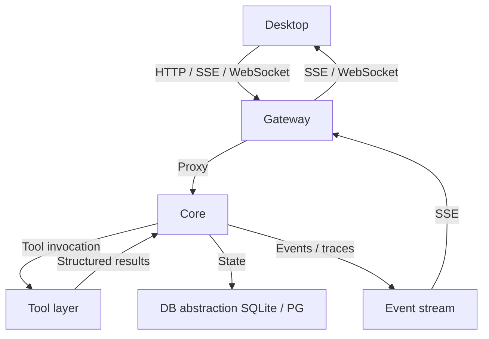

<p align="center">
  
</p>

# TinadecOffice

TinadecOffice 是面向 AI 智能体协作的 **Agent 工作空间**：Core 提供可复用的通用 agent harness，Tool 层提供审批门控的可执行能力，Desktop 把编排、工具与风险控制呈现为可操作界面。

## 当前状态

Core 正在以 .NET 10 + Microsoft Agent Framework (MAF) 1.13 重建为模块化单体：

- 已实现：`GET /api/v1/health`、`GET /api/v1/harness/manifest`、`GET /api/v1/readiness`
- Gateway 代理端点已挂齐 stub（读接口返回空集合，写接口返回 501），便于 Desktop / Gateway 联调
- 共享数据库抽象已接入（默认 SQLite 本地文件，可选 PostgreSQL）；业务表与完整双层运行时仍在推进中

## 架构

| 层 | 路径 | 技术栈 | 端口 | 职责 |
|---|------|--------|------|------|
| **Desktop** | `apps/desktop` | Electron + Vue 3 + Vite + Tailwind | 5173 | UI 呈现：聊天、任务图、审批、可分离面板、Debug Studio |
| **Gateway** | `TinadecGateway` | Elysia + TypeScript | 48730 | 薄 BFF / 代理；Swagger 位于 `/docs` |
| **Core** | `TinadecCore` | .NET 10 + ASP.NET Core + MAF | 48731 | 唯一状态权威：编排、工具策略、模型路由、持久化、就绪回执 |

**设计原则**

- Core 是唯一状态权威 — Gateway 与 Desktop 不保存业务状态
- Desktop 只调用 Gateway，不直接调用 Core
- 写操作必须经过审批门
- API 契约统一 `snake_case`
- Code 是 Tool 层内置工具套件，不是与 Core / Desktop 并列的独立层



## 快速开始

```powershell
npm install
npm run restore:dotnet
npm run dev
```

| 服务 | 地址 |
|------|------|
| Desktop (Vite) | http://127.0.0.1:5173 |
| Gateway API / Docs | http://127.0.0.1:48730/docs |
| Core | http://127.0.0.1:48731 |

更细的启动与排障见 [docs/startup.md](docs/startup.md)。

## 项目结构

```
TinadecOffice/
├── TinadecCore/              # MAF 模块化单体（Contracts … Api + Persistence）
├── TinadecGateway/           # Elysia BFF / 代理
├── apps/desktop/             # Electron + Vue 渲染器、Debug Studio、可分离面板
├── TinadecTools/             # 审批感知工具原型（文件 / 命令 / Git / MCP）
├── TinadecTools.Generators/  # [ToolFunction] 静态注册表源生成器
├── tests/                    # TinadecTools 测试 + 遗留 Core/契约证据测试
├── docs/                     # 产品模型、架构、安全、启动手册
└── TinadecOffice.slnx        # 根解决方案
```

## 核心能力

- **双层智能体编排** — 规划层（主动监督）与执行层（任务执行）协同
- **审批门控工具执行** — 写操作需用户明确批准
- **Model / Agent Center** — Gateway 聚合 Core 资源，提供无状态中心视图
- **可分离面板窗口** — 侧边栏面板可拖出为独立 Electron 窗口
- **Agent Debug Studio** — 追踪可视化与调试（后端随 Core 重建）
- **MCP 透传** — 通过 Tool 层接入外部 MCP server
- **共享数据库抽象** — 默认 SQLite，可选 PostgreSQL；业务 schema 按模块后续落地

## 常用命令

```bash
npm run dev              # 同时启动 Core + Gateway + Desktop
npm run dev:core         # 仅 Core（48731）
npm run dev:gateway      # 仅 Gateway（48730）
npm run dev:desktop      # 仅 Desktop（5173）
npm run build            # 构建工作区与 .NET 解决方案
npm test                 # 运行测试
npm run restore:dotnet   # 还原 .NET 包
```

Core 子方案：

```powershell
Remove-Item Env:Version -ErrorAction SilentlyContinue
Remove-Item Env:Ice-Version -ErrorAction SilentlyContinue
dotnet restore TinadecCore/TinadecCore.slnx
dotnet build TinadecCore/TinadecCore.slnx --no-restore
dotnet test TinadecCore/TinadecCore.slnx --no-build
```

## 文档

| 文档 | 用途 |
|------|------|
| [产品模型](docs/agent-harness-product-model.zh-CN.md) | 层次边界与职责（[English](docs/agent-harness-product-model.en.md)） |
| [架构](docs/architecture.md) | 技术架构、端口、事件形态 |
| [参考项目映射](docs/reference-project-map.md) | 同类项目参考与吸收/拒绝决策 |
| [启动手册](docs/startup.md) | 本地启动与故障排查 |
| [安全](docs/security.md) | 安全边界与约束 |

## 许可证

[GPL-3.0-or-later](LICENSE)
