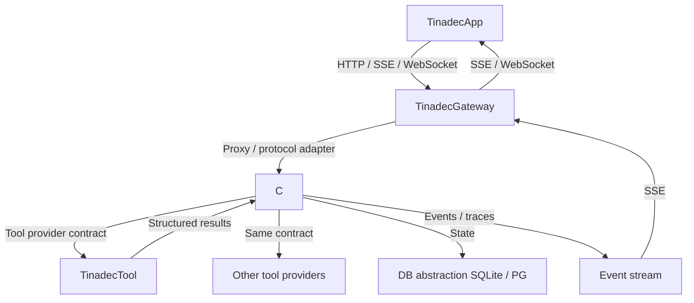

<p align="center">
  
</p>

# TinadecOffice

TinadecOffice 是面向 AI 智能体协作的产品族，由可独立部署和替换的 **TinadecCore、TinadecTool、TinadecGateway、TinadecApp** 组成。TinadecCore 提供可复用的智能体治理与协作运行时；其它产品通过当前公开契约为它提供工具、网络入口或交互体验。

TinadecCore 的权威定位、DmaEA 双层架构、权限与演化方案见 [TinadecCore 产品定义与 DmaEA 架构基线](docs/tinadec-core-product-definition.zh-CN.md)。

## 当前状态

Core 当前是 .NET 10 + Microsoft Agent Framework (MAF) 1.18 的模块化单体：

- 已实现持久化全双工 run、任务规划、动态 worker、监督、会议汇总、上下文 revision、暂停/恢复/取消和重启恢复。
- 已实现正式智能体/模式/提示词版本、每智能体模型策略、工具 manifest 冻结、动作审批和演化候选审核的主要链路。
- MAF 1.18 特定类型只存在于 DmaEA 内部适配器；Core 继续拥有权限、审批、检查点和工具副作用的权威状态，并仅持久化 provider-neutral usage。
- 动态权限委托、事件驱动的上下文压缩/自动演化、Git 治理、稳定 Client SDK/CLI/容器发布仍是目标能力；Contracts、Abstractions、Runtime 目前仅完成可从源码构建的 NuGet 打包边界，尚未宣称已发布。

### API 版本规则（固定 v1）

- TinadecOffice 尚未发布首个正式版，且产品生命周期内所有 HTTP、OpenAPI、SSE 和 WebSocket 公共接口始终固定使用 `/api/v1`。
- 不创建 `/api/v2`、`/api/v3`，也不维护历史兼容路由、legacy 别名或弃用周期。发生破坏性调整时，直接修改 `/api/v1` 的实现、契约、测试和中文文档；客户端使用当前工作树契约。
- `AgentVersion`、`ModeVersion`、`PromptVersion`、策略版本和 manifest 哈希是领域数据的不可变版本，不是 HTTP API 版本。
- 中文产品定义是唯一规范；英文材料只维护固定术语表，其它历史设计文档仅作参考。

## 架构

| 产品 | 路径 | 技术栈 | 默认端口 | 职责 |
|---|------|--------|------|------|
| **TinadecApp** | `apps/desktop`、`apps/web`、`apps/TinadecUI` | Electron / Vue / Web | 5173 | 客户端体验：对话、任务图、审批、配置和调试 |
| **TinadecGateway** | `TinadecGateway` | Elysia + TypeScript | 48730 | 可选的 API 门面、身份/协议适配和流转发 |
| **TinadecCore** | `TinadecCore` | .NET 10 + ASP.NET Core + MAF | 48731 | 唯一业务状态权威：DmaEA、模型、权限、生命周期、审计与演化 |
| **TinadecTool** | 当前代码名 `TinadecTools` | .NET 10 + MCP SDK | 进程协议 | 独立工具发现与执行；不拥有 Core 编排状态 |

**设计原则**

- Core 是唯一业务状态权威；Gateway 与 App 不保存第二套业务状态
- Desktop 永远经 Gateway 访问 Core（2026-08-29 四产品路线图决定：Gateway 是 Desktop 的永久且唯一传输边界）；Gateway 对 Core 不是运行必需项，其它产品可直接使用 Core 的公开契约
- Core 通过当前 Tool Provider 契约连接 TinadecTool 或其它工具服务
- Gateway 是无状态门面；`/api/v1/code/tools/*` 与 `/api/v1/tool-runtime/*` 保留为 Desktop 和外部用户显式使用工具的直连入口，Gateway 只负责身份、协议和流转，不在其中实现业务状态或授权决定
- 权限授权、具体动作审批和结果质量监督是三条独立治理链路
- API 契约统一 `snake_case`
- 发布配置不可变，每个 run 冻结最终配置和工具清单


```mermaid
graph TD
    A[TinadecApp] -->|HTTP / SSE / WebSocket| B[TinadecGateway]
    B -->|Proxy / protocol adapter| C
    C -->|Tool provider contract| D[TinadecTool]
    C -->|Same contract| G[Other tool providers]
    D -->|Structured results| C
    C -->|State| E[DB abstraction SQLite / PG]
    C -->|Events / traces| F[Event stream]
    F -->|SSE| B
    B -->|SSE / WebSocket| A
```

## 快速开始

```powershell
npm install
npm run restore:dotnet
npm run dev
```

| 服务 | 地址 |
|------|------|
| Desktop (Vite) | http://127.0.0.1:5173 |
| Gateway API / Docs | http://127.0.0.1:48730/docs |
| Core | http://127.0.0.1:48731 |

更细的启动与排障见 [docs/startup.md](docs/startup.md)。

## 项目结构

```
TinadecOffice/
├── TinadecCore/              # MAF + DmaEA 智能体治理运行时
├── TinadecGateway/           # 可选 Elysia API 门面 / 协议适配
├── apps/                     # TinadecApp 客户端实现
├── TinadecTools/             # TinadecTool 当前实现（文件 / 命令 / Git / MCP）
├── TinadecTools.Generators/  # [ToolFunction] 静态注册表源生成器
├── tests/                    # TinadecTools 测试 + 遗留 Core/契约证据测试
├── docs/                     # 产品模型、架构、安全、启动手册
└── TinadecOffice.slnx        # 根解决方案
```

## 核心能力

- **DmaEA 双层智能体编排** — 治理层 `operation` 负责入口、协调与监督，执行层 `execution` 规划并交付证据
- **审批门控工具执行** — 写操作需用户明确批准
- **Model / Agent Center** — Gateway 聚合 Core 资源，提供无状态中心视图
- **可分离面板窗口** — 侧边栏面板可拖出为独立 Electron 窗口
- **Agent Debug Studio** — 前端页面已存在，但 Core 的 `debug/*` 路由当前是空数组/`501` 桩、WS `/ws/debug` 为死桩，因此暂无真实追踪数据
- **MCP 透传** — 通过 Tool 层接入外部 MCP server
- **共享数据库抽象** — 默认 SQLite，可选 PostgreSQL；业务 schema 已落地（9 个 DbContext，SQLite 侧 25 个迁移文件，PostgreSQL 侧对应迁移）

## 常用命令

```bash
npm run dev              # 同时启动 Core + Gateway + Desktop
npm run dev:core         # 仅 Core（48731）
npm run dev:gateway      # 仅 Gateway（48730）
npm run dev:desktop      # 仅 Desktop（5173）
npm run build            # 构建工作区与 .NET 解决方案
npm test                 # 运行测试
npm run restore:dotnet   # 还原 .NET 包
```

Core 子方案：

```powershell
Remove-Item Env:Version -ErrorAction SilentlyContinue
Remove-Item Env:Ice-Version -ErrorAction SilentlyContinue
dotnet restore TinadecCore/TinadecCore.slnx
dotnet build TinadecCore/TinadecCore.slnx --no-restore
dotnet test TinadecCore/TinadecCore.slnx --no-build
```

## 文档

| 文档 | 用途 |
|------|------|
| [TinadecCore 产品定义与 DmaEA 架构基线](docs/tinadec-core-product-definition.zh-CN.md) | Core 定位、DmaEA、权限、配置、演化与路线图（权威基线） |
| [TinadecCore 参考决策](docs/tinadec-core-reference-decisions.zh-CN.md) | MAF 与九个参考项目的源码证据、采用项和拒绝项 |
| [Harness 集成模型](docs/agent-harness-product-model.zh-CN.md) | 当前集成部署职责（[English](docs/agent-harness-product-model.en.md)） |
| [架构](docs/architecture.md) | 技术架构、端口、事件形态 |
| [参考项目映射](docs/reference-project-map.md) | 同类项目参考与吸收/拒绝决策 |
| [启动手册](docs/startup.md) | 本地启动与故障排查 |
| [安全](docs/security.md) | 安全边界与约束 |
| [TinadecCore 打包与独立部署](docs/tinadec-core-packaging.zh-CN.md) | NuGet 包、API 发布目录与独立交付边界 |

## 许可证

Copyright (c) 2026 Lincube

| 范围 | 许可证 | 位置 |
|------|--------|------|
| TinadecOffice 整体（含 `apps/desktop`、`apps/web`、`apps/TinadecUI`、`docs`、`scripts`） | `GPL-3.0-or-later` | [`LICENSE`](LICENSE) |
| `TinadecCore`（`TinadecCore/` 下全部模块与 NuGet 包 `TinadecCore.Contracts`/`Abstractions`/`Runtime`） | `MIT` | [`TinadecCore/LICENSE`](TinadecCore/LICENSE) |
| `TinadecGateway`（`TinadecGateway/`） | `AGPL-3.0-or-later` | [`TinadecGateway/LICENSE`](TinadecGateway/LICENSE) |
| `TinadecTools`（`TinadecTools/` 与 `TinadecTools.Generators/`） | `AGPL-3.0-or-later` | [`TinadecTools/LICENSE`](TinadecTools/LICENSE) |

第三方归属见 [`NOTICE`](NOTICE)。`TinadecTools.Generators` 继承 `TinadecTools/LICENSE`，不单独提供 LICENSE 文件。组合分发需满足最严格组件的义务（Gateway/Tools 的 AGPL-3.0 第13条网络服务条款）。
