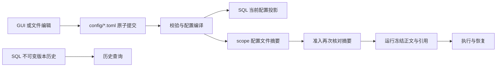

# 配置文件权威与历史事实

## 2026-10-11 投影读取复用

配置上下文每次接入仍读取源内容并比较SHA-256。只有同一作用域、同一文件路径/id/摘要，且此前语义校验并成功应用投影的文档，才可跳过重复TOML/SQL历史校验。相同长度、相同修改时间不代表相同内容；失败不写入已应用缓存，成功写入撤销缓存，另一作用域独立。缺失或损坏文件不能被缓存掩盖。

该复用仅用于接入当前SQL投影。公开配置读取、条件保存、准入Compile/Verify继续执行校验，历史版本不可变与source hash冻结规则不变。`/agents`模型预览另使用请求内批量读取，不复用跨请求运行决策。[性能与回归证据](../../../../../.tinadec_dev/reports/2026-10-11-settings-recovery.zh-CN.md)独立于既有配置/平台验收。

2026-10-09 · 当前工作树。本文描述本轮已实现的配置路径与事务契约；平台验收以证据报告为准。

用户配置位于 `~/.tinadec/config`，项目配置位于项目的 `.tinadec/config`，或 Host 注册的外部存储根的 `config`。代码通过 `IScopeStorageLocations.Config` 取路径，不从打开项目的 CWD 或安装目录发现配置。项目初始化复制用户配置与资源后拥有独立来源；后续用户编辑不再覆盖该项目。

托管 graph 注册 `IScopeConfigurationDocuments` 后，`runtime.toml` 必须来自该 scope，缺失文件不能用显式 Profile 或打包基线绕过。未启用配置编辑权威的嵌入宿主即使提供 Persistence locations，也保持 `TinadecAgent:ProfileConfigPath` → 随包 `Configuration/default-agent-runtime.toml` 的来源顺序；这是一份嵌入基线，不创建用户配置或从历史路径迁移。来源判断依赖端口实际注册，不能只看目录端口存在或可缺省的布尔配置。

| 文件 | 编辑权威与消费者 |
| --- | --- |
| `runtime.toml` | DmaEA 运行策略、预算与触发策略；热重载后的有效内容在准入冻结 |
| `agents.toml` | Agent/Mode/Prompt Pipeline/Tool Definition、默认绑定与已发布配置版本 |
| `models.toml` | Provider、路由及其配置版本；凭据只保存用户 SecretStore 引用 |
| `tools.toml` | 共享工具默认、Agent 覆盖与受管理程序记录 |
| `mcp.toml` | MCP 登记；不再自动导入项目 JSON 或环境变量指定的 JSON |
| `prompts.toml` | Prompt Fragment 正文与版本 |
| `skills.toml` | Skills、来源、扩展和安装元数据；资源正文保存在同一 scope 的资源目录 |
| `storage.toml` | SQLite/PostgreSQL 后端与 PostgreSQL 凭据引用；改变连接须由 Host 应用/重开或用户 Core 重启 |
| `logging.toml` | 诊断日志轮转与总容量；`total_bytes >= rotation_bytes >= 4096` |

`IScopeConfigurationDocuments` 提供 Read、Validate 与 SaveIfMatch。Read 返回原文、绝对路径、SHA-256 `content_hash`、版本和诊断；Save 先校验语法和模块结构，再核对客户端摘要。旧摘要返回 `configuration_conflict`，错误原文返回带行列或字段诊断的 `configuration_invalid`，错误保存不会改原文件。锁位于 `state/.configuration-write.lock`，临时文件经磁盘 flush 后原子替换；原文保存保留全部注释，GUI 修改通过 Tomlyn 元数据保留未被修改表的注释。

唯一性遵守EF模型中的真实索引条件：`status = 'draft'`只约束草稿Agent/Mode；`deleted_at IS NULL`只约束未删除资源。已发布同名Agent可共存，软删除记录不阻止名称复用；主键、普通唯一索引、非空值及历史版本不可变校验继续执行。未知过滤表达式返回`configuration_unique_filter_unsupported`，不能忽略或扩大为无条件索引。诊断保留具体表和属性名；没有源码位置时不虚构行列。

提示词当前版本以`prompt_pipeline_id`关联文件中的pipeline，文件版本缺失即使SQL保留历史也不能用于新运行。GraphSeedPack3.0.1安装回归覆盖文件原字节不变、SQL无部分写入和独立数据库重建；[本轮证据](../../../../../.tinadec_dev/reports/2026-10-09-graphseed-install-fix.zh-CN.md)与通用存储验收分别记账。

活动 `tool_settings.settings.mcp.binding` 和 `tool_settings.settings.skills.binding` 使用原生绑定状态。省略 `binding` 默认继承共享设置；共享设置省略则继承内置的全部可见、已启用资源。`enabled` 开关独立于绑定集合，绑定全部不会启用已禁用资源。

| `binding.mode` | 编辑含义 | `binding.ids` |
| --- | --- | --- |
| `inherit` | 继承共享选择；与省略 binding 相同 | 禁止 |
| `all` | 主动选择此 scope 全部可见、已启用资源；覆盖共享的显式选择 | 禁止 |
| `none` | 空绑定，不选择任何资源 | 禁止 |
| `selected` | 精确绑定资源身份，不按同名资源回退 | 必须为 1–1000 个非零、唯一 UUID |

以下是已有 `[[tool_settings]]` 记录内的 settings 片段，不是完整记录：

```toml
[tool_settings.settings.mcp.binding]
mode = "all"

[tool_settings.settings.skills.binding]
mode = "none"

[tool_settings.settings.search.timeout_ms]
mode = "outer_deadline"
```

可选工具值也有明确语义：`read.max_file_bytes` / `write.max_file_bytes` 用 `{ mode = "unlimited" }` 表示无限制，`search.timeout_ms` 用 `{ mode = "outer_deadline" }` 表示外层 Core deadline，`search.rg_path` 用 `{ mode = "host_search" }` 表示宿主可执行文件探测；具体数值或路径仍直接写标量，省略字段表示继承。Agent 的 unlimited 仍不能解除共享数字上限。

GUI/API 保留既有稀疏 JSON DTO，由统一 codec 适配为这些原生状态并回读；JSON null 不再通过 `__tinadec_null` 哨兵写入活动文件。活动 TOML 拒绝旧哨兵和 `resource_ids` / `server_resource_ids` 数组形状；非法 mode、矛盾 ids 或重复/空 UUID 在文件提交前拒绝。其他活动对象的 null 字段省略以继承；没有定义域含义的 null 数组元素拒绝。历史 `*_versions` 的冻结 JSON 字符串和内容寻址正文保持原字节，已有运行事实无需改写。



五个配置 DbContext 继承 `ConfigurationProjectionDbContext`。`AddTinadecConfigurationFiles` 在领域模块注册后包装工厂：读上下文先按文件摘要重建当前投影，GUI SaveChanges 先提交 TOML，随后更新 SQL。文件提交成功而 SQL 失败时，后续读按文件修复投影。当前配置行缺失时可删除投影；已发布版本属于历史事实，缺失时保留正文和身份，有 Status 的版本降为 `retired`。SQL 历史不能成为新运行的隐藏配置来源：Compile 检查活跃默认、CurrentVersion 与发布定义的版本仍存在于 TOML。删除整个数据库会丢失运行与历史事实，不属于支持的“重建投影”操作。

首次建立配置时，只允许空编辑投影生成结构并通过正常配置写入建立默认项。文件一旦建立，会在 `state/.configuration-documents/<id>.initialized` 保存生命周期标记；后续文件丢失返回 `configuration_missing`，禁止从 SQL 历史重新生成。无标记但 SQL 已有配置的缺失文件同样拒绝重新 seed。用户可恢复文件，或用缺失文件摘要 `""` 保存一份有效替代文件；不需要清除数据库。新准入缺少 storage/logging/runtime 文件也拒绝。

已发布项目的 `project.toml` 也标记初始化完成：即使 Git/复制不带 State、SQL 为空，九份配置文件缺失仍拒绝 seed。首次 staging 必须备齐配置后才发布 manifest；新机器打开已有项目从文件重建投影。

用户 API scope ID 固定为 `user`，数据库隔离另使用 Host 首次原子建立的 `state/storage-identity.toml` UUID；PostgreSQL schema 为 `tinadec_<UUID>`。同一用户根重启身份稳定，新用户根创建独立身份，不能以固定 `tinadec_user` schema 重新读取旧事实。并发初始创建只有一个完整文件胜出；已建立用户根的身份文件丢失或非法须恢复，Core 不修改已有身份。它属于运行状态，不能经配置 API 或 Agent 编辑。

配置关联的 ContentStore 正文嵌入 TOML，并保留原相对内容引用的 tenant、workspace、kind、字节摘要。初始化项目在自己的 ContentStore 中物化同一正文，从而无需读取用户会话数据或依赖用户数据根。Agent Pack 的清单语义摘要与内容字节摘要分别保留。SecretStore 值不进入 TOML 或子进程环境；模型 Harness、ACP、OpenCode 和 ConPTY 均去除 Host 私有控制令牌。

新运行 Compile 固定全部九个文件摘要，冻结前再次 Verify。文件在准入期间改变返回 `configuration_changed_during_admission`；存储连接目标与当前挂载后端不符返回 `configuration_restart_required`。既有运行通过被冻结正文继续执行与恢复，不受后续编辑影响。

自由会话迁移由 Host 持久化 `state/session-transfers.toml`，阶段为 `pending → copying → copied → completed`。已接受的 queued/pending 交互必须先排空，返回 `queued_interactions_pending`；活跃运行结束后 worker 取得源和目标独占 lease，搬运六个事实模块、内容依赖、冻结配置、资源版本和选定审计字节，完整目标持久化后才删除源事实。目标下一次运行绑定目标已发布默认 Mode；原会话选项和源 TOML 归档为历史，已冻结运行正文不修改。复制前保存原图和目标图，崩溃后重放相同事实。会话永久删除同时清理两侧迁移归档。

源码入口：`TinadecCore/Persistence/Configuration/`、`TinadecCore/DmaEA/FrozenRunConfiguration.cs`、`TinadecCore/Runtime/SessionScopeTransferService.cs`、`TinadecCore/Runtime/HostSessionWorkspaceBinder.cs`。测试与证据：[配置和迁移报告](../../../../../.tinadec_dev/reports/2026-10-09-configuration-files.zh-CN.md)。
