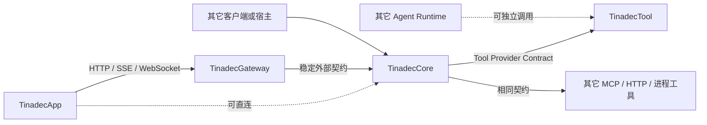
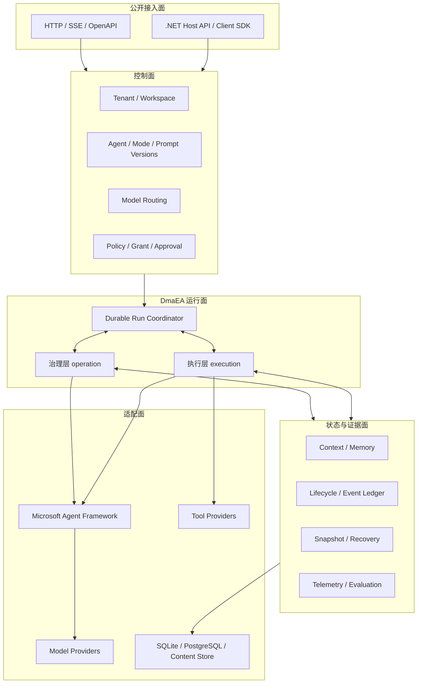
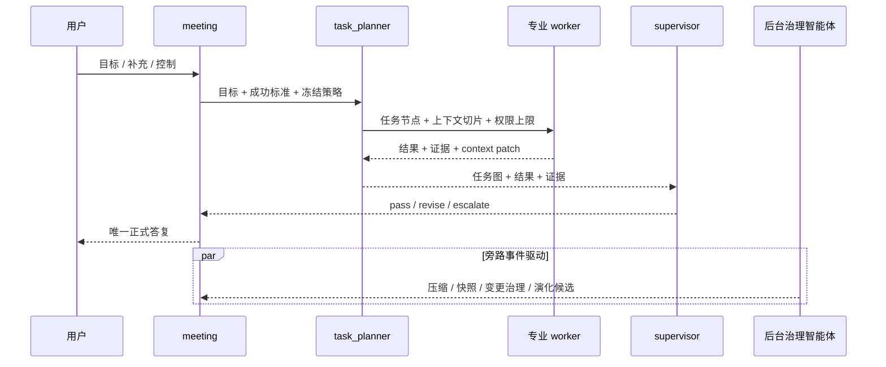
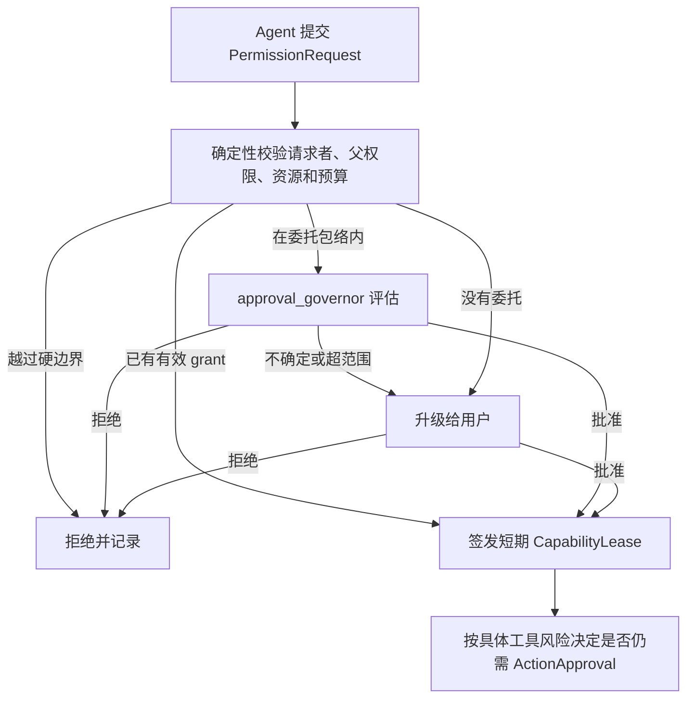
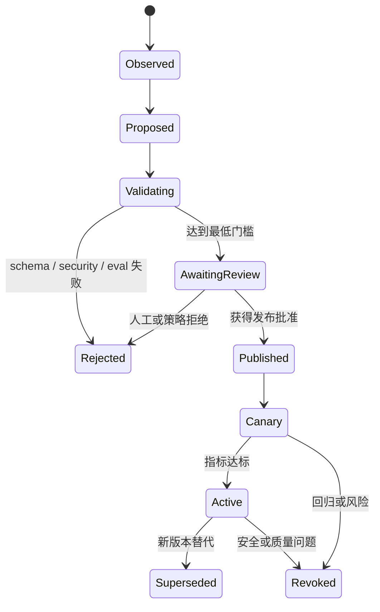

# TinadecCore 产品定义与 DmaEA 架构基线

> 状态：产品与架构基线（Baseline）
> 文档状态：持续维护的产品基线（不使用递增文档版本号）
> 日期：2026-08-22
> 适用范围：TinadecCore、DmaEA，以及 TinadecOffice 四产品之间的契约边界
> 事实基线：截至 2026-08-22，当前工作树统一以 MAF `1.18.0` 为规范基线；实现状态仍须按本文标记区分，未提交工作树不等同于已发布能力。TinadecOffice 尚未发布首个正式版，公开 API 固定为 `/api/v1`。

本文是 TinadecCore 的权威产品定义。它回答四个问题：TinadecCore 是什么、DmaEA 为什么存在、智能体如何被配置与治理、TinadecCore 如何与 TinadecTool、TinadecGateway、TinadecApp 独立协作。

各参考仓库的源码证据、采用项与拒绝项见 [TinadecCore 参考项目调研与设计决策](tinadec-core-reference-decisions.zh-CN.md)。

文中的“必须”“不允许”表示产品不变量；“应”表示默认决策；“可”表示扩展点。实现状态使用以下标记：

- **稳定已实现**：事实基线中存在可运行代码并通过相应测试。
- **工作树升级中**：当前未提交工作树已有实现，但公开契约、迁移、组合入口或测试尚未全部收口。
- **部分实现**：已有数据结构或接口，但未形成完整运行闭环。
- **目标态**：产品定义已确定，尚待实现。

## 0. 文档与 API 版本规则

TinadecOffice 尚未发布首个正式版，且产品生命周期内不承诺历史 API 兼容；所有 HTTP、OpenAPI、SSE 和 WebSocket 公共接口始终使用 `/api/v1`。

- 不创建 `/api/v2`、`/api/v3`，不维护历史兼容路由、legacy 别名、迁移入口或弃用周期。
- 发生破坏性调整时，直接修改 `/api/v1` 的实现、DTO、事件、测试、客户端生成物和本中文文档；不为旧客户端保留第二套路由或旧字段语义。
- 中文产品定义是唯一权威文档；英文材料只维护固定术语表，历史设计文档不构成第二事实源。
- `AgentVersion`、`ModeVersion`、`PromptVersion`、`PolicyVersion`、manifest 哈希和数据库 revision 是领域数据的不可变版本，不代表 HTTP API 版本迭代。
- Gateway 的 `/api/v1/code/tools/*` 与 `/api/v1/tool-runtime/*` 是 Desktop 和外部用户显式使用工具的当前直连入口。它们不是 legacy 兼容层；Gateway 只做无状态身份、协议和流转，不产生业务状态或授权决定。

## 1. 执行摘要

### 1.1 一句话定位

**TinadecCore 是一个基于 Microsoft Agent Framework、可独立部署或嵌入的智能体治理与协作运行时；它通过 DmaEA 把不同模型、提示词、工具和权限组织成可配置、可恢复、可审计、可演化的双层智能体系统。**

TinadecCore 不是聊天 UI、API 转发层或工具集合，也不是对 MAF 的简单封装。MAF 提供智能体和工作流执行原语，TinadecCore 负责产品级的状态权威、双层治理、权限、版本、审计、恢复和演化。

### 1.2 核心价值

1. **让模型做其擅长的工作**：每个智能体可独立选择模型、提示词、上下文策略、工具和预算。
2. **让多智能体协作可治理**：治理层负责入口、协调、监督和演化，执行层负责规划、执行和证据交付。
3. **让自治处于授权范围内**：所有能力均受确定性策略约束，临时授权可过期、可撤销、可审计。
4. **让运行可恢复、可解释**：任务、配置、上下文、工具调用和治理决定均有版本与事件记录。
5. **让系统能够受控演化**：运行期智能体先成为候选，经过评测和批准后才能成为正式配置。

### 1.3 本文锁定的关键决策

| 编号 | 决策 |
| --- | --- |
| PD-01 | `DmaEA` 正式展开为 **Dual-layer multi-agent Evolution Architecture**，中文名为“**双层多智能体演化架构**”。 |
| PD-02 | 两个正式层级为治理层 `operation` 与执行层 `execution`；“运营层”“运维层”和 `planning` 只作为历史称呼，不是公开层级或迁移契约。机器值保持 `operation`。 |
| PD-03 | 会议智能体是唯一面向用户形成正式答复的智能体；其它智能体只产出事件、证据、建议或治理决定。 |
| PD-04 | TinadecCore 是状态、策略和审计权威；MAF 的 session、workflow state 和 checkpoint 是可替换的执行细节。 |
| PD-05 | 权限授予、具体动作审批、结果质量监督是三个不同状态机，不能由一个模型判断替代。 |
| PD-06 | 监督或审批智能体只能在用户预先委托的授权包络内批准；任何智能体都不能自我授权或扩大上级权限。 |
| PD-07 | 配置发布后不可变；每个 run 冻结配置版本、模型选择、工具清单和策略哈希。 |
| PD-08 | 演化默认只生成候选；候选在评测、审批、发布前不得进入正式运行或跨会话检索。 |
| PD-09 | 工作区快照与 MAF checkpoint 是不同概念；“可回退”只覆盖已声明的本地资源，外部副作用必须使用补偿机制。 |
| PD-10 | TinadecCore、TinadecTool、TinadecGateway、TinadecApp 可分别部署和替换，通过当前公开契约协作，不形成编译期捆绑；所有 HTTP 接口始终固定为 `/api/v1`，破坏性调整直接更新 `/api/v1`。 |
| PD-11 | MAF `1.18.x` 只通过 DmaEA 内部适配器接入；Core 始终是审批、权限、检查点、工具执行记录和恢复判定的权威。 |
| PD-12 | 运行面组件分为“自建权”与“MAF 可替换”两档（§5.5）：外部世界一致性、带身份的治理决策、预算账本与演化闭环自动化保留自建权；checkpoint 机械层、编排调度、压缩内核、审批内容协议、协议端点与评分器标记为 MAF 可替换。替换须经 DmaEA 内部适配器与兼容测试门禁，不得影响公开契约；Phase 2 收口前不做主动迁移。 |

## 2. 产品定位

### 2.1 目标用户

- 构建 IDE、办公、研究、客服或自动化产品的智能体平台团队。
- 需要在本地或私有环境中治理模型、工具和数据边界的组织。
- 希望组合不同模型专长，而不把业务锁定在单一模型或单一 agent loop 的开发者。
- 需要长任务、并行任务、人工介入、恢复与审计能力的专业用户。

### 2.2 关键使用场景

- 以简单问答模式提供带检索的对话服务。
- 以计划模式生成可审阅的任务方案，不执行有副作用的动作。
- 以受控执行模式完成单任务，并在高风险节点等待批准。
- 以全双工模式同时处理用户补充、状态查询、目标调整和后台执行。
- 在一个宿主应用内嵌 DmaEA，使用宿主自己的 UI、网关或工具实现。
- 对智能体配置、提示词、模型路由和治理策略进行版本化发布与回滚。

### 2.3 非目标

TinadecCore 不负责：

- 提供最终用户界面或桌面工作台布局。
- 实现文件、Shell、Git、浏览器等具体工具。
- 充当通用反向代理、鉴权入口或多客户端 BFF。
- 训练基础模型，或承诺某个模型永远适合某个专业领域。
- 允许模型绕过确定性策略直接修改权限、正式配置或审计记录。
- 保证任意外部系统的事务级回滚。

## 3. TinadecOffice 四产品矩阵

TinadecOffice 是产品族，不是必须整体安装的单体应用。

| 产品 | 产品职责 | 独立使用方式 | 不拥有的职责 | 当前仓库映射 |
| --- | --- | --- | --- | --- |
| **TinadecCore** | 智能体治理、DmaEA 编排、会话/run/task 状态、模型路由、权限与审批、上下文/记忆、审计与演化 | 作为 .NET 嵌入式运行时，或作为 headless HTTP/SSE 服务 | UI、通用网关、具体工具实现 | `TinadecCore/` |
| **TinadecTool** | 工具发现、参数 schema、风险元数据、隔离执行和结构化结果 | 作为 MCP/本地进程/远程工具服务供符合当前契约的客户端调用 | 任务编排、会话状态、最终授权决定 | 当前代码名 `TinadecTools/` 与 `TinadecTools.Generators/` |
| **TinadecGateway** | 对外 API 门面、身份接入、协议适配、限流、聚合和流转发 | 连接 TinadecCore 或当前契约上游，为 Web/企业网络提供稳定入口；也暴露用户显式工具直连入口 | Core 业务状态、智能体决策、工具策略 | `TinadecGateway/` |
| **TinadecApp** | 面向不同场景的交互应用和可视化客户端 | 直连 TinadecCore，或经 TinadecGateway 连接当前契约后端 | 编排真相、密钥、审批策略和工具执行 | 当前由 `apps/desktop`、`apps/web`、`apps/TinadecUI` 等承载 |

“可单独使用”必须准确理解：四个产品应能独立安装、部署和替换，但客户端或网关仍需要一个符合当前契约的上游服务。TinadecCore 与 TinadecTool 可直接提供独立运行价值；TinadecGateway 与 TinadecApp 的独立性是“不强制捆绑某个具体实现”，不是“脱离任何上游仍能完成业务”。

### 3.1 默认组合，但不是唯一组合



### 3.2 解耦要求

- Core 不得引用 TinadecApp 或 TinadecGateway。
- Core 不得把 `TinadecTools` 子进程路径作为唯一工具接入方式；它只是一个 provider adapter。
- TinadecTool 不得读取或修改 Core 数据库来判断权限。
- Gateway 不得保存 session、run、approval、agent configuration 等业务真相。
- App 只可保存窗口布局、主题等本地体验偏好；业务状态必须来自 Core 契约。
- 四个产品分别维护自己的构建与部署产物；不维护 SemVer API 兼容矩阵或弃用周期，所有公开 HTTP 接口固定为 `/api/v1`。

### 3.3 用户工具直连与智能体工具执行是两条路径

Gateway 保留两组用途明确的当前 v1 工具传输入口：

| 调用者 | 入口 | Gateway 行为 | 授权与执行事实 |
| --- | --- | --- | --- |
| Desktop 或其它明确的用户操作 | `POST /api/v1/code/tools/{toolId}/execute` | 原样转发请求、状态码、响应体和必要响应头到 Tool Provider | Tool Provider 负责工具自身校验；用户治理操作如需 Core 决定，调用方应使用 Core 提供的治理接口 |
| Desktop 或其它需要访问 provider surface 的客户端 | `GET /api/v1/tool-runtime/health`、`/manifest`、`/tools`、`POST /api/v1/tool-runtime/tools/{toolId}/execute` | 原样代理 Tool Runtime 的健康、清单、工具和执行请求 | Tool Runtime/Provider 负责 provider 协议、沙箱和执行结果 |
| DmaEA 智能体运行 | `POST /api/v1/runs/{runId}/tools/{toolId}/execute` | 仅代理到 Core | Core 负责冻结配置、PDP、租约、ActionApproval、审计和调用 Tool Provider |
| Desktop 或宿主用户的受治理写操作 | `POST /api/v1/user/tool-actions`、`/{id}/resume`、`/{id}/snapshot-override` | 仅代理到 Core | Core 创建 UserToolAction，负责快照、PDP、租约、ActionApproval、Tool Provider 调用和审计 |

前两组不是旧路由、迁移入口或兼容别名，而是产品设计中专门给用户和 Desktop 使用的直连传输面。Gateway 不读取 `approval_id`、`approved`、`source` 或风险字段来形成授权结论，也不把用户请求改写成智能体 run。需要 Core 治理事实的用户写操作必须进入 UserToolAction 路径；需要智能体治理的调用必须进入第三组路径。

## 4. TinadecCore 的边界与交付形态

### 4.1 Core 拥有的状态

| 领域 | Core 是否权威 | 说明 |
| --- | --- | --- |
| 租户、工作区、主体与成员关系 | 是 | 所有请求和资源必须带作用域。 |
| 会话、消息、run、turn、task graph | 是 | HTTP 断开不结束后台 run。 |
| 智能体、模式、提示词和模型绑定版本 | 是 | 发布版本不可变。 |
| 权限请求、能力租约、审批和监督结论 | 是 | 三类状态分别持久化。 |
| 工具 manifest 冻结副本和调用记录 | 是 | 工具实现仍属于 Tool provider。 |
| 上下文、记忆候选、正式记忆及来源 | 是 | 正文可进入不可变内容存储。 |
| 工作区快照元数据、恢复计划和结果 | 是 | 快照内容可由 provider 保存。 |
| 事件、trace、成本、治理与演化审计 | 是 | 模型不得删除或改写。 |

### 4.2 目标交付形态

1. **嵌入式包**：`TinadecCore.Runtime` 与稳定的 `Contracts`/`Abstractions` NuGet 包，供 .NET 宿主按模块组合。
2. **独立服务**：`TinadecCore.Api` 可执行程序或容器，提供 OpenAPI、SSE 和管理接口。
3. **客户端 SDK**：由 OpenAPI 生成的 TypeScript/.NET SDK，不泄漏 MAF 类型。
4. **开发工具**：用于配置校验、迁移、导入导出和当前契约检查的 `tinadec-core` CLI。

当前 `Contracts`、`Abstractions` 和 `Runtime` 已显式启用 `IsPackable=true`，Runtime 所需的内部实现模块也作为非稳定依赖包参与还原；这只是可验证的打包边界，尚未等同于发布到 NuGet 源。API 可通过 `dotnet publish` 生成独立服务目录，Client SDK、CLI 和容器镜像仍是后续交付。具体命令与边界见 [TinadecCore 打包与独立部署](tinadec-core-packaging.zh-CN.md)。

## 5. 技术架构

### 5.1 逻辑分层



治理层和执行层是仅有的两个智能体决策层。控制面、状态面和适配面是共享基础设施，不构成第三层智能体。

### 5.2 MAF 与 DmaEA 的责任划分

| 能力 | 优先复用 MAF | TinadecCore 负责 | 当前状态 |
| --- | --- | --- | --- |
| 智能体执行 | `ChatClientAgent`、`AIAgent` | Agent Definition、模型策略、版本和租户隔离 | MAF 1.18 Agent adapter 已收口；公开契约仍不暴露 MAF 类型 |
| 工作流 | 顺序、并发、移交、群聊、Magentic、任意图 workflow | 双层拓扑、任务谱系、运行策略和产品状态机 | Core 自建持久引擎已实现；MAF Workflow 尚未进入热路径 |
| 会话状态 | `AgentSession`、`StateBag` | 持久会话、消息、run、task 和一致性 | Core 持久会话已实现；MAF session 不作为状态权威 |
| 上下文压缩 | 滑窗、截断、工具结果压缩、摘要策略 | 来源、版本、验证、回滚和注入防护 | worker 的 MAF 1.18 原子压缩 adapter 已接入；治理层压缩角色尚未调度 |
| 工具审批 | approval request/response 与人工介入原语 | RBAC/ABAC、授权租约、委托范围、审批升级和审计 | Core 单次动作审批已实现；MAF `ToolApprovalAgent` 未使用，动态授权未接入 |
| 检查点 | workflow message/executor state checkpoint | 运行恢复、配置冻结、工作区快照和副作用补偿 | Core run checkpoint 已实现；MAF Workflow checkpoint 未接入 |
| 可观测性 | Agent/Workflow OpenTelemetry | 事件账本、治理决定、成本和质量指标 | MAF 1.18 Agent 包装已接入且默认非敏感；宿主导出与产品指标尚未闭环 |

所有 MAF 类型必须停留在 **DmaEA 内部适配器**，不得进入其它 Core 模块的领域契约、公开 HTTP DTO、持久事件 envelope、数据库 schema 或稳定 SDK。这样才能独立升级 MAF，并允许将个别执行路径替换为其它运行时。

### 5.3 MAF 版本策略

- 当前工作树统一锁定 MAF `1.18.0` 包族，并通过 `Maf18RuntimeAdapter` 收口版本特定行为；后续只接受经适配器兼容测试确认的 `1.18.x`。
- 生效版本必须来自实际加载程序集和适配器兼容检查，不得在 manifest、DTO、端点和测试中分别硬编码。
- 本地 `agent-framework` 主线只作为源码参考；可用能力以 TinadecCore 锁定包、适配层和兼容测试为准。
- 每次升级必须通过编译、架构、checkpoint 恢复、人工介入、工具循环上限和 OpenTelemetry 契约测试。
- 实验性上下文压缩和 RC 声明式配置只能位于 Tinadec 适配器之后，不得成为公共配置格式。
- Core 自身必须维持模型轮次、工具调用、工具轮次、token、时间、成本、副作用次数和递归深度硬预算。这些预算属于 Tinadec 产品策略，必须独立版本化，不得从 MAF 默认常量推导。
- MAF 自动审批轮次只可作为 Core `max_tool_rounds` 的安全上限，不能授予权限、替代 Action Approval 或绕过持久 Tool Dispatcher。两者计数语义不同，Core 仍须独立记录工具轮次和审批状态。
- 若接入 MAF Workflow checkpoint，应将其 JSON 作为 Core `RunCheckpoint` 引用的不透明 sidecar；Core 继续拥有 tenant scope、CAS、事件水位、审批、租约和副作用 receipt。
- Workflow 恢复必须冻结稳定且唯一的 agent `Id`/`Name` 与拓扑。MAF executor identity 由规范化的 `Name_Id` 构成，身份或拓扑漂移应使恢复失败关闭。
- MAF HITL 使用非阻塞 pending-request 路径：先持久化 external request 与 checkpoint，再释放请求线程；恢复时由 Core 校验 tenant、授权、过期、请求哈希和一次性消费。
- MAF compaction 只用于单次模型调用整形；Core 的来源可追溯 context 仍是权威。共享 session 的每个 agent 必须使用独立 state key，function call 与对应 result 必须作为不可拆分的原子工具组。
- MAF/provider usage 必须在适配器内归一化为 Tinadec 自有、provider-neutral 的 token/成本计量；不得把 `UsageDetails` 或 provider 私有对象写入 checkpoint、事件或公共 DTO。
- Agent 与 Workflow telemetry 必须显式 `EnableSensitiveData=false`，只发送非敏感结构、Core correlation id、归一化 usage 和内容引用；Prompt、用户内容、工具参数/结果、凭据与秘密不得进入默认 trace，序列化失败不得改变 run 结果。

### 5.4 模块实施映射

MVP 继续采用模块化单体，不为了“智能体很多”提前拆微服务。后台角色通过持久事件和 lease 调度，同进程也必须遵守与远程 worker 相同的幂等和权限契约。

| 能力 | 当前代码归属 | 目标调整 |
| --- | --- | --- |
| DmaEA run、任务和 agent instance | `DmaEA` + `Lifecycle` | DmaEA 只做双层编排；Lifecycle 统一状态转换、lease、checkpoint 和事件 |
| Agent/Mode/Prompt 控制面 | `AgentConfiguration` + API endpoints | 下沉到 domain service，API 只做协议映射；增加 PolicyBundle 引用 |
| 模型接入 | `Models` + DmaEA chat factory | 保持 `IChatClient`/MAF adapter；增加能力目录、评测分和合规约束 |
| 上下文与记忆 | `Context`、`Memory`、`VectorStore` | 区分短期 context、候选记忆、正式记忆和检索版本 |
| 权限治理 | `Lifecycle`/工具审批的现有片段 | 新增独立 Governance 模块或边界，承载 PDP、grant、delegation、lease 和 decision |
| 工具接入 | `TinadecCore.Tools` + `TinadecToolsProcessManager` | 抽象 Tool Provider transport；本地进程只是一个 adapter |
| 工作区回退 | `Lifecycle/WorkspaceSnapshotService` + `IWorkspaceSnapshotService` | 补齐 Git diff/restore plan、外部副作用补偿和 provider 扩展 |
| 演化评测 | 候选 API + `AgentInstanceService` | 新增 Evaluation/Promotion service，负责 eval、review、canary、revoke |
| 宿主与公开契约 | `Runtime`、`Api`、`Contracts`、`Abstractions` | 分离稳定/实验 API，形成 NuGet、服务和生成 SDK 交付物 |

跨模块协作只通过窄接口、领域命令和追加事件完成。数据库可保持同一 SQLite/PostgreSQL 实例，但表所有权、迁移和写入口必须唯一。

### 5.5 自建权与 MAF 可替换边界

MAF 已经把大量运行时机械做成可直接引用的零件。为避免在框架已提供的原语上重复投入（沉没成本），也避免把 Core 的差异化能力误交给框架，所有运行面组件按下表分为两档。本表是决策约束：新增自建代码前必须先对照本表；“MAF 可替换”档的自建实现不得继续加深与其它模块的耦合，必须保持可整体换出。

#### 自建权（Core 长期拥有，不因 MAF 演进而放弃）

| 能力 | 保留理由 |
| --- | --- |
| 外部世界一致性：工作区快照、Git 变更治理、副作用补偿与不可逆标记 | MAF checkpoint 只覆盖框架内状态，不覆盖文件系统/VCS/外部 API 副作用（PD-09） |
| 带身份的治理决策：租户作用域、RBAC/ABAC、PolicyBundle 多层求交、委托包络、审批人路由、多级审批台账与合规导出 | MAF 审批规则是会话级、无身份维度；治理台账是产品差异化价值（PD-05/PD-06） |
| 预算账本：跨 run 的 token/成本/轮次/副作用硬预算 | MAF 只有局部上限常量；预算属 Tinadec 产品策略，独立版本化（§5.3） |
| 任务图持久层、产品状态机与追加事件账本 | LangGraph/Dify 同样把它留给宿主；这是 Core 状态权威的本体（PD-04） |
| 演化闭环自动化：eval 集、回归比较、canary、晋升/撤销流水线 | 打分内核可换用 MAF Evaluation 包，但门禁与闭环编排归 Core（PD-08） |
| Tool Provider 传输抽象与 manifest 冻结契约 | 南向接口独立性（§14.2）；本地进程只是 adapter |

#### MAF 可替换（当前自建，允许未来整体换为 MAF 原语）

| 当前自建实现 | MAF 对应物 | 替换条件 |
| --- | --- | --- |
| 持久运行引擎的 checkpoint 存取/replay 机械层 | Workflow checkpoint、Parent 链、time-travel | 契约测试证明幂等键、副作用 receipt、事件水位等恢复语义等价 |
| 单次编排调度（顺序/并发/移交/群聊/Magentic 式协作） | 五种 Orchestration Builder | 双层拓扑与角色激活仍由确定性 Trigger Engine 决定 |
| 上下文压缩内核 | CompactionProvider 家族（ContextWindow/ToolResult/Pipeline） | 自研策略只以 CompactionStrategy 插件形式存在 |
| 审批内容协议与防伪造校验 | ApprovalRequiredAIFunction、ApprovalResponseBindingChatClient、ToolApprovalAgent | 台账、身份与委托包络判断仍归 Governance 模块 |
| 协议端点（OpenAI 兼容/A2A/MCP 发布） | Hosting.OpenAI、Hosting.A2A、hosting-mcp | snake_case 公开契约与 ProblemDetails 语义不受影响 |
| 演化评分内核 | Evaluation 包（RubricScore、ExpectedToolCall） | eval 集、基线比较与发布门禁仍归 Core |

#### 边界纪律

1. 两档之间没有灰色地带；拿不准时按“自建权”处理并在设计评审中说明。
2. “MAF 可替换”档的自建实现禁止向其它模块暴露内部类型，必须与 MAF 类型遵守同一隔离纪律（见 §5.2 末段），使未来替换只动 DmaEA 适配器内部。
3. 替换决策必须走 §5.3 的升级流程：编译、架构、checkpoint 恢复、HITL、工具循环上限与遥测契约测试全部通过后才允许切换。
4. Phase 2（权限自治闭环）收口之前不做主动迁移；本节先冻结边界，防止继续加深“可替换”档实现的耦合成本。

## 6. DmaEA：双层多智能体演化架构

### 6.1 为什么需要 DmaEA

单个模型同时承担理解、规划、编码、检索、监督、权限判断和长上下文维护时，会出现三个问题：能力不匹配、上下文相互污染、责任无法审计。仅仅增加多个 agent 又会引入路由混乱、权限扩散和循环协作。

DmaEA 用“专业化 + 双层治理 + 受控演化”解决这一矛盾：

- 专业化定义谁适合做什么。
- 双层治理定义谁能派发、谁能执行、谁能对用户负责。
- 受控演化定义新能力如何从临时实例变成可复用资产。

### 6.2 不变量

1. 每个正式模式至少包含一个会议智能体和一个受 Core 管控的执行层派发边界。支持任务分解、并发、副作用、重试、重规划或子智能体生成的模式必须配置 `task_planner`；`simple_qa` 可由确定性的单任务派发器代替模型规划智能体。
2. 只有会议智能体拥有 `direct_user_output`。
3. 执行层只能在任务、上下文切片、工具范围和预算内工作。
4. 子智能体的有效权限不得超过父实例与当前 run 的交集。
5. 模型输出是建议或内容，不是授权凭证、事务提交或审计事实。
6. 所有外部副作用必须经过 Core 的确定性工具与权限路径。
7. 每个 run 使用冻结配置；配置热更新只影响新 run。
8. 所有重试、重规划、审批和人工介入都必须可回放。

### 6.3 治理层 `operation`

治理层管理用户关系、全局上下文、授权协同、质量监督和系统演进。智能体按事件激活，不要求每次请求全部运行。`operation` 是稳定机器值；“运营层”“运维层”仅在引用历史材料时保留。

> 实现状态：下表定义目标角色目录。当前热路径仅包含 `meeting`、`task_planner`、动态 worker 和 `supervisor`；`context_compressor`、`capability_advisor` 与 `evolution` 主要仍是配置声明，`approval_governor`、`git_steward` 和 `snapshot_curator` 为目标态。

| 智能体 | 目标职责 | 允许做 | 不允许做 | 默认触发 |
| --- | --- | --- | --- | --- |
| 会议智能体 `meeting` | 唯一用户入口、意图分类、粗计划、派发、汇总 | 创建/绑定 run，向执行层派发，形成正式答复 | 直接执行高风险工具、自行授权 | 用户消息、任务事件、监督结果 |
| 上下文压缩智能体 `context_compressor` | 维护可验证的结构化摘要 | 提交带来源的 context patch | 覆盖新版本目标、删除原始证据 | token 阈值、里程碑、任务结束 |
| 能力推荐智能体 `capability_advisor` | 推荐模型、工具、技能或专业 worker | 产生候选和理由 | 直接授予能力 | 新任务、能力缺口、重规划 |
| 监督智能体 `supervisor` | 检查目标、证据、质量和风险 | `pass/revise/escalate`，提出修正 | 伪造执行证据、突破硬策略 | 产物完成、风险事件、最终输出前 |
| 审批治理智能体 `approval_governor` | 在委托范围内处理低风险权限请求 | 按授权包络建议或确认批准 | 自批、扩大范围、覆盖显式拒绝 | 权限请求、动作审批升级 |
| 变更治理智能体 `git_steward` | 审阅 diff、组织提交语义和交接说明 | 生成提交计划/消息、请求 Git 动作 | 直接提交、推送或改历史 | 变更里程碑、交付前 |
| 快照智能体 `snapshot_curator` | 判断何时创建或保留工作区快照 | 请求快照、标注恢复点和保留策略 | 直接宣称外部副作用已回滚 | 高风险动作前、里程碑、手动触发 |
| 演化智能体 `evolution` | 从运行证据中发现可复用模式 | 创建 agent/prompt/mode/memory 候选 | 直接发布、授予权限、进入正式检索 | 任务结束、用户反馈、评测结果 |

任务书中的“Giit 智能体”在本文按 **Git 智能体** 理解，并正式命名为 `git_steward`。它负责变更治理；实际 `git commit`、`push`、`rebase` 等动作由执行层通过 TinadecTool 完成。

### 6.4 执行层 `execution`

| 智能体 | 职责 | 生命周期 |
| --- | --- | --- |
| 任务规划智能体 `task_planner` | 把治理层目标转为带依赖、成功标准、风险和所需能力的任务图；调度、重规划并汇总证据 | 每个 run 或任务常驻 |
| 专业 worker | 在单个任务节点内使用指定模型、提示词、工具和上下文切片执行 | 默认临时 |
| Git worker `worker.git` | 执行获批的 Git 读取或变更动作 | 按需临时 |
| 通用 worker `worker.general` | 在没有更匹配角色时执行低风险通用任务 | 按需临时 |

前端、后端、测试、数据、文档、浏览器、文件等专业 worker 均使用同一配置契约。专业化不是写死“某模型永远最好”，而是通过能力需求、评测数据、成本和可用性动态选择。

### 6.5 模型能力画像

Agent 配置绑定的是可评测的能力要求，不是在产品代码里硬编码某个模型品牌。

| 角色 | 主要模型能力要求 | 选择原则 |
| --- | --- | --- |
| `meeting` | 指令遵循、多轮目标整合、用户语言与表达 | 以意图保持和答复一致性为先，不能只看通用榜单 |
| `context_compressor` | 长上下文、高召回摘要、结构化抽取 | 重点评测约束遗漏率、事实保持率和注入抵抗 |
| `supervisor` / `approval_governor` | 推理、批判、风险校准、严格结构化输出 | 高风险模式优先使用与执行模型不同的模型族，降低相关性错误 |
| `git_steward` | diff/代码语义理解、变更归类、简洁文案 | 评测提交边界、遗漏变更和提交说明质量 |
| `snapshot_curator` | 环境状态比较、风险和恢复点判断 | 模型只建议时机，实际 capture/restore 由确定性服务完成 |
| `evolution` | 跨运行归纳、配置生成、测试设计 | 可容忍较高离线成本，但必须通过独立 eval 才能发布 |
| 前端 worker | 代码、视觉理解、浏览器调试和设计系统遵循 | 在真实前端任务集上评测，不以“会生成页面”替代工程质量 |
| 后端 worker | 代码、架构、数据一致性、安全和测试 | 优先正确性、变更影响分析和可验证输出 |
| 检索/通用 worker | 检索、引用、低延迟与低成本 | 简单任务优先较小模型，能力不足再按已发布策略升级 |

每次模型选择都记录候选集、约束、评分依据、最终 route、fallback 原因和成本；评测下降时可以切换绑定而不修改 AgentDefinition 的角色语义。

### 6.6 主路径与旁路



上下文压缩、快照、Git 治理和演化默认不阻塞普通问答；只有命中策略门时才进入主路径。

角色激活由 Core 的确定性 Trigger Engine 根据已发布 mode、事件 kind、阈值和去重键决定，再把限定输入交给模型。模型可以建议激活其它角色，但不能直接创建无限群聊；每个后台触发都必须绑定 `run_id/event_seq/agent_version` 幂等键和独立预算。

## 7. 模式系统

“架构”固定双层职责，“模式”决定启用哪些智能体、模型、工具、预算和触发规则。

| 产品模式 | 典型拓扑 | 工具策略 | 适用场景 |
| --- | --- | --- | --- |
| `simple_qa` | `meeting` -> Core 单任务派发器 -> 检索 worker | 只读、单任务、禁止生成子智能体 | 简单问答、知识检索 |
| `plan_only` | `meeting` + `task_planner` + 可选 `supervisor` | 禁止副作用 | 方案、规格、评审 |
| `controlled_execution` | `meeting` + `task_planner` + 少量 worker + `supervisor` | 写操作逐项审批 | 单任务开发和办公自动化 |
| `full_duplex` | 完整治理层 + 并行执行层 | 动态权限、快照与审批 | 长任务、多任务和持续协作 |

当前 `conversation.ask/plan/spec/vibe/auto/agent` 与 `space.full_duplex` 是内置 profile；面向用户的模式名称与内部 profile id 应解耦。简单模式仍保留 `operation/execution` 责任边界，但不要求为单次只读检索调用模型规划器。Core 必须创建可审计的单一 TaskNode，由确定性派发器绑定检索 worker；meeting 不得绕过执行层直接调用工具。

## 8. 运行、并发与事件契约

### 8.1 运行对象

- **Session**：用户与系统的长期交互容器。
- **Interaction/Turn**：一次用户输入及其处理关系，可排队、插入现有 run 或并行创建 run。
- **Run**：可独立恢复和控制的一次目标执行。
- **TaskGraph/TaskNode**：执行层的依赖图和最小可分派单元。
- **AgentInstance**：某一版本智能体在一个作用域内的运行实例。
- **Evidence/Artifact**：可引用、可验证的执行结果。

### 8.2 冻结内容

run 创建时必须持久化以下引用和哈希：

- agent mode version 与拓扑哈希；
- 每个 agent definition version 与 prompt pipeline version；
- 最终 model provider/model/protocol 选择；
- tool manifest 与有效工具交集；
- permission policy、delegation 和预算版本；
- context revision、memory view 和 workspace snapshot 基线；
- Core/MAF 运行时适配版本（当前为 MAF `1.18.0`）。

### 8.3 全双工语义

全双工不等于保持一个永不结束的 HTTP 请求。后台 run 与客户端连接解耦，用户可在执行期间：

- 查询状态；
- 补充非冲突信息；
- 调整目标并触发重规划；
- 暂停、恢复或取消；
- 创建另一个并行 run。

共享状态使用单调递增的 `context_revision`。基于旧 revision 的结果不得覆盖新目标，只能作为 stale evidence 保存、合并非冲突字段或重新执行。

### 8.4 状态机

规范状态为：`planning`、`understanding`、`executing`、`replanning`、`awaiting_approval`、`paused`、`reviewing`、`completed`、`failed`、`cancelled`。这里的 `planning` 是 run 状态，不是智能体层级名称。

所有状态变化必须通过事件账本，并携带 `tenant_id`、`workspace_id`、`session_id`、`run_id`、`turn_id`、`seq`、`trace_id` 和幂等键。

事件账本必须追加写，并遵守以下一致性规则：

- 可重试命令先检查持久 command receipt；同一幂等键和同一请求内容只产生一次逻辑效果。
- 聚合终态与对应终态事件在同一事务、CAS 或 outbox 边界提交，不能出现状态已完成但事件丢失。
- checkpoint 记录 `applied_through_seq`；恢复时先核对既有 tool receipt，再决定重试、补偿或升级人工判断。
- 客户端先加载 snapshot，再从其 cursor 之后重放事件，最后跟随实时流；按 `run_id + seq` 去重。
- 当前契约的消费者可以忽略不影响自身的未知加法字段和事件 kind；这不是对旧客户端的兼容承诺。字段或事件语义发生变化时，直接更新 `/api/v1`、schema、测试、客户端生成物和本文。

## 9. 智能体配置模型

### 9.1 一等配置对象

1. **AgentDefinition/AgentVersion**：角色、层级、模型、提示词、能力、工具、资源、上下文和预算。
2. **AgentMode/ModeVersion**：双泳道拓扑、触发条件、路由、并发和完成策略。
3. **PromptPipeline/PromptVersion**：确定性的提示词 DAG 与模板版本。
4. **PolicyBundle/PolicyVersion**：权限上限、风险分类、委托和升级规则。
5. **WorkspaceDefaults**：工作区默认模式、会议智能体、提示词和模型路由。

稳定基线已覆盖 Agent、Mode、PromptPipeline 和 WorkspaceDefaults 的控制面结构。升级工作树新增了 Governance 的 PolicyBundle、grant、delegation、permission request、decision 与 lease 领域实现，并已接入 Runtime、SQLite/PostgreSQL 迁移、治理 API 与 ToolDispatcher 热路径；ACP `permission.request` 仍按本阶段约束 fail-closed，通用远程 provider 仍是后续工作。

### 9.2 Agent Definition 最小字段

```yaml
api_version: tinadec.io/v1alpha1
kind: AgentDefinition
metadata:
  slug: frontend_engineer
spec:
  layer: execution
  role: frontend_specialist
  model_policy:
    strategy: capability_select
    requires: [code, vision]
    prefer: [frontend_eval_score, low_latency]
    fallback_routes: [code_primary, code_backup]
  prompt_pipeline_ref: frontend-v3
  capabilities: [task.execute, artifact.propose]
  tool_scope:
    allow: [read_file, write_file, shell.execute]
  resource_scope:
    workspace_paths: ["src/frontend/**"]
    network: deny
  context_policy:
    read: [task, relevant_files, reviewed_memory]
    write: [task_evidence, context_patch]
  lifecycle: temporary
  budgets:
    max_turns: 12
    max_tool_calls: 20
    max_tokens: 40000
    timeout_seconds: 900
  events:
    accepts: [worker.dispatched]
    emits: [worker.progress, worker.completed, worker.failed]
```

这是 Tinadec 自有契约，不能直接替换为 MAF 声明式 schema。运行时适配器负责将发布版本转换为相应 MAF agent/workflow。

`capability`、`tool` 和 `resource_scope` 必须分开：capability 表示“允许承担哪类职责”，tool 表示“可调用哪个具体实现”，resource scope 表示“可作用于什么对象”。拥有 `tool.file` 能力不自动获得 `write_file`，获得 `write_file` 也不自动获得整个工作区的写权限。

### 9.3 配置解析顺序

功能配置按以下顺序解析：

`内置基线 -> 租户发布策略 -> 工作区发布版本 -> 会话选择 -> run 临时参数`

其中安全配置不使用“后者覆盖前者”，而使用交集：

`有效权限 = 用户/服务主体授权 ∩ 租户策略 ∩ 工作区策略 ∩ 父实例可转授权包络 ∩ AgentVersion ∩ ModeNode ∩ RunGrant ∩ ToolManifest ∩ TaskRequest`

任一层显式拒绝即拒绝。run 临时参数只能收窄权限或在授权流程完成后附加一个有期限的 grant。

### 9.4 发布与回滚

- draft 使用 revision/ETag 乐观并发。
- publish 先执行 schema、拓扑、引用、权限和预算校验，再生成不可变版本与内容哈希。
- session 绑定发布版本；run 绑定冻结快照。
- rollback 不是修改旧版本，而是将 workspace default 指回一个历史发布版本。
- 已在运行的 run 不受 default 切换影响。
- 删除使用 archive/revoke，不物理删除仍被事件或 run 引用的版本。

### 9.5 模型策略

现有 `inherit`、`fixed`、`parent_select` 保留，并演进为：

- `fixed`：合规或可复现任务固定到指定 route/model。
- `inherit`：继承父实例的已解析模型，但仍重新检查能力和可用性。
- `parent_select`：父协调者在允许候选中选择，选择过程有最大尝试次数并审计。
- `capability_select`：目标态由确定性路由器按能力、评测、上下文、价格、延迟、数据驻留和健康度排序。

模型不可用时只能按已发布 fallback 链切换；不得静默换到数据边界不兼容的 provider。

### 9.6 Agent Center 契约

智能体中心是 TinadecApp 对 Core 控制面的可视化投影，不是配置或权限的第二事实源。它至少应允许用户：

- 查看和编辑 Agent draft，并分别配置模型策略、Prompt Pipeline、capabilities、工具、资源范围、上下文、预算和生命周期；
- 预览 `AgentVersion ∩ ModeNode ∩ Policy ∩ ToolManifest` 的有效权限及每项允许/拒绝原因；
- 设计和校验双层 Mode 拓扑，发布不可变版本并回滚默认绑定；
- 管理 ApprovalDelegation、候选、评测证据、canary、撤销和归档；
- 查看某个 run 实际冻结的版本与当前 draft 的差异。

所有保存、发布、授权和撤销动作都必须调用 Core API，并使用 revision/ETag；App 不得在本地状态中形成隐藏的生效配置。

## 10. 权限、审批与监督

### 10.1 三个独立概念

| 机制 | 回答的问题 | 典型生命周期 |
| --- | --- | --- |
| **能力授权 Capability Grant** | 这个主体是否有资格在某范围内请求某类能力？ | 会话、run 或限时租约 |
| **动作审批 Action Approval** | 这一次带固定参数哈希的高风险动作是否可以执行？ | 单次消费或明确的短期规则 |
| **质量监督 Quality Supervision** | 结果是否满足目标、证据和质量标准？ | 每个里程碑或最终输出前 |

监督智能体的 `pass` 不能替代权限授权；用户允许写文件也不能替代最终质量检查。

精简模式可以让同一个模型/profile 同时支撑 `supervisor` 与 `approval_governor`，也可以按用户要求把有限审批能力配置到监督智能体上；运行时仍必须使用不同的角色身份、权限能力和决策记录。发起请求的实例不能审批自己的请求，质量结论也不能被当成授权结论复用。

### 10.2 动态权限请求流程



`PermissionRequest` 至少包含请求主体、父实例、run/task、capability/action、资源和范围、期限、理由、风险、预期副作用、成本预算、策略版本与升级链。决定必须记录决策主体、授权来源、范围、期限和理由；请求内容或范围变化后必须重新决策。

### 10.3 委托包络

用户授予审批/监督智能体的不是“可以批准一切”，而是不可突破的 `ApprovalDelegation`：

- 委托人、受托 agent version、租户和工作区；
- 可批准的 capability/action、资源路径和环境；
- 最大风险等级、单次/累计成本和变更规模；
- 生效时间、过期时间、最大使用次数；
- 是否要求 snapshot、测试或双人复核；
- 显式拒绝项和升级条件；
- 撤销版本与签名。

请求者与批准者必须不同。模型只能输出结构化建议，确定性 Policy Decision Point 验证包络并签发 lease。lease 必须绑定主体、run、资源、条件和过期时间，默认不可转授。

### 10.4 与工具和 ACP 的关系

- Tool provider 只接收 Core 签发的执行 envelope，不自行推断用户是否同意。
- 单次动作审批必须绑定 tool id、规范化参数哈希、run/task/agent、有效期和一次性 nonce。
- ACP 的 `permission.request` 后续应转换为 Core `PermissionRequest`，暂停当前 turn 并走同一治理流程；当前阶段继续 fail-closed 并明确返回未实现，不伪造授权事实。

## 11. 上下文、记忆与压缩

### 11.1 上下文组成

每个 agent 只获得完成任务所需的最小 ContextPack：目标、约束、相关历史、任务状态、证据引用、已审核记忆、工具说明和治理限制。完整会话不是默认输入。

### 11.2 压缩原则

- 压缩结果是带来源和基线 revision 的派生视图，不替换原始证据。
- 摘要必须区分事实、用户要求、推断、未决问题和已过期信息。
- 重要约束使用结构化字段，不能只存在于自然语言摘要。
- 压缩智能体只能提交 patch，由 Context Service 做并发检查和持久化。
- 存在未闭合的 tool call/result 对、待审批动作、未提交 patch 或上下文冲突时，不得压缩相关区段。
- 先移除可按引用重新取得的陈旧大体积工具结果，再生成增量摘要；不能反复重写整个历史。
- 摘要被写入长期存储前必须防止提示注入和错误固化。

### 11.3 长期记忆

长期记忆采用 `candidate -> reviewed -> published -> revoked/superseded` 生命周期。候选必须记录来源、证据、适用范围、失效条件、置信度和创建者。未经审核的候选不得跨会话检索。

## 12. Git 与工作区快照

### 12.1 三类恢复状态必须区分

| 类型 | 内容 | 当前状态 |
| --- | --- | --- |
| 对话 checkpoint | 消息水位、摘要、`context_revision`、未解决交互 | 部分实现 |
| Run checkpoint | 工作流进度、任务图、agent 实例、待处理请求、租约、MAF 状态引用和事件 cursor | 已实现主要部分 |
| 工作区快照 | 文件清单、内容引用、Git 检测、冲突检查和恢复结果 | 工作树已实现主要部分 |

run 冻结的 Agent/Mode/Prompt/Policy/Model/Tool 哈希是不可变配置绑定，不是第四种可回退状态。`RestorePoint` 可以关联上述三类对象，但恢复时必须明确选择恢复哪些维度。MAF checkpoint 不能恢复被覆盖的文件，也不能撤销已经发送的邮件或数据库写入。

### 12.2 Snapshot Service

`snapshot_curator` 只判断时机并提出请求，确定性的 Snapshot Service 负责创建和恢复：

当前工作树已提供 provider-neutral `IWorkspaceSnapshotProvider`、文件系统 provider、Git CLI provider、`IWorkspaceSnapshotService` 与 `WorkspaceSnapshotService`：支持 Git/非 Git 检测、HEAD/分支/ref、index/tree、工作树、binary patch、未跟踪/删除/冲突路径、文件清单哈希、ContentStore 内容保存、创建幂等、租户/工作区隔离、恢复冲突检查、显式允许冲突和恢复幂等。Git CLI 使用参数数组，不拼接 shell 命令；恢复按引用、index、工作树的确定性顺序执行。高风险 UserToolAction 和 Agent ToolDispatcher 写操作在创建权限请求或动作审批前捕获快照，快照失败默认阻断，用户只能以一次性 override 明确接受 `non_reversible` 风险。UserToolAction 将该事实持久化并通过 DTO 返回；`git_push` 等远程副作用即使本地快照成功也必须标记 `non_reversible` 并返回 `compensation_guidance`，不能把本地恢复伪装为远程回滚。

- Git 仓库优先保存 HEAD、index、untracked manifest、diff/blob 和 worktree 标识。
- 非 Git 目录使用内容寻址的增量文件快照，并设置大小与敏感文件排除策略。
- 在高风险写操作前、任务里程碑、合并前和用户手动触发时创建；不按每一 token 或每一时刻无限快照。
- 恢复前先生成 restore plan，检测当前未保存变更，并要求与风险匹配的审批。
- 外部副作用记录 compensation action；无法补偿时明确标记 `non_reversible`。

### 12.3 Git 治理闭环

`git_steward` 读取 diff 和任务证据，生成变更分组、测试要求、提交说明和风险判断；`worker.git` 经 TinadecTool 执行获批动作。提交、推送、变基、强制更新和删除分支必须分别建模，不能使用一个宽泛的 `git.write` 权限。

Desktop 的 Git 面板遵循同一闭环：查询继续使用用户直连工具传输面；stage、unstage、commit、push、checkout、分支、worktree、merge、rebase 和冲突解决全部创建 Core UserToolAction。界面只展示 Core 返回的 `snapshot_required`、`awaiting_delegate`、`awaiting_user`、`awaiting_approval`、`running`、`completed`、`blocked`、`outcome_unknown`，不本地创建审批、不保存 nonce，也不以 UI 状态替代 Core 事实。PermissionRequest 决定后必须按 action id 重新读取新产生的 ActionApproval；rebase 的 start/continue/skip/abort 是四类独立动作，不得通过 resume 改写原动作参数。

## 13. 智能体演化机制

### 13.1 演化对象

- 新 AgentDefinition 或现有 agent 的新版本；
- PromptPipeline 新版本；
- Mode 子图或路由策略；
- 经审核的记忆、规则或任务模板；
- 工具/Skill 绑定建议。

演化智能体不能直接发布可执行工具代码；此类变化必须进入独立的软件供应链审查。

### 13.2 生命周期



### 13.3 临时智能体

运行期临时智能体必须带父实例、目标、成功标准、模型、上下文选择器、工具、资源、预算和过期条件。默认在 run 完成后释放，只保留审计记录。

用户选择“保留”时，并不是把运行实例原样永久化，而是生成一个去除任务私密上下文和临时凭据的 candidate。candidate 经过静态校验、离线评测、安全检查、监督审阅和用户/组织批准后，才发布为不可变 AgentVersion。

### 13.4 评测与发布门槛

- 与来源任务分离的代表性 eval 集；
- 成功率、证据正确性、成本、延迟和工具失败率；
- 权限越界、提示注入、秘密泄漏和循环测试；
- 相对当前正式版本的回归比较；
- canary 范围、自动撤销阈值和人工回滚入口。

## 14. API 与扩展契约

### 14.1 北向接口

- 管理面：agents、modes、prompts、policies、models、tools、candidates 和 workspace defaults。
- 运行面：sessions、interactions、runs、controls、events、approvals、permission requests、user tool actions、context versions 和 snapshots。
- 观测面：readiness、traces、metrics、evaluations 和 audit export。
- 所有公开 JSON 使用 `snake_case`、RFC 9457 Problem Details、幂等键和并发 revision。
- 当前 v1 客户端以 `POST /sessions/{id}/interactions` 提交 `queued/insert/parallel` 交互，也可使用 `invoke-stream` 完成全双工运行；两者都属于当前 `/api/v1` 契约。后续若合并或调整语义，直接更新 `/api/v1`、测试和本文，不保留旧兼容入口。

### 14.2 南向接口

- **Model Provider**：基于 `IChatClient`/MAF adapter，公开能力与健康度，不暴露密钥。
- **Tool Provider**：manifest、schema、风险、prepare/execute/cancel/recover，不绑定 TinadecTools 进程实现。
- **Storage Provider**：SQLite 本地默认、PostgreSQL 协作部署、不可变 ContentStore 和 VectorStore。
- **Snapshot Provider**：capture、diff、restore plan、restore、retention。
- **Identity/Policy Provider**：主体解析、组/角色、属性和外部策略集成。

### 14.3 API 版本与变更原则

- 所有 HTTP、OpenAPI、SSE 和 WebSocket 公共接口及事件入口始终固定使用 `/api/v1`；不创建 `/api/v2` 或 `/api/v3`。
- 不保留历史兼容路由、legacy 别名、迁移入口或弃用周期。破坏性变更直接修改 `/api/v1` 的端点、DTO、事件、测试、客户端生成物和中文文档。
- provider 可以通过 capability negotiation 描述当前实现能力，但这不是 API 版本协商，也不产生旧契约兼容义务。
- `AgentVersion` 等领域版本、内部 schema revision 和内容哈希用于冻结与审计，不得被解释为 HTTP API 版本迭代。

## 15. 安全、可靠性与可观测性

### 15.1 安全基线

- 默认拒绝、最小权限、短期凭证和 secret reference。
- tenant/workspace/project/run/task/agent/resource 全链路作用域校验。
- prompt 与模型输出永远不直接成为授权事实。
- 重要配置与审计使用内容哈希；正式版本不可原地修改。
- 工具调用防参数替换、重复消费、跨租户复用和过期审批。
- 演化、快照恢复、Git 历史修改和外部发布需要独立风险策略。

### 15.2 可靠性目标

- HTTP/SSE 断开不取消已接纳 run。
- 同一幂等键只产生一个逻辑 interaction、run 或 tool execution。
- Core 重启后从 durable checkpoint 恢复，不重复已确认副作用。
- 队列、等待审批和人工介入状态必须持久化。
- 所有预算均有硬上限；模型不得通过文本请求扩大上限。

### 15.3 核心指标

- 任务成功率、首次监督通过率、人工升级率、重规划率。
- 每任务 token/成本/时延、模型 fallback 率、工具失败率。
- 权限自动处理率、错误批准率、用户被打扰次数。
- checkpoint 恢复成功率、重复副作用数、快照恢复成功率。
- candidate 通过率、canary 回归率、发布后撤销率。
- 单智能体基线与 DmaEA 在同一 eval 集上的质量、成本和时延差异。

“多智能体更多”不是成功指标；只有质量或可靠性收益大于额外成本时才启用更多角色。

## 16. 当前实现盘点（2026-08-22）

本盘点以当前 MAF `1.18.0` 工作树为准；“已实现”表示代码和测试已存在，不等于已发布的独立产品能力。

| 能力 | 状态 | 当前事实 | 主要缺口 |
| --- | --- | --- | --- |
| .NET/MAF 模块化 Core | 已实现 | .NET 10、MAF 1.18；MAF 特定行为收口于 DmaEA 内部适配器 | 继续保持公开契约和持久状态不泄漏 MAF 类型 |
| 持久化全双工 run | 已实现 | task planning、动态 worker、meeting 汇总、监督、暂停/恢复/取消、checkpoint 恢复 | 队列超限项尚未持久化 |
| 正式智能体配置 | 部分实现 | 11 张表、draft/revision、不可变版本、mode/prompt 发布 API | `AgentConfigurationService` 仍是桩；验证逻辑集中于 endpoint |
| 每智能体模型策略 | 已实现主要部分 | `inherit`、`fixed`、`parent_select`，选择事件可审计 | 能力/评测驱动选择与完整 fallback policy |
| 工具治理 | 已实现主要部分 | manifest v2 冻结、agent/mode/manifest 交集、PDP/租约/委托、单次审批、恢复和拒绝 fail-closed | 通用远程 provider transport、ACP 权限桥 |
| 上下文 | 部分实现 | context revision、snapshot、patch 冲突和 stale evidence | `context_compressor` 尚未作为事件驱动角色进入热路径 |
| 监督 | 部分实现 | `pass/revise/escalate` 质量门 | 不是委托审批代理；尚无 ApprovalDelegation |
| 演化 | 部分实现 | 候选生成/晋升/拒绝 API 与临时 agent lineage | 正常 run 不会自动观察并生成候选；缺 eval/canary/revoke 闭环 |
| Git 智能体 | 已实现基线 | TOML/DevSeed 已包含 `git_steward` 与 `worker.git`，Git worker manifest 交集、Desktop 写操作入口和真实 Git commit 治理 E2E 已收口 | 快照智能体调度与远程 provider |
| 工作区快照 | 已实现主要部分 | 文件系统/Git provider、HEAD/index/worktree 捕获、ContentStore、创建/恢复幂等、冲突检查和高风险写前 guard | 完整 restore plan 展示、外部副作用补偿和快照智能体调度 |
| 用户工具动作 | 已实现基线 | `UserToolAction`、权限请求、租约、ActionApproval、快照 override、结果/审计引用和 `/api/v1/user/tool-actions` | 更完整的用户动作历史、恢复决定 UI 和远程 provider |
| 动态权限 | 已实现主要部分 | PermissionRequest、PDP 求交、CapabilityGrant/Delegation/Lease、冻结策略、Agent/用户工具授权闭环、nonce fail-closed | ACP 请求桥接、远程 provider 契约 |
| 独立交付 | 工作树升级中 | Contracts、Abstractions、Runtime 可从源码打包，Api 可 `dotnet publish` | 尚未发布包源、稳定 SDK、CLI 和容器 |
| 四产品解耦 | 部分实现 | 代码目录已分离 | Core 直接托管 TinadecTools；独立 Tool HTTP/WS 服务尚不存在 |

当前热路径主要使用 `meeting`、`task_planner`、动态 worker 与 `supervisor`。`context_compressor`、`capability_advisor/skill_recommender` 和 `evolution` 目前主要是配置声明，不应对外描述为完整自治闭环。

## 17. 实施路线图

### Phase 0：契约收口

目标：消除事实源和术语冲突。

- 固定本文的产品边界、`operation/execution` 和 DmaEA 定义。
- 统一 TOML 与关系库 seed 的 agent roster，关系库发布版本为运行事实源，TOML 只提供内置基线与预算默认值。
- 将 AgentConfiguration 业务逻辑从 API endpoint 下沉到 service/domain 层。
- 修正 Core/根解决方案项目清单、README、MAF 版本和过期文档。
- 持久化 interaction queue，并移除硬编码的 space/agent/default 准入参数。

验收：同一 session/mode 在重启前后解析出相同 topology/config hash；无 `planning` 层级新写入；文档和 manifest 报告一致项目与版本。

### Phase 1：独立 Core 产品面

目标：Core 不依赖 TinadecOffice 整体仓库即可被宿主使用。

- 发布 `Contracts`、`Abstractions`、`Runtime` 包和 `Api` 可执行交付物。
- 明确模块稳定性级别和当前 `/api/v1` 契约，生成 TypeScript/.NET client。
- 将 TinadecToolsProcessManager 降为一个可选 Tool Provider adapter。
- 提供无 Tool provider 的问答/计划模式和 mock provider 示例。
- 完成生产身份适配、tenant/workspace 作用域测试和部署文档。

验收：一个新的 .NET 宿主只引用发布包即可运行 `simple_qa`；一个非 TinadecApp 客户端可直接通过 OpenAPI/SSE 完成 run。

### Phase 2：权限自治闭环

目标：在最小用户打扰下安全处理动态权限。

- 实现 PolicyBundle、CapabilityGrant、PermissionRequest、ApprovalDelegation、CapabilityLease 和 AuthorizationDecision。
- 把动作审批、权限授权和质量监督拆为独立持久状态机。
- 实现 deny/allow/delegated/user escalation 决策路径、撤销和过期。
- 完成 Agent 与 UserToolAction 共用 PDP/lease/ActionApproval 的闭环；用户动作不创建伪造 run，nonce 只保存在 Core 的受保护材料边界。
- 将 ACP `permission.request` 接入同一暂停/恢复流程。
- 加入越权、自批、参数篡改、重复消费和跨租户攻击测试。

验收：授权范围内请求无需打扰用户即可获得短期 lease；范围外请求只升级一次且上下文完整；任何 agent 无法扩大父级或硬策略权限。

### Phase 3：治理层能力闭环

目标：让已声明的运营角色真正事件驱动运行。

- 接入 context compression trigger 与可验证摘要。
- 实现 Snapshot Service/Provider、恢复计划和不可逆副作用标记。
- 实现 `git_steward` 与 `worker.git` 的读写分离闭环。
- 实现 capability advisor 的候选推荐和确定性筛选。
- 完善 scheduling、后台任务、预算和恢复策略。

验收：高风险文件/Git 操作前自动创建可恢复点；长任务压缩不丢失结构化约束；恢复不会覆盖用户在快照后的未确认变更。

### Phase 4：受控演化闭环

目标：从“候选 API”升级为可度量的持续改进系统。

- 让 evolution 旁路订阅 task closed、feedback 和 eval 事件。
- 生成去隐私、无临时凭据的 agent/prompt/mode candidate。
- 建立离线 eval、基线比较、安全检查、人工 review、canary 和自动 revoke。
- 补齐长期记忆的 publish/retrieve/revoke/supersede。

验收：临时 agent 不可直接转正式；发布版本可追溯到来源证据和审批；canary 回归自动停止且可一键回滚默认绑定。

### Phase 5：四产品生态

目标：证明各产品可替换和独立演进。

- TinadecTool 提供稳定的 MCP/进程/远程服务契约。
- TinadecGateway 只依赖当前公开 Core 契约并保持无状态代理。
- TinadecApp 统一桌面/Web 客户端产品命名与连接配置。
- 建立当前 `/api/v1` 契约测试套件和独立发布流水线；不建立跨版本兼容矩阵。

验收：替换 Tool provider 不改 DmaEA；App 可在直连 Core 与经 Gateway 两种拓扑间切换；任一组件升级失败可单独回滚。

## 18. 参考项目吸收原则

参考项目用于验证机制，不决定 TinadecCore 的产品边界：

- 从 MAF 1.18 复用 agent/workflow/session/checkpoint/approval/compaction/telemetry 原语，不复制其公共 schema；审批、权限、检查点和工具副作用仍由 Core 判定并持久化。
- 从 LangGraph 学习持久图状态、interrupt/resume 和时间旅行语义，但保持 Core 为状态权威。
- 从 LangChain 学习模型、工具、middleware 和上下文组合的可替换边界。
- 从 Dify 学习可视化配置、发布版本、工具/模型 provider 和运行观测，但避免将应用 DSL 变成 Core 内核。
- 从 OpenCode、T3 Code 学习 server-first、权限体验、事件流、worktree 和任务界面，但不让 CLI/UI 成为状态源。
- 从 lindexi-agent 学习 .NET/MAF 的组合与宿主方式，以及有序事件、checkpoint 和工具调用配对保护。
- 从 Traycer 学习协议/持久化独立版本、cursor 恢复和角色/权限分离。
- 从 PlanWeave 学习把任务 DAG、claim、review gate 和反馈回路建模为一等产物。
- 从 Grok Build 学习 Agent/persona 解耦、子 Agent I/O 契约、组织硬约束和 sandbox/permission 双层防护。
- 从 Codex 学习审批粒度位图、Forbidden 显式拒绝态、审批记忆化与会话回退的稳定 ID 命名法；LLM 预审只作建议源。
- 从 Gemini CLI 学习分层策略优先级编码、Confirmation Bus 确认流解耦与 headless fail-closed 降级。
- 从 better-harness、pi 学习写前交付门禁、diff 分类评审路由和多会话 Git 行为纪律。
- 从 hermes-agent、TencentDB-Agent-Memory 学习会话级工具表面、溯源信任模型与记忆资产生命周期。

所有吸收项必须通过“是否强化专业化、治理、可恢复或演化”判断；如果只增加 agent 数量或隐藏状态，则不引入。

## 19. 产品验收总则

TinadecCore 首个正式版至少需要满足：

1. Core 可独立安装、嵌入或部署，不要求同时安装 Gateway/App/TinadecTool。
2. 至少两种不同模型可按 agent 独立绑定，并有确定性 fallback 与审计。
3. `simple_qa` 与 `full_duplex` 均通过端到端契约测试。
4. 权限、动作审批和质量监督三条链路可分别查询、回放和撤销。
5. 断线、进程重启和等待审批后可恢复，且不重复已确认副作用。
6. 工作区快照的覆盖范围和不可逆动作对用户透明。
7. 临时 agent 到正式版本必须经过 candidate/eval/review/publish/canary。
8. SQLite 与 PostgreSQL 通过同一持久化契约测试。
9. MAF 升级时，公开 DTO、事件和配置契约同步更新并经过当前 `/api/v1` 契约测试，不依赖旧版兼容。
10. DmaEA 相对单 agent 基线在目标 eval 集上证明可量化收益，且成本与延迟在模式预算内。

## 20. 事实源优先级

当文档、配置和代码冲突时，按以下顺序处理：

1. 已发布数据库版本和某个 run 的冻结快照决定该 run 的实际行为。
2. 公开 API/事件契约与自动化测试决定当前可用能力。
3. 本文决定目标产品边界和术语。
4. `default-agent-runtime.toml` 提供内置运行基线。
5. 其它计划、设计稿和历史文档仅作参考。

发现冲突时必须修正文档或实现，不能通过口头约定长期保留第二套事实源。
